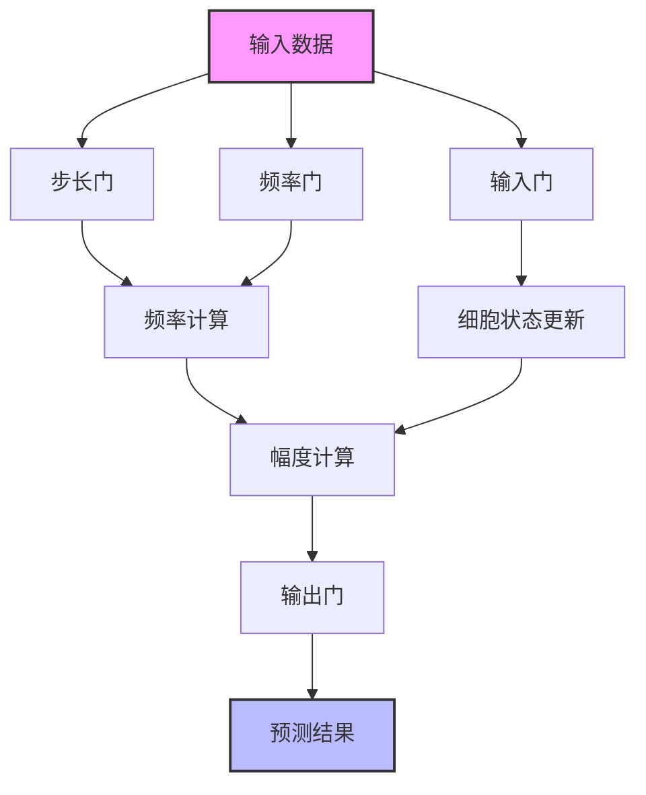

# SFM (Seasonal-Frequency Memory) 模型

## 模块概述

SFM（Seasonal-Frequency Memory）是一个基于PyTorch的深度学习模型，专门设计用于处理时间序列数据，特别是金融市场数据的预测任务。该模型结合了循环神经网络（RNN）的记忆特性和频率分析能力，能够有效捕捉时间序列中的季节性模式和频率特征。

## 类定义

### 1. SFM_Model 类

SFM_Model是核心的神经网络架构，实现了具有频率分析能力的循环记忆单元。

```python
class SFM_Model(nn.Module):
    def __init__(
        self,
        d_feat=6,
        output_dim=1,
        freq_dim=10,
        hidden_size=64,
        dropout_W=0.0,
        dropout_U=0.0,
        device="cpu",
    ):
```

#### 初始化参数

| 参数名 | 类型 | 默认值 | 描述 |
|-------|------|--------|------|
| d_feat | int | 6 | 输入特征维度 |
| output_dim | int | 1 | 输出维度 |
| freq_dim | int | 10 | 频率维度，用于捕捉不同频率的季节性模式 |
| hidden_size | int | 64 | 隐藏层维度 |
| dropout_W | float | 0.0 | 输入权重的dropout率 |
| dropout_U | float | 0.0 | 循环权重的dropout率 |
| device | str | "cpu" | 计算设备（"cpu" 或 "cuda:X"） |

#### 核心属性

```python
# 输入输出维度
self.input_dim = d_feat
self.output_dim = output_dim
self.freq_dim = freq_dim
self.hidden_dim = hidden_size
self.device = device

# 模型参数（门控单元）
self.W_i, self.U_i, self.b_i  # 输入门参数
self.W_ste, self.U_ste, self.b_ste  # 步长门参数
self.W_fre, self.U_fre, self.b_fre  # 频率门参数
self.W_c, self.U_c, self.b_c  # 细胞状态参数
self.W_o, self.U_o, self.b_o  # 输出门参数
self.U_a, self.b_a  # 幅度参数
self.W_p, self.b_p  # 预测参数

# 激活函数
self.activation = nn.Tanh()
self.inner_activation = nn.Hardsigmoid()
```

#### 前向传播方法

```python
def forward(self, input):
    """
    前向传播函数

    参数:
        input: 输入数据，形状为 [N, F, T] 或类似格式

    返回:
        预测结果，形状为 [N]
    """
```

#### 状态初始化方法

```python
def init_states(self, x):
    """
    初始化循环状态

    参数:
        x: 输入数据，用于确定批次大小
    """
```

#### 常数获取方法

```python
def get_constants(self, x):
    """
    获取模型常量参数

    参数:
        x: 输入数据
    """
```

### 2. SFM 类

SFM类是QLib框架的模型接口实现，负责模型的训练、评估和预测。

```python
class SFM(Model):
    def __init__(
        self,
        d_feat=6,
        hidden_size=64,
        output_dim=1,
        freq_dim=10,
        dropout_W=0.0,
        dropout_U=0.0,
        n_epochs=200,
        lr=0.001,
        metric="",
        batch_size=2000,
        early_stop=20,
        eval_steps=5,
        loss="mse",
        optimizer="gd",
        GPU=0,
        seed=None,
        **kwargs,
    ):
```

#### 初始化参数

| 参数名 | 类型 | 默认值 | 描述 |
|-------|------|--------|------|
| d_feat | int | 6 | 输入特征维度 |
| hidden_size | int | 64 | 隐藏层维度 |
| output_dim | int | 1 | 输出维度 |
| freq_dim | int | 10 | 频率维度 |
| dropout_W | float | 0.0 | 输入权重的dropout率 |
| dropout_U | float | 0.0 | 循环权重的dropout率 |
| n_epochs | int | 200 | 训练轮数 |
| lr | float | 0.001 | 学习率 |
| metric | str | "" | 评估指标 |
| batch_size | int | 2000 | 批次大小 |
| early_stop | int | 20 | 早停轮数 |
| eval_steps | int | 5 | 评估间隔 |
| loss | str | "mse" | 损失函数类型 |
| optimizer | str | "gd" | 优化器类型 |
| GPU | int | 0 | GPU设备编号 |
| seed | int | None | 随机种子 |

#### 核心属性

```python
self.logger = get_module_logger("SFM")  # 日志记录器
self.sfm_model = SFM_Model(...)  # 神经网络模型
self.train_optimizer = ...  # 训练优化器
self.fitted = False  # 模型是否已训练的标志
```

#### 训练方法

```python
def train_epoch(self, x_train, y_train):
    """
    训练单个 epoch

    参数:
        x_train: 训练特征数据
        y_train: 训练标签数据
    """
```

#### 测试方法

```python
def test_epoch(self, data_x, data_y):
    """
    测试模型

    参数:
        data_x: 测试特征数据
        data_y: 测试标签数据

    返回:
        (平均损失, 平均得分)
    """
```

#### 模型拟合方法

```python
def fit(
    self,
    dataset: DatasetH,
    evals_result=dict(),
    save_path=None,
):
    """
    训练模型

    参数:
        dataset: QLib数据集对象
        evals_result: 存储评估结果的字典
        save_path: 模型保存路径

    返回:
        无
    """
```

#### 预测方法

```python
def predict(self, dataset: DatasetH, segment: Union[Text, slice] = "test"):
    """
    预测方法

    参数:
        dataset: QLib数据集对象
        segment: 预测数据段（"test" 或切片）

    返回:
        预测结果的Series对象
    """
```

#### 损失和评估指标方法

```python
def mse(self, pred, label):
    """计算均方误差"""

def loss_fn(self, pred, label):
    """损失函数"""

def metric_fn(self, pred, label):
    """评估指标函数"""
```

#### GPU使用属性

```python
@property
def use_gpu(self):
    """判断是否使用GPU"""
    return self.device != torch.device("cpu")
```

### 3. AverageMeter 类

用于计算和存储平均值和当前值的工具类。

```python
class AverageMeter:
    """Computes and stores the average and current value"""

    def __init__(self):
        self.reset()

    def reset(self):
        """重置所有统计值"""

    def update(self, val, n=1):
        """更新统计值

        参数:
            val: 当前值
            n: 权重（样本数量）
        """
```

## 模型架构

SFM模型的架构可以用以下Mermaid图表表示：



## 使用示例

### 基础使用

```python
from qlib.contrib.model.pytorch_sfm import SFM
from qlib.data.dataset import DatasetH

# 创建模型实例
model = SFM(
    d_feat=6,
    hidden_size=64,
    freq_dim=10,
    n_epochs=100,
    lr=0.001,
    batch_size=2000,
    GPU=0
)

# 准备数据集（假设已经有数据集对象）
# dataset = DatasetH(...)

# 训练模型
evals_result = dict()
model.fit(dataset, evals_result)

# 预测
pred = model.predict(dataset, segment="test")

# 打印预测结果
print(pred)
```

### 使用配置文件

在QLib的工作流配置文件中使用SFM模型：

```yaml
# workflow_config_sfm.yaml
model:
  class: "SFM"
  module_path: "qlib.contrib.model.pytorch_sfm"
  kwargs:
    d_feat: 6
    hidden_size: 64
    freq_dim: 10
    n_epochs: 100
    lr: 0.001
    batch_size: 2000
    GPU: 0
```

然后使用`qrun`命令运行：

```bash
qrun workflow_config_sfm.yaml
```

## 工作原理

SFM模型的核心创新在于将循环神经网络与频率分析相结合。它通过以下关键步骤处理时间序列数据：

1. **输入处理**：将原始数据转换为适合模型处理的格式
2. **门控机制**：通过输入门、步长门和频率门控制信息的流动
3. **频率分析**：使用三角函数计算不同频率的正弦和余弦分量
4. **状态更新**：维护细胞状态和隐藏状态的循环更新
5. **幅度计算**：计算频率分量的幅度，捕捉周期性模式
6. **预测生成**：通过输出门生成最终预测结果

## 代码优化建议

虽然SFM模型已经是一个设计良好的架构，但仍有一些潜在的优化方向：

1. **GPU优化**：在训练和预测时使用更高效的GPU内存管理
2. **并行计算**：利用PyTorch的DataParallel或DistributedDataParallel
3. **混合精度训练**：使用torch.cuda.amp提高训练速度和减少内存使用
4. **学习率调度**：实现学习率衰减策略以提高模型收敛性
5. **正则化**：添加更多正则化方法（如L2正则化）防止过拟合

```python
# 学习率调度示例
from torch.optim.lr_scheduler import CosineAnnealingLR

# 在__init__方法中添加
self.scheduler = CosineAnnealingLR(self.train_optimizer, T_max=self.n_epochs)

# 在fit方法中每个epoch后调用
self.scheduler.step()
```

## 总结

SFM模型是一个强大的时间序列预测模型，特别适用于金融市场数据的分析和预测。它的频率分析能力使其能够有效捕捉数据中的季节性模式，而循环结构则保留了长期记忆特性。通过QLib框架的封装，该模型可以方便地集成到量化投资工作流程中。
