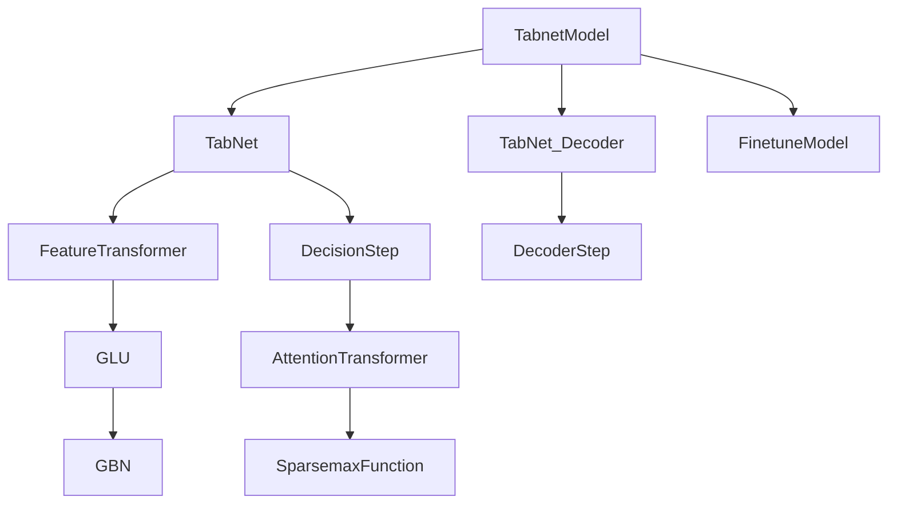

# PyTorch TabNet模型实现

## 模块概述

该模块实现了适用于QLib量化投资平台的TabNet模型，包括完整的训练、预训练和预测功能。TabNet是一种基于注意力机制的深度学习架构，专门为表格数据设计，具有自动特征选择和可解释性的特点。

## 架构设计



## 类定义

### 1. TabnetModel

QLib的TabNet模型主类，继承自`Model`基类，实现了完整的训练、预训练和预测流程。

```python
class TabnetModel(Model):
    def __init__(
        self,
        d_feat=158,
        out_dim=64,
        final_out_dim=1,
        batch_size=4096,
        n_d=64,
        n_a=64,
        n_shared=2,
        n_ind=2,
        n_steps=5,
        n_epochs=100,
        pretrain_n_epochs=50,
        relax=1.3,
        vbs=2048,
        seed=993,
        optimizer="adam",
        loss="mse",
        metric="",
        early_stop=20,
        GPU=0,
        pretrain_loss="custom",
        ps=0.3,
        lr=0.01,
        pretrain=True,
        pretrain_file=None,
    ):
```

**参数说明：**
- `d_feat`: 输入特征维度，默认158
- `out_dim`: TabNet输出维度，默认64
- `final_out_dim`: 最终输出维度，默认1
- `batch_size`: 训练批次大小，默认4096
- `n_d`: 决策步骤特征维度，默认64
- `n_a`: 注意力特征维度，默认64
- `n_shared`: 共享特征转换层数，默认2
- `n_ind`: 独立特征转换层数，默认2
- `n_steps`: 决策步骤数，默认5
- `n_epochs`: 训练轮数，默认100
- `pretrain_n_epochs`: 预训练轮数，默认50
- `relax`: 注意力放松系数，默认1.3
- `vbs`: 虚拟批次大小，默认2048
- `seed`: 随机种子，默认993
- `optimizer`: 优化器类型，默认"adam"
- `loss`: 损失函数类型，默认"mse"
- `metric`: 评估指标，默认""
- `early_stop`: 早停轮数，默认20
- `GPU`: GPU设备编号，默认0
- `pretrain_loss`: 预训练损失函数，默认"custom"
- `ps`: 掩码生成概率，默认0.3
- `lr`: 学习率，默认0.01
- `pretrain`: 是否使用预训练，默认True
- `pretrain_file`: 预训练模型文件路径，默认None

**核心方法：**

```python
def pretrain_fn(self, dataset=DatasetH, pretrain_file="./pretrain/best.model"):
```
预训练函数，使用自监督学习方法训练TabNet编码器。

```python
def fit(self, dataset: DatasetH, evals_result=dict(), save_path=None):
```
训练函数，在预训练基础上微调模型以适应特定任务。

```python
def predict(self, dataset: DatasetH, segment: Union[Text, slice] = "test"):
```
预测函数，对测试数据进行预测。

```python
def test_epoch(self, data_x, data_y):
```
测试轮函数，计算模型在数据上的损失和评估指标。

```python
def train_epoch(self, x_train, y_train):
```
训练轮函数，执行一次完整的训练迭代。

```python
def pretrain_epoch(self, x_train):
```
预训练轮函数，执行一次完整的预训练迭代。

```python
def pretrain_test_epoch(self, x_train):
```
预训练测试轮函数，计算预训练阶段的损失。

```python
def pretrain_loss_fn(self, f_hat, f, S):
```
预训练损失函数，实现了TabNet论文中的自监督损失计算。

```python
def loss_fn(self, pred, label):
```
训练损失函数，支持MSE损失。

```python
def metric_fn(self, pred, label):
```
评估指标函数。

```python
def mse(self, pred, label):
```
MSE损失计算函数。

### 2. FinetuneModel

微调模型类，在预训练模型基础上添加一个线性层以适应特定输出维度。

```python
class FinetuneModel(nn.Module):
    def __init__(self, input_dim, output_dim, trained_model):
        super().__init__()
        self.model = trained_model
        self.fc = nn.Linear(input_dim, output_dim)

    def forward(self, x, priors):
        return self.fc(self.model(x, priors)[0]).squeeze()
```

### 3. TabNet_Decoder

TabNet解码器类，用于预训练阶段的自监督学习。

```python
class TabNet_Decoder(nn.Module):
    def __init__(self, inp_dim, out_dim, n_shared, n_ind, vbs, n_steps):
        super().__init__()
        self.out_dim = out_dim
        if n_shared > 0:
            self.shared = nn.ModuleList()
            self.shared.append(nn.Linear(inp_dim, 2 * out_dim))
            for x in range(n_shared - 1):
                self.shared.append(nn.Linear(out_dim, 2 * out_dim))
        else:
            self.shared = None
        self.n_steps = n_steps
        self.steps = nn.ModuleList()
        for x in range(n_steps):
            self.steps.append(DecoderStep(inp_dim, out_dim, self.shared, n_ind, vbs))

    def forward(self, x):
        out = torch.zeros(x.size(0), self.out_dim).to(x.device)
        for step in self.steps:
            out += step(x)
        return out
```

### 4. DecoderStep

解码器步骤类，实现TabNet解码器的单个步骤。

```python
class DecoderStep(nn.Module):
    def __init__(self, inp_dim, out_dim, shared, n_ind, vbs):
        super().__init__()
        self.fea_tran = FeatureTransformer(inp_dim, out_dim, shared, n_ind, vbs)
        self.fc = nn.Linear(out_dim, out_dim)

    def forward(self, x):
        x = self.fea_tran(x)
        return self.fc(x)
```

### 5. TabNet

TabNet编码器类，实现核心的TabNet架构。

```python
class TabNet(nn.Module):
    def __init__(self, inp_dim=6, out_dim=6, n_d=64, n_a=64, n_shared=2, n_ind=2, n_steps=5, relax=1.2, vbs=1024):
        super().__init__()
        if n_shared > 0:
            self.shared = nn.ModuleList()
            self.shared.append(nn.Linear(inp_dim, 2 * (n_d + n_a)))
            for x in range(n_shared - 1):
                self.shared.append(nn.Linear(n_d + n_a, 2 * (n_d + n_a)))
        else:
            self.shared = None

        self.first_step = FeatureTransformer(inp_dim, n_d + n_a, self.shared, n_ind, vbs)
        self.steps = nn.ModuleList()
        for x in range(n_steps - 1):
            self.steps.append(DecisionStep(inp_dim, n_d, n_a, self.shared, n_ind, relax, vbs))
        self.fc = nn.Linear(n_d, out_dim)
        self.bn = nn.BatchNorm1d(inp_dim, momentum=0.01)
        self.n_d = n_d

    def forward(self, x, priors):
        assert not torch.isnan(x).any()
        x = self.bn(x)
        x_a = self.first_step(x)[:, self.n_d :]
        sparse_loss = []
        out = torch.zeros(x.size(0), self.n_d).to(x.device)
        for step in self.steps:
            x_te, loss = step(x, x_a, priors)
            out += F.relu(x_te[:, : self.n_d])
            x_a = x_te[:, self.n_d :]
            sparse_loss.append(loss)
        return self.fc(out), sum(sparse_loss)
```

### 6. DecisionStep

决策步骤类，实现TabNet的每个决策步骤。

```python
class DecisionStep(nn.Module):
    def __init__(self, inp_dim, n_d, n_a, shared, n_ind, relax, vbs):
        super().__init__()
        self.atten_tran = AttentionTransformer(n_a, inp_dim, relax, vbs)
        self.fea_tran = FeatureTransformer(inp_dim, n_d + n_a, shared, n_ind, vbs)

    def forward(self, x, a, priors):
        mask = self.atten_tran(a, priors)
        sparse_loss = ((-1) * mask * torch.log(mask + 1e-10)).mean()
        x = self.fea_tran(x * mask)
        return x, sparse_loss
```

### 7. AttentionTransformer

注意力转换类，实现TabNet的特征选择注意力机制。

```python
class AttentionTransformer(nn.Module):
    def __init__(self, d_a, inp_dim, relax, vbs=1024):
        super().__init__()
        self.fc = nn.Linear(d_a, inp_dim)
        self.bn = GBN(inp_dim, vbs=vbs)
        self.r = relax

    def forward(self, a, priors):
        a = self.bn(self.fc(a))
        mask = SparsemaxFunction.apply(a * priors)
        priors = priors * (self.r - mask)
        return mask
```

### 8. FeatureTransformer

特征转换类，实现TabNet的特征转换模块。

```python
class FeatureTransformer(nn.Module):
    def __init__(self, inp_dim, out_dim, shared, n_ind, vbs):
        super().__init__()
        first = True
        self.shared = nn.ModuleList()
        if shared:
            self.shared.append(GLU(inp_dim, out_dim, shared[0], vbs=vbs))
            first = False
            for fc in shared[1:]:
                self.shared.append(GLU(out_dim, out_dim, fc, vbs=vbs))
        else:
            self.shared = None
        self.independ = nn.ModuleList()
        if first:
            self.independ.append(GLU(inp_dim, out_dim, vbs=vbs))
        for x in range(first, n_ind):
            self.independ.append(GLU(out_dim, out_dim, vbs=vbs))
        self.scale = float(np.sqrt(0.5))

    def forward(self, x):
        if self.shared:
            x = self.shared[0](x)
            for glu in self.shared[1:]:
                x = torch.add(x, glu(x))
                x = x * self.scale
        for glu in self.independ:
            x = torch.add(x, glu(x))
            x = x * self.scale
        return x
```

### 9. GLU

门控线性单元类，实现特征转换的非线性变换。

```python
class GLU(nn.Module):
    def __init__(self, inp_dim, out_dim, fc=None, vbs=1024):
        super().__init__()
        if fc:
            self.fc = fc
        else:
            self.fc = nn.Linear(inp_dim, out_dim * 2)
        self.bn = GBN(out_dim * 2, vbs=vbs)
        self.od = out_dim

    def forward(self, x):
        x = self.bn(self.fc(x))
        return torch.mul(x[:, : self.od], torch.sigmoid(x[:, self.od :]))
```

### 10. GBN

幽灵批次归一化类，实现高效的批次归一化方法。

```python
class GBN(nn.Module):
    def __init__(self, inp, vbs=1024, momentum=0.01):
        super().__init__()
        self.bn = nn.BatchNorm1d(inp, momentum=momentum)
        self.vbs = vbs

    def forward(self, x):
        if x.size(0) <= self.vbs:
            return self.bn(x)
        else:
            chunk = torch.chunk(x, x.size(0) // self.vbs, 0)
            res = [self.bn(y) for y in chunk]
            return torch.cat(res, 0)
```

### 11. SparsemaxFunction

稀疏最大化函数类，实现稀疏注意力机制。

```python
class SparsemaxFunction(Function):
    @staticmethod
    def forward(ctx, input, dim=-1):
        ctx.dim = dim
        max_val, _ = input.max(dim=dim, keepdim=True)
        input -= max_val
        tau, supp_size = SparsemaxFunction.threshold_and_support(input, dim=dim)
        output = torch.clamp(input - tau, min=0)
        ctx.save_for_backward(supp_size, output)
        return output

    @staticmethod
    def backward(ctx, grad_output):
        supp_size, output = ctx.saved_tensors
        dim = ctx.dim
        grad_input = grad_output.clone()
        grad_input[output == 0] = 0

        v_hat = grad_input.sum(dim=dim) / supp_size.to(output.dtype).squeeze()
        v_hat = v_hat.unsqueeze(dim)
        grad_input = torch.where(output != 0, grad_input - v_hat, grad_input)
        return grad_input, None
```

## 使用示例

### 1. 基本使用

```python
from qlib.contrib.model.pytorch_tabnet import TabnetModel
from qlib.data.dataset import DatasetH

# 初始化模型
model = TabnetModel(
    d_feat=158,
    out_dim=64,
    final_out_dim=1,
    batch_size=4096,
    n_epochs=100,
    lr=0.01,
    GPU=0
)

# 准备数据集
dataset = DatasetH(...)  # 初始化数据集

# 训练模型
model.fit(dataset)

# 预测
predictions = model.predict(dataset, segment="test")
```

### 2. 配置文件使用

```yaml
# workflow_config_tabnet.yaml
model:
  class: TabnetModel
  module_path: qlib.contrib.model.pytorch_tabnet
  kwargs:
    d_feat: 158
    out_dim: 64
    final_out_dim: 1
    batch_size: 4096
    n_epochs: 100
    lr: 0.01
    GPU: 0

dataset:
  class: DatasetH
  module_path: qlib.data.dataset
  kwargs:
    handler:
      class: Alpha158
      module_path: qlib.contrib.data.handler
    segments:
      train: [2008-01-01, 2014-12-31]
      valid: [2015-01-01, 2016-12-31]
      test: [2017-01-01, 2020-08-01]
```

使用命令运行：
```bash
qrun workflow_config_tabnet.yaml
```

## 代码优化建议

### 1. 类型注解完善
当前代码中部分方法缺少完整的类型注解，建议添加更详细的类型提示以提高代码可读性和可维护性。

### 2. 文档字符串增强
部分函数和类的文档字符串可以进一步完善，特别是添加更详细的参数说明和返回值类型。

### 3. 代码结构优化
```python
# 原代码
def test_epoch(self, data_x, data_y):
    x_values = torch.from_numpy(data_x.values)
    y_values = torch.from_numpy(np.squeeze(data_y.values))
    x_values[torch.isnan(x_values)] = 0
    y_values[torch.isnan(y_values)] = 0
    self.tabnet_model.eval()

    scores = []
    losses = []

    indices = np.arange(len(x_values))

    for i in range(len(indices))[:: self.batch_size]:
        if len(indices) - i < self.batch_size:
            break
        feature = x_values[indices[i : i + self.batch_size]].float().to(self.device)
        label = y_values[indices[i : i + self.batch_size]].float().to(self.device)
        priors = torch.ones(self.batch_size, self.d_feat).to(self.device)
        with torch.no_grad():
            pred = self.tabnet_model(feature, priors)
            loss = self.loss_fn(pred, label)
            losses.append(loss.item())

            score = self.metric_fn(pred, label)
            scores.append(score.item())

    return np.mean(losses), np.mean(scores)
```

```python
# 优化后代码
def test_epoch(self, data_x: pd.DataFrame, data_y: pd.DataFrame) -> Tuple[float, float]:
    """
    测试模型在数据上的性能

    Args:
        data_x: 输入特征数据
        data_y: 标签数据

    Returns:
        (平均损失, 平均评估指标)
    """
    x_values = torch.from_numpy(data_x.values)
    y_values = torch.from_numpy(np.squeeze(data_y.values))
    x_values[torch.isnan(x_values)] = 0
    y_values[torch.isnan(y_values)] = 0
    self.tabnet_model.eval()

    scores = []
    losses = []

    indices = np.arange(len(x_values))

    for i in range(0, len(indices), self.batch_size):
        end_idx = i + self.batch_size
        if end_idx > len(indices):
            break

        feature = x_values[indices[i:end_idx]].float().to(self.device)
        label = y_values[indices[i:end_idx]].float().to(self.device)
        priors = torch.ones(end_idx - i, self.d_feat).to(self.device)

        with torch.no_grad():
            pred = self.tabnet_model(feature, priors)
            loss = self.loss_fn(pred, label)
            losses.append(loss.item())

            score = self.metric_fn(pred, label)
            scores.append(score.item())

    return np.mean(losses), np.mean(scores)
```

### 4. 错误处理增强
在数据加载和处理过程中添加更详细的错误处理逻辑，提高代码的鲁棒性。

### 5. 代码复用优化
将重复的代码片段（如数据准备、批次处理等）提取为辅助函数，提高代码的复用性和可维护性。

## 总结

PyTorch TabNet模型为QLib量化投资平台提供了一个强大的深度学习解决方案，具有以下特点：

1. **自动特征选择**：通过注意力机制自动学习特征重要性
2. **可解释性**：提供特征选择的可视化和解释
3. **自监督学习**：支持预训练-微调的训练流程
4. **高效计算**：使用幽灵批次归一化等技术提高训练效率
5. **灵活性**：支持多种参数配置和损失函数选择

该实现完整地复现了TabNet的核心功能，并针对量化投资任务进行了优化，是处理金融时间序列数据的理想选择。
