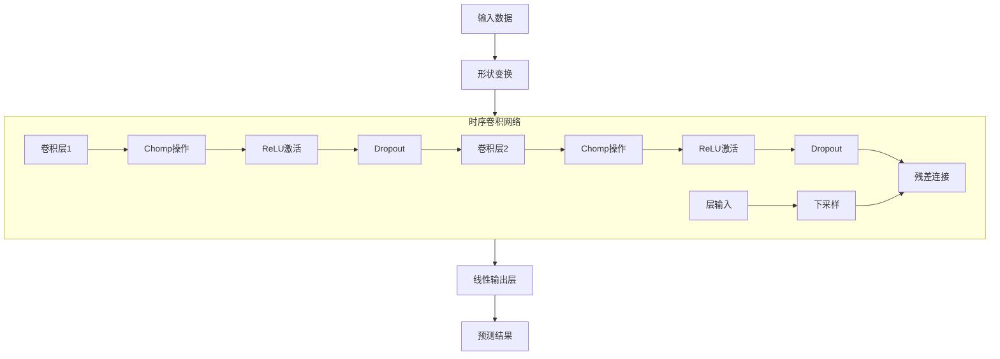

# TCN（时序卷积网络）模型

## 模块概述

该模块实现了基于PyTorch的时序卷积网络（Temporal Convolutional Network, TCN）模型，用于量化金融领域的时间序列预测任务。TCN模型具有以下特点：

- 能够捕捉时间序列数据中的长期依赖关系
- 支持可变长度的历史数据输入
- 具有高效的训练和推理速度
- 提供灵活的超参数配置

## 类定义

### TCN 类

TCN类是QLib框架中的模型接口实现，负责模型的初始化、训练、评估和预测。

```python
class TCN(Model):
    """TCN Model

    Parameters
    ----------
    d_feat : int
        每个时间步的输入维度（特征数量）
    n_chans: int
        卷积通道数量
    kernel_size: int
        卷积核大小
    num_layers: int
        TCN层数
    dropout: float
        Dropout率
    n_epochs: int
        训练轮数
    lr: float
        学习率
    metric: str
        早停策略使用的评估指标
    batch_size: int
        批处理大小
    early_stop: int
        早停轮数
    loss: str
        损失函数类型
    optimizer: str
        优化器类型
    GPU: int
        GPU设备ID
    seed: int
        随机种子

    Attributes
    ----------
    logger: Logger
        日志记录器
    d_feat: int
        输入特征维度
    n_chans: int
        卷积通道数
    kernel_size: int
        卷积核大小
    num_layers: int
        TCN层数
    dropout: float
        Dropout率
    n_epochs: int
        训练轮数
    lr: float
        学习率
    metric: str
        评估指标
    batch_size: int
        批处理大小
    early_stop: int
        早停轮数
    loss: str
        损失函数类型
    optimizer: str
        优化器类型
    device: torch.device
        计算设备（CPU或GPU）
    seed: int
        随机种子
    tcn_model: TCNModel
        TCN模型实例
    train_optimizer: torch.optim.Optimizer
        训练优化器
    fitted: bool
        模型是否已训练完成
    """
```

### TCNModel 类

TCNModel是实际的PyTorch模型实现，继承自nn.Module。

```python
class TCNModel(nn.Module):
    """TCN模型的PyTorch实现

    Parameters
    ----------
    num_input: int
        输入维度
    output_size: int
        输出维度
    num_channels: list
        每层的通道数
    kernel_size: int
        卷积核大小
    dropout: float
        Dropout率

    Attributes
    ----------
    num_input: int
        输入维度
    tcn: TemporalConvNet
        TemporalConvNet实例
    linear: nn.Linear
        输出线性层
    """
```

## 函数说明

### __init__（TCN类构造函数）

```python
def __init__(
    self,
    d_feat=6,
    n_chans=128,
    kernel_size=5,
    num_layers=5,
    dropout=0.5,
    n_epochs=200,
    lr=0.0001,
    metric="",
    batch_size=2000,
    early_stop=20,
    loss="mse",
    optimizer="adam",
    GPU=0,
    seed=None,
    **kwargs,
):
```

**功能**：初始化TCN模型，设置超参数、日志记录器、优化器和模型结构。

**参数**：
- `d_feat`：输入特征维度，默认6
- `n_chans`：卷积通道数，默认128
- `kernel_size`：卷积核大小，默认5
- `num_layers`：TCN层数，默认5
- `dropout`：Dropout率，默认0.5
- `n_epochs`：训练轮数，默认200
- `lr`：学习率，默认0.0001
- `metric`：评估指标，默认""
- `batch_size`：批处理大小，默认2000
- `early_stop`：早停轮数，默认20
- `loss`：损失函数类型，默认"mse"
- `optimizer`：优化器类型，默认"adam"
- `GPU`：GPU设备ID，默认0
- `seed`：随机种子，默认None

**返回值**：无

### use_gpu（属性）

```python
@property
def use_gpu(self):
    return self.device != torch.device("cpu")
```

**功能**：检查是否使用GPU。

**返回值**：bool，True表示使用GPU，False表示使用CPU。

### mse（损失函数）

```python
def mse(self, pred, label):
    loss = (pred - label) ** 2
    return torch.mean(loss)
```

**功能**：计算均方误差（MSE）损失。

**参数**：
- `pred`：模型预测值
- `label`：真实标签值

**返回值**：torch.Tensor，MSE损失值

### loss_fn（损失函数包装器）

```python
def loss_fn(self, pred, label):
```

**功能**：根据配置的损失函数类型计算损失，支持MSE损失。

**参数**：
- `pred`：模型预测值
- `label`：真实标签值（可能包含NaN）

**返回值**：torch.Tensor，损失值

### metric_fn（评估指标函数）

```python
def metric_fn(self, pred, label):
```

**功能**：计算评估指标，支持损失函数作为指标。

**参数**：
- `pred`：模型预测值
- `label`：真实标签值（可能包含NaN）

**返回值**：torch.Tensor，评估指标值

### train_epoch（训练一轮）

```python
def train_epoch(self, x_train, y_train):
```

**功能**：训练模型一轮，处理整个训练数据集。

**参数**：
- `x_train`：训练特征数据
- `y_train`：训练标签数据

**返回值**：无

### test_epoch（测试/评估一轮）

```python
def test_epoch(self, data_x, data_y):
```

**功能**：测试模型性能，计算损失和评估指标。

**参数**：
- `data_x`：测试特征数据
- `data_y`：测试标签数据

**返回值**：tuple，包含平均损失和平均评估指标

### fit（训练模型）

```python
def fit(
    self,
    dataset: DatasetH,
    evals_result=dict(),
    save_path=None,
):
```

**功能**：训练TCN模型，包括数据准备、训练过程、早停策略和模型保存。

**参数**：
- `dataset`：数据集对象
- `evals_result`：训练过程的评估结果字典
- `save_path`：模型保存路径

**返回值**：无

### predict（预测）

```python
def predict(self, dataset: DatasetH, segment: Union[Text, slice] = "test"):
```

**功能**：使用训练好的模型进行预测。

**参数**：
- `dataset`：数据集对象
- `segment`：预测的数据段，默认"test"

**返回值**：pd.Series，预测结果

### TCNModel.__init__（TCNModel构造函数）

```python
def __init__(self, num_input, output_size, num_channels, kernel_size, dropout):
```

**功能**：初始化TCNModel。

**参数**：
- `num_input`：输入维度
- `output_size`：输出维度
- `num_channels`：每层的通道数列表
- `kernel_size`：卷积核大小
- `dropout`：Dropout率

**返回值**：无

### TCNModel.forward（前向传播）

```python
def forward(self, x):
```

**功能**：模型前向传播。

**参数**：
- `x`：输入数据，形状为(batch_size, d_feat, seq_length)

**返回值**：torch.Tensor，预测结果

## 使用示例

### 基本使用

```python
from qlib.contrib.model.pytorch_tcn import TCN
from qlib.data.dataset import DatasetH
from qlib.utils import init_instance_by_config

# 配置模型参数
model_config = {
    "class": "TCN",
    "module_path": "qlib.contrib.model.pytorch_tcn",
    "kwargs": {
        "d_feat": 6,
        "n_chans": 128,
        "kernel_size": 5,
        "num_layers": 5,
        "dropout": 0.5,
        "n_epochs": 200,
        "lr": 0.0001,
        "batch_size": 2000,
        "early_stop": 20,
        "loss": "mse",
        "optimizer": "adam",
        "GPU": 0,
        "seed": 42,
    },
}

# 初始化模型
model = init_instance_by_config(model_config)

# 准备数据集（需要根据实际情况配置）
dataset = DatasetH(...)

# 训练模型
evals_result = {}
model.fit(dataset, evals_result=evals_result)

# 预测
predictions = model.predict(dataset, segment="test")
```

### 在QLib工作流中使用

```yaml
# workflow_config.yaml
model:
  class: TCN
  module_path: qlib.contrib.model.pytorch_tcn
  kwargs:
    d_feat: 6
    n_chans: 128
    kernel_size: 5
    num_layers: 5
    dropout: 0.5
    n_epochs: 200
    lr: 0.0001
    batch_size: 2000
    early_stop: 20
    loss: mse
    optimizer: adam
    GPU: 0
    seed: 42

dataset:
  class: DatasetH
  module_path: qlib.data.dataset
  kwargs:
    handler:
      class: Alpha158
      module_path: qlib.contrib.data.handler
    segments:
      test: [2020-01-01, 2023-12-31]
      valid: [2019-01-01, 2019-12-31]
      train: [2017-01-01, 2018-12-31]

record:
  - class: SignalRecord
    module_path: qlib.workflow.record_temp
    kwargs:
      model: $model
      dataset: $dataset
```

## TCN模型架构

### 模型结构



### TCN模型特点

1. **因果卷积（Causal Convolution）**：确保当前时刻的预测只依赖于过去的信息
2. **扩张卷积（Dilated Convolution）**：使用指数增长的扩张率，在保持计算效率的同时增加感受野
3. **残差连接**：每个TemporalBlock包含残差连接，避免梯度消失问题
4. **Dropout正则化**：在训练过程中随机丢弃部分神经元，防止过拟合

## 关键参数说明

| 参数 | 描述 | 默认值 | 建议范围 |
|------|------|--------|----------|
| d_feat | 输入特征维度 | 6 | 根据数据而定 |
| n_chans | 卷积通道数 | 128 | 32-256 |
| kernel_size | 卷积核大小 | 5 | 3-7 |
| num_layers | TCN层数 | 5 | 3-10 |
| dropout | Dropout率 | 0.5 | 0.1-0.7 |
| n_epochs | 训练轮数 | 200 | 100-500 |
| lr | 学习率 | 0.0001 | 0.00001-0.001 |
| batch_size | 批处理大小 | 2000 | 500-5000 |
| early_stop | 早停轮数 | 20 | 10-50 |

## 注意事项

1. **GPU内存限制**：当使用大批次和大量通道时，需要注意GPU内存限制
2. **数据预处理**：确保输入数据已进行适当的标准化处理
3. **随机种子**：设置固定的随机种子可确保结果可复现
4. **模型保存**：训练过程中会自动保存最佳模型到指定路径

## 扩展功能

### 自定义损失函数

可以通过继承TCN类并重写loss_fn方法来添加自定义损失函数。

```python
class CustomTCN(TCN):
    def loss_fn(self, pred, label):
        mask = ~torch.isnan(label)

        if self.loss == "mae":
            return torch.mean(torch.abs(pred[mask] - label[mask]))
        elif self.loss == "mse":
            return self.mse(pred[mask], label[mask])

        raise ValueError("unknown loss `%s`" % self.loss)
```

### 自定义评估指标

类似地，可以重写metric_fn方法添加自定义评估指标。

```python
class CustomTCN(TCN):
    def metric_fn(self, pred, label):
        mask = torch.isfinite(label)

        if self.metric == "mae":
            return -torch.mean(torch.abs(pred[mask] - label[mask]))
        elif self.metric in ("", "loss"):
            return -self.loss_fn(pred[mask], label[mask])

        raise ValueError("unknown metric `%s`" % self.metric)
```
