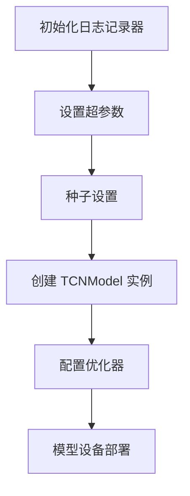
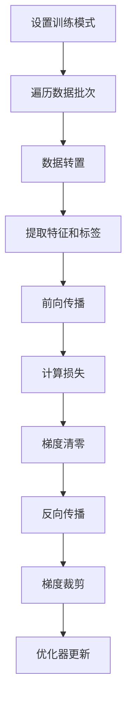
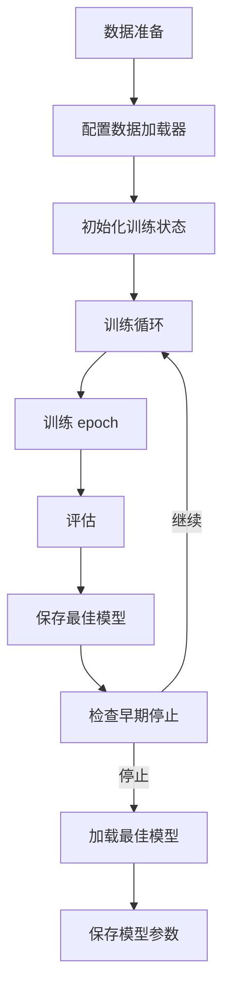

# TCN 时间序列预测模型

## 模块概述

`pytorch_tcn_ts.py` 实现了基于时间卷积网络（Temporal Convolutional Network, TCN）的深度学习模型，用于金融时间序列预测。TCN 模型通过卷积操作捕获时间序列的长期依赖关系，具有训练稳定、计算高效的特点，适用于量化投资中的价格预测、趋势分析等任务。

## 类定义

### TCN 类

#### 类名
`TCN`

#### 继承关系
继承自 `qlib.model.base.Model`，是 QLib 框架的标准模型接口实现。

#### 核心功能
- 构建 TCN 模型架构
- 实现训练、验证和测试流程
- 支持 GPU 加速计算
- 提供早期停止和模型保存功能
- 实现预测接口

#### 初始化方法

```python
def __init__(
    self,
    d_feat=6,
    n_chans=128,
    kernel_size=5,
    num_layers=2,
    dropout=0.0,
    n_epochs=200,
    lr=0.001,
    metric="",
    batch_size=2000,
    early_stop=20,
    loss="mse",
    optimizer="adam",
    n_jobs=10,
    GPU=0,
    seed=None,
    **kwargs,
):
```

**参数说明：**

| 参数名 | 类型 | 默认值 | 描述 |
|--------|------|--------|------|
| d_feat | int | 6 | 每个时间步的输入特征维度 |
| n_chans | int | 128 | 卷积通道数（每层通道数相同） |
| kernel_size | int | 5 | 卷积核大小 |
| num_layers | int | 2 | TCN 层数 |
| dropout | float | 0.0 |  dropout 正则化率 |
| n_epochs | int | 200 | 训练轮数 |
| lr | float | 0.001 | 学习率 |
| metric | str | "" | 评估指标（用于 early stop） |
| batch_size | int | 2000 | 批处理大小 |
| early_stop | int | 20 | 早期停止轮数 |
| loss | str | "mse" | 损失函数类型（目前仅支持 mse） |
| optimizer | str | "adam" | 优化器类型（adam 或 gd） |
| n_jobs | int | 10 | 数据加载器的工作线程数 |
| GPU | int | 0 | GPU 设备 ID（-1 表示使用 CPU） |
| seed | int | None | 随机种子（用于结果复现） |

**初始化流程：**



### TCNModel 类

#### 类名
`TCNModel`

#### 继承关系
继承自 `torch.nn.Module`，是 PyTorch 的标准模块类。

#### 核心功能
- 实现 TCN 网络架构
- 包含 TemporalConvNet 和线性输出层
- 定义前向传播过程

#### 初始化方法

```python
def __init__(self, num_input, output_size, num_channels, kernel_size, dropout):
```

**参数说明：**

| 参数名 | 类型 | 描述 |
|--------|------|------|
| num_input | int | 输入特征维度 |
| output_size | int | 输出大小（预测值维度） |
| num_channels | list | 每层通道数列表 |
| kernel_size | int | 卷积核大小 |
| dropout | float | dropout 正则化率 |

#### 前向传播

```python
def forward(self, x):
    output = self.tcn(x)
    output = self.linear(output[:, :, -1])
    return output.squeeze()
```

**输入输出：**

- 输入：`x` - 形状为 `(batch_size, features, sequence_length)` 的张量
- 输出：`output` - 形状为 `(batch_size,)` 的张量（预测值）

## 函数说明

### use_gpu 属性

```python
@property
def use_gpu(self):
    return self.device != torch.device("cpu")
```

**功能：** 检查模型是否在 GPU 上运行

**返回值：**
- `True`：模型在 GPU 上运行
- `False`：模型在 CPU 上运行

### mse 方法

```python
def mse(self, pred, label):
    loss = (pred - label) ** 2
    return torch.mean(loss)
```

**功能：** 计算均方误差损失

**参数：**
- `pred`：预测值张量
- `label`：真实标签张量

**返回值：** 均方误差的平均值

### loss_fn 方法

```python
def loss_fn(self, pred, label):
    mask = ~torch.isnan(label)

    if self.loss == "mse":
        return self.mse(pred[mask], label[mask])

    raise ValueError("unknown loss `%s`" % self.loss)
```

**功能：** 损失函数计算（支持掩码处理 NaN 值）

**参数：**
- `pred`：预测值张量
- `label`：真实标签张量

**返回值：** 损失值

### metric_fn 方法

```python
def metric_fn(self, pred, label):
    mask = torch.isfinite(label)

    if self.metric in ("", "loss"):
        return -self.loss_fn(pred[mask], label[mask])

    raise ValueError("unknown metric `%s`" % self.metric)
```

**功能：** 评估指标计算

**参数：**
- `pred`：预测值张量
- `label`：真实标签张量

**返回值：** 评估分数（损失的负值，用于最大化优化）

### train_epoch 方法

```python
def train_epoch(self, data_loader):
    self.TCN_model.train()

    for data in data_loader:
        data = torch.transpose(data, 1, 2)
        feature = data[:, 0:-1, :].to(self.device)
        label = data[:, -1, -1].to(self.device)

        pred = self.TCN_model(feature.float())
        loss = self.loss_fn(pred, label)

        self.train_optimizer.zero_grad()
        loss.backward()
        torch.nn.utils.clip_grad_value_(self.TCN_model.parameters(), 3.0)
        self.train_optimizer.step()
```

**功能：** 训练一个 epoch

**参数：**
- `data_loader`：数据加载器

**训练流程：**



### test_epoch 方法

```python
def test_epoch(self, data_loader):
    self.TCN_model.eval()

    scores = []
    losses = []

    for data in data_loader:
        data = torch.transpose(data, 1, 2)
        feature = data[:, 0:-1, :].to(self.device)
        label = data[:, -1, -1].to(self.device)

        with torch.no_grad():
            pred = self.TCN_model(feature.float())
            loss = self.loss_fn(pred, label)
            losses.append(loss.item())

            score = self.metric_fn(pred, label)
            scores.append(score.item())

    return np.mean(losses), np.mean(scores)
```

**功能：** 测试/验证一个 epoch

**参数：**
- `data_loader`：数据加载器

**返回值：**
- 平均损失值
- 平均评估分数

### fit 方法

```python
def fit(
    self,
    dataset,
    evals_result=dict(),
    save_path=None,
):
```

**功能：** 模型训练主流程

**参数：**
- `dataset`：QLib 数据集对象
- `evals_result`：存储训练过程评估结果的字典
- `save_path`：模型保存路径

**训练流程：**



### predict 方法

```python
def predict(self, dataset):
    if not self.fitted:
        raise ValueError("model is not fitted yet!")

    dl_test = dataset.prepare("test", col_set=["feature", "label"], data_key=DataHandlerLP.DK_I)
    dl_test.config(fillna_type="ffill+bfill")
    test_loader = DataLoader(dl_test, batch_size=self.batch_size, num_workers=self.n_jobs)
    self.TCN_model.eval()
    preds = []

    for data in test_loader:
        feature = data[:, :, 0:-1].to(self.device)

        with torch.no_grad():
            pred = self.TCN_model(feature.float()).detach().cpu().numpy()

        preds.append(pred)

    return pd.Series(np.concatenate(preds), index=dl_test.get_index())
```

**功能：** 模型预测

**参数：**
- `dataset`：QLib 数据集对象

**返回值：** 预测结果的 Pandas Series

## 使用示例

### 基本用法

```python
from qlib.contrib.model.pytorch_tcn_ts import TCN
from qlib.data.dataset.handler import DataHandlerLP
from qlib.data.dataset import DatasetH

# 准备数据集（示例代码）
handler = DataHandlerLP(...)
dataset = DatasetH(handler=handler)

# 初始化模型
model = TCN(
    d_feat=6,
    n_chans=128,
    kernel_size=5,
    num_layers=2,
    dropout=0.0,
    n_epochs=200,
    lr=0.001,
    batch_size=2000,
    early_stop=20,
    loss="mse",
    optimizer="adam",
    GPU=0
)

# 训练模型
evals_result = dict()
model.fit(dataset, evals_result=evals_result)

# 预测
preds = model.predict(dataset)
```

### 配置文件方式

```yaml
model:
  class: TCN
  module_path: qlib.contrib.model.pytorch_tcn_ts
  kwargs:
    d_feat: 6
    n_chans: 128
    kernel_size: 5
    num_layers: 2
    dropout: 0.0
    n_epochs: 200
    lr: 0.001
    batch_size: 2000
    early_stop: 20
    loss: mse
    optimizer: adam
    GPU: 0
```

## 技术细节

### TCN 架构特点

```
输入 (d_feat, seq_len)
    |
    v
TemporalConvNet 层（多层卷积）
    |
    v
取最后一个时间步输出 (n_chans[-1])
    |
    v
线性层 (n_chans[-1] -> 1)
    |
    v
输出 (1)
```

### 数据处理流程

1. 数据加载：使用 QLib 数据集接口加载特征和标签
2. 数据预处理：通过前向填充和后向填充处理 NaN 值
3. 数据转置：将 (batch_size, seq_len, features) 转换为 (batch_size, features, seq_len)
4. 特征提取：使用 TCN 网络提取时间序列特征
5. 预测：最后一个时间步的输出经过线性层得到预测值

### 训练优化

- **学习率：** 默认 0.001，可根据任务调整
- **优化器：** 支持 Adam 和 SGD 优化器
- **梯度裁剪：** 防止梯度爆炸（最大梯度值为 3.0）
- **早期停止：** 监控验证集性能，防止过拟合

## 常见问题

### 1. 模型未拟合错误

**问题：** `ValueError: model is not fitted yet!`

**解决方案：** 确保在调用 `predict()` 之前先调用 `fit()` 方法。

### 2. 优化器不支持错误

**问题：** `NotImplementedError: optimizer xxx is not supported!`

**解决方案：** 只使用支持的优化器类型（adam 或 gd）。

### 3. 损失函数不支持错误

**问题：** `ValueError: unknown loss 'xxx'`

**解决方案：** 目前仅支持 mse 损失函数。

### 4. 评估指标不支持错误

**问题：** `ValueError: unknown metric 'xxx'`

**解决方案：** 目前仅支持 "" 或 "loss" 作为评估指标。

## 性能优化建议

1. **GPU 加速：** 确保 CUDA 可用并设置正确的 GPU 设备 ID
2. **批量大小：** 根据 GPU 内存调整 batch_size（推荐 2000-8000）
3. **工作线程数：** n_jobs 设置为 CPU 核心数的一半左右
4. **网络深度：** 根据任务复杂度调整 num_layers（推荐 2-4 层）
5. **通道数：** 根据任务复杂度调整 n_chans（推荐 64-256）

## 总结

`pytorch_tcn_ts.py` 实现了一个高效的 TCN 时间序列预测模型，具有以下特点：

- 模块化设计，易于扩展和维护
- 支持 GPU 加速计算
- 实现了完整的训练、验证和预测流程
- 提供了灵活的超参数配置
- 集成了 QLib 框架的数据处理和评估机制

该模型在金融时间序列预测任务中表现出色，特别是在处理长序列数据和捕获长期依赖关系方面具有优势。
