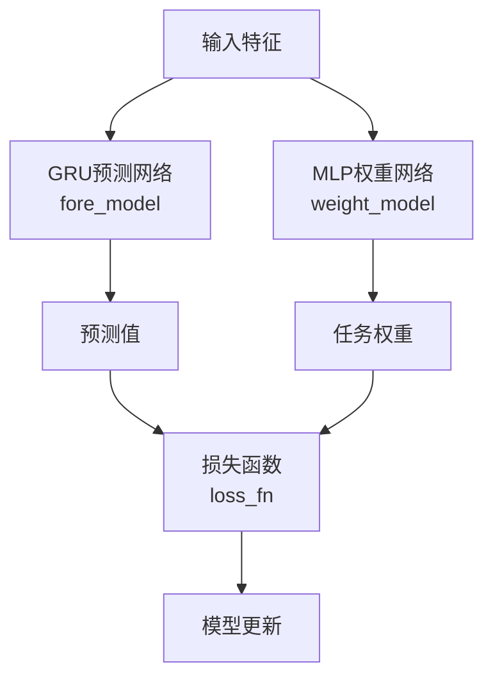
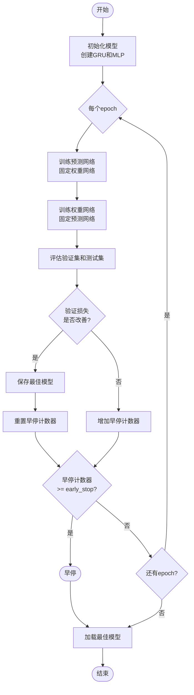

# TCTS 模型文档

## 模块概述

TCTS（Task-Consistent Time Series）是一个基于PyTorch实现的量化投资预测模型。该模型采用双网络架构，结合GRU（门控循环单元）进行时间序列预测和MLP（多层感知机）进行任务权重分配，能够自适应地学习多个预测任务的重要性权重。

### 主要特性

- **双网络架构**：GRU预测网络 + MLP权重网络
- **任务自适应**：支持硬选择（hard）和软加权（soft）两种任务组合模式
- **早停机制**：防止过拟合，自动选择最佳模型
- **灵活配置**：支持自定义网络结构、优化器、学习率等超参数
- **自动重试**：验证集性能不达标时自动重新训练

## 架构图



## 类定义

### TCTS 类

主模型类，继承自 `Model` 基类，实现了完整的训练、验证和预测流程。

```python
class TCTS(Model):
    """TCTS Model

    Parameters
    ----------
    d_feat : int
        每个时间步的输入特征维度
    metric: str
        早停时使用的评估指标
    optimizer : str
        优化器名称
    GPU : str
        用于训练的GPU ID
    """
```

#### 初始化参数

| 参数名 | 类型 | 默认值 | 说明 |
|--------|------|--------|------|
| d_feat | int | 6 | 输入特征维度 |
| hidden_size | int | 64 | 隐藏层大小 |
| num_layers | int | 2 | 网络层数 |
| dropout | float | 0.0 | Dropout比率 |
| n_epochs | int | 200 | 训练轮数 |
| batch_size | int | 2000 | 批次大小 |
| early_stop | int | 20 | 早停轮数 |
| loss | str | "mse" | 损失函数类型 |
| fore_optimizer | str | "adam" | 预测网络优化器 |
| weight_optimizer | str | "adam" | 权重网络优化器 |
| input_dim | int | 360 | 输入维度 |
| output_dim | int | 5 | 输出维度（任务数） |
| fore_lr | float | 5e-7 | 预测网络学习率 |
| weight_lr | float | 5e-7 | 权重网络学习率 |
| steps | int | 3 | 训练步数 |
| GPU | int | 0 | GPU设备ID |
| target_label | int | 0 | 目标标签索引 |
| mode | str | "soft" | 任务组合模式（"soft"或"hard"） |
| seed | int | None | 随机种子 |
| lowest_valid_performance | float | 0.993 | 最低验证集性能要求 |

### MLPModel 类

多层感知机模型，用于生成任务权重。

```python
class MLPModel(nn.Module):
    def __init__(self, d_feat, hidden_size=256, num_layers=3, dropout=0.0, output_dim=1):
```

#### 初始化参数

| 参数名 | 类型 | 默认值 | 说明 |
|--------|------|--------|------|
| d_feat | int | - | 输入特征维度 |
| hidden_size | int | 256 | 隐藏层大小 |
| num_layers | int | 3 | MLP层数 |
| dropout | float | 0.0 | Dropout比率 |
| output_dim | int | 1 | 输出维度 |

### GRUModel 类

基于GRU的时间序列预测模型。

```python
class GRUModel(nn.Module):
    def __init__(self, d_feat=6, hidden_size=64, num_layers=2, dropout=0.0):
```

#### 初始化参数

| 参数名 | 类型 | 默认值 | 说明 |
|--------|------|--------|------|
| d_feat | int | 6 | 输入特征维度 |
| hidden_size | int | 64 | GRU隐藏层大小 |
| num_layers | int | 2 | GRU层数 |
| dropout | float | 0.0 | Dropout比率 |

## 函数说明

### TCTS 类方法

#### `__init__()`

```python
def __init__(
    self,
    d_feat=6,
    hidden_size=64,
    num_layers=2,
    dropout=0.0,
    n_epochs=200,
    batch_size=2000,
    early_stop=20,
    loss="mse",
    fore_optimizer="adam",
    weight_optimizer="adam",
    input_dim=360,
    output_dim=5,
    fore_lr=5e-7,
    weight_lr=5e-7,
    steps=3,
    GPU=0,
    target_label=0,
    mode="soft",
    seed=None,
    lowest_valid_performance=0.993,
    **kwargs,
)
```

**功能说明**：初始化TCTS模型，设置超参数并记录日志。

**参数**：参见上面的初始化参数表。

**返回值**：无

---

#### `loss_fn()`

```python
def loss_fn(self, pred, label, weight)
```

**功能说明**：计算损失函数，支持硬选择和软加权两种模式。

**参数**：
- `pred` (torch.Tensor): 预测值，形状为 [batch_size]
- `label` (torch.Tensor): 标签值，形状为 [batch_size, output_dim]
- `weight` (torch.Tensor): 任务权重，形状为 [batch_size, output_dim]

**返回值**：
- `loss` (torch.Tensor): 计算得到的损失值（标量）

**工作模式**：
- **hard模式**：选择权重最大的任务，只计算该任务的损失
- **soft模式**：使用权重对所有任务的损失进行加权平均

---

#### `train_epoch()`

```python
def train_epoch(self, x_train, y_train, x_valid, y_valid)
```

**功能说明**：执行一个epoch的训练，包括预测网络和权重网络的交替训练。

**参数**：
- `x_train` (pd.DataFrame): 训练集特征
- `y_train` (pd.DataFrame): 训练集标签
- `x_valid` (pd.DataFrame): 验证集特征
- `y_valid` (pd.DataFrame): 验证集标签

**返回值**：无

**训练流程**：
1. 固定权重网络，训练预测网络 `steps` 次
2. 固定预测网络，在验证集上训练权重网络

---

#### `test_epoch()`

```python
def test_epoch(self, data_x, data_y)
```

**功能说明**：在给定数据上评估模型性能。

**参数**：
- `data_x` (pd.DataFrame): 输入特征
- `data_y` (pd.DataFrame): 输入标签

**返回值**：
- `mean_loss` (float): 平均MSE损失

---

#### `fit()`

```python
def fit(
    self,
    dataset: DatasetH,
    verbose=True,
    save_path=None,
)
```

**功能说明**：训练模型的主入口，准备数据并启动训练循环。

**参数**：
- `dataset` (DatasetH): 数据集对象，包含训练/验证/测试集
- `verbose` (bool): 是否打印训练日志
- `save_path` (str): 模型保存路径

**返回值**：无

**异常**：
- `ValueError`: 当训练集或验证集为空时抛出

---

#### `training()`

```python
def training(
    self,
    x_train,
    y_train,
    x_valid,
    y_valid,
    x_test,
    y_test,
    verbose=True,
    save_path=None,
)
```

**功能说明**：执行完整的训练流程，包括模型初始化、多轮训练和早停。

**参数**：
- `x_train` (pd.DataFrame): 训练集特征
- `y_train` (pd.DataFrame): 训练集标签
- `x_valid` (pd.DataFrame): 验证集特征
- `y_valid` (pd.DataFrame): 验证集标签
- `x_test` (pd.DataFrame): 测试集特征
- `y_test` (pd.DataFrame): 测试集标签
- `verbose` (bool): 是否打印训练日志
- `save_path` (str): 模型保存路径

**返回值**：
- `best_loss` (float): 最佳验证集损失

**训练流程**：
1. 初始化预测网络（GRU）和权重网络（MLP）
2. 配置优化器（Adam或SGD）
3. 多轮训练，每轮后评估验证集和测试集
4. 保存最佳模型参数
5. 早停机制：验证集损失连续 `early_stop` 轮不下降则停止
6. 加载最佳模型参数

---

#### `predict()`

```python
def predict(self, dataset)
```

**功能说明**：使用训练好的模型进行预测。

**参数**：
- `dataset` (DatasetH): 数据集对象

**返回值**：
- `predictions` (pd.Series): 预测结果，索引与测试集一致

**异常**：
- `ValueError`: 当模型尚未训练时抛出

---

### MLPModel 类方法

#### `__init__()`

```python
def __init__(self, d_feat, hidden_size=256, num_layers=3, dropout=0.0, output_dim=1)
```

**功能说明**：初始化MLP模型。

**网络结构**：
- 多层全连接层，每层后接ReLU激活
- 除第一层外，每层前应用Dropout
- 输出层后接Softmax归一化

---

#### `forward()`

```python
def forward(self, x)
```

**功能说明**：前向传播，计算任务权重。

**参数**：
- `x` (torch.Tensor): 输入特征，形状为 [N, F]

**返回值**：
- `weight` (torch.Tensor): 任务权重，形状为 [N, output_dim]，经过Softmax归一化

---

### GRUModel 类方法

#### `__init__()`

```python
def __init__(self, d_feat=6, hidden_size=64, num_layers=2, dropout=0.0)
```

**功能说明**：初始化GRU模型。

**网络结构**：
- GRU层：处理时间序列
- 全连接输出层：生成预测值

---

#### `forward()`

```python
def forward(self, x)
```

**功能说明**：前向传播，进行时间序列预测。

**参数**：
- `x` (torch.Tensor): 输入特征，形状为 [N, F*T]

**返回值**：
- `pred` (torch.Tensor): 预测值，形状为 [N]

**数据变换**：
1. 重塑为 [N, F, T]（特征 × 时间步）
2. 置换为 [N, T, F]（时间步 × 特征）
3. GRU处理，取最后一个时间步的输出
4. 全连接层生成预测

---

## 使用示例

### 基本使用

```python
import qlib
from qlib.contrib.model.pytorch_tcts import TCTS
from qlib.data.dataset import DatasetH
from qlib.data.dataset.handler import DataHandlerLP

# 初始化QLib
qlib.init(provider_uri="~/.qlib/qlib_data/cn_data")

# 准备数据处理器
handler = DataHandlerLP(
    instruments="csi300",
    start_time="2010-01-01",
    end_time="2020-12-31",
    learn_processors=[
        "DropnaLabel",
        "CSZScoreNorm",
    ],
    infer_processors=[
        "DropnaLabel",
        "CSZScoreNorm",
    ],
)

# 创建数据集
dataset = DatasetH(
    handler=handler,
    segments={
        "train": ("2010-01-01", "2017-12-31"),
        "valid": ("2018-01-01", "2018-12-31"),
        "test": ("2019-01-01", "2020-12-31"),
    },
)

# 初始化模型
model = TCTS(
    d_feat=6,
    hidden_size=64,
    num_layers=2,
    dropout=0.0,
    n_epochs=200,
    batch_size=2000,
    early_stop=20,
    mode="soft",
    GPU=0,
    seed=42,
)

# 训练模型
model.fit(dataset, save_path="./tcts_model")

# 预测
pred = model.predict(dataset)
print(pred.head())
```

### 硬选择模式

```python
# 使用硬选择模式，每次只选择一个任务
model_hard = TCTS(
    d_feat=6,
    hidden_size=64,
    num_layers=2,
    mode="hard",  # 硬选择模式
    GPU=0,
)

model_hard.fit(dataset, save_path="./tcts_hard_model")
pred_hard = model_hard.predict(dataset)
```

### 自定义超参数

```python
# 自定义超参数
model_custom = TCTS(
    d_feat=20,              # 20个特征
    hidden_size=128,        # 更大的隐藏层
    num_layers=3,           # 3层网络
    dropout=0.2,            # 使用dropout
    n_epochs=300,           # 更多训练轮数
    batch_size=1000,        # 更小的批次
    early_stop=30,          # 更长的早停等待
    fore_lr=1e-6,           # 更高的预测网络学习率
    weight_lr=1e-6,         # 更高的权重网络学习率
    output_dim=10,          # 10个任务
    lowest_valid_performance=0.99,  # 放宽最低性能要求
    GPU=1,                  # 使用第二个GPU
    seed=1234,              # 固定随机种子
)

model_custom.fit(dataset, save_path="./tcts_custom_model")
```

## 训练流程图



## 注意事项

1. **输入数据格式**：
   - 特征数据形状应为 [N, F*T]，其中F是特征维度，T是时间步数
   - 标签数据形状应为 [N, output_dim]，支持多任务学习

2. **GPU使用**：
   - 确保CUDA可用，否则会自动回退到CPU
   - 可以通过 `GPU` 参数指定使用的GPU设备ID

3. **随机种子**：
   - 设置 `seed` 参数可以保证结果可复现
   - 如果验证集性能不达标，模型会自动重置随机种子并重试

4. **早停机制**：
   - 监控验证集损失，连续 `early_stop` 轮不下降则停止训练
   - 自动加载验证集性能最佳的模型参数

5. **模式选择**：
   - `soft` 模式：对所有任务进行加权平均，更平滑
   - `hard` 模式：只选择权重最大的任务，更稀疏

## 相关文件

- `qlib/model/base.py` - 模型基类定义
- `qlib/data/dataset.py` - 数据集类
- `qlib/data/dataset/handler.py` - 数据处理器

## 参考文献

TCTS模型的设计思想参考了多任务学习和时间序列预测的相关研究，通过自适应任务权重分配提升了量化投资预测的鲁棒性。
