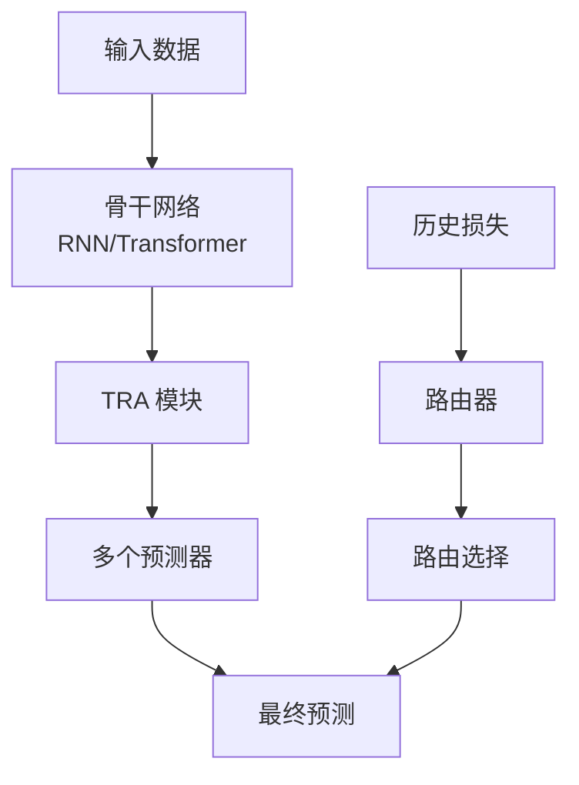
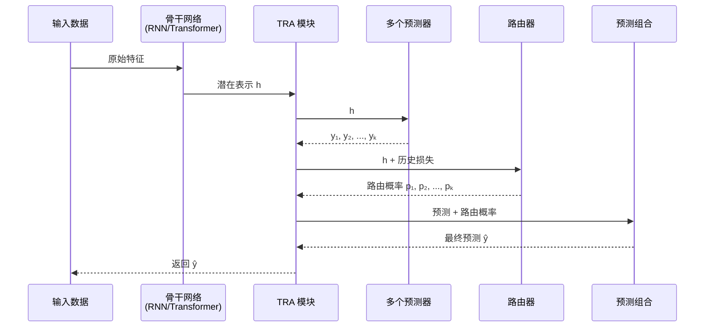

# PyTorch TRA (Temporal Routing Adaptor) 模块文档

## 模块概述

`pytorch_tra.py` 实现了基于 PyTorch 的时间路由适配器（Temporal Routing Adaptor, TRA）模型，这是一个用于量化投资的深度学习模型。TRA 模型通过学习历史预测误差，将输入样本路由到特定的预测器进行训练和推理，从而适应不同的市场状态或交易模式。

### 主要特性

- 支持 RNN 和 Transformer 两种骨干网络
- 实现了样本级（sample-wise）和日级（daily）两种传输方式
- 支持多种路由方法：none（无路由）、router（路由器）、oracle（最优传输）
- 集成了预训练、早停、TensorBoard 日志等功能
- 支持状态记忆和参数冻结

### 架构图



## 类定义

### TRAModel

主模型类，继承自 `qlib.model.base.Model`，实现了完整的 TRA 训练和推理流程。

#### 初始化参数

| 参数 | 类型 | 默认值 | 说明 |
|------|------|--------|------|
| `model_config` | dict | - | 骨干网络配置（RNN 或 Transformer 使用） |
| `tra_config` | dict | - | TRA 配置 |
| `model_type` | str | "RNN" | 骨干网络类型：RNN 或 Transformer |
| `lr` | float | 1e-3 | 学习率 |
| `n_epochs` | int | 500 | 总训练轮数 |
| `early_stop` | int | 50 | 早停轮数，当性能未提升时停止 |
| `update_freq` | int | 1 | 梯度更新频率 |
| `max_steps_per_epoch` | int | None | 每轮最大步数 |
| `lamb` | float | 0.0 | 正则化参数 |
| `rho` | float | 0.99 | `lamb` 的指数衰减率 |
| `alpha` | float | 1.0 | 计算传输损失矩阵的融合参数 |
| `seed` | int | None | 随机种子 |
| `logdir` | str | None | 本地日志目录 |
| `eval_train` | bool | False | 是否在训练过程中评估训练集 |
| `eval_test` | bool | False | 是否在训练过程中评估测试集 |
| `pretrain` | bool | False | 是否在训练 TRA 前预训练骨干网络 |
| `init_state` | str | None | 模型初始化状态路径 |
| `freeze_model` | bool | False | 是否冻结骨干网络参数 |
| `freeze_predictors` | bool | False | 是否冻结预测器参数 |
| `transport_method` | str | "none" | 传输方法：none/router/oracle |
| `memory_mode` | str | "sample" | 记忆模式：sample/daily |

#### 主要方法

##### `__init__`

```python
def __init__(
    self,
    model_config,
    tra_config,
    model_type="RNN",
    lr=1e-3,
    n_epochs=500,
    early_stop=50,
    update_freq=1,
    max_steps_per_epoch=None,
    lamb=0.0,
    rho=0.99,
    alpha=1.0,
    seed=None,
    logdir=None,
    eval_train=False,
    eval_test=False,
    pretrain=False,
    init_state=None,
    reset_router=False,
    freeze_model=False,
    freeze_predictors=False,
    transport_method="none",
    memory_mode="sample",
)
```

**功能说明**：初始化 TRAModel，设置所有超参数，验证配置有效性，初始化日志和 TensorBoard。

**使用示例**：
```python
model = TRAModel(
    model_config={"input_size": 16, "hidden_size": 64},
    tra_config={"num_states": 3, "input_size": 128},
    model_type="RNN",
    lr=1e-3,
    n_epochs=200,
    transport_method="router"
)
```

##### `_init_model`

```python
def _init_model(self)
```

**功能说明**：初始化骨干网络（RNN 或 Transformer）和 TRA 模块，加载预训练权重（如果提供），冻结指定参数，初始化优化器。

**详细流程**：
1. 根据 `model_type` 创建骨干网络并移至设备
2. 创建 TRA 模块
3. 如果提供 `init_state`，加载模型状态
4. 如果 `reset_router=True`，重置路由器参数
5. 根据 `freeze_model` 和 `freeze_predictors` 冻结对应参数
6. 打印可训练参数数量
7. 初始化 Adam 优化器
8. 设置训练状态标志

##### `train_epoch`

```python
def train_epoch(self, epoch, data_set, is_pretrain=False)
```

**功能说明**：执行一个训练轮次，包括前向传播、损失计算、反向传播和参数更新。

**参数说明**：
- `epoch` (int): 当前轮次数
- `data_set`: 训练数据集
- `is_pretrain` (bool): 是否为预训练阶段

**返回值**：
- `total_loss` (float): 该轮次的平均损失

**详细流程**：
1. 设置模型为训练模式
2. 初始化优化器梯度
3. 遍历数据集批次：
   - 前向传播通过骨干网络
   - 通过 TRA 获得所有预测器的输出
   - 根据传输方法计算损失
   - 反向传播
   - 按 `update_freq` 频率更新参数
   - 记录 TensorBoard 日志
4. 计算并返回平均损失

**使用示例**：
```python
loss = model.train_epoch(0, train_dataset, is_pretrain=False)
print(f"Epoch 0 loss: {loss:.4f}")
```

##### `test_epoch`

```python
def test_epoch(self, epoch, data_set, return_pred=False, prefix="test", is_pretrain=False)
```

**功能说明**：执行一个测试/验证轮次，评估模型性能。

**参数说明**：
- `epoch` (int): 当前轮次数
- `data_set`: 测试数据集
- `return_pred` (bool): 是否返回预测结果
- `prefix` (str): TensorBoard 日志前缀
- `is_pretrain` (bool): 是否为预训练阶段

**返回值**：
- `metrics` (dict): 评估指标字典（MSE、MAE、IC、ICIR）
- `preds` (pd.DataFrame): 预测结果（如果 `return_pred=True`）
- `probs` (pd.DataFrame): 路由概率（如果 `return_pred=True`）
- `P_all` (pd.DataFrame): 传输矩阵（如果 `return_pred=True`）

**详细流程**：
1. 设置模型为评估模式
2. 遍历数据集批次：
   - 无梯度前向传播
   - 计算预测和损失
   - 保存损失到数据集内存
3. 计算评估指标
4. 记录 TensorBoard 日志
5. 返回结果

**使用示例**：
```python
metrics, preds, probs, P = model.test_epoch(
    epoch=10,
    data_set=valid_dataset,
    return_pred=True,
    prefix="valid"
)
print(f"IC: {metrics['IC']:.4f}, ICIR: {metrics['ICIR']:.4f}")
```

##### `_fit`

```python
def _fit(self, train_set, valid_set, test_set, evals_result, is_pretrain=True)
```

**功能说明**：内部训练循环，处理训练、验证、早停和模型保存。

**参数说明**：
- `train_set`: 训练数据集
- `valid_set`: 验证数据集
- `test_set`: 测试数据集
- `evals_result` (dict): 评估结果存储字典
- `is_pretrain` (bool): 是否为预训练阶段

**返回值**：
- `best_score` (float): 最佳验证集 IC 分数

**详细流程**：
1. 初始化最佳分数和早停计数器
2. 如果使用路由且非预训练，初始化内存
3. 训练循环：
   - 调用 `train_epoch` 进行训练
   - 在验证集上评估
   - 记录评估结果
   - 如果性能提升，保存最佳模型
   - 检查早停条件
4. 加载最佳模型参数
5. 返回最佳分数

##### `fit`

```python
def fit(self, dataset, evals_result=dict())
```

**功能说明**：主训练接口，处理完整的训练流程，包括预训练和最终推理。

**参数说明**：
- `dataset`: 数据集，必须是 `MTSDatasetH` 类型
- `evals_result` (dict): 评估结果存储字典

**详细流程**：
1. 验证数据集类型
2. 准备训练、验证、测试集
3. 初始化训练状态
4. 如果 `pretrain=True`：
   - 配置优化器只训练骨干网络和预测器
   - 执行预训练
   - 重置优化器以包含所有参数
5. 执行主训练
6. 在所有数据集上进行最终推理
7. 如果 `logdir` 提供，保存模型和预测结果

**使用示例**：
```python
from qlib.contrib.data.dataset import MTSDatasetH

# 准备数据集
dataset = MTSDatasetH(...)
evals_result = {}

# 训练模型
model.fit(dataset, evals_result=evals_result)

# 查看训练历史
print("Train history:", evals_result["train"])
```

##### `predict`

```python
def predict(self, dataset, segment="test")
```

**功能说明**：使用训练好的模型进行预测。

**参数说明**：
- `dataset`: 数据集，必须是 `MTSDatasetH` 类型
- `segment` (str): 预测的数据集分段

**返回值**：
- `preds` (pd.DataFrame): 预测结果 DataFrame

**使用示例**：
```python
# 获取测试集预测
test_preds = model.predict(dataset, segment="test")

# 获取训练集预测
train_preds = model.predict(dataset, segment="train")
```

---

### RNN

RNN 骨干网络类，支持 GRU、LSTM 等架构，可选注意力机制。

#### 初始化参数

| 参数 | 类型 | 默认值 | 说明 |
|------|------|--------|------|
| `input_size` | int | 16 | 输入特征维度 |
| `hidden_size` | int | 64 | 隐藏层维度 |
| `num_layers` | int | 2 | RNN 层数 |
| `rnn_arch` | str | "GRU" | RNN 架构类型 |
| `use_attn` | bool | True | 是否使用注意力层 |
| `dropout` | float | 0.0 | Dropout 比率 |

#### 主要方法

##### `__init__`

```python
def __init__(
    self,
    input_size=16,
    hidden_size=64,
    num_layers=2,
    rnn_arch="GRU",
    use_attn=True,
    dropout=0.0,
    **kwargs,
)
```

**功能说明**：初始化 RNN 模型，包括输入投影层、RNN 层和可选的注意力层。

**架构细节**：
- 如果 `hidden_size < input_size`，添加输入投影层进行压缩
- 使用 PyTorch 的 RNN 实现（GRU/LSTM/RNN）
- 注意力层使用 concat attention 机制

##### `forward`

```python
def forward(self, x)
```

**功能说明**：RNN 前向传播。

**参数说明**：
- `x` (torch.Tensor): 输入张量，形状为 `[batch, time, features]`

**返回值**：
- `last_out` (torch.Tensor): 输出张量

**详细流程**：
1. 应用输入投影（如果有）
2. 通过 RNN 层
3. 对最后一层隐藏状态取平均
4. 如果使用注意力：
   - 计算注意力分数
   - 加权求和 RNN 输出
   - 拼接平均隐藏状态和注意力输出
5. 返回最终输出

**使用示例**：
```python
rnn = RNN(input_size=20, hidden_size=64, use_attn=True)
x = torch.randn(32, 60, 20)  # batch=32, time=60, features=20
output = rnn(x)
print(output.shape)  # torch.Size([32, 128])  # 64*2 with attention
```

---

### PositionalEncoding

位置编码类，为 Transformer 提供位置信息。

#### 主要方法

##### `__init__`

```python
def __init__(self, d_model, dropout=0.1, max_len=5000)
```

**功能说明**：初始化位置编码。

**参数说明**：
- `d_model` (int): 模型维度
- `dropout` (float): Dropout 比率
- `max_len` (int): 最大序列长度

##### `forward`

```python
def forward(self, x)
```

**功能说明**：将位置编码添加到输入张量。

**参数说明**：
- `x` (torch.Tensor): 输入张量

**返回值**：
- 添加位置编码后的张量

---

### Transformer

Transformer 骨干网络类。

#### 初始化参数

| 参数 | 类型 | 默认值 | 说明 |
|------|------|--------|------|
| `input_size` | int | 16 | 输入特征维度 |
| `hidden_size` | int | 64 | 隐藏层维度 |
| `num_layers` | int | 2 | Transformer 层数 |
| `num_heads` | int | 2 | 注意力头数 |
| `dropout` | float | 0.0 | Dropout 比率 |

#### 主要方法

##### `__init__`

```python
def __init__(
    self,
    input_size=16,
    hidden_size=64,
    num_layers=2,
    num_heads=2,
    dropout=0.0,
    **kwargs,
)
```

**功能说明**：初始化 Transformer 模型。

##### `forward`

```python
def forward(self, x)
```

**功能说明**：Transformer 前向传播。

**参数说明**：
- `x` (torch.Tensor): 输入张量，形状为 `[batch, time, features]`

**返回值**：
- 最后一个时间步的输出

**详细流程**：
1. 调整维度顺序（时间第一）
2. 添加位置编码
3. 应用输入投影
4. 通过 Transformer 编码器
5. 返回最后一个时间步的输出

**使用示例**：
```python
transformer = Transformer(input_size=20, hidden_size=64, num_heads=2)
x = torch.randn(32, 60, 20)  # batch=32, time=60, features=20
output = transformer(x)
print(output.shape)  # torch.Size([32, 64])
```

---

### TRA

时间路由适配器（Temporal Routing Adaptor）模块。

#### 初始化参数

| 参数 | 类型 | 默认值 | 说明 |
|------|------|--------|------|
| `input_size` | int | - | 输入维度（RNN/Transformer 的隐藏层维度） |
| `num_states` | int | 1 | 潜在状态数量（即交易模式数量） |
| `hidden_size` | int | 8 | 路由器的隐藏层维度 |
| `rnn_arch` | str | "GRU" | 路由器的 RNN 架构 |
| `num_layers` | int | 1 | 路由器的 RNN 层数 |
| `dropout` | float | 0.0 | Dropout 比率 |
| `tau` | float | 1.0 | Gumbel softmax 温度 |
| `src_info` | str | "LR_TPE" | 路由器使用的信息类型 |

#### 主要方法

##### `__init__`

```python
def __init__(
    self,
    input_size,
    num_states=1,
    hidden_size=8,
    rnn_arch="GRU",
    num_layers=1,
    dropout=0.0,
    tau=1.0,
    src_info="LR_TPE",
)
```

**功能说明**：初始化 TRA 模块。

**架构细节**：
- `src_info` 选项：
  - `"LR"`: 仅使用 latent representation（潜在表示）
  - `"TPE"`: 仅使用 temporal pattern encoder（时间模式编码器）
  - `"LR_TPE"`: 同时使用两者
- 当 `num_states > 1` 时才创建路由器
- 预测器是一个线性层，输出 `num_states` 个预测

##### `reset_parameters`

```python
def reset_parameters(self)
```

**功能说明**：重置所有子模块的参数。

##### `forward`

```python
def forward(self, hidden, hist_loss)
```

**功能说明**：TRA 前向传播。

**参数说明**：
- `hidden` (torch.Tensor): 骨干网络的隐藏表示
- `hist_loss` (torch.Tensor): 历史损失矩阵

**返回值**：
- `preds` (torch.Tensor): 所有预测器的预测
- `choice` (torch.Tensor): Gumbel softmax 选择（训练时）
- `prob` (torch.Tensor): 路由概率

**详细流程**：
1. 通过预测器获得所有状态的预测
2. 如果 `num_states == 1`，直接返回预测
3. 根据 `src_info` 处理输入：
   - `"TPE"`: 通过 RNN 处理历史损失
   - `"LR"`: 直接使用隐藏表示
   - `"LR_TPE"`: 拼接两者
4. 通过全连接层获得路由 logits
5. 应用 Gumbel softmax 获得选择
6. 计算路由概率
7. 返回结果

**使用示例**：
```python
tra = TRA(input_size=128, num_states=3, src_info="LR_TPE")
hidden = torch.randn(32, 128)  # batch=32, features=128
hist_loss = torch.randn(32, 60, 3)  # batch=32, time=60, states=3

preds, choice, prob = tra(hidden, hist_loss)
print(preds.shape)   # torch.Size([32, 3])
print(choice.shape)  # torch.Size([32, 3])
print(prob.shape)    # torch.Size([32, 3])
```

---

## 工具函数

### evaluate

```python
def evaluate(pred)
```

**功能说明**：评估预测结果，计算 MSE、MAE、IC 指标。

**参数说明**：
- `pred` (pd.DataFrame): 包含 `score` 和 `label` 列的 DataFrame

**返回值**：
- `metrics` (dict): 包含 MSE、MAE、IC 的字典

**详细流程**：
1. 将预测和标签转换为百分位数排名
2. 计算预测误差
3. 计算 MSE（均方误差）
4. 计算 MAE（平均绝对误差）
5. 计算 IC（Spearman 秩相关系数）

**使用示例**：
```python
import pandas as pd
import numpy as np

pred_df = pd.DataFrame({
    'score': np.random.randn(100),
    'label': np.random.randn(100)
})
metrics = evaluate(pred_df)
print(f"MSE: {metrics['MSE']:.4f}, MAE: {metrics['MAE']:.4f}, IC: {metrics['IC']:.4f}")
```

---

### shoot_infs

```python
def shoot_infs(inp_tensor)
```

**功能说明**：将张量中的 inf 值替换为最大值。

**参数说明**：
- `inp_tensor` (torch.Tensor): 输入张量

**返回值**：
- 处理后的张量

---

### sinkhorn

```python
def sinkhorn(Q, n_iters=3, epsilon=0.1)
```

**功能**：执行 Sinkhorn 算法计算最优传输矩阵。

**参数说明**：
- `Q` (torch.Tensor): 成本矩阵
- `n_iters` (int): 迭代次数
- `epsilon` (float): 正则化参数

**返回值**：
- `P` (torch.Tensor): 最优传输矩阵

**详细流程**：
1. 对成本矩阵应用指数变换
2. 处理 inf 值
3. 交替归一化行和列
4. 返回传输矩阵

---

### loss_fn

```python
def loss_fn(pred, label)
```

**功能说明**：计算均方误差损失。

**参数说明**：
- `pred` (torch.Tensor): 预测值
- `label` (torch.Tensor): 标签值

**返回值**：
- 损失张量

---

### minmax_norm

```python
def minmax_norm(x)
```

**功能说明**：对张量进行最小-最大归一化。

**参数说明**：
- `x` (torch.Tensor): 输入张量

**返回值**：
- 归一化后的张量

---

### transport_sample

```python
def transport_sample(all_preds, label, choice, prob, hist_loss, count, transport_method, alpha, training=False)
```

**功能说明**：样本级传输函数。

**参数说明**：
- `all_preds` (torch.Tensor): 所有预测器的预测，形状 `[sample x states]`
- `label` (torch.Tensor): 标签，形状 `[sample]`
- `choice` (torch.Tensor): Gumbel softmax 选择，形状 `[sample x states]`
- `prob` (torch.Tensor): 路由器预测概率，形状 `[sample x states]`
- `hist_loss` (torch.Tensor): 历史损失矩阵，形状 `[sample x states]`
- `count` (list): 每日样本计数（样本级传输时为空）
- `transport_method` (str): 传输方法：oracle/router
- `alpha` (float): 融合参数
- `training` (bool): 是否训练模式

**返回值**：
- `loss` (torch.Tensor): 损失值
- `pred` (torch.Tensor): 最终预测
- `L` (torch.Tensor): 归一化损失矩阵
- `P` (torch.Tensor): 传输矩阵

**详细流程**：
1. 计算所有预测器的损失
2. 归一化损失
3. 融合当前损失和历史损失
4. 使用 Sinkhorn 算法计算传输矩阵
5. 根据传输方法计算最终预测和损失

---

### transport_daily

```python
def transport_daily(all_preds, label, choice, prob, hist_loss, count, transport_method, alpha, training=False)
```

**功能说明**：日级传输函数。

**参数说明**：
- `all_preds` (torch.Tensor): 所有预测器的预测，形状 `[sample x states]`
- `label` (torch.Tensor): 标签，形状 `[sample]`
- `choice` (torch.Tensor): Gumbel softmax 选择，形状 `[days x states]`
- `prob` (torch.Tensor): 路由器预测概率，形状 `[days x states]`
- `hist_loss` (torch.Tensor): 历史损失矩阵，形状 `[days x states]`
- `count` (list): 每日样本计数，形状 `[days]`
- `transport_method` (str): 传输方法：oracle/router
- `alpha` (float): 融合参数
- `training` (bool): 是否训练模式

**返回值**：
- `loss` (torch.Tensor): 损失值
- `pred` (torch.Tensor): 最终预测
- `L` (torch.Tensor): 归一化损失矩阵
- `P` (torch.Tensor): 传输矩阵

**详细流程**：
1. 按天分组计算所有预测器的损失
2. 归一化损失
3. 融合当前损失和历史损失
4. 使用 Sinkhorn 算法计算传输矩阵
5. 根据传输方法计算最终预测和损失

---

### load_state_dict_unsafe

```python
def load_state_dict_unsafe(model, state_dict)
```

**功能说明**：加载模型状态字典，忽略不匹配的键。

**参数说明**：
- `model`: PyTorch 模型
- `state_dict`: 状态字典

**返回值**：
- 包含 unexpected_keys、missing_keys、error_msgs 的字典

---

### plot

```python
def plot(P)
```

**功能说明**：绘制传输矩阵的可视化图。

**参数说明**：
- `P` (pd.DataFrame): 传输矩阵 DataFrame

**返回值**：
- 图像数组，用于 TensorBoard 显示

**详细流程**：
1. 创建包含两个子图的画布
2. 左图：面积图显示传输概率
3. 右图：柱状图显示最大概率状态的分布
4. 将图像转换为 numpy 数组

---

## 完整使用示例

### 示例 1：基本训练流程

```python
import torch
import pandas as pd
from qlib.contrib.data.dataset import MTSDatasetH
from qlib.contrib.model.pytorch_tra import TRAModel

# 配置模型
model_config = {
    "input_size": 20,      # 特征维度
    "hidden_size": 64,     # 隐藏层维度
    "num_layers": 2,       # RNN 层数
    "rnn_arch": "GRU",     # RNN 架构
    "use_attn": True,      # 使用注意力
    "dropout": 0.1
}

tra_config = {
    "input_size": 128,     # TRA 输入维度（hidden_size * 2 with attention）
    "num_states": 3,       # 3 个潜在状态
    "hidden_size": 16,     # 路由器隐藏层
    "tau": 1.0,            # Gumbel softmax 温度
    "src_info": "LR_TPE"   # 使用 LR 和 TPE
}

# 创建模型
model = TRAModel(
    model_config=model_config,
    tra_config=tra_config,
    model_type="RNN",
    lr=1e-3,
    n_epochs=200,
    early_stop=30,
    lamb=0.1,
    transport_method="router",
    memory_mode="sample",
    logdir="./tra_logs",
    eval_train=True,
    pretrain=True
)

# 准备数据集（假设已创建 MTSDatasetH）
dataset = MTSDatasetH(...)

# 训练模型
evals_result = {}
model.fit(dataset, evals_result=evals_result)

# 预测
test_preds = model.predict(dataset, segment="test")
print(test_preds.head())
```

### 示例 2：使用 Transformer 骨干网络

```python
model_config = {
    "input_size": 20,
    "hidden_size": 64,
    "num_layers": 2,
    "num_heads": 2,
    "dropout": 0.1
}

tra_config = {
    "input_size": 64,      # Transformer 输出维度
    "num_states": 5,
    "hidden_size": 8,
    "src_info": "TPE"      # 仅使用 TPE
}

model = TRAModel(
    model_config=model_config,
    tra_config=tra_config,
    model_type="Transformer",
    transport_method="oracle",
    memory_mode="daily"    # 日级传输
)
```

### 示例 3：仅使用 TRA 进行推理

```python
# 创建模型结构
model = TRAModel(
    model_config=model_config,
    tra_config=tra_config,
    init_state="./tra_logs/model.bin"  # 加载训练好的权重
)

# 预测
dataset = MTSDatasetH(...)
preds = model.predict(dataset, segment="test")

# 分析结果
print("Predictions shape:", preds.shape)
print("Columns:", preds.columns.tolist())
print("Score IC:", preds['score'].corr(preds['label'], method='spearman'))
```

## 模型架构详解

### TRA 工作原理

TRA 通过学习历史预测误差来识别不同的市场状态，并为每个状态训练专门的预测器。



### 传输方法对比

| 方法 | 说明 | 使用场景 |
|------|------|----------|
| `none` | 无传输，简单平均所有预测 | 单状态模型，或作为基线 |
| `router` | 学习路由器预测路由 | 实际应用部署 |
| `oracle` | 使用最优传输（后验） | 预训练或理论上限 |

### 记忆模式对比

| 模式 | 说明 | 优点 | 缺点 |
|------|------|------|------|
| `sample` | 样本级记忆和传输 | 更细粒度的控制 | 计算量大 |
| `daily` | 日级记忆和传输 | 计算高效，适合日常预测 | 粒度较粗 |

## 训练策略建议

### 预训练策略

当 `pretrain=True` 时，模型会分两个阶段训练：

1. **预训练阶段**：
   - 只训练骨干网络和预测器
   - 使用 oracle 传输方法
   - 目标是让每个预测器学会处理特定状态

2. **主训练阶段**：
   - 训练所有参数（包括路由器）
   - 使用指定的传输方法
   - 学习路由策略

### 超参数调优建议

1. **`num_states`**：通常设置为 2-5，取决于市场状态复杂度
2. **`lamb`**：正则化参数，建议从 0.01-0.1 开始
3. **`alpha`**：融合参数，0.5-1.0 范围较合理
4. **`tau`**：Gumbel softmax 温度，1.0 通常效果良好
5. **`src_info`**："LR_TPE" 通常效果最好，但可尝试其他选项

### 早停策略

模型使用验证集 IC 作为早停指标：
- 保存 IC 最高的模型
- 当 IC 连续 `early_stop` 轮未提升时停止训练
- 最终加载最佳模型进行推理

## 注意事项

1. **数据集要求**：必须使用 `MTSDatasetH` 类型的数据集
2. **设备选择**：自动使用 CUDA（如果可用），否则使用 CPU
3. **内存管理**：使用日级传输时，`src_info` 必须为 "TPE"
4. **参数初始化**：可以使用 `init_state` 加载预训练模型
5. **日志记录**：建议设置 `logdir` 以保存模型和训练日志
6. **随机性控制**：设置 `seed` 以确保结果可复现

## 文件位置

- 源码文件：`/home/firewind0/qlib/qlib/contrib/model/pytorch_tra.py`
- 本文档：`/home/firewind0/qlib/docs/all/contrib/model/pytorch_tra.md`
