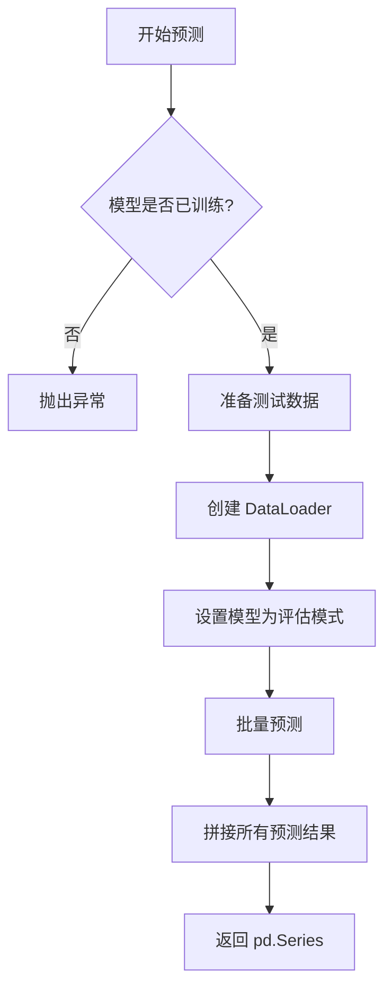
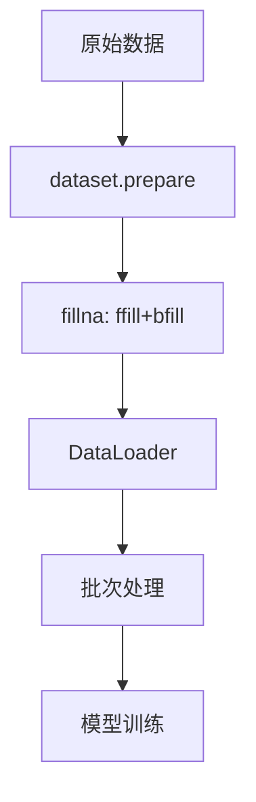
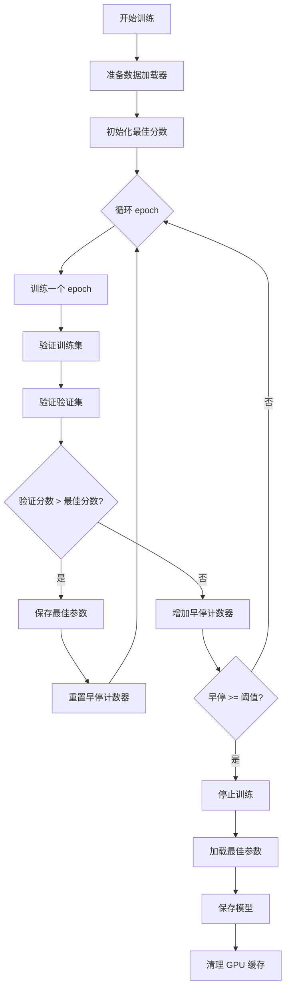

# pytorch_transformer_ts 模块文档

## 模块概述

`pytorch_transformer_ts` 模块实现了基于 Transformer 的时序预测模型，适用于量化投资中的时间序列预测任务。该模块包含：

- **TransformerModel**: 完整的 Transformer 模型类，继承自 Qlib 的 Model 基类
- **Transformer**: PyTorch Transformer 网络架构
- **PositionalEncoding**: 位置编码层

## 核心类

### TransformerModel

完整的 Transformer 模型实现，支持训练、预测和评估。

#### 构造方法参数

| 参数 | 类型 | 默认值 | 说明 |
|------|------|--------|------|
| d_feat | int | 20 | 输入特征维度 |
| d_model | int | 64 | Transformer 内部模型维度 |
| batch_size | int | 8192 | 扩展大小 |
| nhead | int | 2 | 多头注意力机制的注意力头数 |
| num_layers | int | 2 | Transformer 编码器层数 |
| dropout | float | 0 | Dropout 比例 |
| n_epochs | int | 100 | 训练轮数 |
| lr | float | 0.0001 | 学习率 |
| metric | str | "" | 评估指标 |
| early_stop | int | 5 | 早停轮数 |
| loss | str | "mse" | 损失函数类型 |
| optimizer | str | "adam" | 优化器类型 |
| reg | float | 1e-3 | L2 正则参数 |
| n_jobs | int | 10 | 数据加载工作进程数 |
| GPU | int | 0 | GPU 设备编号 |
| seed | int | None | 随机种子 |
| **kwargs | dict | - | 其他参数 |

#### 主要方法

##### use_gpu (属性)

返回是否使用 GPU。

```python
@property
def use_gpu(self):
    return self.device != torch.device("cpu")
```

##### mse(pred, label)

计算均方误差（MSE）。

**参数：**
- `pred`: 预测值
- `label`: 真实标签

**返回：** 均方误差

##### loss_fn(pred, label)

计算损失值，支持多种损失函数。

**参数：**
- `pred`: 预测值
- `label`: 真实标签

**返回：** 损失值

**支持的损失函数：**
- `mse`: 均方误差

##### metric_fn(pred, label)

计算评估指标。

**参数：**
- `pred`: 预测值
- `label`: 真实标签

**返回：** 评估指标值

##### train_epoch(data_loader)

训练一个 epoch。

**参数：**
- `data_loader`: 训练数据加载器

##### test_epoch(data_loader)

测试一个 epoch，返回平均损失和分数。

**参数：**
- `data_loader`: 测试数据加载器

**返回：** (平均损失, 平均分数)

##### fit(dataset, evals_result=dict(), save_path=None)

训练模型。

**参数：**
- `dataset`: 数据集对象，必须包含 train 和 valid 分割
- `evals_result`: 用于存储训练/验证结果的字典
- `save_path`: 模型保存路径

**训练过程：**
1. 准备训练和验证数据
2. 创建 DataLoader
3. 循环训练 epoch
4. 支持早停机制
5. 保存最佳模型参数

##### predict(dataset)

预测测试集数据。

**参数：**
- `dataset`: 数据集对象

**返回：** 预测结果（pd.Series）

**流程：**


### Transformer

PyTorch Transformer 网络架构实现。

#### 构造方法参数

| 参数 | 类型 | 默认值 | 说明 |
|------|------|--------|------|
| d_feat | int | 6 | 输入特征维度 |
| d_model | int | 8 | Transformer 内部维度 |
| nhead | int | 4 | 注意力头数 |
| num_layers | int | 2 | 编码器层数 |
| dropout | float | 0.5 | Dropout 比例 |
| device | torch.device | None | 计算设备 |

#### 网络结构


#### forward(src)

前向传播。

**参数：**
- `src`: 输入张量，形状为 [N, T, F]

**返回：** 输出张量，形状为 [N]

### PositionalEncoding

位置编码层，为 Transformer 提供序列位置信息。

#### 构造方法参数

| 参数 | 类型 | 默认值 | 说明 |
|------|------|--------|------|
| d_model | int | - | 模型维度 |
| max_len | int | 1000 | 最大序列长度 |

#### 编码公式

使用正弦和余弦函数生成位置编码：

```
PE(pos, 2i) = sin(pos / 10000^(2i/d_model))
PE(pos, 2i+1) = cos(pos / 10000^(2i/d_model))
```

#### forward(x)

添加位置编码。

**参数：**
- `x`: 输入张量 [T, N, F]

**返回：** 输入 + 位置编码

## 使用示例

### 基本使用

```python
from qlib.contrib.model.pytorch_transformer_ts import TransformerModel
from qlib.data.dataset import DatasetH

# 创建模型
model = TransformerModel(
    d_feat=20,          # 特征维度
    d_model=64,         # Transformer 内部维度
    nhead=2,            # 注意力头数
    num_layers=2,       # 编码器层数
    batch_size=2048,    # 批大小
    n_epochs=100,       # 训练轮数
    lr=0.0001,          # 学习率
    early_stop=5,       # 早停轮数
    GPU=0               # 使用 GPU 0
)

# 准备数据集
dataset = DatasetH(handler=your_data_handler, ...)

# 训练模型
evals_result = {}
model.fit(
    dataset,
    evals_result=evals_result,
    save_path="./transformer_model.pth"
)

# 预测
predictions = model.predict(dataset)
```

### 查看训练结果

```python
import matplotlib.pyplot as plt

# 训练历史
train_scores = evals_result['train']
valid_scores = evals_result['valid']

epochs = range(len(train_scores))
plt.figure(figsize=(10, 6))
plt.plot(epochs, train_scores, label='Train Score')
plt.plot(epochs, valid_scores, label='Valid Score')
plt.xlabel('Epoch')
plt.ylabel('Score')
plt.title('Transformer Training History')
plt.legend()
plt.grid(True)
plt.show()
```

### 使用不同的优化器

```python
# 使用 SGD 优化器
model = TransformerModel(
    d_feat=20,
    optimizer="gd",      # 使用 SGD
    lr=0.01,             # SGD 通常需要更大的学习率
    reg=1e-4
)

model.fit(dataset)
```

### 自定义超参数

```python
model = TransformerModel(
    d_feat=30,           # 更多的特征
    d_model=128,         # 更大的模型维度
    nhead=4,             # 更多注意力头
    num_layers=4,        # 更深的网络
    dropout=0.3,         # 较高的 dropout
    batch_size=4096,
    n_epochs=200,
    lr=0.0001,
    reg=1e-3,
    early_stop=10
)
```

## 注意事项

1. **GPU 使用**：模型会自动检测 CUDA 可用性并使用 GPU。如果 GPU 不可用，会自动回退到 CPU。

2. **内存管理**：训练后会自动清理 GPU 缓存。

3. **数据形状**：
   - 输入特征形状：[N, T, F]（批量大小，时间步，特征维度）
   - 标签形状：[N, T, 1] 或 [N]

4. **早停机制**：如果验证分数在 `early_stop` 轮内没有提升，训练会提前停止。

5. **梯度裁剪**：训练时梯度值会被裁剪到 3.0 以防止梯度爆炸。

6. **最佳模型保存**：训练会保存验证集上表现最好的模型参数。

## 技术细节

### 数据处理流程



### 训练循环



## 参考文献

- Vaswani, A., et al. (2017). "Attention is All You Need". arXiv:1706.03762
