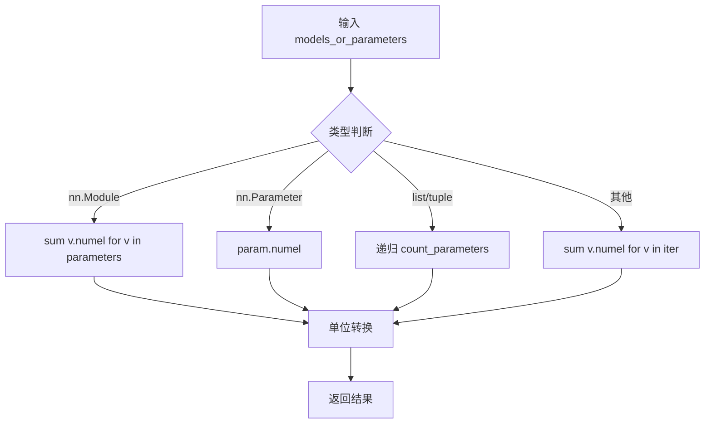

# pytorch_utils 模块文档

## 模块概述

`pytorch_utils` 模块提供了 PyTorch 模型的实用工具函数，主要用于计算模型的参数数量和存储大小。

该模块轻量但实用，常用于：
- 估算模型大小
- 比较不同模型的复杂度
- 模型压缩和优化前的评估

## 函数

### count_parameters(models_or_parameters, unit="m")

计算 PyTorch 模型或参数的参数数量，并按指定单位返回。

#### 参数

| 参数 | 类型 | 默认值 | 说明 |
|------|------|--------|------|
| models_or_parameters | nn.Module / nn.Parameter / list / tuple | - | 模型、参数或它们的列表 |
| unit | str | "m" | 存储大小单位 |

#### 返回值

返回参数数量，根据 `unit` 参数转换为相应的存储单位：

| unit 值 | 说明 | 转换 |
|----------|------|------|
| "k" 或 "kb" | 千字节 | / 2^10 |
| "m" 或 "mb" | 兆字节（默认） | / 2^20 |
| "g" 或 "gb" | 吉字节 | / 2^30 |
| None | 参数数量 | 不转换 |

#### 支持的输入类型

1. **单个模型**（nn.Module）
   ```python
   model = nn.Linear(100, 50)
   params = count_parameters(model)
   ```

2. **单个参数**（nn.Parameter）
   ```python
   param = nn.Parameter(torch.randn(100))
   params = count_parameters(param)
   ```

3. **模型参数列表**（list 或 tuple）
   ```python
   params_list = [model1.parameters(), model2.parameters()]
   params = count_parameters(params_list)
   ```

4. **参数迭代器**
   ```python
   params = count_parameters(model.parameters())
   ```

#### 异常

如果传入未知的 `unit` 值，会抛出 `ValueError`。

## 使用示例

### 基本使用

```python
import torch.nn as nn
from qlib.contrib.model.pytorch_utils import count_parameters

# 创建一个简单的模型
model = nn.Sequential(
    nn.Linear(100, 200),
    nn.ReLU(),
    nn.Linear(200, 50)
)

# 计算参数数量（以 MB 为单位）
params_mb = count_parameters(model, unit="m")
print(f"模型参数大小: {params_mb:.2f} MB")

# 计算原始参数数量
params_count = count_parameters(model, unit=None)
print(f"模型参数数量: {params_count}")
```

### 比较不同模型

```python
import torch.nn as nn
from qlib.contrib.model.pytorch_utils import count_parameters

# 创建不同大小的模型
small_model = nn.Linear(10, 5)
large_model = nn.Sequential(
    nn.Linear(100, 200),
    nn.BatchNorm1d(200),
    nn.Linear(200, 100),
    nn.ReLU(),
    nn.Linear(100, 50)
)

# 比较参数数量
print(f"小模型: {count_parameters(small_model, unit='k'):.2f} KB")
print(f"大模型: {count_parameters(large_model, unit='m'):.2f} MB")
```

### 计算模型各层的参数

```python
import torch.nn as nn
from qlib.contrib.model.pytorch_utils import count_parameters

model = nn.Sequential(
    nn.Linear(100, 200),
    nn.Linear(200, 100),
    nn.Linear(100, 50)
)

# 计算每层的参数
for name, layer in model.named_children():
    params = count_parameters(layer, unit=None)
    print(f"{name}: {params:,} 个参数")
```

### 使用不同单位

```python
from qlib.contrib.model.pytorch_utils import count_parameters

model = nn.Linear(1000, 500)

# 不同单位
print(f"原始数量: {count_parameters(model, unit=None):,}")
print(f"KB: {count_parameters(model, unit='k'):.2f} KB")
print(f"MB: {count_parameters(model, unit='m'):.4f} MB")
print(f"GB: {count_parameters(model, unit='g'):.6f} GB")
```

### 计算多个模型的参数总和

```python
import torch.nn as nn
from qlibert.model.pytorch_utils import count_parameters

# 创建多个模型
models = [
    nn.Linear(100, 50),
    nn.Linear(50, 25),
    nn.Linear(25, 10)
]

# 计算所有模型的参数总和
total_params = count_parameters(models, unit="m")
print(f"所有模型的总参数: {total_params:.2f} MB")

# 或者使用列表推导式
total_params = sum(count_parameters(m, unit=None) for m in models)
print(f"所有模型的总参数: {total_params:,}")
```

### 在训练循环中监控参数

```python
import torch.nn as nn
from qlib.contrib.model.pytorch_utils import count_parameters

class CustomModel(nn.Module):
    def __init__(self):
        super().__init__()
        self.layers = nn.ModuleList()

    def add_layer(self, in_features, out_features):
        self.layers.append(nn.Linear(in_features, out_features))

# 动态添加层并监控参数
model = CustomModel()
model.add_layer(100, 50)

print(f"添加第1层后: {count_parameters(model, unit='k'):.2f} KB")

model.add_layer(50, 25)
print(f"添加第2层后: {count_parameters(model, unit='k'):.2f} KB")

model.add_layer(25, 10)
print(f"添加第3层后: {count_parameters(model,)k'):.2f} KB")
```

## 实际应用场景

### 模型复杂度评估

```python
from qlib.contrib.model.pytorch_utils import count_parameters

def evaluate_model_complexity(model):
    """评估模型复杂度"""
    params = count_parameters(model, unit='m')

    if params < 1:
        complexity = "小"
    elif params < 10:
        complexity = "中"
    elif params < 50:
        complexity = "大"
    else:
        complexity = "超大"

    return complexity, params

model = create_your_model()
complexity, params = evaluate_model_complexity(model)
print(f"模型复杂度: {complexity} ({params:.2f} MB)")
```

### 模型压缩验证

```python
from qlib.contrib.model.pytorch_utils import count_parameters

# 原始模型
original_model = create_large_model()
original_params = count_parameters(original_model, unit='m')

# 压缩后的模型
compressed_model = compress_model(original_model)
compressed_params = count_parameters(compressed_model, unit='m')

# 计算压缩率
compression_ratio = original_params / compressed_params
print(f"原始大小: {original_params:.2f} MB")
print(f"压缩后大小: {compressed_params:.2f} MB")
print(f"压缩率: {compression_ratio:.2f}x")
```

### 内存预算检查

```python
from qlib.contrib.model.pytorch_utils import count_parameters

def check_memory_budget(model, max_size_mb=100):
    """检查模型是否超出内存预算"""
    model_size = count_parameters(model, unit='m')

    if model_size > max_size_mb:
        print(f"警告: 模型大小 ({model_size:.2f} MB) 超出预算 ({max_size_mb} MB)")
        return False
    else:
        print(f"模型大小 ({model_size:.2f} MB) 在预算范围内")
        return True

model = create_model()
check_memory_budget(model, max_size_mb=50)
```

## 注意事项

1. **参数类型转换**：函数内部将所有参数转换为浮点数进行除法运算。

2. **单位不区分大小写**：`"M"`、`"m"`、`"MB"`、`"mb"` 等价。

3. **嵌套模型**：对于包含子模块的模型，会递归计算所有参数。

4. **共享参数**：如果多个模块共享参数，该参数会被多次计数。

5. **缓冲区**：不计算模型的缓冲区（buffer），只计算可训练参数。

6. **精度影响**：返回值使用浮点数表示，可能存在精度误差。

## 技术细节

### 计算原理



### 单位转换公式

```
KB: count / 2^10
MB: count / 2^20
GB: count / 2^30
```

其中 `count` 是参数总数（假设每个参数 4 字节，float32）。

## 相关工具

除了 `count_parameters`，PyTorch 还提供以下相关函数：

```python
import torch.nn as nn

# 计算可训练参数数量
def count_trainable_parameters(model):
    return sum(p.numel() for p in model.parameters() if p.requires_grad)

# 计算所有参数数量（包括不可训练的）
def count_all_parameters(model):
    return sum(p.numel() for p in model.parameters())

# 获取参数总数
def get_param_count(model):
    return sum(p.numel() for p in model.parameters())
```

## 示例输出

```
模型参数大小: 0.23 MB
模型参数数量: 60000
小模型: 0.19 KB
大模型: 0.13 MB
原始数量: 500,000
KB: 1953.12 KB
MB: 1.9070 MB
GB: 0.001863 GB
所有模型的总参数: 0.03 MB
所有模型的总参数: 5,650
添加第1层后: 0.19 KB
添加第2层后: 0.30 KB
添加第3层后: 0.39 KB
模型复杂度: 中 (5.23 MB)
原始大小: 25.00 MB
压缩后大小: 12.50 MB
压缩率: 2.00x
警告: 模型大小 (125.00 MB) 超出预算 (100.00 MB)
```

## 参考资源

- PyTorch 官方文档: https://pytorch.org/docs/stable/nn.html
- 参数数量计算最佳实践
- 模型压缩和优化技术
