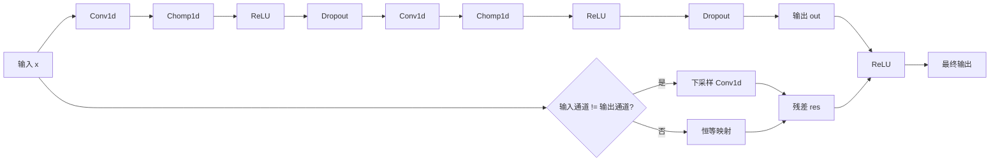
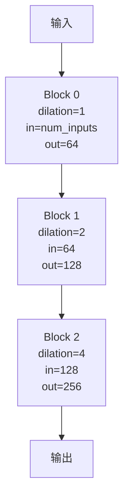
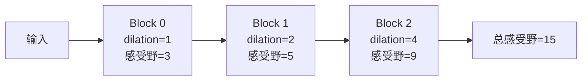

# tcn 模块文档

## 模块概述

`tcn`（Temporal Convolutional Network）模块实现了时序卷积网络，这是一个由 Dilated Convolution 构成的深度时序模型。该网络能够有效捕获长程时序依赖关系，同时保持合理的计算复杂度。

该模块实现自 Bai 等人 (2018) 提出的 TCN 架构，包含以下核心组件：

- **Chomp1d**: 修剪层，用于移除因果卷积产生的额外填充
- **Temporal Convolutional Network**: 完整的时序卷
- **TemporalBlock**: 时序块，TCN 的基本构建单元
- **TemporalConvNet**: 时序卷积网络，由多个 TemporalBlock 组成

## 架构特点

1. **因果卷积**：确保模型只使用过去的信息进行预测
2. **空洞卷积**：通过空洞（dilation）实现指数级感受野增长
3. **残差连接**：支持梯度流动，改善深度网络的训练
4. **权重归一化**：提高训练稳定性

## 核心类

### Chomp1d

修剪层，用于移除因果卷积右侧的额外填充，确保输出长度与输入一致。

#### 构造方法参数

| 参数 | 类型 | 说明 |
|------|------|------|
| chomp_size | int | 需要从右侧修剪的元素数量 |

#### forward(x)

前向传播，从右侧修剪指定数量的元素。

**参数：**
- `x`: 输入张量，形状为 [N, C, L]（批量大小，通道数，长度）

**返回：** 修剪后的张量，形状为 [N, C, L - chomp_size]

**示例：**
```python
import torch
import torch.nn as nn
from qlib.contrib.model.tcn import Chomp1d

# 创建修剪层
chomp = Chomp1d(chomp_size=3)

# 输入张量
x = torch.randn(2, 3, 10)  # [N=2, C=3, L=10]

# 修剪
output = chomp(x)
print(output.shape)  # torch.Size([2, 3, 7])
```

### TemporalBlock

时序块，TCN 的基本构建单元。每个块包含两个卷积层、ReLU 激活、Dropout 和残差连接。

#### 构造方法参数

| 参数 | 类型 | 默认值 | 说明 |
|------|------|--------|------|
| n_inputs | int | - | 输入通道数 |
| n_outputs | int | - | 输出通道数 |
| kernel_size | int | - | 卷积核大小 |
| stride | int | - | 步长 |
| dilation | int | - | 空洞率（dilation factor） |
| padding | int | - | 填充大小，通常为 (kernel_size - 1) * dilation |
| dropout | float | 0.2 | Dropout 比例 |

#### 网络结构



#### init_weights()

初始化权重为均值为 0、标准差为 0.01 的正态分布。

####`forward(x)`

前向传播。

**参数：**
- `x`: 输入张量

**返回：** 输出张量（ReLU(out + residual)）

**示例：**
```python
import torch
from qlib.contrib.model.tcn import TemporalBlock

# 创建时序块
block = TemporalBlock(
    n_inputs=3,      # 输入通道
    n_outputs=5,     # 输出通道
    kernel_size=3,   # 卷积核大小
    stride=1,       # 步长
    dilation=2,     # 空洞率
    padding=4,       # 填充
    dropout=0.2      # Dropout
)

# 输入张量
x = torch.randn(10, 3, 50)  # [N=10, C=3, L=50]

# 前向传播
output = block(x)
print(output.shape)  # torch.Size([10, 5, 50])
```

### TemporalConvNet

完整的时序卷积网络，由多个 TemporalBlock 堆叠而成，每个块的空洞率呈指数增长。

#### 构造方法参数

| 参数 | 类型 | 默认值 | 说明 |
|------|------|--------|------|
| num_inputs | int | - | 输入通道数 |
| num_channels | list | - | 各层的输出通道数列表，长度决定网络深度 |
| kernel_size | int | 2 | 卷积核大小 |
| dropout | float | 0.2 | Dropout 比例 |

#### 网络架构

网络由 `len(num_channels)` 个 TemporalBlock 组成：

- 第 i 层的空洞率：`dilation = 2^i`
- 第 i 层的输入通道：`num_inputs`（i=0）或 `num_channels[i-1]`（i>0）
- 第 i 层的输出通道：`num_channels[i]`

**示例结构（num_channels=[64, 128, 256]）：**


#### forward(x)

前向传播。

**参数：**
- `x`: 输入张量

**返回：** 输出张量

#### 感受野计算

对于 `num_channels=[c1, c2, ..., cn]`，感受野大小为：

```
receptive_field = 1 + sum((kernel_size - 1) * 2^i for i in range(n))
```

例如，kernel_size=3, num_channels=[64, 128, 256]：
```
receptive_field = 1 + [(3-1)*1 + (3-1)*2 + (3-1)*4]
                 = 1 + [2 + 4 + 8]
                 = 15
```

## 使用示例

### 基本使用

```python
import torch
from qlib.contrib.model.tcn import TemporalConvNet

# 创建 TCN
model = TemporalConvNet(
    num_inputs=10,      # 输入通道数
    num_channels=[64, 128, 256],  # 各层输出通道数
    kernel_size=3,      # 卷积核大小
    dropout=0.2         # Dropout
)

# 输入张量 [N, C, L]
x = torch.randn(32, 10, 100)  # 批量=32, 通道=10, 长度=100

# 前向传播
output = model(x)
print(output.shape)  # torch.Size([32, 256, 100])
```

### 计算感受野

```python
def calculate_receptive_field(kernel_size, num_channels):
    """计算 TCN 的感受野大小"""
    receptive_field = 1
    for i in range(len(num_channels)):
        receptive_field += (kernel_size - 1) * (2 ** i)
    return receptive_field

rf = calculate_receptive_field(kernel_size=3, num_channels=[64, 128, 256])
print(f"感受野大小: {rf}")  # 感受野大小: 15
```

### 不同配置的 TCN

```python
import torch
from qlib.contrib.model.tcn import TemporalConvNet

# 浅层网络
shallow_tcn = TemporalConvNet(
    num_inputs=10,
    num_channels=[64, 64],
    kernel_size=3
)

# 深层网络
deep_tcn = TemporalConvNet(
    num_inputs=10,
    num_channels=[64, 64, 128, 128, 256, 256],
    kernel_size=3
)

# 大卷积核
large_kernel_tcn = TemporalConvNet(
    num_inputs=10,
    num_channels=[128, 256],
    kernel_size=5
)

# 高 Dropout
high_dropout_tcn = TemporalConvNet(
    num_inputs=10,
    num_channels=[64, 128, 256],
    kernel_size=3,
    dropout=0.5
)
```

### 在时序预测任务中使用

```python
import torch
import torch.nn as nn
from qlib.contrib.model.tcn import TemporalConvNet

class TCNForecaster(nn.Module):
    def __init__(self, input_dim, hidden_dims, output_dim):
        super().__init__()
        self.tcn = TemporalConvNet(
            num_inputs=input_dim,
            num_channels=hidden_dims,
            kernel_size=3,
            dropout=0.2
        )
        self.fc = nn.Linear(hidden_dims[-1], output_dim)

    def forward(self, x):
        # x: [N, C, L]
        x = self.tcn(x)  # [N, hidden_dims[-1], L]
        x = x[:, :, -1]  # 取最后一个时间步 [N, hidden_dims[-1]]
        x = self.fc(x)   # [N, output_dim]
        return x

# 使用
model = TCNForecaster(
    input_dim=10,
    hidden_dims=[64, 128, 256],
    output_dim=1
)

# 输入：过去 50 个时间步，每个时间步 10 个特征
x = torch.randn(32, 10, 50)
prediction = model(x)
print(prediction.shape)  # torch.Size([32, 1])
```

### 在分类任务中使用

```python
import torch
import torch.nn as nn
from qlib.contrib.model.tcn import TemporalConvNet

class TCNClassifier(nn.Module):
    def __init__(self, input_dim, hidden_dims, num_classes):
        super().__init__()
        self.tcn = TemporalConvNet(
            num_inputs=input_dim,
            num_channels=hidden_dims,
            kernel_size=3,
            dropout=0.3
        )
        # 全局平均池化
        self.pool = nn.AdaptiveAvgPool1d(1)
        self.fc = nn.Linear(hidden_dims[-1], num_classes)

    def forward(self, x):
        # x: [N, C, L]
        x = self.tcn(x)  # [N, hidden_dims[-1], L]
        x = self.pool(x)  # [N, hidden_dims[-1], 1]
        x = x.squeeze(-1)  # [N, hidden_dims[-1]]
        x = self.fc(x)    # [N, num_classes]
        return x

# 使用
model = TCNClassifier(
    input_dim=10,
    hidden_dims=[64, 128],
    num_classes=5
)

x = torch.randn(32, 10, 100)
logits = model(x)
print(logits.shape)  # torch.Size([32, 5])
```

## 与其他时序模型的比较

### TCN vs LSTM/GRU

| 特性 | TCN | LSTM/GRU |
|------|-----|----------|
| 并行计算 | 是 | 否 |
| 梯度传播 | 更稳定 | 容易消失/爆炸 |
| 感受野 | 指数增长 | 线性增长 |
| 内存使用 | 较低 | 较高 |
| 训练速度 | 较快 | 较慢 |

### TCN vs 标准 CNN

| 特性 | TCN | 标准 CNN |
|------|-----|----------|
| 因果性 | 是 | 否 |
| 长程依赖 | 支持 | 不支持 |
| 感受野 | 指数增长 | 线性增长 |

## 注意事项

1. **输入形状**：TCN 期望输入形状为 [N, C, L]（批量大小，通道数，长度）。

2. **输出长度**：TCN 的输出长度与输入长度相同（得益于 Chomp1d）。

3. **感受野**：确保序列长度大于感受野大小，否则无法捕获完整历史信息。

4. **内存消耗**：深层网络和较大通道数会增加内存使用。

5. **训练稳定性**：由于使用了权重归一化和残差连接，TCN 通常比深层 LSTM 更稳定。

6. **序列长度**：TCN 对序列长度不敏感，可以处理不同长度的序列。

7. **权重初始化**：权重初始化为 N(0, 0.01)，可以根据需要调整。

## 技术细节

### 空洞卷积原理

空洞卷积通过在卷积核元素之间插入"空洞"来扩大感受野：

```python
# 标准卷积（dilation=1）
# 卷积核大小为 3，覆盖 3 个位置
# [x1, x2, x3, x4, x5]
#  |   |   |

# 空洞卷积（dilation=2）
# 卷积核大小为 3，但覆盖 5 个位置
# [x1, x2, x3, x4, x5]
#  |       |       |
```

### 感受野增长



### 残差连接

残差连接确保：

1. **梯度流动**：梯度可以直接通过跳跃连接传播
2. **网络深度**：允许训练更深的网络而不出现退化
3. **性能保证**：至少不会比浅层网络差

## 性能优化建议

1. **批大小**：使用较大的批大小以充分利用 GPU 并行性

2. **通道数**：逐步增加通道数（如 [64, 128, 256]）

3. **Dropout**：在深层网络中使用适当的 Dropout 防止过拟合

4. **卷积核大小**：通常 2-5 即可，更大的卷积核不一定会带来更好的性能

5. **网络深度**：感受野应该覆盖足够的历史信息

## 参考资源

1. **论文**：
   - Bai, S., Kolter, J. Z., & Koltun, V. (2018). "An Empirical Evaluation of Generic Convolutional and Recurrent Networks for Sequence Modeling". arXiv:1803.01271

2. **相关实现**：
   - Official TCN implementation: https://github.com/locuslab/TCN
   - PyTorch temporal convolutions: https://pytorch.org/docs/stable/nn.html#conv1d

3. **扩展阅读**：
   - Dilated Convolution in WaveNet
   - Casual Convolutions for Audio Generation
   - Residual Networks for Sequence Modeling
