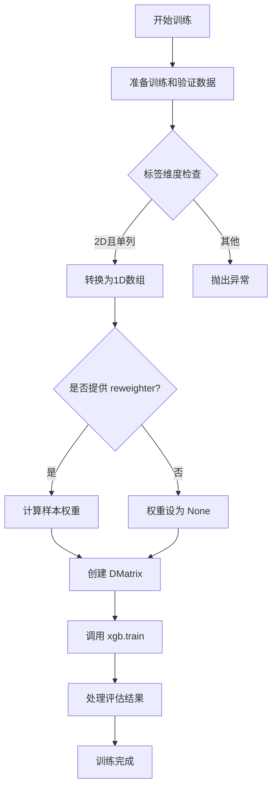
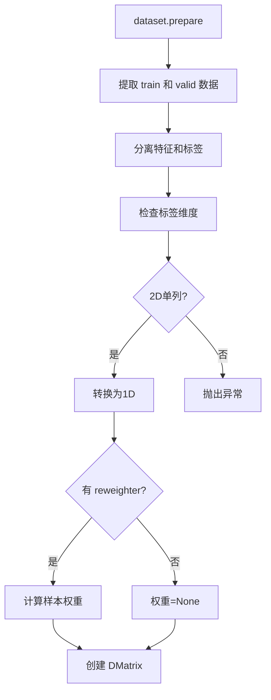
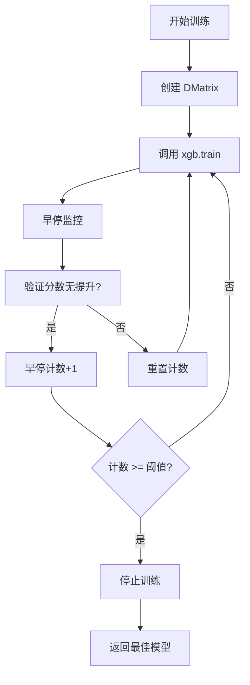

# xgboost 模块文档

## 模块概述

`xgboost` 模块封装了 XGBoost 模型，使其能够与 Qlib 框架无缝集成。该模块提供了：

- **XGBModel**: 继承自 `Model` 和 `FeatureInt` 的 XGBoost 模型封装类
- 支持训练、预测和特征重要性分析
- 支持样本重加权（Reweighter）
- 完整的早停机制和评估记录

## 核心类

### XGBModel

XGBoost 模型封装类，实现了 Qlib 的 `Model` 接口和 `FeatureInt` 接口。

#### 继承关系

```
Model
  └── XGBModel
        └── FeatureInt
```

#### 构造方法参数

XGBModel 的构造方法接受任意关键字参数，这些参数会直接传递给 XGBoost 训练器。

常用的 XGBoost 参数：

| 参数 | 类型 | 默认值 | 说明 |
|------|------|--------|------|
| objective | str | "reg:squarederror" | 学习任务目标 |
| max_depth | int | 6 | 树的最大深度 |
| learning_rate | float | 0.1 | 学习率（eta） |
| n_estimators | int | 100 | 树的数量 |
| min_child_weight | int | 1 | 子节点最小权重和 |
| subsample | float | 1.0 | 训练样本采样比例 |
| colsample_bytree | float | 1.0 | 特征采样比例 |
| reg_alpha | float | 0 | L1 正则化参数 |
| reg_lambda | float | 1 | L2 正则化参数 |
| gamma | float | 0 | 最小分裂损失 |
| tree_method | str | "auto" | 树构建方法 |

#### 主要方法

##### fit(dataset, num_boost_round=1000, early_stopping_rounds=50, verbose_eval=20, evals_result=dict(), reweighter=None, **kwargs)

训练 XGBoost 模型。

**参数：**

| 参数 | 类型 | 默认值 | 说明 |
|------|------|--------|------|
| dataset | DatasetH | - | 数据集对象，必须包含 train 和 valid 分割 |
| num_boost_round | int | 1000 | 最大迭代次数 |
| early_stopping_rounds | int | 50 | 早停轮数 |
| verbose_eval | int | 20 | 每隔多少轮打印日志 |
| evals_result | dict | - | 用于存储训练结果的字典 |
| reweighter | Reweighter | None | 样本重加权器 |
| **kwargs | dict | - | 传递给 xgb.train 的额外参数 |

**训练流程：**



**注意事项：**
- XGBoost 不支持多标签训练
- 如果 `y_train` 是 2D 数组且只有一列，会自动压缩为 1D
- `evals_result` 字典会被修改，包含 'train' 和 'valid' 的评估历史

**示例：**
```python
from qlib.contrib.model.xgboost import XGBModel
from qlib.data.dataset import DatasetH

# 创建模型
model = XGBModel(
    objective="reg:squarederror",
    max_depth=6,
    learning_rate=0.1,
    n_estimators=100,
    subsample=0.8,
    colsample_bytree=0.8
)

# 准备数据集
dataset = DatasetH(handler=your_data_handler, ...)

# 训练
evals_result = {}
model.fit(
    dataset,
    num_boost_round=1000,
    early_stopping_rounds=50,
    verbose_eval=20,
    evals_result=evals_result
)

# 查看训练历史
print(f"训练轮数: {len(evals_result['train'])}")
print(f"最终训练损失: {evals_result['train'][-1]}")
print(f"最终验证损失: {evals_result['valid'][-1]}")
```

##### predict(dataset, segment="test")

使用训练好的模型进行预测。

**参数：**

| 参数 | 类型 | 默认值 | 说明 |
|------|------|--------|------|
| dataset | DatasetH | - | 数据集对象 |
| segment | str/slice | "test" | 要预测的数据段 |

**返回：** `pd.Series`，包含预测结果，索引与数据集索引一致

**异常：**
- 如果模型未训练（`self.model is None`），抛出 `ValueError`

**示例：**
```python
# 预测测试集
predictions = model.predict(dataset, segment="test")
print(predictions.head())

# 预测验证集
valid_predictions = model.predict(dataset, segment="valid")
print(valid_predictions.head())

# 预测训练集
train_predictions = model.predict(dataset, segment="train")
print(train_predictions.head())

# 使用 slice
slice_predictions = model.predict(dataset, segment=slice(0, 100))
```

##### get_feature_importance(*args, **kwargs)

获取特征重要性。

**参数：**
- `*args`, `**kwargs`: 传递给 `xgb.Booster.get_score()` 的参数

常用的参数：
- `importance_type`: 特征重要性类型
  - `"weight"`: 特征在所有树中被使用的次数
  - `"gain"`: 特征带来的平均增益
  - `"cover"`: 特征覆盖的样本平均数
  - `"total_gain"`: 特征带来的总增益
  - `"total_cover"`: 特征覆盖的样本总数

**返回：** `pd.Series`，按重要性降序排列

**参考文档：**
https://xgboost.readthedocs.io/en/latest/python/python_api.html#xgboost.Booster.get_score

**示例：**
```python
# 获取特征重要性（按使用次数）
importance_weight = model.get_feature_importance(importance_type="weight")
print("特征重要性（按使用次数）：")
print(importance_weight.head(10))

# 获取特征重要性（按增益）
importance_gain = model.get_feature_importance(importance_type="gain")
print("\n特征重要性（按增益）：")
print(importance_gain.head(10))

# 获取特征重要性（按覆盖样本数）
importance_cover = model.get_feature_importance(importance_type="cover")
print("\n特征重要性（按覆盖样本数）：")
print(importance_cover.head(10))
```

## 使用示例

### 基本使用

```python
from qlib.contrib.model.xgboost import XGBModel
from qlib.data.dataset import DatasetH

# 创建模型
model = XGBModel(
    objective="reg:squarederror",
    max_depth=6,
    learning_rate=0.1,
    n_estimators=100
)

# 准备数据
dataset = DatasetH(handler=your_data_handler, ...)

# 训练
model.fit(dataset)

# 预测
predictions = model.predict(dataset)
```

### 使用样本重加权

```python
from qlib.contrib.model.xgboost import XGBModel
from qlib.data.dataset.weight import Reweighter

# 创建样本重加权器
reweighter = Reweighter(
    method="rank",  # 或 "sample_weight"
    **your_params
)

# 创建模型
model = XGBModel(
    objective="reg:squarederror",
    max_depth=6
)

# 使用重加权训练
model.fit(
    dataset,
    reweighter=reweighter,
    num_boost_round=500,
    early_stopping_rounds=30
)
```

### 自定义超参数

```python
model = XGBModel(
    objective="reg:squarederror",
    max_depth=8,              # 更深的树
    learning_rate=0.05,       # 更小的学习率
    n_estimators=500,         # 更多的树
    min_child_weight=3,       # 防止过拟合
    subsample=0.8,            # 行采样
    colsample_bytree=0.8,     # 列采样
    reg_alpha=0.1,            # L1 正则化
    reg_lambda=1.0,           # L2 正则化
    gamma=0.1                 # 最小分裂增益
)

model.fit(
    dataset,
    num_boost_round=1000,
    early_stopping_rounds=50
)
```

### 处理评估结果

```python
evals_result = {}
model.fit(
    dataset,
    num_boost_round=1000,
    early_stopping_rounds=50,
    verbose_eval=20,
    evals_result=evals_result
)

# 绘制训练曲线
import matplotlib.pyplot as plt

plt.figure(figsize=(12, 5))

# 训练损失
plt.subplot(1, 2, 1)
plt.plot(evals_result['train'], label='Train Loss')
plt.plot(evals_result['valid'], label='Valid Loss')
plt.xlabel('Iteration')
plt.ylabel('Loss')
plt.title('Training Progress')
plt.legend()
plt.grid(True)

# 差距
plt.subplot(1, 2, 2)
gap = [v - t for t, v in zip(evals_result['train'], evals_result['valid'])]
plt.plot(gap, label='Gap (Valid - Train)')
plt.xlabel('Iteration')
plt.ylabel('Gap')
plt.title('Train-Valid Gap')
plt.legend()
plt.grid(True)

plt.tight_layout()
plt.show()
```

### 特征重要性分析

```python
# 获取特征重要性
importance = model.get_feature_importance(importance_type="gain")

# 显示前 20 个重要特征
print("Top 20 重要特征：")
print(importance.head(20))

# 可视化
plt.figure(figsize=(10, 8))
importance.head(20).plot(kind='barh')
plt.title('Feature Importance (Gain)')
plt.xlabel('Importance')
plt.ylabel('Feature')
plt.gca().invert_yaxis()
plt.tight_layout()
plt.show()
```

### 保存和加载模型

```python
import xgboost as xgb

# 训练后保存模型
model.save_model("xgboost_model.json")  # 或 .json, .ubj

# 保存为二进制格式
model.save_model("xgboost_model.bin")

# 加载模型
loaded_model = xgb.Booster()
loaded_model.load_model("xgboost_model.json")

# 或者重新创建 XGBModel 并加载
new_model = XGBModel()
new_model.model = loaded_model
```

### 使用不同的目标函数

```python
# 回归任务（默认）
model_reg = XGBModel(
    objective="reg:squarederror",
    max_depth=6
)

# 二分类任务
model_binary = XGBModel(
    objective="binary:logistic",
    max_depth=6
)

# 多分类任务
model_multi = XGBModel(
    objective="multi:softprob",
    max_depth=6,
    num_class=10
)

# 排序任务
model_rank = XGBModel(
    objective="rank:pairwise",
    max_depth=6
)
```

### 调优超参数（手动网格搜索）

```python
import numpy as np

# 参数搜索空间
max_depths = [4, 6, 8]
learning_rates = [0.05, 0.1, 0.2]
subsamples = [0.7, 0.8, 0.9]

best_score = float('inf')
best_params = None

for max_depth in max_depths:
    for lr in learning_rates:
        for subsample in subsamples:
            model = XGBModel(
                objective="reg:squarederror",
                max_depth=max_depth,
                learning_rate=lr,
                subsample=subsample
            )

            evals_result = {}
            model.fit(
                dataset,
                num_boost_round=500,
                early_stopping_rounds=30,
                evals_result=evals_result
            )

            valid_score = evals_result['valid'][-1]

            if valid_score < best_score:
                best_score = valid_score
                best_params = {
                    'max_depth': max_depth,
                    'learning_rate': lr,
                    'subsample': subsample
                }

print(f"最佳参数: {best_params}")
print(f"最佳分数: {best_score}")
```

## 常见问题

### 1. 如何处理缺失值？

XGBoost 默认可以处理缺失值。你可以通过 `missing` 参数指定缺失值的表示方式：

```python
model = XGBModel(
    objective="reg:squarederror",
    missing=np.nan  # 指定缺失值
)
```

### 2. 如何监控训练过程？

使用 `verbose_eval` 参数控制日志频率：

```python
model.fit(
    dataset,
    verbose_eval=10,  # 每 10 轮打印一次
    num_boost_round=1000
)
```

### 3. 如何避免过拟合？

```python
model = XGBModel(
    objective="reg:squarederror",
    max_depth=4,            # 限制树深度
    learning_rate=0.05,     # 小学习率
    min_child_weight=5,     # 增加最小子节点权重
    subsample=0.7,          # 行采样
    colsample_bytree=0.7,   # 列采样
    reg_alpha=0.5,          # L1 正则化
    reg_lambda=1.0          # L2 正则化
)
```

### 4. 如何加速训练？

```python
model = XGBModel(
    objective="reg:squarederror",
    tree_method="hist",      # 使用直方图算法
    max_depth=6
)
```

### 5. 如何使用 GPU 加速？

```python
model = XGBModel(
    objective="reg:squarederror",
    tree_method="gpu_hist",  # GPU 加速
    max_depth=6
)
```

## 性能优化建议

1. **数据格式**：使用 DMatrix 可以提高性能
2. **树方法**：`hist` 方法通常比 `exact` 更快
3. **并行化**：通过 `nthread` 参数设置线程数
4. **早停**：使用 `early_stopping_rounds` 避免不必要的迭代
5. **特征选择**：使用 `colsample_bytree` 进行特征采样

## 与其他 Qlib 模型的比较

| 特性 | XGBModel | LGBModel | ADModel |
|------|----------|----------|---------|
| 底层算法 | XGBoost | LightGBM | 自动决策树 |
| 训练速度 | 中 | 快 | 中 |
| 内存占用| 中 | 低 | 低 |
| GPU 支持 | 是 | 是 | 否 |
| 特征重要性 | 是 | 是 | 否 |

## 技术细节

### 数据准备流程



### 训练流程



## 参考资源

1. **XGBoost 官方文档**：
   - Python API: https://xgboost.readthedocs.io/en/latest/python/python_api.html
   - 参数说明: https://xgboost.readthedocs.io/en/latest/parameter.html

2. **Qlib 相关**：
   - Model 基类: `qlib/model/base.py`
   - FeatureInt 接口: `qlib/model/interpret/base.py`
   - DataHandlerLP: `qlib/data/dataset/handler.py`

3. **扩展阅读**：
   - XGBoost: A Scalable Tree Boosting System
   - XGBoost 最佳实践
   - 特征重要性分析方法
