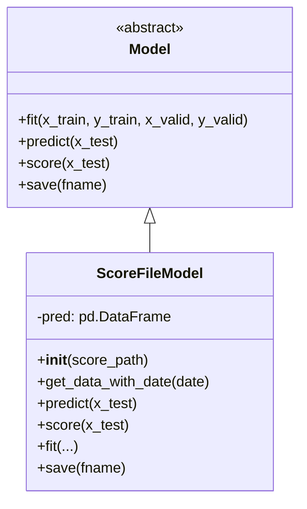

# online/__init__.py 模块文档

## 模块概述

`online/__init__.py` 模块提供了一个用于从文件加载预测分数的模型实现。该模块主要定义了 `ScoreFileModel` 类，用于读取预先计算好的分数文件并返回特定日期的预测分数。

该模块适用于离线训练完成后的在线推理场景，允许系统从外部文件加载预测结果，而无需重新运行模型推理。

---

## 类定义

### ScoreFileModel

**继承自**: `Model`

**类说明**:
`ScoreFileModel` 是一个从分数文件加载预测结果的模型类。它会读取一个包含股票预测分数的CSV文件，并根据请求的日期返回相应的预测分数序列。该类特别适用于在线交易系统中，当模型训练和推理分离时使用。

**文件格式要求**:
- CSV文件格式，包含预测分数数据
- 使用多级索引：(stock_id, trade_date)
- 需要包含 "score" 列存储预测分数
- 索引列：第0列和第1列（自动解析为日期）

---

## 构造方法

### `__init__(self, score_path)`

初始化 ScoreFileModel 实例并加载分数文件。

**参数说明**:

| 参数名 | 类型 | 必填 | 说明 |
|--------|------|------|------|
| `score_path` | `str` | 是 | 分数文件的路径，指向包含预测分数的CSV文件 |

**异常**:
- 文件不存在时会抛出 `FileNotFoundError`
- 文件格式不正确时会抛出 `pandas` 相关的解析异常

**示例**:
```python
from qlib.contrib.online import ScoreFileModel

# 创建模型实例
model = ScoreFileModel(score_path="/path/to/score_file.csv")

# 文件内容示例格式：
# index,score
# (stock_001,2023-01-01),0.85
# (stock_002,2023-01-01),-0.32
# ...
```

---

## 方法详解

### `get_data_with_date(self, date, **kwargs)`

获取指定日期的所有股票预测分数。

**参数说明**:

| 参数名 | 类型 | 必填 | 说明 |
|--------|------|------|------|
| `date` | `pd.Timestamp` | 是 | 要查询的预测日期 |
| `**kwargs` | `dict` | | 额外的关键字参数，当前未使用 |

**返回值**:
- `pd.Series`: 预测分数序列
  - **索引**: 股票ID (stock_id)
  - **值**: 预测分数 (score)

**异常**:
- 如果请求的日期在文件中不存在，会抛出 `KeyError`

**示例**:
```python
import pandas as pd

# 获取2023-01-01的预测分数
date = pd.Timestamp("2023-01-01")
score_series = model.get_data_with_date(date)

# 输出示例：
# stock_001    0.85
# stock_002   -0.32
# stock_003    0.45
# Name: score, dtype: float64

# 获取特定股票的分数
stock_score = score_series["stock_001"]  # 0.85
```

### `predict(self, x_test, **kwargs)`

模型预测方法（占位符实现）。

**参数说明**:

| 参数名 | 类型 | �填 | 说明 |
|--------|------|------|------|
| `x_test` | `Any` | 是 | 测试数据 |
| `**kwargs` | `dict` | | 额外关键字参数 |

**返回值**:
- 直接返回输入数据 `x_test`

**说明**:
此方法为 `Model` 基类要求的接口实现占位符，实际上不做任何预测处理，直接返回输入。

### `score(self, x_test, **kwargs)`

模型评分方法（占位符实现）。

**参数说明**:

| 参数名 | 类型 | 必填 | 说明 |
|--------|------|------|------|
| `x_test` | `Any` | 是 | 测试数据 |
| `**kwargs` | `dict` | | 额外关键字参数 |

**返回值**:
- `None`

**说明**:
此方法为 `Model` 基类要求的接口实现占位符，不做任何操作。

### `fit(self, x_train, y_train, x_valid, y_valid, w_train=None, w_valid=None, **kwargs)`

模型训练方法（占位符实现）。

**参数说明**:

| 参数名 | 类型 | 必填 | 说明 |
|--------|------|------|------|
| `x_train` | `Any` | 是 | 训练特征数据 |
| `y_train` | `Any` | 是 | 训练标签数据 |
| `x_valid` | `Any` | 是 | 验证特征数据 |
| `y_valid` | `Any` | 是 | 验证标签数据 |
| `w_train` | `Any` | 否 | 训练样本权重 |
| `w_valid` | `Any` | 否 | 验证样本权重 |
| `**kwargs` | `dict` | | 额外关键字参数 |

**返回值**:
- `None`

**说明**:
此方法为 `Model` 基类要求的接口实现占位符，不做任何训练操作。因为 `ScoreFileModel` 设计为直接加载预计算的分数，不需要训练。

### `save(self, fname, **kwargs)`

模型保存方法（占位符实现）。

**参数说明**:

| 参数名 | 类型 | 必填 | 说明 |
|--------|------|------|------|
| `fname` | `str` | 是 | 保存的文件名 |
| `**kwargs` | `dict` | | 额外关键字参数 |

**返回值**:
- `None`

**说明**:
此方法为 `Model` 基类要求的接口实现占位符，不做任何保存操作。分数已经在外部文件中。

---

## 使用示例

### 示例1：基本使用

```python
import pandas as pd
from qlib.contrib.online import ScoreFileModel

# 1. 创建分数文件
score_data = pd.DataFrame({
    'score': [0.85, -0.32, 0.45, -0.15]
}, index=pd.MultiIndex.from_tuples([
    ('stock_001', '2023-01-01'),
    ('stock_002', '2023-01-01'),
    ('stock_003', '2023-01-01'),
    ('stock_004', '2023-01-01')
], names=['instrument', 'datetime']))
score_data.to_csv('/tmp/score_file.csv')

# 2. 加载模型
model = ScoreFileModel(score_path='/tmp/score_file.csv')

# 3. 获取预测分数
date = pd.Timestamp('2023-01-01')
scores = model.get_data_with_date(date)

print(scores)
# stock_001    0.85
# stock_002   -0.32
# stock_003    0.45
# stock_004   -0.15
# Name: score, dtype: float64
```

### 示例2：在在线交易系统中使用

```python
from qlib.contrib.online import ScoreFileModel
from qlib.contrib.strategy import TopkDropoutStrategy
from qlib.backtest.account import Account
import pandas as pd

# 配置参数
config = {
    'score_path': '/path/to/precalculated_scores.csv',
    'init_cash': 1000000,
    'topk': 50,
    'drop': 5
}

# 初始化组件
model = ScoreFileModel(score_path=config['score_path'])
strategy = TopkDropoutStrategy(
    topk=config['topk'],
    drop=config['drop']
)
account = Account(init_cash=config['init_cash'])

# 在每个交易日
trade_date = pd.Timestamp('2023-01-02')
pred_date = pd.Timestamp('2023-01-01')

# 获取预测分数
score_series = model.get_data_with_date(pred_date)

# 生成交易决策
trade_exchange = D.calendar(start_time=pred_date, end_time=trade_date)
order_list = strategy.generate_trade_decision(
    score_series=score_series,
    current=account.current_position,
    trade_exchange=trade_exchange,
    trade_date=trade_date
)
```

---

## 架构说明

### 模型继承关系



### 数据流程


---

## 注意事项

1. **文件格式要求**:
   - CSV文件必须使用多级索引格式
   - 第一级索引为股票ID，第二级索引为日期
   - 必须包含名为 "score" 的列

2. **性能考虑**:
   - 整个分数文件在初始化时加载到内存
   - 对于大规模数据集，确保有足够的内存

3. **线程安全**:
   - 该类不是线程安全的，多线程使用时需要外部同步

4. **日期类型**:
   - 索引中的日期会自动解析为 `pd.Timestamp`
   - 请求的日期必须与文件中的日期精确匹配

5. **适用场景**:
   - 适用于离线训练后在线推理的场景
   - 适用于批量预测结果需要频繁查询的场景
   - 不适用于需要实时预测的场景

---

## 相关模块

- `qlib.contrib.model.base.Model`: 模型基类
- `qlib.data`: 数据接口模块
- `qlib.contrib.strategy`: 策略模块
- `qlib.backtest.account`: 账户模块

---

## 更新历史

- 初始版本：实现了基本的分数文件加载和查询功能
