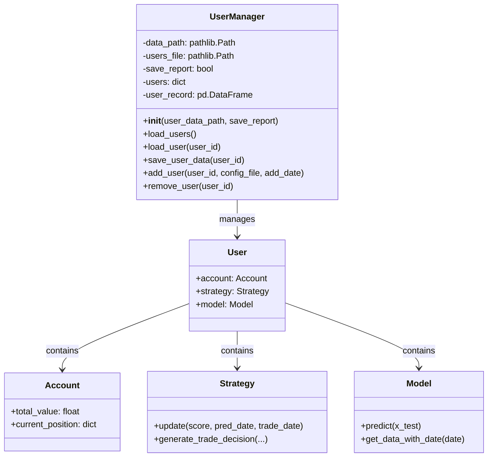
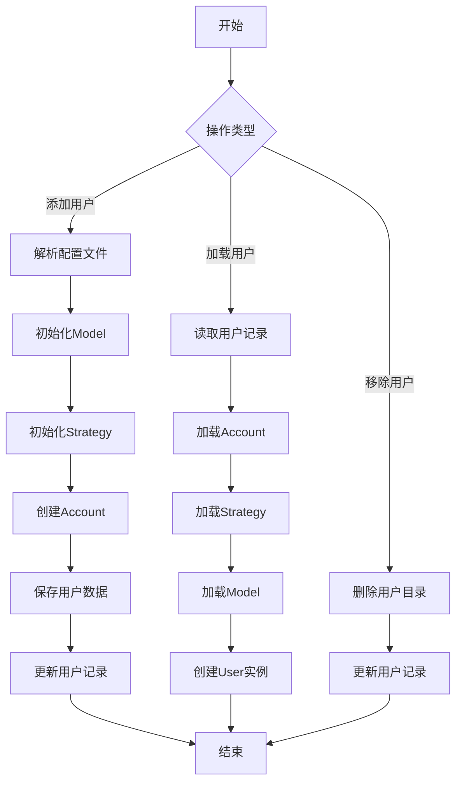
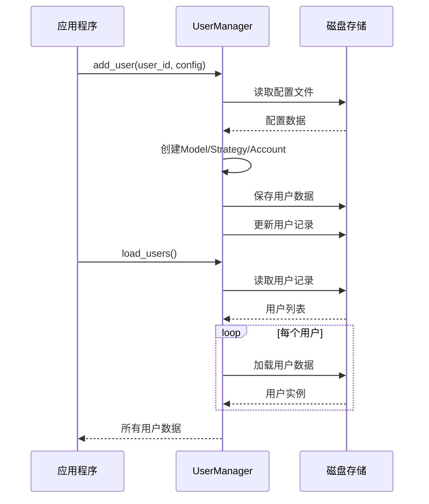

# online/manager.py 模块文档

## 模块概述

`online/manager.py` 模块提供了在线交易系统的用户管理功能。该模块核心是 `UserManager` 类，负责管理多个用户的账户、策略和模型数据，包括用户的创建、加载、保存和删除等操作。

该模块是 Qlib 在线交易系统的基础设施，支持：
- 多用户并发管理
- 用户数据的持久化存储
- 用户配置的动态加载
- 用户生命周期管理

---

## 类定义

### UserManager

**类说明**:
`UserManager` 是用户管理器类，负责管理在线交易系统中的所有用户。每个用户包含账户（Account）、策略（Strategy）和模型（Model）三个核心组件。用户数据存储在指定的目录中，通过 `user_id` 进行索引管理。

**核心功能**:
1. 用户的增删查改
2. 用户数据的加载和保存
3. 用户配置的解析和初始化
4. 用户记录的维护

---

## 构造方法

### `__init__(self, user_data_path, save_report=True)`

初始化 UserManager 实例。

**参数说明**:

| 参数名 | 类型 | 必填 | 默认值 | 说明 |
|--------|------|------|--------|------|
| `user_data_path` | `str` or `pathlib.Path` | 是 | - | 用户数据存储的根目录路径 |
| `save_report` | `bool` | 否 | `True` | 是否在每次交易后保存报告 |

**属性说明**:

| 属性名 | 类型 | 说明 |
|--------|------|------|
| `data_path` | `pathlib.Path` | 用户数据存储的根目录路径 |
| `users_file` | `pathlib.Path` | 用户记录文件路径（users.csv） |
| `save_report` | `bool` | 是否保存报告标志 |
| `users` | `dict` | 用户字典，key为user_id，value为User实例 |
| `user_record` | `pd.DataFrame` | 用户记录表，包含user_id和add_date |

**目录结构要求**:
```
user_data_path/
├── users.csv                    # 用户记录表
├── user_id_1/                   # 用户1的数据目录目录
│   ├── account.pkl              # 账户数据
│   ├── strategy_user_id_1.pkl   # 策略数据
│   └── model_user_id_1.pkl     # 模型数据
├── user_id_2/
│   └── ...
```

**示例**:
```python
from qlib.contrib.online.manager import UserManager

# 创建用户管理器
um = UserManager(
    user_data_path="/path/to/user_data",
    save_report=True
)

# 初始化用户数据目录
# um.load_users()
```

---

## 方法详解

### `load_users(self)`

加载所有用户数据到管理器中。

**参数说明**:
- 无参数

**返回值**:
- `None`

**功能说明**:
1. 读取 `users.csv` 文件获取所有用户列表
2. 对每个用户调用 `load_user()` 加载其数据
3. 将加载的用户实例存储到 `self.users` 字典中

**异常**:
- `FileNotFoundError`: 当 `users.csv` 文件不存在时
- `ValueError`: 当用户数据加载失败时

**示例**:
```python
um = UserManager(user_data_path="/path/to/user_data")
um.load_users()

# 访问用户
for user_id, user in um.users.items():
    print(f"User: {user_id}")
    print(f"Account cash: {user.account.total_cash}")
```

### `load_user(self, user_id)`

加载指定用户的完整数据。

**参数说明**:

| 参数名 | 类型 | 必填 | 说明 |
|--------|------|------|------|
| `user_id` | `str` | 是 | 要加载的用户ID |

**返回值**:
- `User`: 用户实例对象，包含账户、策略和模型

**异常**:
| 异常类型 | 触发条件 |
|----------|----------|
| `ValueError` | 用户已经加载过或文件不存在 |
| `FileNotFoundError` | 用户数据文件不存在 |

**功能说明**:
1. 加载用户的账户数据 (`account.pkl`)
2. 加载用户的策略数据 (`strategy_{user_id}.pickle`)
3. 加载用户的模型数据 (`model_{user_id}.pickle`)
4. 创建并返回 User 实例

**示例**:
```python
# 加载单个用户
user = um.load_user(user_id="user_001")

# 访问用户组件
account = user.account
strategy = user.strategy
model = user.model

print(f"Account value: {account.total_value}")
```

### `save_user_data(self, user_id)`

保存指定用户的所有数据到磁盘。

**参数说明**:

| 参数名 | 类型 | 必填 | 说明 |
|--------|------|------|------|
| `user_id` | `str` | 是 | 要保存的用户ID |

**返回值**:
- `None`

**异常**:
- `ValueError`: 当用户不存在时

**功能说明**:
1. 保存用户的账户数据
2. 保存用户的策略数据
3. 保存用户的模型数据

**示例**:
```python
# 交易后保存用户数据
um.save_user_data(user_id="user_001")
```

### `add_user(self, user_id, config_file, add_date)`

添加新用户到系统中。

**参数说明**:

| 参数名 | 类型 | 必填 | 说明 |
|--------|------|------|------|
| `user_id` | `str` | 是 | 新用户的唯一标识ID |
| `config_file` | `str` or `pathlib.Path` | 是 | 用户配置文件路径（YAML格式） |
| `add_date` | `pd.Timestamp` or `str` | 是 | 用户添加日期 |

**返回值**:
- `None`

**异常**:
| 异常类型 | 触发条件 |
|----------|----------|
| `ValueError` | 配置文件不存在或用户已存在 |
| `FileNotFoundError` | 配置文件不存在 |

**配置文件格式**:
```yaml
# user_config.yaml
init_cash: 1000000  # 初始资金

model:
  class: qlib.contrib.model.xgboost.XGBoostModel
  module_path: qlib.contrib.model.xgboost
  kwargs:
    # 模型参数

strategy:
  class: qlib.contrib.strategy.topk_dropout.TopkDropoutStrategy
  module_path: qlib.contrib.strategy.topk_dropout
  kwargs:
    topk: 50
    drop: 5
```

**功能说明**:
1. 读取并解析用户配置文件
2. 初始化模型实例
3. 初始化策略实例并根据模型进行初始化
4. 创建账户实例
5. 创建用户目录并保存所有组件
6. 更新用户记录表

**示例**:
```python
import pandas as pd

# 添加新用户
um.add_user(
    user_id="new_user",
    config_file="/path/to/user_config.yaml",
    add_date=pd.Timestamp("2023-01-01")
)
```

### `remove_user(self, user_id)`

从系统中移除指定用户。

**参数说明**:

| 参数名 | 类型 | 必填 | 说明 |
|--------|------|------|------|
| `user_id` | `str` | 是 | 要移除的用户ID |

**返回值**:
- `None`

**异常**:
| 异常类型 | 触发条件 |
|----------|----------|
| `ValueError` | 用户数据不存在 |

**功能说明**:
1. 删除用户的数据目录及其所有内容
2. 从用户记录表中移除该用户

**示例**:
```python
# 移除用户
um.remove_user(user_id="old_user")
```

---

## 完整使用示例

### 示例1：创建新用户

```python
from qlib.contrib.online.manager import UserManager
import pandas as pd
import yaml

# 1. 创建用户配置
config = {
    'init_cash': 1000000,
    'model': {
        'class': 'qlib.contrib.model.xgboost.XGBoostModel',
        'module_path': 'qlib.contrib.model.xgboost',
        'kwargs': {
            'loss': 'mse',
            'colsample_bytree': 0.8,
            'learning_rate': 0.05
        }
    },
    'strategy': {
        'class': 'qlib.contrib.strategy.topk_dropout.TopkDropoutStrategy',
        'module_path': 'qlib.contrib.strategy.topk_dropout',
        'kwargs': {
            'topk': 50,
            'drop': 5
        }
    }
}

# 保存配置文件
with open('/path/to/user_config.yaml', 'w') as f:
    yaml.dump(config(config))

# 2. 创建用户管理器
um = UserManager(user_data_path="/path/to/user_data")

# 3. 添加用户
um.add_user(
    user_id="demo_user",
    config_file="/path/to/user_config.yaml",
    add_date=pd.Timestamp("2023-01-01")
)

print("用户创建成功！")
```

### 示例2：加载和管理用户

```python
from qlib.contrib.online.manager import UserManager

# 创建管理器
um = UserManager(user_data_path="/path/to/user_data")

# 加载所有用户
um.load_users()

# 遍历用户
for user_id, user in um.users.items():
    print(f"用户ID: {user_id}")
    print(f"账户总值: {user.account.total_value}")
    print(f"持仓数量: {len(user.account.current_position)}")

    # 更新用户数据
    # ... 执行交易逻辑 ...

    # 保存用户数据
    um.save_user_data(user_id)
```

### 示例3：用户生命周期管理

```python
from qlib.contrib.online.manager import UserManager
import pandas as pd

um = UserManager(user_data_path="/path/to/user_data")

# 1. 添加用户
um.add_user(
    user_id="user_001",
    config_file="/path/to/config.yaml",
    add_date=pd.Timestamp("2023-01-01")
)

# 2. 加载用户
um.load_users()

# 3. 执行交易
user = um.users["user_001"]
# ... 执行交易逻辑 ...

# 4. 保存数据
um.save_user_data("user_001")

# 5. 如需移除用户
# um.remove_user("user_001")
```

---

## 架构说明

### 类继承关系



### 用户管理流程



### 数据持久化流程



---

## 目录结构说明

### 用户数据目录结构

```
user_data_path/
├── users.csv                          # 用户记录表
│   # 格式: user_id,add_date
user_001/
├── account.pkl                        # 账户数据
├── strategy_user_001.pickle           # 策略数据
└── model_user_001.pickle              # 模型数据
user_002/
├── account.pkl
├── strategy_user_002.pickle
└── model_user_002.pickle
```

### users.csv 格式

```csv
user_id,add_date
user_001,2023-01-01
user_002,2023-01-15
user_003,2023-02-01
```

---

## 注意事项

1. **用户ID唯一性**:
   - user_id 必须在整个系统中唯一
   - 尝试添加已存在的用户会抛出异常

2. **文件格式**:
   - 配置文件必须为 YAML 格式
   - 必须包含 `init_cash`, `model`, `strategy` 三个配置项

3. **数据一致性**:
   - 加载用户时必须先调用 `load_users()`
   - 修改用户数据后必须调用 `save_user_data()` 保存

4. **线程安全**:
   - UserManager 不是线程安全的
   - 多线程环境需要外部同步机制

5. **内存管理**:
   - 所有用户数据加载到内存
   - 大规模用户系统需要注意内存使用

6. **日期类型**:
   - add_date 支持字符串或 pd.Timestamp
   - 内部会转换为 pd.Timestamp 存储

---

## 相关模块

- `qlib.contrib.online.user.User`: 用户类
- `qlib.backtest.account.Account`: 账户类
- `qlib.contrib.strategy`: 策略模块
- `qlib.contrib.model`: 模型模块
- `qlib.utils`: 工具函数模块

---

## 常见问题

### Q1: 如何批量添加用户？

```python
import yaml

user_configs = [
    ("user_001", "config1.yaml", "2023-01-01"),
    ("user_002", "config2.yaml", "2023-01-15"),
]

um = UserManager(user_data_path="/path/to/user_data")

for user_id, config_file, add_date in user_configs:
    um.add_user(user_id, config_file, add_date)
```

### Q2: 如何检查用户是否存在？

```python
um.load_users()

if "user_001" in um.users:
    print("用户存在")
else:
    print("用户不存在")
```

### Q3: 如何备份用户数据？

```python
import shutil

# 备份整个用户数据目录
shutil.copytree("/path/to/user_data", "/path/to/backup")

# 备份单个用户
user_dir = "/path/to/user_data/user_001"
backup_dir = "/path/to/backup/user_001"
shutil.copytree(user_dir, backup_dir)
```

---

## 更新历史

- 初始版本：实现基本的用户管理功能
