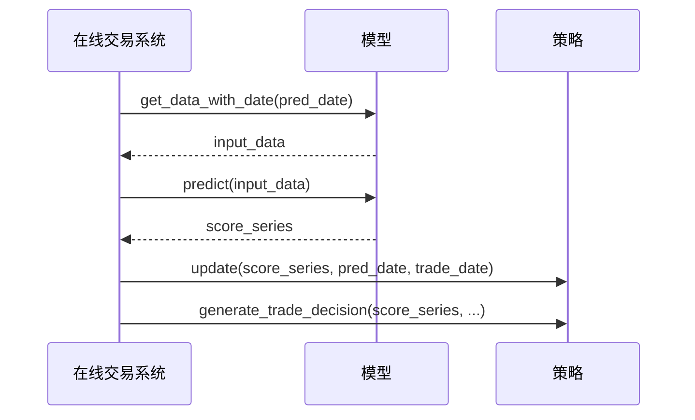
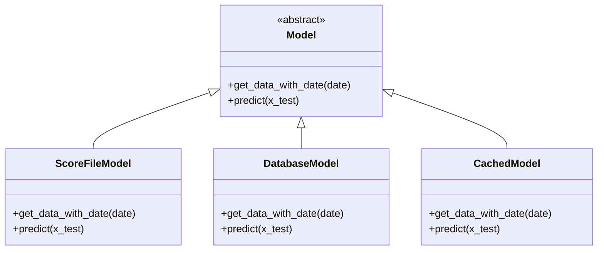
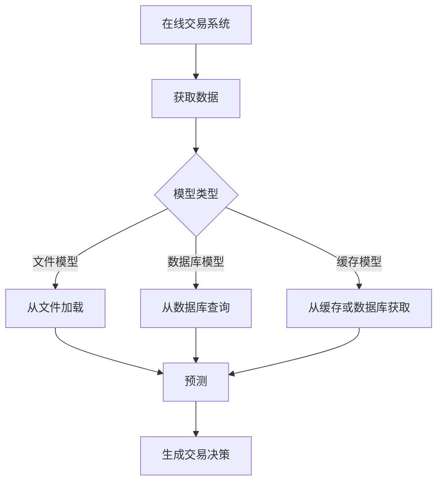

# online/online_model.py 模块文档

## 模块概述

`online/online_model.py` 模块定义了在线交易系统对模型接口的要求和规范。该模块主要包含文档说明，指出在线模块要求模型必须实现特定的接口方法。

该模块不包含可执行代码，而是作为接口规范的文档说明，确保在线交易系统使用的模型能够正确集成。

---

## 模块接口要求

### 必需的接口方法

在线交易系统要求所有模型必须实现以下方法：

#### `get_data_with_date(self, date, **kwargs)`

获取指定日期用于预测的数据。

**方法签名**:
```python
def get_data_with_date(self, date, **kwargs):
    """
    Will be called in online module
    need to return the data that used to predict the label (score) of stocks at date.

    :param
        date: pd.Timestamp
            predict date
    :return:
        data: the input data that used to predict the label (score) of stocks at predict date.
    """
    raise NotImplementedError("get_data_with_date for this model is not implemented.")
```

**参数说明**:

| 参数名 | 类型 | 必填 | 说明 |
|--------|------|------|------|
| `date` | `pd.Timestamp` | 是 | 预测日期 |
| `**kwargs` | `dict` | | 额外关键字参数，用于传递额外信息 |

**返回值**:
- `data`: 用于预测该日期股票标签（分数）的输入数据
  - 数据类型取决于具体模型实现
  - 通常为 pandas Series 或 DataFrame

**功能说明**:
- 在线模块会在每个交易日调用此方法
- 方法需要返回用于预测的输入数据
- 数据应该包含该日期所有需要预测的股票的相关特征

**异常**:
- `NotImplementedError`:当模型未实现此方法时

---

## 实现示例

### 示例1：从预计算文件加载

```python
import pandas as pd
from ...contrib.model.base import Model

class ScoreFileModel(Model):
    """
    从预计算分数文件加载预测结果的模型
    """

    def __init__(self, score_path):
        # 加载分数文件
        pred_test = pd.read_csv(
            score_path,
            index_col=[0, 1],
            parse_dates=True,
            infer_datetime_format=True
        )
        self.pred = pred_test

    def get_data_with_date(self, date, **kwargs):
        """
        获取指定日期的预测数据

        :param date: 预测日期
        :return: 预测分数序列
        """
        # 从预计算结果中提取指定日期
        score = self.pred.loc(axis=0)[:, date]
        score_series = score.reset_index(level="datetime", drop=True)["score"]
        return score_series

    def predict(self, x_test, **kwargs):
        """预测方法"""
        return x_test

    def score(self, x_test, **kwargs):
        """评分方法"""
        return

    def fit(self, x_train, y_train, x_valid, y_valid, w_train=None, w_valid=None, **kwargs):
        """训练方法（不需要）"""
        return

    def save(self, fname, **kwargs):
        """保存方法（不需要）"""
        return
```

### 示例2：实时从数据库加载

```python
import pandas as pd
from ...contrib.model.base import Model
from ...data import D

class OnlineModel(Model):
    """
    在线模型，实时从数据库加载数据
    """

    def __init__(self, model_path, feature_fields):
        """初始化模型"""
        self.model = self._load_model(model_path)
        self.feature_fields = feature_fields

    def get_data_with_date(self, date, **kwargs):
        """
        从数据库获取指定日期的特征数据

        :param date: 预测日期
        :return: 特征数据
        """
        # 获取所有股票的特征
        all_stocks = D.instruments('all')

        # 加载特征数据
        features = D.features(
            instruments=all_stocks,
            fields=self.feature_fields,
            start_time=date,
            end_time=date
        )

        # 处理数据格式
        data = features.stack().unstack(level='instrument')

        return data

    def predict(self, x_test, **kwargs):
        """使用模型进行预测"""
        return self.model.predict(x_test)

    def fit(self, x_train, y_train, x_valid, y_valid, w_train=None, w_valid=None, **kwargs):
        """训练模型"""
        self.model.fit(x_train, y_train)
```

### 示例3：基于缓存的在线模型

```python
import pandas as pd
from ...contrib.model.base import Model
from ...data import D

class CachedOnlineModel(Model):
    """
    带缓存的在线模型
    """

    def __init__(self, model_path, feature_fields, cache_size=100):
        """初始化模型"""
        self.model = self._load_model(model_path)
        self.feature_fields = feature_fields
        self.cache = {}  # 日期 -> 数据缓存
        self.cache_size = cache_size
        self.cache_order = []  # 记录缓存顺序

    def get_data_with_date(self, date, **kwargs):
        """
        获取指定日期的数据，使用缓存优化性能

        :param date: 预测日期
        :return: 特征数据
        """
        # 检查缓存
        date_str = str(date)
        if date_str in self.cache:
            # 更新访问顺序
            self.cache_order.remove(date_str)
            self.cache_order.append(date_str)
            return self.cache[date_str]

        # 加载数据
        all_stocks = D.instruments('all')
        features = D.features(
            instruments=all_stocks,
            fields=self.feature_fields,
            start_time=date,
            end_time=date
        )
        data = features.stack().unstack(level='instrument')

        # 更新缓存
        if len(self.cache) >= self.cache_size:
            # 移除最老的缓存
            oldest_date = self.cache_order.pop(0)
            del self.cache[oldest_date]

        self.cache[date_str] = data
        self.cache_order.append(date_str)

        return data

    def predict(self, x_test, **kwargs):
        """预测"""
        return self.model.predict(x_test)
```

---

## 接口规范

### 方法调用时机

在线交易系统会在以下流程中调用 `get_data_with_date` 方法：



### 数据格式要求

模型返回的数据应满足以下要求：

1. **数据类型**:
   - 推荐使用 `pandas.Series` 或 `pandas.DataFrame`
   - 确保数据可以被策略模型正确处理

2. **索引格式**:
   - 如果是 Series，索引应为股票ID或股票名称
   - 如果是 DataFrame，应包含股票相关信息

3. **数据完整性**:
   - 应包含所有可交易股票的数据
   - 缺失值应使用适当的方式处理（如NaN）

---

## 在线交易流程

### 完整流程说明


### 实现代码示例

```python
from qlib.contrib.online.manager import UserManager
from qlib.contrib.online.operator import Operator
import pandas as pd

# 初始化
operator = Operator(client="config.yaml")
um = UserManager(user_data_path="/path/to/user_data")
um.load_users()

# 处理每个交易日
trade_date = pd.Timestamp("2023-01-15")
pred_date = pd.Timestamp("2023-01-14")

for user_id, user in um.users.items():
    # 1. 获取预测数据（调用 get_data_with_date）
    input_data = user.model.get_data_with_date(pred_date)

    # 2. 生成预测分数
    score_series = user.model.predict(input_data)

    # 3. 更新策略
    user.strategy.update(score_series, pred_date, trade_date)

    # 4. 生成交易决策
    order_list = user.strategy.generate_trade_decision(
        score_series=score_series,
        current=user.account.current_position,
        trade_exchange=trade_exchange,
        trade_date=trade_date
    )

    # 5. 保存用户数据
    um.save_user_data(user_id)
```

---

## 设计模式

### 策略模式

在线模型使用策略模式，允许多种不同的数据获取方式：



### 模板方法模式

在线交易系统定义了固定的流程，具体的模型实现提供数据获取的方式：



---

## 注意事项

1. **方法必须实现**:
   - 所有在线使用的模型必须实现 `get_data_with_date` 方法
   - 否则会抛出 `NotImplementedError`

2. **数据一致性**:
   - 返回的数据应与模型训练时的数据格式一致
   - 特征名称和顺序应保持一致

3. **性能考虑**:
   - 该方法会被频繁调用，应优化性能
   - 考虑使用缓存机制减少重复加载

4. **错误处理**:
   - 当日期无效时，应抛出适当的异常
   - 当数据缺失时，应返回空数据或抛出异常

5. **线程安全**:
   - 如果模型在多线程环境中使用，需确保线程安全
   - 考虑使用锁或其他同步机制

---

## 常见问题

### Q1: 如何测试模型是否实现了必需的接口？

```python
def test_model_interface(model):
    """测试模型是否实现了在线接口"""
    import pandas as pd

    try:
        # 测试 get_data_with_date
        date = pd.Timestamp("2023-01-01")
        data = model.get_data_with_date(date)
        print(f"get_data_with_date OK, 返回类型: {type(data)}")

        # 测试 predict
        score = model.predict(data)
        print(f"predict OK, 返回类型: {type(score)}")

        return True
    except NotImplementedError as e:
        print(f"接口未实现: {e}")
        return False
    except Exception as e:
        print(f"其他错误: {e}")
        return False
```

### Q2: 如何处理日期不存在的情况？

```python
def get_data_with_date(self, date, **kwargs):
    try:
        return self._load_data_for_date(date)
    except ValueError as e:
        # 日期不在交易日历中
        self.logger.warning(f"日期 {date} 不是交易日: {e}")
        return pd.Series()  # 返回空数据
    except Exception as e:
        # 其他错误
        self.logger.error(f"加载数据失败: {e}")
        raise
```

### Q3: 如何实现数据预处理？

```python
def get_data_with_date(self, date, **kwargs):
    # 1. 加载原始数据
    raw_data = self._load_raw_data(date)

    # 2. 数据预处理
    processed_data = self._preprocess(raw_data)

    # 3. 特征工程
    features = self._feature_engineering(processed_data)

    # 4. 数据标准化
    normalized_data = self._normalize(features)

    return normalized_data
```

---

## 相关模块

- `qlib.contrib.model.base.Model`: 模型基类
- `qlib.contrib.online.operator.Operator`: 在线操作器
- `qlib.contrib.online.manager.UserManager`: 用户管理器
- `qlib.contrib.online.utils`: 工具函数

---

## 最佳实践

1. **使用缓存**: 对于频繁访问的数据，实现缓存机制
2. **错误处理**: 提供完善的错误处理和日志记录
3. **数据验证**: 验证返回数据的格式和完整性
4. **性能监控**: 记录方法执行时间，监控性能
5. **文档完善**: 为自定义模型提供清晰的使用文档

---

## 更新历史

- 初始版本：定义在线模型接口规范
