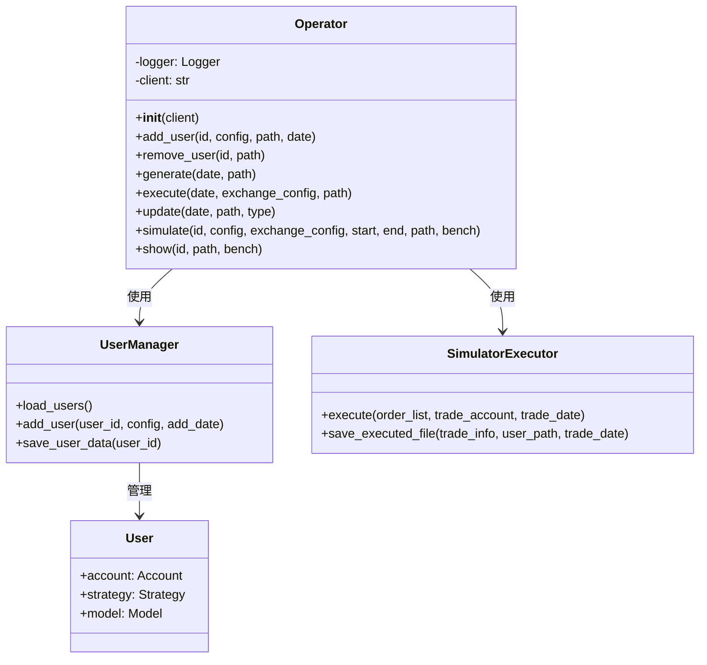
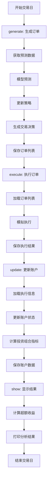
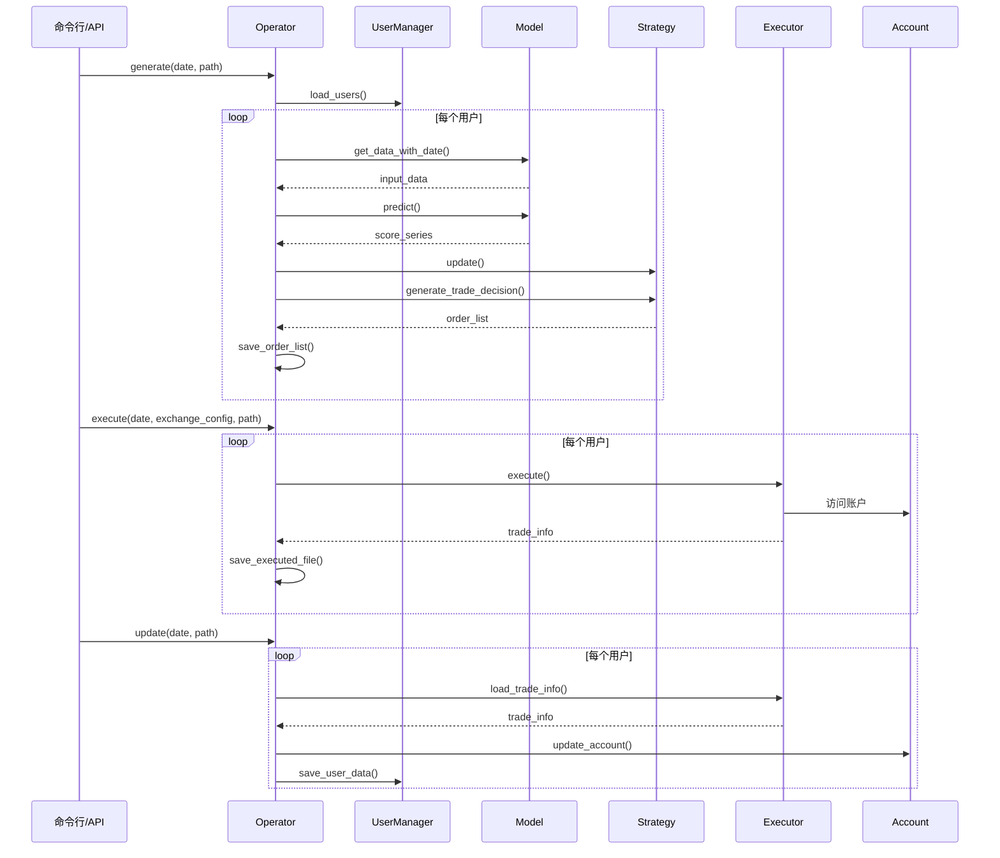

# online/operator.py 模块文档

## 模块概述

`online/operator.py` 模块提供了在线交易系统的核心操作接口。该模块定义了 `Operator` 类，封装了在线交易系统的完整生命周期管理，包括用户管理、订单生成、执行和账户更新等核心功能。

该模块是基于 `Fire` 库实现的命令行工具，可以通过命令行直接调用各种操作方法。

---

## 类定义

### Operator

**类说明**:
`Operator` 是在线交易系统的操作器类，提供了从用户管理到完整交易执行的所有操作。它整合了用户管理器、交易执行器和各种工具函数，是连接各个组件的中央协调器。

**核心功能**:
1. 用户生命周期管理（添加、删除）
2. 订单生成（基于预测分数）
3. 订单执行（模拟或真实）
4. 账户状态更新
5. 完整的在线模拟流程
6. 结果展示和分析

---

## 构造方法

### `__init__(self, client: str)`

初始化 Operator 实例。

**参数说明**:

| 参数名 | 类型 | 必填 | 说明 |
|--------|------|------|------|
| `client` | `str` | 是 | Qlib 客户端配置文件路径（.yaml格式） |

**属性说明**:

| 属性名 | 类型 | 说明 |
|--------|------|------|
| `logger` | `logging.Logger` | 日志记录器 |
| `client` | `str` | 客户端配置文件路径 |

**示例**:
```python
from qlib.contrib.online.operator import Operator

# 创建操作器
operator = Operator(client="/path/to/client_config.yaml")
```

---

## 方法详解

### `init(client, path, date=None)` (静态方法)

初始化用户管理器并获取预测日期和交易日期。

**参数说明**:

| 参数名 | 类型 | 必填 | 默认值 | 说明 |
|--------|------|------|--------|------|
| `client` | `str` | 是 | - | Qlib 客户端配置文件路径 |
| `path` | `str` | 是 | - | 用户账户数据保存路径 |
| `date` | `str` | 否 | `None` | 交易日期（YYYY-MM-DD格式） |

**返回值**:
- `tuple`: `(um, pred_date, trade_date)`
  - `um`: `UserManager` 实例

  - `pred_date`: `pd.Timestamp` 预测日期
  - `trade_date`: `pd.Timestamp` 交易日期

**异常**:
- `ValueError`: 当指定日期不是交易日时

**示例**:
```python
import pandas as pd

# 初始化
um, pred_date, trade_date = Operator.init(
    client="config.yaml",
    path="/path/to/user_data",
    date="2023-01-15"
)

print(f"预测日期: {pred_date}")  # 2023-01-14
print(f"交易日期: {trade_date}")  # 2023-01-15
```

### `add_user(self, id, config, path, date)`

向在线系统添加新用户。

**参数说明**:

| 参数名 | 类型 | 必填 | 说明 |
|--------|------|------|------|
| `id` | `str` | 是 | 用户ID，必须唯一 |
| `config` | `str` | 是 | 用户配置文件路径（YAML格式） |
| `path` | `str` | 是 | 用户账户数据保存路径 |
| `date` | `str` | 是 | 用户添加日期（YYYY-MM-DD格式） |

**异常**:
- `ValueError`: 当添加日期不是交易日时

**示例**:
```python
operator = Operator(client="config.yaml")

operator.add_user(
    id="user_001",
    config="/path/to/user_config.yaml",
    path="/path/to/user_data",
    date="2023-01-01"
)
```

### `remove_user(self, id, path)`

从在线系统中移除用户。

**参数说明**:

| 参数名 | 类型 | 必填 | 说明 |
|--------|------|------|------|
| `id` | `str` | 是 | 要移除的用户ID |
| `path` | `str` | 是 | 用户账户数据保存路径 |

**示例**:
```python
operator.remove_user(
    id="user_001",
    path="/path/to/user_data"
)
```

### `generate(self, date, path)`

生成指定日期的订单列表。

**参数说明**:

| 参数名 | 类型 | 必填 | 说明 |
|--------|------|------|------|
| `date` | `str` | 是 | 交易日期（YYYY-MM-DD格式） |
| `path` | `str` | 是 | 用户账户数据保存路径 |

**功能说明**:
1. 对每个用户：
   - 获取预测日期的数据
   - 使用模型进行预测
   - 保存预测分数
   - 更新策略
   - 生成并保存交易决策

**示例**:
```python
operator.generate(
    date="2023-01-15",
    path="/path/to/user_data"
)
```

### `execute(self, date, exchange_config, path)`

执行指定日期的订单列表。

**参数说明**:

| 参数名 | 类型 | 必填 | 说明 |
|--------|------|------|------|
| `date` | `str` | 是 | 交易日期（YYYY-MM-DD格式） |
| `exchange_config` | `str` | 是 | 交易所配置文件路径（YAML格式） |
| `path` | `str` | 是 | 用户账户数据保存路径 |

**功能说明**:
1. 对每个用户：
   - 加载订单列表
   - 模拟执行订单
   - 保存执行结果

**示例**:
```python
operator.execute(
    date="2023-01-15",
    exchange_config="/path/to/exchange_config.yaml",
    path="/path/to/user_data"
)
```

### `update(self, date, path, type="SIM")`

更新指定日期的账户状态。

**参数说明**:

| 参数名 | 类型 | 必填 | 默认值 | 说明 |
|--------|------|------|--------|------|
| `date` | `str` | 是 | - | 交易日期（YYYY-MM-DD格式） |
| `path` | `str` | 是 | - | 用户账户数据保存路径 |
| `type` | `str` | 否 | `"SIM"` | 执行器类型，"SIM"表示模拟器 |

**异常**:
- `ValueError`: 当type不是"SIM"或"YC"时

**功能说明**:
1. 对每个用户：
   - 加载交易执行信息
   - 更新账户状态
   - 计算投资组合指标

**示例**:
```python
operator.update(
    date="2023-01-15",
    path="/path/to/user_data",
    type="SIM"
)
```

### `simulate(self, id, config, exchange_config, start, end, path, bench="SH000905")`

运行完整的在线模拟流程（从start日期到end日期）。

**参数说明**:

| 参数名 | 类型 | 必填 | 默认值 | 说明 |
|--------|------|------|--------|------|
| `id` | `str` | 是 | - | 用户ID，必须唯一 |
| `config` | `str` | 是 | - | 用户配置文件路径（YAML格式） |
| `exchange_config` | `str` | 是 | - | 交易所配置文件路径（YAML格式） |
| `start` | `str` | 是 | - | 开始日期（YYYY-MM-DD格式） |
| `end` | `str` | 是 | - | 结束日期（YYYY-MM-DD格式） |
| `path` | `str` | 是 | - | 用户账户数据保存路径 |
| `bench` | `str` | 否 | `"SH000905"` | 基准指数代码 |

**功能说明**:
对每个交易日执行完整流程：
1. 加载并保存预测分数
2. 更新策略（和模型）
3. 生成并保存订单列表
4. 自动执行订单列表
5. 更新账户状态

**示例**:
```python
operator.simulate(
    id="demo_user",
    config="/path/to/user_config.yaml",
    exchange_config="/path/to/exchange_config.yaml",
    start="2023-01-01",
    end="2023-12-31",
    path="/path/to/user_data",
    bench="SH000905"
)
```

### `show(self, id, path, bench="SH000905")`

显示用户的最新报告（均值、标准差、信息比率、年化收益）。

**参数说明**:

| 参数名 | 类型 | 必填 | 默认值 | 说明 |
|--------|------|------|--------|------|
| `id` | `str` | 是 | - | 用户ID |
| `path` | `str` | 是 | - | 用户账户数据保存路径 |
| `bench` | `str` | 否 | `"SH000905"` | 基准指数代码 |

**输出**:
- 打印超额收益（不含成本）的分析结果
- 打印超额收益（含成本）的分析结果

**示例**:
```python
operator.show(
    id="user_001",
    path="/path/to/user_data",
    bench="SH000905"
)
```

---

## 命令行使用

### 使用 Fire 命令行接口

该模块集成了 `Fire` 库，可以通过命令行直接调用：

```bash
# 添加用户
python -m qlib.contrib.online.operator add_user \
  --id user_001 \
  --config /path/to/user_config.yaml \
  --path /path/to/user_data \
  --date 2023-01-01 \
  --client /path/to/client_config.yaml

# 生成订单
python -m qlib.contrib.online.operator generate \
  --date 2023-01-15 \
  --path /path/to/user_data \
  --client /path/to/client_config.yaml

# 执行订单
python -m qlib.contrib.online.operator execute \
  --date 2023-01-15 \
  --exchange_config /path/to/exchange_config.yaml \
  --path /path/to/user_data \
  --client /path/to/client_config.yaml

# 更新账户
python -m qlib.contrib.online.operator update \
  --date 2023-01-15 \
  --path /path/to/user_data \
  --client /path/to/client_config.yaml \
  --type SIM

# 运行完整模拟
python -m qlib.contrib.online.operator simulate \
  --id demo_user \
  --config /path/to/user_config.yaml \
  --exchange_config /path/to/exchange_config.yaml \
  --start 2023-01-01 \
  --end 2023-12-31 \
  --path /path/to/user_data \
  --bench SH000905 \
  --client /path/to/client_config.yaml

# 显示结果
python -m qlib.contrib.online.operator show \
  --id user_001 \
  --path /path/to/user_data \
  --bench SH000905 \
  --client /path/to/client_config.yaml
```

---

## 完整使用示例

### 示例1：完整的在线交易流程

```python
from qlib.contrib.online.operator import Operator
import pandas as pd

# 创建操作器
operator = Operator(client="/path/to/client_config.yaml")

# 1. 添加用户
operator.add_user(
    id="trader_001",
    config="/path/to/user_config.yaml",
    path="/path/to/user_data",
    date="2023-01-01"
)

# 2. 生成订单（在T-1日进行）
pred_date = pd.Timestamp("2023-01-14")
trade_date = pd.Timestamp("2023-01-15")

# 注意：generate方法需要T-1日的预测日期
operator.generate(
    date="2023-01-15",
    path="/path/to/user_data"
)

# 3. 执行订单（在T日）
operator.execute(
    date="2023-01-15",
    exchange_config="/path/to/exchange_config.yaml",
    path="/path/to/user_data"
)

# 4. 更新账户
operator.update(
    date="2023-01-15",
    path="/path/to/user_data",
    type="SIM"
)

# 5. 查看结果
operator.show(
    id="trader_001",
    path="/path/to/user_data",
    bench="SH000905"
)
```

### 示例2：批量用户管理

```python
from qlib.contrib.online.operator import Operator

operator = Operator(client="config.yaml")

# 批量添加用户
users = [
    ("user_001", "config1.yaml", "2023-01-01"),
    ("user_002", "config2.yaml", "2023-01-01"),
    ("user_003", "config3.yaml", "2023-01-02"),
]

for user_id, config_file, add_date in users:
    operator.add_user(
        id=user_id,
        config=config_file,
        path="/path/to/user_data",
        date=add_date
    )

# 为所有用户生成订单
operator.generate(
    date="2023-01-15",
    path="/path/to/user_data"
)
```

### 示例3：回测模式运行

```python
from qlib.contrib.online.operator import Operator

operator = Operator(client="config.yaml")

# 运行完整的回测
operator.simulate(
    id="backtest_user",
    config="/path/to/user_config.yaml",
    exchange_config="/path/to/exchange_config.yaml",
    start="2022-01-01",
    end="2023-12-31",
    path="/path/to/user_data",
    bench="SH000905"  # 使用中证500作为基准
)

# 查看回测结果
operator.show(
    id="backtest_user",
    path="/path/to/user_data",
    bench="SH000905"
)
```

---

## 架构说明

### 系统架构图



### 在线交易流程



### 数据流程图



---

## 配置文件说明

### 用户配置文件格式

```yaml
# user_config.yaml
init_cash: 1000000  # 初始资金

model:
  class: qlib.contrib.model.xgboost.XGBoostModel
  module_path: qlib.contrib.model.xgboost
  kwargs:
    loss: mse
    colsample_bytree: 0.8
    learning_rate: 0.05
    max_depth: 6
    n_estimators: 200

strategy:
  class: qlib.contrib.strategy.topk_dropout.TopkDropoutStrategy
  module_path: qlib.contrib.strategy.topk_dropout
  kwargs:
    topk: 50  # 持仓股票数量
    drop: 5   # 每次调仓时换出的股票数量
```

### 交易所配置文件格式

```yaml
# exchange_config.yaml
trade_exchange:
  class: qlib.backtest.exchange.Exchange
  module_path: qlib.backtest.exchange
  kwargs:
    freq: '1day'
    deal_price: close  # 成交价格
    open_cost: 0.0015  # 开仓手续费
    close_cost: 0.0015 # 平仓手续费
    min_cost: 5        # 最小手续费
```

### 客户端配置文件格式

```yaml
# client_config.yaml
provider_uri: "~/.qlib/qlib_data/cn_data"  # 数据目录
region: "cn"  # 区域
market: "csi300"  # 市场范围

exp_manager:
  class: qlib.workflow.R
  module_path: qlib.workflow
  kwargs:
    experiment_name: "online_trading"
```

---

## 注意事项

1. **日期顺序**:
   - `generate` 方法会在交易日的前一天生成订单
   - `execute` 和 `update` 在交易日执行
   - 确保日期是有效的交易日

2. **执行顺序**:
   - 必须按顺序执行：generate -> execute -> update
   - 不能跳过或乱序执行

3. **用户唯一性**:
   - 用户ID必须唯一
   - 尝试添加已存在的用户会失败

4. **文件路径**:
   - 所有配置文件必须存在且格式正确
   - 使用绝对路径或相对路径要小心

5. **内存使用**:
   - 同时加载所有用户到内存
   - 大规模用户系统需要注意内存限制

6. **线程安全**:
   - Operator 不是线程安全的
   - 多线程使用需要外部同步

---

## 性能优化

### 批量操作

```python
# 不好的做法：逐个处理
for date in dates:
    operator.generate(date=str(date), path=path)
    operator.execute(date=str(date), exchange_config=exchange_config, path=path)
    operator.update(date=str(date), path=path)

# 好的做法：使用simulate方法
operator.simulate(
    id="user",
    config=config,
    exchange_config=exchange_config,
    start=str(dates[0]),
    end=str(dates[-1]),
    path=path
)
```

### 异步执行（需要自行实现）

```python
import asyncio
from concurrent.futures import ThreadPoolExecutor

async def async_generate(operator, date, path):
    with ThreadPoolExecutor() as executor:
        loop = asyncio.get_event_loop()
        await loop.run_in_executor(executor, operator.generate, date, path)

# 批量异步生成
tasks = [async_generate(operator, str(d), path) for d in dates]
await asyncio.gather(*tasks)
```

---

## 常见问题

### Q1: 如何处理交易日期不是交易日的情况？

```python
from qlib.utils import is_tradable_date
from qlib.utils import get_next_trading_date

# 检查日期
if not is_tradable_date(date):
    next_date = get_next_trading_date(date)
    print(f"日期 {date} 不是交易日，下一个交易日是 {next_date}")
```

### Q2: 如何查看用户的详细持仓？

```python
from qlib.contrib.online.manager import UserManager

um = UserManager(user_data_path=path)
um.load_users()

user = um.users["user_001"]
print(f"当前持仓: {user.account.current_position}")
print(f"账户总值: {user.account.total_value}")
print(f"可用资金: {user.account.total_cash}")
```

### Q3: 如何重置用户状态？

```python
# 删除用户
operator.remove_user(id="user_001", path=path)

# 重新添加
operator.add_user(
    id="user_001",
    config=config,
    path=path,
    date="2023-01-01"
)
```

---

## 相关模块

- `qlib.contrib.online.manager.UserManager`: 用户管理器
- `qlib.contrib.online.executor.SimulatorExecutor`: 模拟执行器
- `qlib.contrib.online.user.User`: 用户类
- `qlib.contrib.online.utils`: 工具函数
- `qlib.backtest.account.Account`: 账户类

---

## 最佳实践

1. **使用完整流程**:
   - 对于批量日期，优先使用 `simulate` 方法
   - 它会自动处理所有步骤，减少错误

2. **错误处理**:
   - 捕获并处理所有可能的异常
   - 记录详细的错误日志

3. **数据备份**:
   - 定期备份用户数据目录
   - 在重要操作前创建快照

4. **监控**:
   - 监控账户状态和交易结果
   - 设置预警阈值

5. **测试**:
   - 在生产环境前充分测试
   - 使用小规模数据进行验证

---

## 更新历史

- 初始版本：实现基本的在线交易操作
