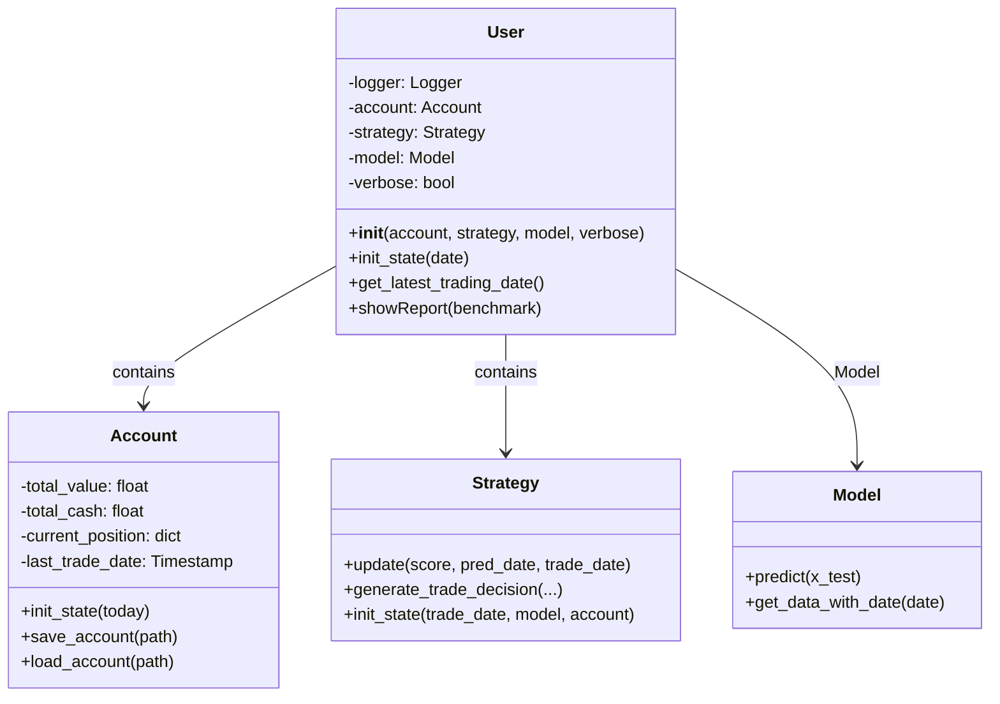
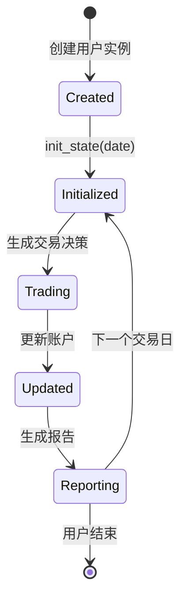
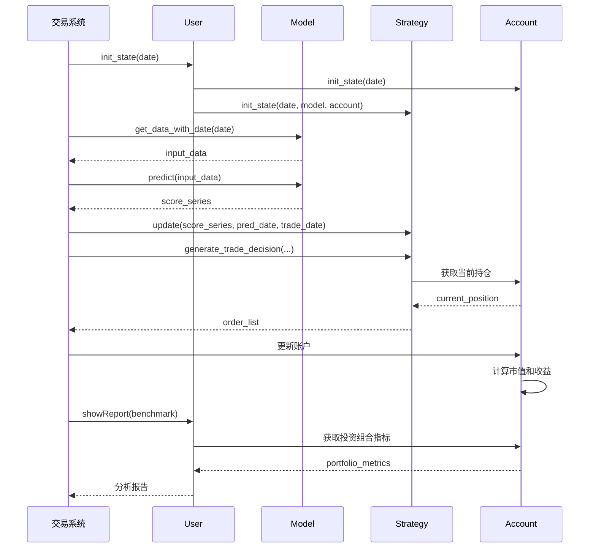

# online/user.py 模块文档

## 模块概述

`online/user.py` 模块定义了在线交易系统中用户的抽象表示。该模块核心是 `User` 类，将账户、策略和模型三个核心组件组合在一起，作为一个完整的交易主体。

该模块提供了用户状态管理、初始化和报告生成等功能，是连接账户、策略和模型的桥梁。

---

## 类定义

### User

**类说明**:
`User` 类表示在线交易系统中的一个用户，整合了账户（Account）、策略（Strategy）和模型（Model）三个核心组件。每个用户都拥有独立的账户状态、交易策略和预测模型。

**核心功能**:
1. 组件整合：统一管理账户、策略和模型
2. 状态初始化：在每个交易日初始化相关状态
3. 信息查询：获取用户最新交易日期
4. 报告生成：生成并显示交易结果分析

---

## 构造方法

### `__init__(self, account, strategy, model, verbose=False)`

初始化 User 实例。

**参数说明**:

| 参数名 | 类型 | 必填 | 默认值 | 说明 |
|--------|------|------|--------|------|
| `account` | `Account` | 是 | - | 账户实例，管理资金和资产 |
| `strategy` | `Strategy` | 是 | - | 策略实例，负责交易决策 |
| `model` | `Model` | 是 | - | 模型实例，负责市场预测 |
| `verbose` | `bool` | 否 | `False` | 是否打印过程信息 |

**属性说明**:

| 属性名 | 类型 | 说明 |
|--------|------|------|
| `logger` | `logging.Logger` | 日志记录器 |
| `account` | `Account` | 账户实例，管理资金和持仓 |
| `strategy` | `Strategy` | 策略实例，负责交易决策 |
| `model` | `Model` | 模型实例，负责预测 |
| `verbose` | `bool` | 是否输出详细信息 |

**组件要求**:

1. **Account**: 必须实现 `qlib.backtest.account.Account` 接口
2. **Strategy**: 必须实现策略接口和以下方法：
   - `update(score_series, pred_date, trade_date)`
   - `generate_trade_decision(...)`
   - `init_state(trade_date, model, account)`
3. **Model**: 必须实现 `qlib.contrib.model.base.Model` 接口

**示例**:
```python
from qlib.contrib.online.user import User
from qlib.backtest.account import Account
from qlib.contrib.model import XGBoostModel
from qlib.contrib.strategy import TopkDropoutStrategy

# 创建组件
account = Account(init_cash=1000000)
model = XGBoostModel(**model_kwargs)
strategy = TopkDropoutStrategy(**strategy_kwargs)

# 创建用户
user = User(
    account=account,
    strategy=strategy,
    model=model,
    verbose=True
)
```

---

## 方法详解

### `init_state(self, date)`

在每个交易日开始时初始化用户状态。

**参数说明**:

| 参数名 | 类型 | 必填 | 说明 |
|--------|------|------|------|
| `date` | `pd.Timestamp` | 是 | 当前交易日期 |

**返回值**:
- `None`

**功能说明**:
1. 初始化账户状态（如计算当前市值、更新持仓信息）
2. 初始化策略状态（如更新内部状态、准备交易决策）
3. 传递模型和账户引用给策略

**调用时机**:
- 在每个交易日的开始阶段调用
- 在生成交易决策之前调用
- 确保所有组件都有正确的初始状态

**示例**:
```python
import pandas as pd

# 在交易日开始时
trade_date = pd.Timestamp("2023-01-15")
user.init_state(trade_date)

# 现在可以安全地生成交易决策
score_series = model.predict(input_data)
order_list = user.strategy.generate_trade_decision(
    score_series=score_series,
    current=user.account.current_position,
    trade_exchange=trade_exchange,
    trade_date=trade_date
)
```

### `get_latest_trading_date(self)`

获取用户的最新交易日期。

**参数说明**:
- 无参数

**返回值**:
- `str` 或 `None`: 最新交易日期的字符串表示（格式：'YYYY-MM-DD'）
  - 如果用户从未进行过交易，返回 `None`

**功能说明**:
- 从账户记录中获取最后的交易日期
- 用于检查数据状态和同步
- 可以用来判断用户是否是新用户

**示例**:
```python
# 获取最新交易日期
latest_date = user.get_latest_trading_date()

if latest_date is None:
    print("这是一个新用户，从未进行过交易")
else:
    print(f"最后交易日: {latest_date}")
    # 可以检查数据是否是最新的
    current_date = pd.Timestamp("2023-01-15")
    if latest_date < str(current_date):
        print("需要更新数据")
```

### `showReport(self, benchmark="SH000905")`

生成并显示用户的交易报告。

**参数说明**:

| 参数名 | 类型 | 必填 | 默认值 | 说明 |
|--------|------|------|--------|------|
| `benchmark` | `str` | 否 | `"SH000905"` | 基准指数代码 |

**返回值**:
- `pd.DataFrame`: 投资组合指标数据框

**功能说明**:
1. 获取基准指数数据
2. 生成投资组合指标
3. 计算超额收益（不含成本）
4. 计算超额收益（含成本）
5. 使用日志记录和打印结果

**输出内容**:
- 超额收益（不含成本）：均值、标准差、信息比率、年化收益
- 超额收益（含成本）：均值、标准差、信息比率、ari年化收益

**常用基准指数**:
- `"SH000905"`: 中证500指数
- `"SH000300"`: 沪深300指数
- `"SH000001"`: 上证综合指数

**示例**:
```python
# 显示报告
portfolio_metrics = user.showReport(benchmark="SH000905")

# portfolio_metrics 包含：
# - return: 组合收益率
# - cost: 交易成本
# - bench: 基准收益率
```

---

## 完整使用示例

### 示例1：创建和使用用户

```python
import pandas as pd
from qlib.contrib.online.user import User
from qlib.backtest.account import Account
from qlib.contrib.model.xgboost import XGBoostModel
from qlib.contrib.strategy.topk_dropout import TopkDropoutStrategy

# 1. 创建组件
account = Account(init_cash=1000000)

model = XGBoostModel(
    loss='mse',
    colsample_bytree=0.8,
    learning_rate=0.05,
    max_depth=6
)

strategy = TopkDropoutStrategy(
    topk=50,
    drop=5
)

# 2. 创建用户
user = User(
    account=account,
    strategy=strategy,
    model=model,
    verbose=True
)

# 3. 在交易日开始时初始化
trade_date = pd.Timestamp("2023-01-15")
user.init_state(trade_date)

# 4. 获取最新交易日期
latest_date = user.get_latest_trading_date()
print(f"最新交易日期: {latest_date}")

# 5. 生成交易决策
# ... (需要获取预测分数)

# 6. 交易结束后查看报告
# user.showReport(benchmark="SH000905")
```

### 示例2：在在线交易系统中使用

```python
from qlib.contrib.online.manager import UserManager
from qlib.contrib.online.user import User

# 创建用户管理器
um = UserManager(user_data_path="/path/to/user_data")
um.load_users()

# 遍历所有用户
for user_id, user in um.users.items():
    print(f"\n处理用户: {user_id}")

    # 初始化状态
    user.init_state(trade_date)

    # 检查最新交易日期
    latest_date = user.get_latest_trading_date()
    if latest_date:
        print(f"上次交易: {latest_date}")
    else:
        print("新用户")

    # 获取预测数据
    input_data = user.model.get_data_with_date(pred_date)

    # 预测
    score_series = user.model.predict(input_data)

    # 更新策略
    user.strategy.update(score_series, pred_date, trade_date)

    # 生成交易决策
    order_list = user.strategy.generate_trade_decision(
        score_series=score_series,
        current=user.account.current_position,
        trade_exchange=trade_exchange,
        trade_date=trade_date
    )

    # 保存用户数据
    um.save_user_data(user_id)

    # 查看报告
    if should_show_report:
        user.showReport(benchmark="SH000905")
```

### 示例3：批量用户分析

```python
from qlib.contrib.online.manager import UserManager
import pandas as pd

# 加载所有用户
um = UserManager(user_data_path="/path/to/user_data")
um.load_users()

# 分析所有用户
results = {}

for user_id, user in um.users.items():
    # 获取最新交易日期
    latest_date = user.get_latest_trading_date()

    # 获取账户信息
    total_value = user.account.total_value
    total_cash = user.account.total_cash
    position_count = len(user.account.current_position)

    # 生成报告
    portfolio_metrics = user.showReport(benchmark="SH000905")

    # 存储结果
    results[user_id] = {
        'latest_date': latest_date,
        'total_value': total_value,
        'total_cash': total_cash,
        'position_count': position_count,
        'portfolio_metrics': portfolio_metrics
    }

# 汇总报告
print("\n=== 用户汇总报告 ===")
for user_id, data in results.items():
    print(f"\n用户: {user_id}")
    print(f"  最新交易日: {data['latest_date']}")
    print(f"  账户总值: {data['total_value']:.2f}")
    print(f"  可用资金: {data['total_cash']:.2f}")
    print(f"  持仓数量: {data['position_count']}")
```

---

## 架构说明

### 类关系图



### 用户状态生命周期



### 交易流程



---

## 组件协作模式

### 策略如何访问账户和模型

策略在 `init_state` 方法中会接收到账户和模型的引用：

```python
class TopkDropoutStrategy:
    def init_state(self, trade_date, model, account):
        """
        策略初始化时接收账户和模型引用

        Parameters
        ----------
        trade_date : pd.Timestamp
            当前交易日期
        model : Model
            模型实例
        account : Account
            账户实例
        """
        self.model = model
        self.account = account
        self.trade_date = trade_date

        # 可以根据账户状态调整策略
        if self.account.total_value < 500000:
            # 低资金时降低风险
            self.adjusted_topk = min(self.topk, 20)
        else:
            self.adjusted_topk = self.topk
```

### 模型如何提供数据

模型需要实现 `get_data_with_date` 方法：

```python
class OnlineModel:
    def get_data_with_date(self, date, **kwargs):
        """
        获取指定日期的预测数据

        这个方法会在在线交易系统中被调用

        Parameters
        ----------
        date : pd.Timestamp
            预测日期

        Returns
        -------
        pd.Series
            预测分数序列，索引为股票ID
        """
        # 实现数据获取逻辑
        data = self._load_data(date)
        return data
```

### 账户如何更新状态

账户在交易后自动更新状态：

```python
# 交易后
update_account(
    account=user.account,
    trade_info=trade_info,
    trade_exchange=trade_exchange,
    trade_date=trade_date
)

# 账户状态已更新
print(f"账户总值: {user.account.total_value}")
print(f"可用资金: {user.account.total_cash}")
print(f"持仓: {user.account.current_position}")
```

---

## 报告指标说明

### 投资组合指标

`showReport` 方法生成以下指标：

1. **均值 (Mean)**: 平均收益率
2. **标准差 (Std)**: 收益率波动性
3. **信息比率 (Information Ratio)**: 超额收益与跟踪误差的比率
4. **年化收益 (Annualized Return)**: 年化后的收益率

### 超额收益计算

```
超额收益（不含成本）= 组合收益 - 基准收益
超额收益（含成本）= 组合收益 - 基准收益 - 交易成本
```

### 报告输出示例

```
Result of porfolio:
excess_return_without_cost:
{
    "mean": 0.0012,
    "std": 0.0156,
    "information_ratio": 0.7692,
    "annualized_return": 0.3024
}
excess_return_with_cost:
{
    "mean": 0.0008,
    "std": 0.0156,
    "information_ratio": 0.5128,
    "annualized_return": 0.2016
}
```

---

## 注意事项

1. **组件依赖**:
   - 账户、策略、模型必须都已正确初始化
   - 策略可能依赖账户和模型，需要在 `init_state` 中传递

2. **状态一致性**:
   - 每个交易日开始时必须调用 `init_state`
   - 确保所有组件的状态同步

3. **日期类型**:
   - `init_state` 的 date 参数应为 `pd.Timestamp`
   - `get_latest_trading_date` 返回字符串格式

4. **线程安全**:
   - User 实例不是线程安全的
   - 多线程使用需要外部同步

5. **报告生成**:
   - `showReport` 需要基准指数数据
   - 确保基准指数代码正确且数据可用

6. **资源管理**:
   - 账户、策略、模型可能占用大量内存
   - 不再使用时及时清理

---

## 性能优化

### 批量处理

```python
# 好的做法：批量处理用户
um.load_users()

for user_id, user in um.users.items():
    # 初始化状态
    user.init_state(trade_date)

    # 获取预测
    input_data = user.model.get_data_with_date(pred_date)
    score_series = user.model.predict(input_data)

    # 更新和决策
    user.strategy.update(score_series, pred_date, trade_date)
    order_list = user.strategy.generate_trade_decision(...)

    # 保存
    um.save_user_data(user_id)
```

### 避免重复初始化

```python
# 不好的做法：每次都创建新用户
for date in dates:
    user = User(account, strategy, model)
    user.init_state(date)
    # ...

# 好的做法：复用用户实例
user = User(account, strategy, model)
for date in dates:
    user.init_state(date)
    # ...
```

---

## 常见问题

### Q1: 如何检查用户是否是新用户？

```python
latest_date = user.get_latest_trading_date()

if latest_date is None:
    print("这是新用户")
else:
    print(f"用户上次交易日期: {latest_date}")
```

### Q2: 如何获取用户的详细持仓信息？

```python
# 获取持仓
positions = user.account.current_position

for stock, position in positions.items():
    print(f"股票: {stock}")
}")
    print(f"  数量: {position['amount']}")
    print(f"  成本: {position['cost']}")
```

### Q3: 如何保存用户的所有组件？

```python
# 通过 UserManager 保存
um.save_user_data(user_id)

# 或者手动保存
user.account.save_account(user_path)
# 保存策略和模型（需要序列化）
```

---

## 相关模块

- `qlib.backtest.account.Account`: 账户类
- `qlib.contrib.strategy`: 策略模块
- `qlib.contrib.model.base.Model`: 模型基类
- `qlib.contrib.online.manager.UserManager`: 用户管理器

---

## 最佳实践

1. **状态管理**:
   - 每个交易日开始时调用 `init_state`
   - 不要手动修改组件内部状态

2. **错误处理**:
   - 捕获并处理组件初始化异常
   - 记录详细的错误日志

3. **报告监控**:
   - 定期调用 `showReport` 检查表现
   - 设置预警阈值

4. **资源清理**:
   - 不再使用时及时清理
   - 避免内存泄漏

5. **组件解耦**:
   - 保持组件之间的低耦合
   - 通过明确接口进行交互

---

## 更新历史

- 初始版本：实现基本的用户整合功能
