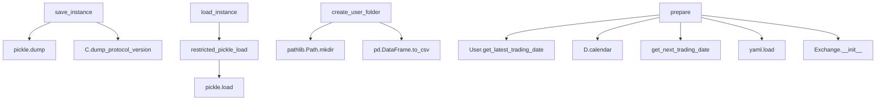
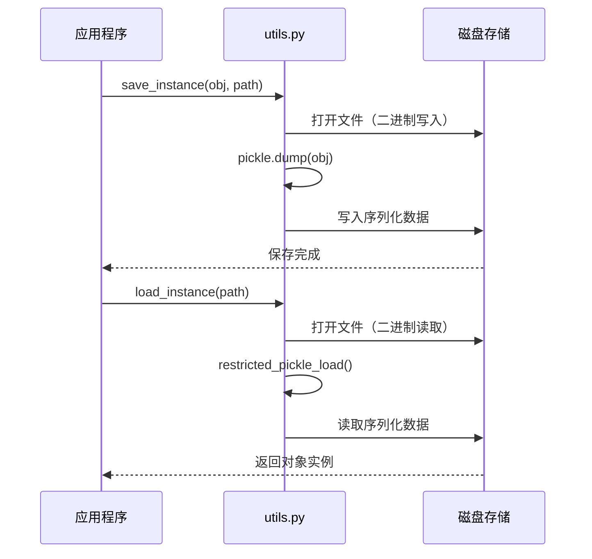
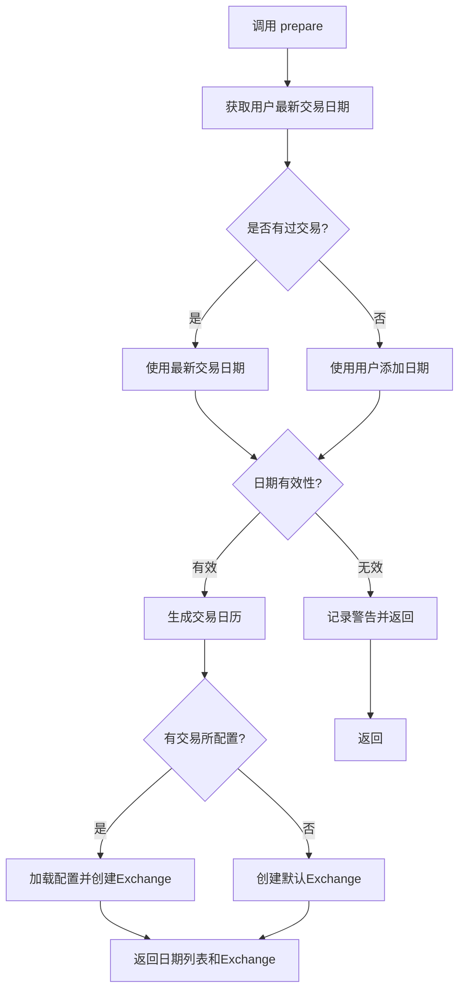

# online/utils.py 模块文档

## 模块概述

`online/utils.py` 模块提供了在线交易系统的工具函数集。该模块包含数据序列化、用户目录管理、交易日期准备等核心辅助功能。

该模块是支撑整个在线系统运行的基础设施，提供了：
- 安全的对象序列化和反序列化
- 用户数据目录的自动创建
- 交易日期和交易所的准备
- 安全的 pickle 加载机制

---

## 函数定义

### load_instance(file_path)

从文件加载序列化的对象实例。

**函数签名**:
```python
def load_instance(file_path):
    """
    load a pickle file

    Parameters
    ----------
    file_path : str / pathlib.Path()
        path of file to be loaded

    Returns
    -------
    instance
        An instance loaded from file
    """
```

**参数说明**:

| 参数名 | 类型 | 必填 | 说明 |
|--------|------|------|------|
| `file_path` | `str` or `pathlib.Path` | 是 | 要加载的文件路径 |

**返回值**:
- `Any`: 从文件加载的对象实例

**异常**:
| 异常类型 | 触发条件 |
|----------|----------|
| `ValueError` | 文件不存在 |
| `pickle.UnpicklingError` | 文件格式错误或损坏 |
| 其他 pickle 相关异常 | 反序列化失败 |

**安全说明**:
- 使用 `restricted_pickle_load` 进行安全加载
- 防止恶意代码注入攻击
- 仅加载可信的序列化数据

**示例**:
```python
from qlib.contrib.online.utils import load_instance

# 加载策略对象
strategy = load_instance("/path/to/strategy_user_001.pickle")

# 加载模型对象
model = load_instance("/path/to/model_user_001.pickle")

# 对象可以直接使用
predictions = model.predict(data)
```

### save_instance(instance, file_path)

将对象实例序列化保存到文件。

**函数签名**:
```python
def save_instance(instance, file_path):
    """
    save(dump) an instance to a pickle file

    Parameters
    ----------
    instance : Any
        data to be dumped
    file_path : str / pathlib.Path()
        path of file to be dumped
    """
```

**参数说明**:

| 参数名 | 类型 | 必填 | 说明 |
|--------|------|------|------|
| `instance` | `Any` | 是 | 要序列化的对象实例 |
| `file_path` | `str` or `pathlib.Path` | 是 | 保存的文件路径 |

**返回值**:
- `None`

**异常**:
| 异常类型 | 触发条件 |
|----------|----------|
| `pickle.PicklingError` | 对象无法序列化 |
| `OSError` | 文件写入失败 |
| 其他 pickle 相关异常 | 序列化失败 |

**协议说明**:
- 使用配置的 dump protocol version
- 版本由 `qlib.config.C.dump_protocol_version` 指定
- 默认使用最新的 pickle 协议

**示例**:
```python
from qlib.contrib.online.utils import save_instance
from qlib.contrib.model import XGBoostModel

# 创建模型
model = XGBoostModel(**params)

# 保存模型
save_instance(model, "/path/to/model_user_001.pickle")

# 模型已保存到文件
```

### create_user_folder(path)

创建用户数据目录并初始化用户记录文件。

**函数签名**:
```python
def create_user_folder(path):
    """
    Create user data directory and initialize users.csv
    """
```

**参数说明**:

| 参数名 | 类型 | 必填 | | 说明 |
|--------|------|------|------|------|
| `path` | `str` or `pathlib.Path` | 是 | 用户数据根目录路径 |

**返回值**:
- `None`

**功能说明**:
1. 检查目录是否存在，如果存在则直接返回
2. 创建目录及其父目录（`mkdir -p`）
3. 创建空的 `users.csv` 文件，包含表头

**目录结构**:
```
path/
└── users.csv    # 用户记录表（初始化时为空，只有表头）
```

**users.csv 格式**:
```csv
user_id,add_date
```

**异常**:
| 异常类型 | 触发条件 |
|----------|----------|
| `OSError` | 目录创建失败 |
| `PermissionError` | 没有写入权限 |

**示例**:
```python
from qlib.contrib.online.utils import create_user_folder

# 创建用户数据目录
create_user_folder("/path/to/user_data")

# 目录已创建，可以开始添加用户
```

### prepare(um, today, user_id, exchange_config=None)

准备交易日期和交易所对象。

**函数签名**:
```python
def prepare(um, today, user_id, exchange_config=None):
    """
    1. Get the dates that need to do trading till today for user {user_id}
       dates[0] indicate the latest trading date of User{user_id},
       if User{user_id} haven't do trading before, than dates[0] presents the init date of User{user_id}.
    2. Set the exchange with exchange_config file

    Parameters
    ----------
    um : UserManager()
        User manager instance
    today : pd.Timestamp()
        Current trading date
    user_id : str
        User identifier
    exchange_config : str, optional
        Path to exchange configuration file

    Returns
    -------
    dates : list of pd.Timestamp
        Trading dates list
    trade_exchange : Exchange()
        Exchange instance
    """
```

**参数说明**:

| 参数名 | 类型 | 必填 | 说明 |
|--------|------|------|------|
| `um` | `UserManager` | 是 | 用户管理器实例 |
| `today` | `pd.Timestamp` | 是 | 当前交易日期 |
| `user_id` | `str` | 是 | 用户ID |
| `exchange_config` | `str` or `None` | 否 | 交易所配置文件路径 |

**返回值**:
- `tuple`: `(dates, trade_exchange)`
  - `dates`: `list[pd.Timestamp]` 交易日期列表
    - `dates[0]`: 用户最新交易日期或初始化日期
    - `dates[-1]`: 当前交易日期
    - `dates[-2]`: 下一个交易日
  - `trade_exchange`: `Exchange` 交易所实例

**功能说明**:
1. 获取用户的最新交易日期
   - 如果从未交易过，使用用户添加日期
   - 如果最新交易日期晚于 today，记录警告并返回
2. 生成从最新交易日期到当前日期的所有交易日
3. 加载交易所配置（如果提供）
4. 创建交易所实例
5. 返回日期列表和交易所实例

**异常**:
- 一般不会抛出异常，但会记录警告

**警告情况**:
- 当用户的最新交易日期晚于当前日期时，记录警告日志

**示例**:
```python
from qlib.contrib.online.utils import prepare
import pandas as pd

# 准备交易环境
dates, trade_exchange = prepare(
    um=user_manager,
    today=pd.Timestamp("2023-01-15"),
    user_id="user_001",
    exchange_config="/path/to/exchange_config.yaml"
)

# dates[0]: 最新交易日期
# dates[1:-1]: 中间的交易日
# dates[-1]: 当前日期
# dates[-2]: 下一个交易日

# 使用交易所
trade_account = Account(init_cash=1000000)
order_list = strategy.generate_trade_decision(
    score_series=score_series,
    current=trade_account.current_position,
    trade_exchange=trade_exchange,
    trade_date=dates[-1]
)
```

---

## 完整使用示例

### 示例1：保存和加载对象

```python
from qlib.contrib.online.utils import load_instance, save_instance
from qlib.contrib.model.xgboost import XGBoostModel
from qlib.contrib.strategy.topk_dropout import TopkDropDropoutStrategy

# 创建对象
model = XGBoostModel(
    loss='mse',
    colsample_bytree=0.8,
    learning_rate=0.05
)

strategy = TopkDropoutStrategy(
    topk=50,
    drop=5
)

# 保存对象
save_instance(model, "/tmp/model.pickle")
save_instance(strategy, "/tmp/strategy.pickle")

# 加载对象
loaded_model = load_instance("/tmp/model.pickle")
loaded_strategy = load_instance("/tmp/strategy.pickle")

# 验证
print(type(loaded_model))  # <class 'qlib.contrib.model.xgboost.XGBoostModel'>
print(type(loaded_strategy))  # <class '...TopkDropoutStrategy'>
```

### 示例2：初始化用户系统

```python
from qlib.contrib.online.utils import create_user_folder
from qlib.contrib.online.manager import UserManager
import pandas as pd

# 1. 创建用户数据目录
create_user_folder("/path/to/user_data")

# 2. 创建用户管理器
um = UserManager(user_data_path="/path/to/user_data")

# 3. 添加用户
um.add_user(
    user_id="user_001",
    config_file="/path/to/user_config.yaml",
    add_date=pd.Timestamp("2023-01-01")
)

# 4. 加载用户
um.load_users()

print(f"用户数量: {len(um.users)}")
```

### 示例3：准备交易环境

```python
from qlib.contrib.online.utils import prepare
from qlib.contrib.online.manager import UserManager
import pandas as pd

# 初始化
um = UserManager(user_data_path="/path/to/user_data")
um.load_users()

# 准备今天的交易环境
today = pd.Timestamp("2023-01-15")
user_id = "user_001"

# 不使用交易所配置（使用默认）
dates, trade_exchange = prepare(
    um=um,
    today=today,
    user_id=user_id
)

print(f"交易日期范围: {dates[0]} 到 {dates[-1]}")
print(f"下一个交易日: {dates[-2]}")

# 使用交易所配置
dates, trade_exchange = prepare(
    um=um,
    today=today,
    user_id=user_id,
    exchange_config="/path/to/exchange_config.yaml"
)
```

### 示例4：完整的用户数据管理

```python
from qlib.contrib.online.utils import (
    create_user_folder,
    save_instance,
    load_instance
)
from qlib.contrib.online.manager import UserManager
import pandas as pd

# 1. 创建用户数据目录
user_data_path = "/path/to/user_data"
create_user_folder(user_data_path)

# 2. 创建用户管理器并添加用户
um = UserManager(user_data_path=user_data_path)
um.add_user(
    user_id="user_001",
    config_file="/path/to/config.yaml",
    add_date=pd.Timestamp("2023-01-01")
)

# 3. 加载用户
um.load_users()
user = um.users["user_001"]

# 4. 修改用户组件（例如更新模型）
user.model = new_model

# 5. 保存用户数据
um.save_user_data("user_001")

# 或者单独保存组件
save_instance(user.model, f"{user_data_path}/user_001/model_user_001.pickle")
save_instance(user.strategy, f"{user_data_path}/user_001/strategy_user_001.pickle")
```

### 示例5：批量保存和加载

```python
from qlib.contrib.online.utils import save_instance, load_instance
import os

# 批量保存
objects = {
    "model1": model_instance_1,
    "model2": model_instance_2,
    "strategy": strategy_instance
}

save_dir = "/path/to/save"
os.makedirs(save_dir, exist_ok=True)

for name, obj in objects.items():
    save_instance(obj, f"{save_dir}/{name}.pickle")
    print(f"保存 {name}")

# 批量加载
loaded_objects = {}

for filename in os.listdir(save_dir):
    if filename.endswith('.pickle'):
        name = filename[:-7]  # 移除 .pickle
        obj = load_instance(f"{save_dir}/{filename}")
        loaded_objects[name] = obj
        print(f"加载 {name}")

print(f"总共加载 {len(loaded_objects)} 个对象")
```

---

## 架构说明

### 函数依赖关系



### 数据持久化流程



### 交易日期准备流程



---

## 安全考虑

### Pickle 安全性

该模块使用 `restricted_pickle_load` 来防止安全漏洞：

```python
# 安全的加载方式
instance = restricted_pickle_load(fr)

# 不安全的加载方式（不要使用）
instance = pickle.load(fr)  # 可能执行恶意代码
```

**安全措施**:
1. 使用限制的类白名单
2. 防止代码注入攻击
3. 只加载可信来源的文件

**最佳实践**:
1. 只加载自己创建的 pickle 文件
2. 不要加载来自不可信来源的 pickle 文件
3. 定期检查 pickle 文件的来源和内容

### 文件系统安全

```python
# 检查文件存在性
if not file_path.exists():
    raise ValueError("Cannot find file")

# 创建目录时使用绝对路径
path = pathlib.Path(path).resolve()
path.mkdir(parents=True, exist_ok=True)
```

---

## 性能优化

### 批量序列化

```python
import pickle
from pathlib import Path

# 不好的做法：逐个保存
for obj in objects:
    save_instance(obj, path)

# 好的做法：批量保存（如果支持）
# 注意：pickle 格式不支持批量保存，需要逐个处理
for name, obj in object_dict.items():
    save_instance(obj, f"{path}/{name}.pickle")
```

### 内存管理

```python
# 大对象序列化后可以释放内存
large_object = create_large_object()
save_instance(large_object, path)
del large_object  # 释放内存

# 需要时再加载
loaded_object = load_instance(path)
```

### 使用上下文管理器

```python
# 创建目录时的安全方式
from pathlib import Path

user_path = Path(user_data_path)
user_path.mkdir(parents=True, exist_ok=True)
```

---

## 错误处理

### 典型错误场景

```python
# 1. 文件不存在
try:
    obj = load_instance("/nonexistent/file.pickle")
except ValueError as e:
    print(f"文件不存在: {e}")

# 2. 文件格式错误
try:
    obj = load_instance("/invalid/format.pickle")
except pickle.UnpicklingError as e:
    print(f"文件格式错误: {e}")

# 3. 权限错误
try:
    save_instance(obj, "/readonly/path/file.pickle")
except PermissionError as e:
    print(f"没有写入权限: {e}")

# 4. 对象无法序列化
try:
    save_instance(lambda x: x, "/path/to/file.pickle")
except pickle.PicklingError as e:
    print(f"对象无法序列化: {e}")
```

### 日志记录

```python
from qlib.contrib.online.utils import create_user_folder

import logging
logging.basicConfig(level=logging.INFO)

# 创建目录时会记录日志
create_user_folder("/path/to/user_data")
# INFO: Created user folder at /path/to/user_data
```

---

## 常见问题

### Q1: 如何检查 pickle 文件是否有效？

```python
def is_valid_pickle(file_path):
    """检查 pickle 文件是否有效"""
    try:
        load_instance(file_path)
        return True
    except Exception:
        return False

# 使用
if is_valid_pickle("/path/to/file.pickle"):
    obj = load_instance("/path/to/file.pickle")
else:
    print("文件无效")
```

### Q2: 如何处理 pickle 版本兼容性？

```python
# 使用统一的协议版本
from qlib.config import C

print(f"Pickle protocol version: {C.dump_protocol_version}")

# 保存时会自动使用配置的版本
save_instance(obj, path)
```

### Q3: 如何备份用户数据？

```python
import shutil
from pathlib import Path

def backup_user_data(source, backup_dir):
    """备份用户数据目录"""
    source = Path(source)
    backup_dir = Path(backup_dir)

    # 创建备份目录
    timestamp = pd.Timestamp.now().strftime("%Y%m%d_%H%M%S")
    backup_path = backup_dir / f"backup_{timestamp}"

    # 复制整个目录
    shutil.copytree(source, backup_path)
    print(f"备份到: {backup_path}")

# 使用
backup_user_data("/path/to/user_data", "/path/to/backups")
```

---

## 相关模块

- `qlib.contrib.online.manager.UserManager`: 用户管理器
- `qlib.contrib.online.user.User`: 用户类
- `qlib.data`: 数据接口
- `qlib.config`: 配置管理
- `qlib.utils`: 工具函数
- `qlib.backtest.exchange.Exchange`: 交易所类

---

## 最佳实践

1. **序列化安全**:
   - 只序列化和加载可信的对象
   - 不要加载未知来源的 pickle 文件
   - 使用 `restricted_pickle_load` 而不是 `pickle.load`

2. **目录管理**:
   - 使用 `create_user_folder` 初始化用户目录
   - 使用绝对路径避免混淆
   - 检查目录是否存在后再操作

3. **错误处理**:
   - 捕获并处理所有可能的异常
   - 提供有意义的错误信息
   - 记录详细的错误日志

4. **性能考虑**:
   - 大对象序列化后及时释放内存
   - 避免频繁的序列化操作
   - 考虑使用缓存机制

5. **版本控制**:
   - 记录 pickle 文件的版本信息
   - 处理版本兼容性问题
   - 提供数据迁移工具

---

## 更新历史

- 初始版本：实现基本的工具函数
- 安全更新：使用 `restricted_pickle_load` 替代 `pickle.load`
