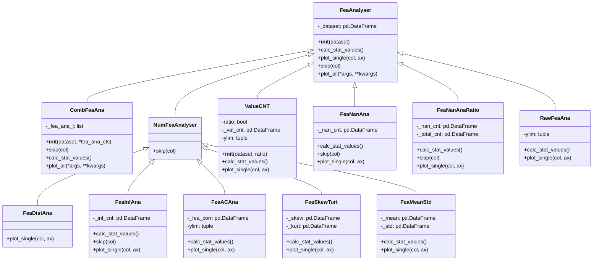

# data 模块

## 模块概述

`qlib.contrib.report.data` 模块提供了用于分析和可视化数据特征的类和工具。该模块主要用于分析特征数据的统计特性、分布、缺失值、无穷大值等。

## 模块结构

```
data/
├── __init__.py           # 模块初始化
├── base.py             # 基础分析器类
└── ana.py              # 具体分析器实现
```

## 核心类体系

### 类继承关系



---

## 基础类：FeaAnalyser

**位置**: `qlib.contrib.report.data.base.FeaAnalyser`

**说明**: 所有特征分析器的基类，提供了统计计算和绘图的基本框架。

### 构造方法

```python
def __init__(self, dataset: pd.DataFrame):
```

**参数说明**:

| 参数 | 类型 | 说明 |
|------|------|------|
| dataset | pd.DataFrame | 要分析的数据集 |

**数据集要求**:
- 索引包含 datetime 级别
- 可以有多列，每列对应一个特征
- 按时间维度聚合计算统计数据

**示例数据**:

```python
                return
datetime   instrument
2007-02-06  equity_tpx     0.010087
            equity_spx     0.000786
```

### 方法说明

#### calc_stat_values

```python
def calc_stat_values(self):
    pass
```

**说明**: 计算统计值。子类应该重写此方法以实现具体的统计计算。

#### plot_single

```python
def plot_single(self, col, ax):
    raise NotImplementedError(f"This type of input is not supported")
```

**说明**: 绘制单个特征的图表。子类应该重写此方法。

**参数**:
- `col`: 列名（特征名）
- `ax`: matplotlib 轴对象

#### skip

```python
def skip(self, col):
    return False
```

**说明**: 判断是否跳过某个特征。返回 True 表示跳过该特征。

**参数**:
- `col`: 列名（特征名）

**返回**: bool

#### plot_all

```python
def plot_all(self, *args, **kwargs):
```

**说明**: 绘制所有特征的图表。

**参数**:
- `*args`, `**kwargs`: 传递给 `sub_fig_generator` 的参数

**工作流程**:
1. 创建子图生成器
2. 遍历每个特征列
3. 如果不跳过该特征，则获取子图并绘制

---

## 数值特征分析器：NumFeaAnalyser

**位置**: `qlib.contrib.report.data.ana.NumFeaAnalyser`

**说明**: 数值特征分析器的基类，继承自 `FeaAnalyser`。自动跳过非数值类型的特征。

### 方法说明

#### skip

```python
def skip(self, col):
    is_obj = np.issubdtype(self._dataset[col], np.dtype("O"))
    if is_obj:
        logger.info(f"{col} is not numeric and is skipped")
    return is_obj
```

**说明**: 检查特征是否为数值类型。如果不是数值类型（object 类型），则跳过该特征。

---

## 具体分析器类

### 1. CombFeaAna - 组合分析器

**位置**: `qlib.contrib.report.data.ana.CombFeaAna`

**说明**: 将多个子分析器组合在一起，在单个图表中显示多个分析结果。

#### 构造方法

```python
def __init__(self, dataset: pd.DataFrame, *fea_ana_cls):
```

**参数说明**:

| 参数 | 类型 | 说明 |
|------|------|------|
| dataset | pd.DataFrame | 要分析的数据集 |
| *fea_ana_cls | FeaAnalyser 子类 | 要组合的分析器类 |

**要求**: 至少需要 2 个分析器类。

#### 使用示例

```python
from qlib.contrib.report.data.ana import (
    CombFeaAna, FeaMeanStd, FeaSkewTurt
)

# 组合均值标准差和偏度峰度分析器
fa = CombFeaAna(
    dataset=df,
    FeaMeanStd,
    FeaSkewTurt
)

# 绘制所有特征
fa.plot_all(wspace=0.3, sub_figsize=(12, 3), col_n=5)
```

---

### 2. ValueCNT - 值计数分析器

**位置**: `qlib.contrib.report.data.ana.ValueCNT`

**说明**: 统计每个特征在不同时间点的唯一值数量。

#### 构造方法

```python
def __init__(self, dataset: pd.DataFrame, ratio: bool = False):
```

**参数说明**:

| 参数 | 类型 | 默认值 | 说明 |
|------|------|--------|------|
| dataset | pd.DataFrame | 必需 | 要分析的数据集 |
| ratio | bool | False | 是否计算比例，True 时计算唯一值占总数量的比例 |

#### 计算逻辑

- 按日期分组
- 统计每天每个特征的唯一值数量
- 如果 ratio=True，则除以当天的总数据量

#### 使用示例

```python
from qlib.contrib.report.data.ana import ValueCNT

# 统计唯一值数量
fa = ValueCNT(df, ratio=False)
fa.plot_all(wspace=0.3, sub_figsize=(12, 3), col_n=5)

# 统计唯一值比例
fa = ValueCNT(df, ratio=True)
fa.plot_all(wspace=0.3, sub_figsize=(12, 3), col_n=5)
```

---

### 3. FeaDistAna - 特征分布分析器

**位置**: `qlib.contrib.report.data.ana.FeaDistAna`

**说明**: 绘制特征的直方图，展示数据的分布情况。

#### 绘图说明

- 使用 seaborn 的 histplot 函数
- 默认使用 100 个 bins
- 不显示 KDE（核密度估计）

#### 使用示例

```python
from qlib.contrib.report.data.ana import FeaDistAna

fa = FeaDistAna(df)
fa.plot_all(wspace=0.3, sub_figsize=(12, 3), col_n=5)
```

---

### 4. FeaInfAna - 无穷大值分析器

**位置**: `qlib.contrib.report.data.ana.FeaInfAna`

**说明**: 分析特征中的无穷大值（inf/-inf）数量。

#### 计算逻辑

- 按日期分组
- 统计每天每个特征的无穷大值数量
- 只显示包含无穷大值的特征

#### 使用示例

```python
from qlib.contrib.report.data.ana import FeaInfAna

fa = FeaInfAna(df)
fa.plot_all(wspace=0.3, sub_figsize=(12, 3), col_n=5)
```

---

### 5. FeaNanAna - 缺失值分析器

**位置**: `qlib.contrib.report.data.ana.FeaNanAna`

**说明**: 分析特征中的缺失值（NaN）数量。

#### 计算逻辑

- 按日期分组
- 统计每天每个特征的缺失值数量
- 只显示包含缺失值的特征

#### 使用示例

```python
from qlib.contrib.report.data.ana import FeaNanAna

fa = FeaNanAna(df)
fa.plot_all(wspace=0.3, sub_figsize=(12, 3), col_n=5)
```

---

### 6. FeaNanAnaRatio - 缺失值比例分析器

**位置**: `qlib.contrib.report.data.ana.FeaNanAnaRatio`

**说明**: 分析特征中的缺失值比例。

#### 计算逻辑

- 按日期分组
- 计算每天每个特征的缺失值数量
- 计算缺失值占总数量的比例
- 只显示包含缺失值的特征

#### 使用示例

```python
from qlib.contrib.report.data.ana import FeaNanAnaRatio

fa = FeaNanAnaRatio(df)
fa.plot_all(wspace=0.3, sub_figsize=(12, 3), col_n=5)
```

---

### 7. FeaACAna - 自相关分析器

**位置**: `qlib.contrib.report.data.ana.FeaACAna`

**说明**: 分析特征的自相关性。

#### 计算逻辑

- 使用 `pred_autocorr_all` 函数计算自相关
- 结果包含日期索引和自相关值

#### 使用示例

```python
from qlib.contrib.report.data.ana import FeaACAna

fa = FeaACAna(df)
fa.plot_all(wspace=0.3, sub_figsize=(12, 3), col_n=5)
```

---

### 8. FeaSkewTurt - 偏度和峰度分析器

**位置**: `qlib.contrib.report.data.ana.FeaSkewTurt`

**说明**: 分析特征的偏度（skewness）和峰度（kurtosis）。

#### 绘图说明

- 左侧 Y 轴：偏度，使用蓝色
- 右侧 Y 轴：峰度，使用绿色
- 双 y 轴图表

#### 统计指标说明

- **偏度（Skewness）**:
  - 衡量数据分布的对称性
  - > 0：右偏（长尾在右侧）
  - < 0：左偏（长尾在左侧）
  - = 0：对称分布

- **峰度（Kurtosis）**:
  - 衡量数据分布的尖峰程度
  - > 0：尖峰分布（比正态分布更尖）
  - < 0：平峰分布（比正态分布更平）
  - = 0：正态分布的峰度

#### 使用示例

```python
from qlib.contrib.report.data.ana import FeaSkewTurt

fa = FeaSkewTurt(df)
fa.plot_all(wspace=0.3, sub_figsize=(12, 3), col_n=5)
```

---

### 9. FeaMeanStd - 均值和标准差分析器

**位置**: `qlib.contrib.report.data.ana.FeaMeanStd`

**说明**: 分析特征的均值和标准差随时间的变化。

#### 计算逻辑

- 按日期分组计算均值
- 按日期分组计算标准差

#### 绘图说明

- 左侧 Y 轴：均值，使用蓝色
- 右侧 Y 轴：标准差，使用绿色
- 双 y 轴图表

#### 使用示例

```python
from qlib.contrib.report.data.ana import FeaMeanStd

fa = FeaMeanStd(df)
fa.plot_all(wspace=0.3, sub_figsize=(12, 3), col_n=5)
```

---

### 10. RawFeaAna - 原始值分析器

**位置**: `qlib.contrib.report.data.ana.RawFeaAna`

**说明**: 直接显示特征的原始值，不做进一步分析。

#### 使用场景

- 查看特征的时间序列变化
- 快速检查数据的数值范围
- 识别异常值

#### 使用示例

```python
from qlib.contrib.report.data.ana import RawFeaAna

fa = RawFeaAna(df)
fa.plot_all(wspace=0.3, sub_figsize=(12, 3), col_n=5)
```

---

## 完整使用示例

### 示例 1: 基础特征分析

```python
import pandas as pd
import numpy as np
from qlib.contrib.report.data.ana import (
    FeaMeanStd, FeaDistAna, FeaNanAna,
    FeaInfAna, FeaSkewTurt
)

# 准备数据
np.random.seed(42)
dates = pd.date_range('2020-01-01', periods=100)
instruments = [f'STOCK{i:04d}' for i in range(10)]

index = pd.MultiIndex.from_product(
    [instruments, dates],
    names=['instrument', 'datetime']
)

# 创建特征数据
data = pd.DataFrame({
    'feature1': np.random.randn(len(index)),
    'feature2': np.random.randn(len(index)) * 2,
    'feature3': np.random.randn(len(index)) * 0.5,
}, index=index)

# 分析均值和标准差
print("=== 均值和标准差分析 ===")
fa_mean_std = FeaMeanStd(data)
fa_mean_std.plot_all(wspace=0.3, sub_figsize=(12, 3), col_n=3)

# 分析分布
print("\n=== 分布分析 ===")
fa_dist = FeaDistAna(data)
fa_dist.plot_all(wspace=0.3, sub_figsize=(12, 3), col_n=3)

# 分析偏度和峰度
print("\n=== 偏度和峰度分析 ===")
fa_skew = FeaSkewTurt(data)
fa_skew.plot_all(wspace=0.3, sub_figsize=(12, 3), col_n=3)
```

### 示例 2: 缺失值和无穷大值分析

```python
from qlib.contrib.report.data.ana import FeaNanAna, FeaNanAnaRatio, FeaInfAna

# 添加一些缺失值
data_with_nan = data.copy()
data_with_nan.loc[data_with_nan['feature1'] > 2, 'feature1'] = np.nan
data_with_nan.loc[data_with_nan['feature2'] < -3, 'feature2'] = np.nan

# 添加一些无穷大值
data_with_inf = data.copy()
data_with_inf.loc[data_with_inf['feature3'] > 1, 'feature3'] = np.inf

# 分析缺失值数量
print("=== 缺失值数量分析 ===")
fa_nan = FeaNanAna(data_with_nan)
fa_nan.plot_all(wspace=0.3, sub_figsize=(12, 3), col_n=3)

# 分析缺失值比例
print("\n=== 缺失值比例分析 ===")
fa_nan_ratio = FeaNanAnaRatio(data_with_nan)
fa_nan_ratio.plot_all(wspace=0.3, sub_figsize=(12, 3), col_n=3)

# 分析无穷大值
print("\n=== 无穷大值分析 ===")
fa_inf = FeaInfAna(data_with_inf)
fa_inf.plot_all(wspace=0.3, sub_figsize=(12, 3), col_n=3)
```

### 示例 3: 组合分析器

```python
from qlib.contrib.report.data.ana import CombFeaAna, FeaMeanStd, FeaSkewTurt

# 组合均值标准差和偏度峰度分析器
print("=== 组合分析：均值标准差 + 偏度峰度 ===")
fa_combined = CombFeaAna(
    dataset=data,
    FeaMeanStd,
    FeaSkewTurt
)
fa_combined.plot_all(wspace=0.3, sub_figsize=(12, 6), col_n=3, row_n=2)
```

### 示例 4: 完整的数据质量检查流程

```python
import pandas as pd
import numpy as np
from qlib.contrib.report.data.ana import (
    FeaMeanStd, FeaDistAna, FeaNanAna,
    FeaInfAna, FeaSkewTurt, FeaACAna,
    ValueCNT, RawFeaAna
)

def check_data_quality(data):
    """全面检查数据质量"""
    print("=" * 60)
    print("数据质量检查报告")
    print("=" * 60)

    # 1. 原始值概览
    print("\n1. 原始值概览")
    print("-" * 60)
    fa_raw = RawFeaAna(data)
    fa_raw.plot_all(wspace=0.3, sub_figsize=(12, 3), col_n=3)

    # 2. 均值和标准差
    print("\n2. 均值和标准差分析")
    print("-" * 60)
    fa_mean_std = FeaMeanStd(data)
    fa_mean_std.plot_all(wspace=0.3, sub_figsize=(12, 3), col_n=3)

    # 3. 分布分析
    print("\n3. 分布分析")
    print("-" * 60)
    fa_dist = FeaDistAna(data)
    fa_dist.plot_all(wspace=0.3, sub_figsize=(12, 3), col_n=3)

    # 4. 偏度和峰度
    print("\n4. 偏度和峰度分析")
    print("-" * 60)
    fa_skew = FeaSkewTurt(data)
    fa_skew.plot_all(wspace=0.3, sub_figsize=(12, 3), col_n=3)

    # 5. 缺失值检查
    print("\n5. 缺失值检查")
    print("-" * 60)
    fa_nan = FeaNanAna(data)
    if data.isna().any().any():
        fa_nan.plot_all(wspace=0.3, sub_figsize=(12, 3), col_n=3)
    else:
        print("✓ 没有缺失值")

    # 6. 无穷大值检查
    print("\n6. 无穷大值检查")
    print("-" * 60)
    fa_inf = FeaInfAna(data)
    if np.isinf(data).any().any():
        fa_inf.plot_all(wspace=0.3, sub_figsize=(12, 3), col_n=3)
    else:
        print("✓ 没有无穷大值")

    # 7. 自相关分析
    print("\n7. 自相关分析")
    print("-" * 60)
    fa_ac = FeaACAna(data)
    fa_ac.plot_all(wspace=0.3, sub_figsize=(12, 3), col_n=3)

    print("\n" + "=" * 60)
    print("数据质量检查完成")
    print("=" * 60)

# 执行数据质量检查
check_data_quality(data)
```

### 示例 5: 使用真实 Qlib 数据

```python
import qlib
import pandas as pd
from qlib.data import D
from qlib.contrib.report.data.ana import (
    FeaMeanStd, FeaDistAna, FeaNanAna,
    FeaInfAna, FeaSkewTurt
)

# 初始化 Qlib
qlib.init(provider_uri='~/.qlib/qlib_data/cn_data', region='cn')

# 获取数据
instruments = D.instruments('csi500')
fields = [
    '$close',
    '$volume',
    'Ref($close, 1)/$close - 1',  # 收益率
    '$volume / Ref($volume, 1)',  # 成交量变化
]

dates = pd.date_range('2020-01-01', '2020-12-31')
data = D.features(instruments, fields, dates[0], dates[-1])
data.columns = ['close', 'volume', 'return', 'volume_change']

# 转换为 MultiIndex 格式
data = data.reset_index()
data = data.set_index(['instrument', 'datetime'])

# 分析数据
print("=== Qlib 数据分析 ===")

# 均值和标准差
fa_mean_std = FeaMeanStd(data)
fa_mean_std.plot_all(wspace=0.3, sub_figsize=(12, 3), col_n=2)

# 分布分析
fa_dist = FeaDistAna(data)
fa_dist.plot_all(wspace=0.3, sub_figsize=(12, 3), col_n=2)

# 偏度和峰度
fa_skew = FeaSkewTurt(data)
fa_skew.plot_all(wspace=0.3, sub_figsize=(12, 3), col_n=2)
```

## 最佳实践

1. **数据准备**:
   - 确保数据索引包含 'datetime' 级别
   - 使用 MultiIndex 结构 [instrument, datetime]
   - 处理缺失值和无穷大值

2. **分析器选择**:
   - **数据概览**: RawFeaAna
   - **统计特性**: FeaMeanStd, FeaSkewTurt
   - **分布检查**: FeaDistAna
   - **数据质量**: FeaNanAna, FeaNanAnaRatio, FeaInfAna
   - **时间特性**: FeaACAna
   - **组合分析**: CombFeaAna

3. **参数调整**:
   - `sub_figsize`: 调整每个子图的大小
   - `col_n`: 控制每行的子图数量
   - `wspace`, `hspace`: 调整子图之间的间距

4. **性能考虑**:
   - 对于大数据集，先使用抽样分析
   - 可以分别对每个特征使用 `plot_single` 方法
   - 使用 `skip` 方法过滤不需要分析的特征

5. **结果解释**:
   - **均值和标准差**: 检查数据是否稳定
   - **偏度和峰度**: 评估分布形态
   - **缺失值**: 识别数据质量问题
   - **自相关**: 理解特征的时序特性

## 常见问题

### Q: 如何只分析特定特征？

A: 重写 `skip` 方法：

```python
class CustomAnalyser(FeaMeanStd):
    def skip(self, col):
        # 只分析 feature1 和 feature2
        return col not in ['feature1', 'feature2']

fa = CustomAnalyser(data)
fa.plot_all(wspace=0.3, sub_figsize=(12, 3), col_n=2)
```

### Q: 如何自定义绘图样式？

A: 重写 `plot_single` 方法：

```python
class CustomDistAnalyser(FeaDistAna):
    def plot_single(self, col, ax):
        # 使用不同的颜色和 bins 数量
        sns.histplot(
            self._dataset[col],
            ax=ax,
            kde=True,
            bins=50,
            color='red'
        )
        ax.set_xlabel("")
        ax.set_title(f"{col} (Custom)")

fa = CustomDistAnalyser(data)
fa.plot_all(wspace=0.3, subfigsize=(12, 3), col_n=3)
```

### Q: 如何组合多个分析器？

A: 使用 `CombFeaAna`：

```python
fa = CombFeaAna(
    dataset=data,
    FeaMeanStd,
    FeaSkewTurt,
    FeaDistAna
)
fa.plot_all(wspace=0.3, subfigsize=(12, 9), col_n=3, row_n=3)
```

### Q: 如何保存图表？

A: 在绘图后使用 matplotlib 保存：

```python
import matplotlib.pyplot as plt

fa = FeaMeanStd(data)
fa.plot_all(wspace=0.3, subfigsize=(12, 3), col_n=3)

# 保存当前图形
plt.savefig('feature_analysis.png', dpi=300, bbox_inches='tight')
```

### Q: 如何处理大量特征？

A: 使用迭代的方式，每次分析一部分：

```python
features = data.columns.tolist()
batch_size = 10

for i in range(0, len(features), batch_size):
    batch_features = features[i:i+batch_size]
    batch_data = data[batch_features]

    fa = FeaMeanStd(batch_data)
    fa.plot_all(wspace=0.3, subfigsize=(12, 3), col_n=batch_size)
```
