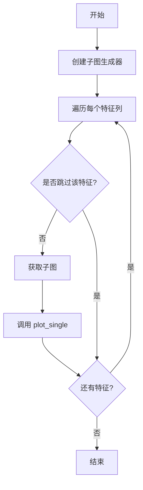

# data/base.py

## 模块概述

`qlib.contrib.report.data.base` 模块是数据分析器的基础模块，定义了所有特征分析器的基类。该模块提供了数据分析的基本框架，支持统计计算和批量绘图功能。

## 模块职责

该模块负责：

1. **定义数据分析器的公共接口**
2. **提供统计计算的基本框架**
3. **实现批量绘图功能**
4. **支持特征过滤机制**

---

## 核心类：FeaAnalyser

**说明**: 所有特征分析器的基类，提供了数据分析的通用框架。

### 构造方法

```python
def __init__(self, dataset: pd.DataFrame):
```

**参数说明**:

| 参数 | 类型 | 说明 |
|------|------|------|
| dataset | pd.DataFrame | 要分析的数据集 |

**数据集要求**:

数据集应该满足以下格式：

```python
                return
datetime   instrument
2007-02-06  equity_tpx     0.010087
            equity_spx     0.000786
```

**要求**:
- 索引包含 `datetime` 级别
- 可以有多列，每列对应一个特征
- 按时间维度（`datetime`）聚合计算统计数据

---

### 方法详细说明

#### calc_stat_values

```python
def calc_stat_values(self):
    pass
```

**说明**: 计算统计值。子类应该重写此方法以实现具体的统计计算。

**子类实现示例**:

```python
class MyAnalyser(FeaAnalyser):
    def calc_stat_values(self):
        # 计算均值
        self._mean = self._dataset.groupby('datetime', group_keys=False).mean()

        # 计算标准差
        self._std = self._dataset.groupby('datetime', group_keys=False).std()
```

#### plot_single

```python
def plot_single(self, col, ax):
    raise NotImplementedError(f"This type of input is not supported")
```

**说明**: 绘制单个特征的图表。子类应该重写此方法。

**参数**:
- `col` (str): 列名（特征名）
- `ax` (matplotlib.pyplot.Axes): matplotlib 轴对象

**子类实现示例**:

```python
class MyAnalyser(FeaAnalyser):
    def plot_single(self, col, ax):
        # 在轴上绘制数据
        self._dataset[col].plot(ax=ax, title=col)
        ax.set_xlabel("")
        ax.grid(True)
```

#### skip

```python
def skip(self, col):
    return False
```

**说明**: 判断是否跳过某个特征。返回 True 表示跳过该特征，不在图表中显示。

**参数**:
- `col` (str): 列名（特征名）

**返回**: bool

**默认实现**: 不跳过任何特征。

**子类实现示例**:

```python
class MyAnalyser(FeaAnalyser):
    def skip(self, col):
        # 跳过名称包含 'temp' 的特征
        return 'temp' in col.lower()
```

#### plot_all

```python
def plot_all(self, *args, **kwargs):
```

**说明**: 绘制所有特征的图表。

**参数**:
- `*args`, `**kwargs`: 传递给 `sub_fig_generator` 的参数

**工作流程**:



**默认参数**:

| 参数 | 默认值 | 说明 |
|------|--------|------|
| sub_figsize | (3, 3) | 每个子图的尺寸 |
| col_n | 10 | 每行子图的数量 |
| row_n | 1 | 每列子图的数量 |
| wspace | None | 子图之间的宽度间距 |
| hspace | None | 子图[内容过长，已省略]...|
| sharex | False | 是否共享 x 轴 |
| sharey | False | 是否共享 y 轴 |

**使用示例**:

```python
import pandas as pd
import numpy as np

# 准备数据
np.random.seed(42)
dates = pd.date_range('2020-01-01', periods=100)
instruments = [f'STOCK{i:04d}' for i in range(10)]

index = pd.MultiIndex.from_product(
    [instruments, dates],
    names=['instrument', 'datetime']
)

data = pd.DataFrame({
    'feature1': np.random.randn(len(index)),
    'feature2': np.random.randn(len(index)) * 2,
    'feature3': np.random.randn(len(index)) * 0.5,
}, index=index)

# 创建分析器
fa = FeaAnalyser(data)

# 重写必要的方法
class CustomAnalyser(FeaAnalyser):
    def calc_stat_values(self):
        self._mean = self._dataset.groupby('datetime', group_keys=False).mean()
        self._std = self._dataset.groupby('datetime', group_keys=False).std()

    def plot_single(self, col, ax):
        self._mean[col].plot(ax=ax, label='mean')
        self._std[col].plot(ax=ax, label='std')
        ax.legend()
        ax.set_title(col)
        ax.grid(True)

# 绘制所有特征
fa = CustomAnalyser(data)
fa.plot_all(sub_figsize=(12, 3), col_n=3)
```

---

## 子类设计指南

### 创建自定义分析器

要创建自定义分析器，需要继承 `FeaAnalyser` 并重写关键方法。

```python
import pandas as pd
import matplotlib.pyplot as plt
from qlib.contrib.report.data.base import FeaAnalyser

class CustomFeatureAnalyser(FeaAnalyser):
    """自定义特征分析器示例"""

    def __init__(self, dataset: pd.DataFrame, custom_param=None):
        """
        初始化自定义分析器

        Parameters
        ----------
        dataset : pd.DataFrame
            要分析的数据集
        custom_param : any, optional
            自定义参数
        """
        # 保存自定义参数
        self.custom_param = custom_param

        # 调用父类初始化
        super().__init__(dataset)

    def calc_stat_values(self):
        """
        计算统计值

        这个方法会在 __init__ 中自动调用
        """
        # 计算各种统计量
        self._mean = self._dataset.groupby('datetime', group_keys=False).mean()
        self._std = self._dataset.groupby('datetime', group_keys=False).std()
        self._min = self._dataset.groupby('datetime', group_keys=False).min()
        self._max = self._dataset.groupby('datetime', group_keys=False).max()

    def plot_single(self, col, ax):
        """
        绘制单个特征的图表

        Parameters
        ----------
        col : str
            特征列名
        ax : matplotlib.pyplot.Axes
            matplotlib 轴对象
        """
        # 绘制均值
        self._mean[col].plot(ax=ax, label='mean', color='blue')

        # 绘制标准差
        self._std[col].plot(ax=ax, label='std', color='green')

        # 设置图表样式
        ax.set_title(f'{col} Analysis')
        ax.set_xlabel('')
        ax.set_ylabel('Value')
        ax.legend()
        ax.grid(True, alpha=0.3)

    def skip(self, col):
        """
        判断是否跳过该特征

        Parameters
        ----------
        col : str
            特征列名

        Returns
        -------
        bool
            True 表示跳过该特征
        """
        # 示例：跳过名称包含 'ignore' 的特征
        if 'ignore' in col.lower():
            return True

        # 示例：跳过全为常数的特征
        if self._dataset[col].nunique() == 1:
            return True

        return False

    def plot_all(self, *args, **kwargs):
        """
        绘制所有特征的图表

        可以重写这个方法以实现自定义的批量绘图逻辑
        """
        # 调用父类的 plot_all
        super().plot_all(*args, **kwargs)

        # 添加自定义后处理
        plt.suptitle('Custom Feature Analysis', y=1.02)
```

### 使用自定义分析器

```python
# 准备数据
data
# ... (准备上面的 data) ...

# 创建自定义分析器
fa = CustomFeatureAnalyser(data, custom_param="example")

# 绘制所有特征
fa.plot_all(
    sub_figsize=(12, 3),
    col_n=3,
    wspace=0.3,
    hspace=0.4
)
```

---

## 实现模式

### 模式 1: 简单统计绘图

```python
class SimpleStatAnalyser(FeaAnalyser):
    """只计算并绘制均值"""

    def calc_stat_values(self):
        self._mean = self._dataset.groupby('datetime', group_keys=False).mean()

    def plot_single(self, col, ax):
        self._mean[col].plot(ax=ax)
        ax.set_title(col)
```

### 模式 2: 条件过滤

```python
class FilteredAnalyser(FeaAnalyser):
    """跳过某些特征"""

    def skip(self, col):
        # 跳过名称以 '_' 开头的特征
        return col.startswith('_')

    def calc_stat_values(self):
        self._stats = self._dataset.groupby('datetime', group_keys=False).describe()

    def plot_single(self, col, ax):
        self._stats[col]['mean'].plot(ax=ax)
        ax.set_title(col)
```

### 模式 3: 复杂统计

```python
class ComplexStatAnalyser(FeaAnalyser):
    """计算多个统计量"""

    def calc_stat_values(self):
        self._mean = self._dataset.groupby('datetime', group_keys=False).mean()
        self._std = self._dataset.groupby('datetime', group_keys=False).std()
        self._skew = self._dataset.groupby('datetime', group_keys=False).skew()
        self._kurt = self._dataset.groupby('datetime', group_keys=False).kurt()

    def plot_single(self, col, ax):
        # 使用双 y 轴
        self._mean[col].plot(ax=ax, label='mean')
        self._std[col].plot(ax=ax, label='std')
        ax.set_ylabel('Mean/Std')
        ax.legend(loc='upper left')

        # 创建第二个 y 轴
        ax2 = ax.twinx()
        self._skew[col].plot(ax=ax2, label='skew', color='red')
        self._kurt[col].plot(ax=ax2, label='kurt', color='orange')
        ax2.set_ylabel('Skew/Kurt')
        ax2.legend(loc='upper right')

        ax.set_title(col)
```

### 模式 4: 延时计算

```python
class LazyStatAnalyser(FeaAnalyser):
    """延迟计算，只在需要时计算"""

    def __init__(self, dataset: pd.DataFrame):
        super().__init__(dataset)
        self._stats_computed = False

    def calc_stat_values(self):
        # 不在这里计算
        pass

    def _ensure_stats(self):
        """确保统计量已计算"""
        if not self._stats_computed:
            self._mean = self._dataset.groupby('datetime', group_keys=False).mean()
            self._stats_computed = True

    def plot_single(self, col, ax):
        # 在绘图时才计算
        self._ensure_stats()
        self._mean[col].plot(ax=ax)
        ax.set_title(col)
```

---

## 最佳实践

### 1. 数据验证

```python
class ValidatedAnalyser(FeaAnalyser):
    def __init__(self, dataset: pd.DataFrame):
        # 验证数据格式
        if 'datetime'` not in dataset.index.names:
            raise ValueError("索引必须包含 'datetime' 级别")

        if dataset.empty:
            raise ValueError("数据集不能为空")

        super().__init__(dataset)
```

### 2. 错误处理

```python
class SafeAnalyser(FeaAnalyser):
    def calc_stat_values(self):
        try:
            self._mean = self._dataset.groupby('datetime', group_keys=False).mean()
        except Exception as e:
            print(f"计算均值时出错: {e}")
            self._mean = None

    def plot_single(self, col, ax):
        if self._mean is None:
            ax.text(0.5, 0.5, '统计量计算失败', ha='center')
            return

        self._mean[col].plot(ax=ax)
        ax.set_title(col)
```

### 3. 性能优化

```python
class OptimizedAnalyser(FeaAnalyser):
    def __init__(self, dataset: pd.DataFrame, sample_size=None):
        # 可选的抽样
        if sample_size is not None and len(dataset) > sample_size:
            dataset = dataset.sample(sample_size)

        super().__init__(dataset)
```

### 4. 日志记录

```python
import logging

class LoggedAnalyser(FeaAnalyser):
    def __init__(self, dataset: pd.DataFrame, name="Analyser"):
        self.name = name
        self.logger = logging.getLogger(name)
        super().__init__(dataset)

    def calc_stat_values(self):
        self.logger.info("开始计算统计量...")
        self._mean = self._dataset.groupby('datetime', group_keys=False).mean()
        self.logger.info(f"计算完成，处理了 {len(self._dataset)} 条记录")
```

---

## 常见问题

### Q: 为什么 calc_stat_values 中要计算所有特征的统计量？

A: 因为 `base.py` 的设计理念是"先计算所有统计量，再统一绘图"。这样可以：
1. 避免重复计算
2. 提高批量绘图效率
3. 便于统计量的复用

### Q: 如何处理不同类型的特征？

A: 可以在 `skip` 方法中检查特征类型：

```python
class TypedAnalyser(FeaAnalyser):
    def skip(self, col):
        # 检查数据类型
        dtype = self._dataset[col].dtype

        # 跳过非数值类型
        if pd.api.types.is_object_dtype(dtype):
            self.logger.info(f"跳过非数值特征: {col}")
            return True

        # 跳过分类型
        if pd.api.types.is_float_dtype(dtype):
            return False

        return False
```

### Q: plot_all 如何控制子图布局？

A: 通过传递参数给 `sub_fig_generator`：

```python
fa.plot_all(
    sub_figsize=(12, 3),  # 每个子图的大小
    col_n=5,                 # 每行 5 个子图
    row_n=1,                 # 每列 1 个子图
    wspace=0.3,              # 水平间距
    hspace=0.4,              # 垂直间距
    sharex=True,              # 共享 x 轴
    sharey=False              # 不共享 y 轴
)
```

### Q: 如何添加自定义的统计分析？

A: 在 `calc_stat_values` 中计算，在 `plot_single` 中使用：

```python
class ExtendedAnalyser(FeaAnalyser):
    def calc_stat_values(self):
        # 计算基本统计量
        self._mean = self._dataset.groupby('datetime', group_keys=False).mean()
        self._std = self._dataset.groupby('datetime', group_keys=False).std()

        # 计算自定义统计量
        self._range = self._max - self._min
        self._cv = self._std / self._mean  # 变异系数

    def plot_single(self, col, ax):
        # 绘制基本统计量
        self._mean[col].plot(ax=ax, label='mean')
        self._std[col].plot(ax=ax, label='std')

        # 绘制自定义统计量
        self._cv[col].plot(ax=ax, label='CV', linestyle='--')

        ax.legend()
        ax.set_title(col)
```

### Q: 为什么继承后还要调用 super().__init__()？

A: 调用 `super().__init__()` 是为了：
1. 初始化父类的属性（如 `_dataset`）
2. 自动调用 `calc_stat_values()` 方法
3. 确保继承链正确

如果不调用，子类可能无法正常工作。

### Q: 可以在 plot_all 中添加自定义逻辑吗？

A: 可以，重写 `plot_all` 方法：

```python
class CustomPlotAnalyser(FeaAnalyser):
    def plot_all(self, *args, **kwargs):
        # 调用父类的 plot_all
        super().plot_all(*args, **kwargs)

        # 添加自定义逻辑
        plt.suptitle('Custom Analysis Report', y=1.02, fontsize=14)
        plt.tight_layout()
```

### Q: 如何处理内存不足的问题？

A: 使用以下策略：

```python
class MemoryEfficientAnalyser(FeaAnalyser):
    def __init__(self, dataset: pd.DataFrame, batch_size=None):
        # 分批处理
        self.batch_size = batch_size

        # 如果数据量很大，只保留索引
        if len(dataset) > 100000:
            self._data_index = dataset.index
            self._data_columns = dataset.columns
            self._large_dataset = True
        else:
            super().__init__(dataset)
            self._large_dataset = False

    def calc_stat_values(self):
        if self._large_dataset:
            # 分批计算
            # ... 实现分批逻辑 ...
        else:
            self._mean = self._dataset.groupby('datetime', group_keys=False).mean()
```

---

## 与其他模块的集成

### 与 `qlib.contrib.report.data.ana` 的关系

`base.py` 定义了基础类，`ana.py` 提供了具体的实现：

```python
from qlib.contrib.report.data.base import FeaAnalyser
from qlib.contrib.report.data.ana import FeaMeanStd, FeaDistAna

# 这些类都继承自 FeaAnalyser
fa1 = FeaMeanStd(data)  # 继承自 FeaAnalyser
fa2 = FeaDistAna(data)  # 继承自 FeaAnalyser
```

### 与 `qlib.contrib.report.utils` 的关系

使用 `utils.py` 中的 `sub_fig_generator` 函数：

```python
from qlib.contrib.report.utils import sub_fig_generator

# 在 plot_all 中使用
def plot_all(self, *args, **kwargs):
    ax_gen = iter(sub_fig_generator(*args, **kwargs))
    for col in self._dataset:
        if not self.skip(col):
            ax = next(ax_gen)
            self.plot_single(col, ax)
```

---

## 总结

`FeaAnalyser` 是 Qlib 数据分析框架的核心基类，提供了：

1. **统一的接口**: 所有分析器都遵循相同的接口规范
2. **灵活的扩展**: 通过继承和重写方法轻松创建自定义分析器
3. **高效的批量处理**: `plot_all` 方法支持批量绘制多个特征
4. **智能过滤**: `skip` 方法支持条件过滤特征

通过继承 `FeaAnalyser`，可以快速开发出功能强大的特征分析工具。
