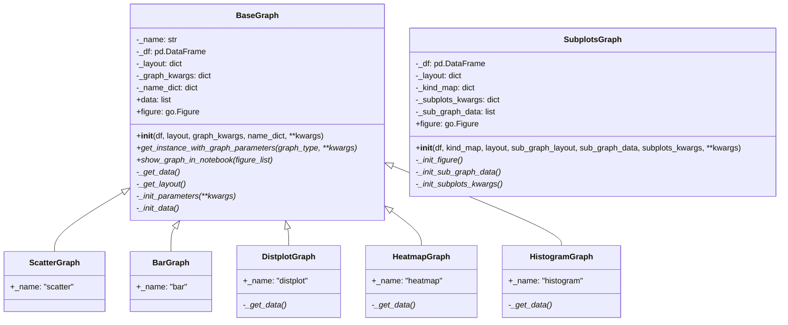

# graph.py

## 模块概述

`qlib.contrib.report.graph.py` 提供了一系列用于生成交互式图表的基类和具体图表类，基于 Plotly 库实现。该模块支持多种图表类型，包括散点图、柱状图、分布图、热力图、直方图和子图。

## 类定义

### BaseGraph

**说明**: 所有图表类的基类，提供了创建 Plotly 图表的基本功能。

#### 构造方法

```python
def __init__(
    self,
    df: pd.DataFrame = None,
    layout: dict = None,
    graph_kwargs: dict = None,
    name_dict: dict = None,
    **kwargs
):
```

**参数说明**:

| 参数 | 类型 | 默认值 | 说明 |
|------|------|--------|------|
| df | pd.DataFrame | None | 用于绘制图表的数据 |
| layout | dict | None | go.Layout 的参数，用于配置图表布局 |
| graph_kwargs | dict | None | 图表参数，如 go.Bar(**graph_kwargs) |
| name_dict | dict | None | 列名映射字典，用于显示列的名称 |
| **kwargs | - | - | 其他参数 |

#### 重要方法

##### get_instance_with_graph_parameters

```python
@staticmethod
def get_instance_with_graph_parameters(graph_type: str = None, **kwargs)
```

**说明**: 根据图表类型获取对应的图表类实例。

**参数**:
- `graph_type` (str): 图表类型名称，如 "Scatter", "Bar", "Heatmap" 等
- `**kwargs`: 传递给图表类的参数

**返回**: 图表类实例

##### show_graph_in_notebook

```python
@staticmethod
def show_graph_in_notebook(figure_list: Iterable[go.Figure] = None)
```

**说明**: 在 Jupyter Notebook 中显示图表列表。

**参数**:
- `figure_list` (Iterable[go.Figure]): 要显示的图表列表

**特性**:
- 自动检测运行环境（Jupyter Notebook 或 Google Colab）
- 在 Colab 中使用 "colab" 渲染器

##### figure

```python
@property
def figure(self) -> go.Figure
```

**说明**: 获取生成的 Plotly Figure 对象。

**返回**: plotly.graph_objs.Figure 对象

---

### ScatterGraph

**说明**: 散点图类，继承自 `BaseGraph`。

**内部名称**: "scatter"

**使用示例**:

```python
import pandas as pd
from qlib.contrib.report.graph import ScatterGraph

# 准备数据
df = pd.DataFrame({
    'A': [1, 2, 3, 4, 5],
    'B': [2, 4, 6, 8, 10]
}, index=pd.date_range('2020-01-01', periods=5))

# 创建散点图
scatter = ScatterGraph(
    df=df,
    layout={'title': '散点图示例'},
    graph_kwargs={'mode': 'lines+markers'}
)

# 显示图表
figure = scatter.figure
figure.show()
```

---

### BarGraph

**说明**: 柱状图类，继承自 `BaseGraph`。

**内部名称**: "bar"

**使用示例**:

```python
import pandas as pd
from qlib.contrib.report.graph import BarGraph

# 准备数据
df = pd.DataFrame({
    'Return': [0.05, 0.03, -0.02, 0.01, 0.04],
    'Benchmark': [0.03, 0.02, -0.01, 0.00, 0.02]
}, index=['Mon', 'Tue', 'Wed', 'Thu', 'Fri'])

# 创建柱状图
bar = BarGraph(
    df=df,
    layout={'title': '收益率柱状图'}
)

# 显示图表
figure = bar.figure
figure.show()
```

---

### DistplotGraph

**说明**: 分布图类，继承自 `BaseGraph`，用于显示数据分布。

**内部名称**: "distplot"

**特性**:
- 自动删除缺失值
- 使用 Plotly 的 create_distplot 函数

**使用示例**:

```python
import pandas as pd
import numpy as np
from qlib.contrib.report.graph import DistplotGraph

# 准备数据
np.random.seed(42)
df = pd.DataFrame({
    'Normal': np.random.normal(0, 1, 100),
    'Uniform': np.random.uniform(-1, 1, 100)
})

# 创建分布图
distplot = DistplotGraph(
    df=df,
    layout={'title': '数据分布'},
    graph_kwargs={'show_rug': False}
)

# 显示图表
figure = distplot.figure
figure.show()
```

---

### HeatmapGraph

**说明**: 热力图类，继承自 `BaseGraph`。

**内部名称**: "heatmap"

**数据格式**: 需要 DataFrame 形式的数据，索引作为 y 轴，列作为 x 轴

**使用示例**:

```python
import pandas as pd
from qlib.contrib.report.graph import HeatmapGraph

# 准备数据
df = pd.DataFrame({
    'Jan': [0.1, 0.2, 0.3],
    'Feb': [0.2, 0.3, 0.4],
    'Mar': [0.3, 0.4, 0.5]
}, index=['2018', '2019', '2020'])

# 创建热力图
heatmap = HeatmapGraph(
    df=df,
    layout={'title': '月度IC热力图'}
)

# 显示图表
figure = heatmap.figure
figure.show()
```

---

### HistogramGraph

**说明**: 直方图类，继承自 `BaseGraph`。

**内部名称**: "histogram"

**使用示例**:

```python
import pandas as pd
import numpy as np
from qlib.contrib.report.graph import HistogramGraph

# 准备数据
np.random.seed(42)
df = pd.DataFrame({
    'Returns': np.random.normal(0.001, 0.02, 500)
})

# 创建直方图
histogram = HistogramGraph(
    df=df,
    layout={'title': '收益率分布'}
)

# 显示图表
figure = histogram.figure
figure.show()
```

---

### SubplotsGraph

**说明**: 创建子图的类，类似于 `df.plot(subplots=True)` 的功能。

#### 构造方法

```python
def __init__(
    self,
    df: pd.DataFrame = None,
    kind_map: dict = None,
    layout: dict = None,
    sub_graph_layout: dict = None,
    sub_graph_data: list = None,
    subplots_kwargs: dict = None,
    **kwargs
):
```

**参数说明**:

| 参数 | 类型 | 默认值 | 说明 |
|------|------|--------|------|
| df | pd.DataFrame | None | 要绘制的数据 |
| kind_map | dict | None | 子图类型和参数映射，如 `dict(kind='ScatterGraph', kwargs=dict())` |
| layout | dict | None | 整体布局参数，go.Layout 的参数 |
| sub_graph_layout | dict | None | 每个子图的布局配置 |
| sub_graph_data | list | None | 每个子图的实例化参数列表 |
| subplots_kwargs | dict | None | plotly.tools.make_subplots 的原始参数 |

**subplots_kwargs 详细参数**:

| 参数 | 类型 | 默认值 | 说明 |
|------|------|--------|------|
| shared_xaxes | bool | False | 是否共享 x 轴 |
| shared_yaxes | bool | False | 是否共享 y 轴 |
| vertical_spacing | float | 自动 | 子图之间的垂直间距 |
| subplot_titles | list | 自动 | 子图标题列表 |
| specs | list | None | 子图规格配置 |
| rows | int | 自动 | 子图网格的行数 |
| cols | | 自动 | 子图网格的列数 |

**sub_graph_data 结构**:

```python
[
    (column_name, {
        'row': int,      # 子图所在行
        'col': int,      # 子图所在列
        'name': str,     # 显示名称
        'kind': str,     # 图表类型
        'graph_kwargs': dict  # 图表参数
    }),
    # ... 更多子图配置
]
```

#### 使用示例

```python
import pandas as pd
import numpy as np
from qlib.contrib.report.graph import SubplotsGraph

# 准备数据
np.random.seed(42)
dates = pd.date_range('2020-01-01', periods=100)
df = pd.DataFrame({
    'A': np.cumsum(np.random.randn(100) * 0.01),
    'B': np.cumsum(np.random.randn(100) * 0.015),
    'C': np.cumsum(np.random.randn(100) * 0.02)
}, index=dates)

# 创建子图
subplots = SubplotsGraph(
    df=df,
    layout={'title': '多指标子图'},
    kind_map={'kind': 'ScatterGraph', 'kwargs': {'mode': 'lines'}},
    subplots_kwargs={
        'rows': 3,
        'cols': 1,
        'shared_xaxes': True,
        'vertical_spacing': 0.05
    }
)

# 显示图表
figure = subplots.figure
figure.show()
```

**自定义子图配置示例**:

```python
import pandas as pd
from qlib.contrib.report.graph import SubplotsGraph

# 准备数据
df = pd.DataFrame({
    'value1': [1, 2, 3, 4, 5],
    'value2': [5, 4, 3, 2, 1]
}, index=['A', 'B', 'C', 'D', 'E'])

# 自定义子图配置
sub_graph_data = [
    ('value1', {'row': 1, 'col': 1, 'kind': 'BarGraph'}),
    ('value2', {'row': 1, 'col': 2, 'kind': 'ScatterGraph'})
]

# 创建子图
subplots = SubplotsGraph(
    df=df,
    sub_graph_data=sub_graph_data,
    subplots_kwargs={'rows': 1, 'cols': 2}
)

# 显示图表
figure = subplots.figure
figure.show()
```

## 类继承关系图



## 完整使用示例

```python
import pandas as pd
import numpy as np
from qlib.contrib.report.graph import (
    ScatterGraph, BarGraph, HeatmapGraph,
    SubplotsGraph, BaseGraph
)

# 示例 1: 创建简单的散点图
dates = pd.date_range('2020-01-01', periods=100)
df1 = pd.DataFrame({
    'StockA': np.cumsum(np.random.randn(100) * 0.01),
    'StockB': np.cumsum(np.random.randn(100) * 0.015)
}, index=dates)

scatter = ScatterGraph(
    df=df1,
    layout={'title': '股票价格走势'},
    graph_kwargs={'mode': 'lines+markers'}
)
scatter.figure.show()

# 示例 2: 创建热力图
monthly_data = {
    'Jan': [0.05, 0.03, 0.02],
    'Feb': [0.04, 0.02, 0.01],
    'Mar': [0.06, 0.04, 0.03]
}
df2 = pd.DataFrame(monthly_data, index=['2018', '2019', '2020'])

heatmap = HeatmapGraph(
    df=df2,
    layout={'title': '月度收益率'}
)
heatmap.figure.show()

# 示例 3: 在 Notebook 中显示多个图表
figures = [scatter.figure, heatmap.figure]
BaseGraph.show_graph_in_notebook(figures)

# 示例 4: 创建复杂子图
subplots = SubplotsGraph(
    df=df1,
    layout={'title': '多股票走势对比'},
    kind_map={'kind': 'ScatterGraph', 'kwargs': {'mode': 'lines'}},
    subplots_kwargs={
        'rows': 2,
        'cols': 1,
        'shared_xaxes': True,
        'vertical_spacing': 0.1
    }
)
subplots.figure.show()
```

## 注意事项

1. **数据要求**: 所有图表类要求 DataFrame 不为空，否则会抛出 `ValueError: df is empty.`
2. **日期格式**: 对于时间序列数据，建议使用 `pd.DatetimeIndex` 作为索引
3. **缺失值处理**: `DistplotGraph` 会自动删除缺失值，其他图表类可能需要预处理
4. **渲染方式**: 在 Notebook 中使用 `show_graph_in_notebook()` 可以获得更好的显示效果
5. **子图限制**: `SubplotsGraph` 中 `col_n` 必须大于 1
