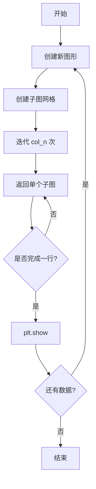

# utils.py

## 模块概述

`qlib.contrib.report.utils.py` 提供了用于报告生成的辅助工具函数，包括子图生成器和 Plotly 日期轴断点推断功能。

## 函数定义

### sub_fig_generator

**说明**: 生成子图生成器，每次迭代返回一行包含指定数量子图的对象。

#### 函数签名

```python
def sub_fig_generator(
    sub_figsize=(3, 3),
    col_n=10,
    row_n=1,
    wspace=None,
    hspace=None,
    sharex=False,
    sharey=False
):
```

#### 参数说明

| 参数 | 类型 | 默认值 | 说明 |
|------|------|--------|------|
| sub_figsize | tuple | (3, 3) | 每个子图的尺寸 (width, height) |
| col_n | int | 10 | 每行子图的数量，生成 col_n 个子图后会创建新图形 |
| row_n | int | 1 | 每列子图的数量 |
| wspace | float | None | 子图之间的宽度间距 |
| hspace | float | None | 子图之间的高度间距 |
| sharex | bool | False | 是否共享 x 轴 |
| sharey | bool | False | 是否共享 y 轴 |

#### 返回值

生成器对象，每次迭代返回 squeezed 后的轴对象。

#### 特性与限制

1. **已知限制**: 最后一行子图不会自动绘制，需要在函数外部手动绘制
2. **自动显示**: 每完成一行子图后自动调用 `plt.show()`
3. **尺寸计算**: 整体图形尺寸为 `(sub_figsize[0] * col_n, sub_figsize[1] * row_n)`

#### 使用示例

```python
import matplotlib.pyplot as plt
import numpy as np
from qlib.contrib.report.utils import sub_fig_generator

# 创建子图生成器
gen = sub_fig_generator(sub_figsize=(4, 3), col_n=3, row_n=2, wspace=0.3)

# 生成 6 个子图
for i in range(6):
    ax = next(gen)
    x = np.linspace(0, 10, 100)
    ax.plot(x, np.sin(x + i))
    ax.set_title(f'Subplot {i+1}')

# 手动绘制最后一行
plt.show()
```

#### 工作流程



---

### guess_plotly_rangebreaks

**说明**: 推断日期时间索引中需要移除的空白间隔，用于在 Plotly 图表中隐藏非交易日。

#### 函数签名

```python
def guess_plotly_rangebreaks(dt_index: pd.DatetimeIndex):
```

#### 参数说明

| 参数 | 类型 | 说明 |
|------|------|------|
| dt_index | pd.DatetimeIndex | 数据的日期时间索引 |

#### 返回值

返回 Plotly x 轴的 `rangebreaks` 参数字典列表。

每个 rangebreak 的格式:
```python
{
    'values': [日期列表],
    'dvalue': 间隔的毫秒数
}
```

#### 工作原理

1. **计算间隔**: 计算相邻日期之间的时间差
2. **识别最小间隔**: 找出最小的间隔（通常为交易日间隔）
3. **识别断点**: 找出大于最小间隔的空白区域
4. **生成配置**: 为每个空白区域生成 rangebreak 配置

#### 使用示例

```python
import pandas as pd
from qlib.contrib.report.utils import guess_plotly_rangebreaks

# 创建不连续的日期索引（包含周末和节假日）
dates = pd.to_datetime([
    '2020-01-02', '2020-01-03',  # 周四、周五
    '2020-01-06', '2020-01-07',  # 周一、周二
    '2020-01-08',                 # 周三
    '2020-01-13',                 # 下周一
])
dt_index = pd.DatetimeIndex(dates)

# 获取 rangebreaks
rangebreaks = guess_plotly_rangebreaks(dt_index)

print(rangebreaks)
# 输出类似:
# [{'values': [Timestamp('2020-01-06 00:00:00'), ...],
#   'dvalue': 345600000}]
```

#### 在图表中使用

```python
import pandas as pd
import plotly.graph_objs as go
from qlib.contrib.report.utils import guess_plotly_rangebreaks

# 准备数据
dates = pd.bdate_range('2020-01-01', '2020-12-31')  # 只包含工作日
values = pd.Series(range(len(dates)), index=dates)

# 创建图表
fig = go.Figure()
fig.add_trace(go.Scatter(
    x=values.index,
    y=values.values,
    mode='lines'
))

# 应用 rangebreaks 以隐藏周末
rangebreaks = guess_plotly_rangebreaks(pd.DatetimeIndex(values.index))
fig.update_layout(
    xaxis=dict(
        rangebreaks=rangebreaks,
        tickangle=45
    )
)

fig.show()
```

#### 效果说明

- **隐藏空白**: 非交易日（周末、节假日）在图表上不会显示为空白
- **保持比例**: 交易日之间的比例保持不变
- **自动检测**: 自动识别并隐藏各种类型的空白间隔

#### 限制

1. **仅适用于日期索引**: 只支持 `pd.DatetimeIndex` 类型
2. **单调性要求**: 日期索引应该是单调递增的（函数内部会排序）
3. **毫秒精度**: 间隔转换为毫秒计算

---

## 完整使用示例

### 示例 1: 批量绘制多个特征

```python
import pandas as pd
import numpy as np
import matplotlib.pyplot as plt
from qlib.contrib.report.utils import sub_fig_generator

# 创建模拟数据
np.random.seed(42)
dates = pd.date_range('2020-01-01', periods=100)
data = {
    f'feature_{i}': np.cumsum(np.random.randn(100) * 0.1)
    for i in range(12)
}
df = pd.DataFrame(data, index=dates)

# 创建子图生成器：每行 3 个子图
gen = sub_fig_generator(sub_figsize=(5, 3), col_n=3, wspace=0.3, hspace=0.4)

# 绘制所有特征
for i, col in enumerate(df.columns):
    ax = next(gen)
    df[col].plot(ax=ax, title=col)
    ax.grid(True, alpha=0.3)

# 注意：最后一行需要手动显示
plt.show()
```

### 示例 2: 创建金融图表并隐藏非交易日

```python
import pandas as pd
import plotly.graph_objs as go
from qlib.contrib.report.utils import guess_plotly_rangebreaks

# 模拟股票数据（只包含交易日）
dates = pd.bdate_range('2020-01-01', '2020-06-30')
prices = 100 + np.cumsum(np.random.randn(len(dates)) * 1.5)

df = pd.DataFrame({'Close': prices}, index=dates)

# 创建图表
fig = go.Figure()

# 添加价格线
fig.add_trace(go.Scatter(
    x=df.index,
    y=df['Close'],
    mode='lines',
    name='Price'
))

# 添加移动平均线
df['MA20'] = df['Close'].rolling(20).mean()
fig.add_trace(go.Scatter(
    x=df.index,
    y=df['MA20'],
    mode='lines',
    name='MA20'
))

# 配置布局
fig.update_layout(
    title='股票价格走势',
    xaxis=dict(
        rangebreaks=guess_plotly_rangebreaks(pd.DatetimeIndex(df.index)),
        tickangle=45,
        title='Date'
    ),
    yaxis=dict(title='Price'),
    hovermode='x unified',
    legend=dict(orientation='h', yanchor= 'bottom', y=1.02)
)

fig.show()
```

### 示例 3: 综合使用两个工具函数

```python
import pandas as pd
import numpy as np
import matplotlib.pyplot as plt
import plotly.graph_objs as go
from qlib.contrib.report.utils import sub_fig_generator, guess_plotly_rangebreaks

# 创建多个股票的数据
dates = pd.bdate_range('2020-01-01', '2020-12-31')
stocks = ['AAPL', 'MSFT', 'GOOG', 'AMZN', 'TSLA']

data = {}
for stock in stocks:
    data[stock] = 100 + np.cumsum(np.random.randn(len(dates)) * 2)

df = pd.DataFrame(data, index=dates)

# 使用 matplotlib 绘制子图
print("使用 Matplotlib 绘制子图:")
gen = sub_fig_generator(sub_figsize=(4, 3), col_n=3, wspace=0.3)
for i, col in enumerate(df.columns):
    ax = next(gen)
    df[col].plot(ax=ax, title=col)
    ax.grid(True, alpha=0.3)
plt.show()

# 使用 plotly 绘制交互式图表
print("\n使用 Plotly 绘制交互式图表:")
fig = go.Figure()

for stock in stocks:
    fig.add_trace(go.Scatter(
        x=df.index,
        y=df[stock],
        mode='lines',
        name=stock
    ))

fig.update_layout(
    title='多股票价格对比',
    xaxis=dict(
        rangebreaks=guess_plotly_rangebreaks(pd.DatetimeIndex(df.index)),
        tickangle=45
    ),
    yaxis=dict(title='Price'),
    hovermode='x unified'
)

fig.show()
```

## 最佳实践

1. **sub_fig_generator 使用**
   - 确保 `col_n > 1`，否则会抛出断言错误
   - 最后一行子图需要手动调用 `plt.show()`
   - 对于大量子图，适当调整 `wspace` 和 `hspace` 以避免拥挤

2. **guess_plotly_rangebreaks 使用**
   - 在处理金融时间序列时强烈推荐使用
   - 可以与 Plotly 的各种图表类型配合使用
   - 对于分钟级、小时级数据同样适用

3. **性能考虑**
   - `sub_fig_generator` 适合中等数量的子图（几十到几百个）
   - `guess_plotly_rangebreaks` 对于大数据集（数年数据）也能高效处理

## 常见问题

### Q: 为什么最后一行子图没有显示？

A: 这是 `sub_fig_generator` 的已知限制。每次完成一行（col_n 个子图）后会自动调用 `plt.show()`，但最后一行需要手动调用。解决方法：

```python
# 获取所有子图
axes = [next(gen) for _ in range(total_plots)]

# 手动显示最后一个图形
plt.show()
```

### Q: rangebreaks 可以处理分钟级数据吗？

A: 可以。`guess_plotly_rangebreaks` 会自动计算最小间隔并识别更大的断点，适用于任何频率的时间序列。

### Q: 如何在子图之间共享坐标轴？

A: 使用 `sharex` 和 `sharey` 参数：

```python
gen = sub_fig_generator(
    sub_figsize=(5, 3),
    col_n=3,
    sharex=True,  # 共享 x 轴
    sharey=False   # 不共享 y 轴
)
```
