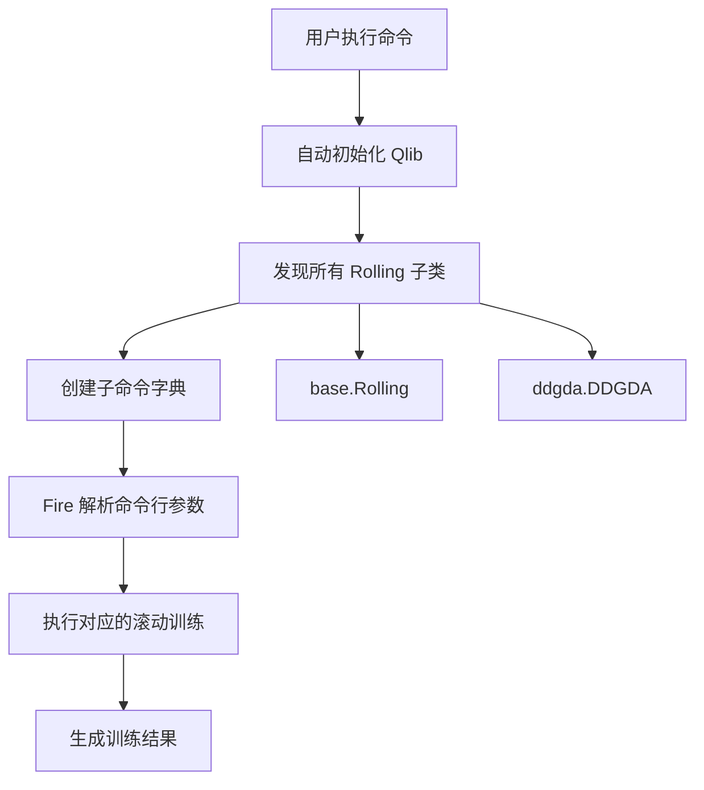

# qlib.contrib.rolling.__main__

## 模块概述

`qlib.contrib.rolling.__main__` 模块是滚动训练的命令行入口点。它使用 Python Fire 库提供子命令接口，允许用户通过命令行运行不同的滚动训练方法。

## 功能说明

该模块会自动发现 `qlib.contrib.rolling` 包中所有继承自 `Rolling` 基类的实现，并将其注册为子命令。

## 支持的子命令

| 子命令 | 实现类 | 说明 |
|--------|--------|------|
| `base` | `qlib.contrib.rolling.base.Rolling` | 基础滚动训练 |
| `ddgda` | `qlib.contrib.rolling.ddgda.DDGDA` | 基于 DDG-DA 的滚动训练 |

## 使用方式

### 基础滚动训练

```bash
python -m qlib.contrib.rolling base \
    --conf_path <配置文件路径> \
    --exp_name <实验名称> \
    --horizon 20 \
    --step 20 \
    run
```

### DDG-DA 滚动训练

```bash
python -m qlib.contrib.rolling ddgda \
    --conf_path <配置文件路径> \
    --exp_name <实验名称> \
    --horizon 20 \
    --step 20 \
    --sim_task_model gbdt \
    run
```

## 完整命令示例

```bash
# 基础滚动训练
python -m qlib.contrib.rolling base \
    --conf_path examples/benchmarks/LightGBM/workflow_config_lightgbm_Alpha158.yaml \
    --exp_name rolling_exp \
    --horizon 20 \
    --step 20 \
    --train_start 2010-01-01 \
    --test_end 2020-12-31 \
    run

# DDG-DA 滚动训练
python -m qlib.contrib.rolling ddgda \
    --conf_path examples/benchmarks/LightGBM/workflow_config_lightgbm_Alpha158.yaml \
    --exp_name ddgda_rolling_exp \
    --horizon 20 \
    --step 20 \
    --sim_task_model gbdt \
    --meta_1st_train_end 2010-12-31 \
    --segments 0.62 \
    run
```

## 工作流程



可以通过 `python -m qlib.contrib.rolling --help` 查看所有可用的子命令。

## 执行流程

1. **初始化 Qlib**：调用 `auto_init()` 初始化 Qlib 环境
2. **发现子类**：使用 `find_all_classes` 找到所有 `Rolling` 子类
3. **创建命令**：将子类注册为 Fire 子命令
4. **执行训练**：根据用户输入执行相应的滚动训练

## 代码结构

```python
# 创建子命令字典
sub_commands = {
    'base': <class 'qlib.contrib.rolling.base.Rolling'>,
    'ddgda': <class 'qlib.contrib.rolling.ddgda.DDGDA'>,
    ...
}

# 使用 Fire 解析命令
fire.Fire(sub_commands)
```

## 注意事项

1. **自动初始化**：该模块会自动调用 `auto_init()`，无需手动初始化 Qlib
2. **实验清理**：运行前建议清理 `mlruns` 目录
3. **配置路径**：`--conf_path` 参数需要提供相对于工作目录或绝对路径
4. **参数传递**：所有类的构造参数都可以通过命令行传递

## 相关模块

- `qlib.contrib.rolling.base` - 基础滚动训练实现
- `qlib.contrib.rolling.ddgda` - DDG-DA 滚动训练实现
- `qlib.utils.mod.find_all_classes` - 子类发现工具
