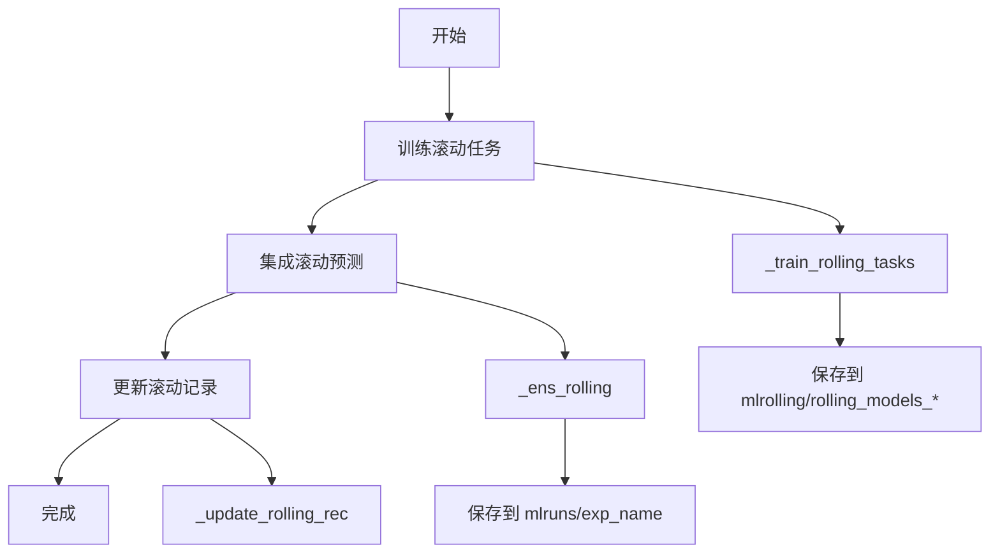

# qlib.contrib.rolling.base

## 模块概述

`qlib.contrib.rolling.base` 模块提供了基础的滚动训练实现。`Rolling` 类是滚动训练的核心类，负责将单个任务拆分为多个时间序列任务，并执行滚动训练和评估。

---

## Rolling 类

### 类概述

`Rolling` 类实现了基础的滚动训练功能，专注于离线将特定任务转换为滚动训练模式。

### 设计动机

- 仅关注离线将特定任务转换为滚动训练模式
- 为简化实现，忽略任务依赖关系（例如时间序列依赖）

### 与其他模块的区别

| 模块 | 说明 |
|------|------|
| **MetaController** | 学习如何处理任务（学习如何学习） |
| **OnlineStrategy** | 专注于在线模型服务，模型可随时间更新 |
| **Rolling** | 仅用于离线测试滚动模型，更简单 |

### 使用示例

```bash
python -m qlib.contrib.rolling.base --conf_path <配置文件路径> run
```

### 注意事项

运行前请清理之前的结果：
```bash
rm -r mlruns
```

---

## 构造方法

### `__init__`

```python
def __init__(
    self,
    conf_path: Union[str, Path],
    exp_name: Optional[str] = None,
    horizon: Optional[int] = 20,
    step: int = 20,
    h_path: Optional[str] = None,
    train_start: Optional[str] = None,
    test_end: Optional[str] = None,
    task_ext_conf: Optional[dict] = None,
    rolling_exp: Optional[str] = None,
) -> None
```

#### 参数说明

| 参数 | 类型 | 必填 | 默认值 | 说明 |
|------|------|------|--------|------|
| conf_path | str/Path | 是 | - | 滚动训练配置文件路径 |
| exp_name | str | 否 | None | 输出实验名称（包含滚动记录的合并预测） |
| horizon | int | 否 | 20 | 预测目标的时域，用于覆盖文件中的预测时域 |
| step | int | 否 | 20 | 滚动步长 |
| h_path | str | 否 | None | 数据处理器文件路径（会覆盖配置中的 handler） |
| train_start | str | 否 | None | 训练开始时间，通常与 handler 一起使用 |
| test_end | str | 否 | None | 测试结束时间，通常与 handler 一起使用 |
| task_ext_conf | dict | 否 | None | 更新任务配置的选项 |
| rolling_exp | str | 否 | None | 滚动实验名称（包含多个滚动周期的记录） |

#### 参数详解

- **conf_path**：YAML 格式的配置文件路径
- **exp_name**：最终合并结果的实验名称
- **horizon**：预测时域，当前版本必须显式指定
- **h_path**：
  - 如果提供，使用指定的 handler 文件
  - 如果未提供，`enable_handler_cache=True` 时会创建自定义缓存
- **train_start/test_end**：用于覆盖数据的时间范围
- **rolling_exp**：
  - 包含多个滚动周期的实验名称
  - 每个记录对应一个特定的滚动周期
  - 与最终实验不同

#### 示例

```python
from qlib.contrib.rolling.base import Rolling

rolling = Rolling(
    conf_path="workflow_config.yaml",
    exp_name="rolling_results",
    horizon=20,
    step=20,
    train_start="2010-01-01",
    test_end="2020-12-31"
)
```

---

## 主要方法

### basic_task

```python
def basic_task(self, enable_handler_cache: Optional[bool] = True) -> dict
```

#### 功能说明

返回基础任务配置。该配置可能与 `conf_path` 中的配置不完全相同，因为某些参数会被 `__init__` 中的参数覆盖。

#### 参数说明

| 参数 | 类型 | 必填 | 默认值 | 说明 |
|------|------|------|--------|------|
| enable_handler_cache | bool | 否 | True | 是否启用 handler 缓存 |

#### 返回值

返回基础任务配置字典。

#### 处理逻辑

1. 加载原始配置文件
2. 覆盖数据集时域（horizon）
3. 替换 handler 为缓存（如果需要）
4. 更新训练/测试时间范围
5. 应用额外的任务配置

#### 示例

```python
# 获取基础任务配置
task = rolling.basic_task(enable_handler_cache=True)
print(task)
```

---

### run_basic_task

```python
def run_basic_task(self)
```

#### 功能说明

运行基础任务（不进行滚动训练）。用于快速测试和模型调优。

#### 使用场景

- 快速测试任务配置
- 模型超参数调优
- 验证数据处理流程

#### 示例

```python
# 运行基础任务（不滚动）
rolling.run_basic_task()
```

---

### get_task_list

```python
def get_task_list(self) -> List[dict]
```

#### 功能说明

返回滚动训练的任务列表。

#### 返回值

返回滚动训练的任务字典列表。

#### 处理逻辑

1. 获取基础任务配置
2. 使用 `task_generator` 生成滚动任务
3. 截断最后几天以避免信息泄露
4. 将记录设置为 `SignalRecord`（分析推迟到最终集成）

#### 关键参数

- **step**：滚动步长
- **trunc_days**：截断天数（horizon + 1）

#### 示例

```python
# 获取滚动任务列表
task_list = rolling.get_task_list()
print(f"Generated {len(task_list)} rolling tasks")
```

---

### run

```python
def run(self)
```

#### 功能说明

执行完整的滚动训练流程。

#### 执行流程



#### 输出结构

1. **滚动模型实验** (`rolling_models_*`)：
   - 每个滚动周期对应一个记录
   - 包含训练好的模型和预测

2. **合并结果实验** (`exp_name`)：
   - 包含合并的预测和标签
   - 包含评估指标

#### 示例

```python
# 执行完整滚动训练
rolling.run()

# 结果保存在 mlruns 目录
# - mlruns/rolling_models_YYYYMMDDHHMMSS/  # 滚动模型
# - mlruns/exp_name/                       # 合并结果
```

---

## 内部方法

### _raw_conf

```python
def _raw_conf(self) -> dict
```

#### 功能说明

加载配置文件并返回原始配置。

#### 返回值

返回配置文件内容的字典。

---

### _replace_handler_with_cache

```python
def _replace_handler_with_cache(self, task: dict) -> dict
```

#### 功能说明

将任务中的 handler 替换为缓存或外部文件。

#### 参数说明

| 参数 | 类型 | 必填 | 说明 |
|------|------|------|------|
| task | dict | 是 | 任务配置字典 |

#### 返回值

返回更新后的任务配置。

#### 处理逻辑

- 如果 `h_path` 不为空，使用指定的 handler 文件
- 否则，创建自定义缓存

---

### _update_start_end_time

```python
def _update_start_end_time(self, task: dict) -> dict
```

#### 功能说明

更新任务的训练开始时间和测试结束时间。

#### 参数说明

| 参数 | 类型 | 必填 | 说明 |
|------|------|------|------|
| task | dict | 是 | 任务配置字典 |

#### 返回值

返回更新后的任务配置。

---

### _train_rolling_tasks

```python
def _train_rolling_tasks(self)
```

#### 功能说明

训练所有滚动任务。

#### 处理逻辑

1. 获取滚动任务列表
2. 删除之前的滚动实验
3. 使用 `TrainerR` 训练所有任务

---

### _ens_rolling

```python
def _ens_rolling(self)
```

#### 功能说明

集成所有滚动预测。

#### 处理逻辑

1. 使用 `RecorderCollector` 收集所有滚动记录
2. 使用 `RollingEnsemble` 合并预测和标签
3. 保存合并结果到最终实验

---

### _update_rolling_rec

```python
def _update_rolling_rec(self)
```

#### 功能说明

评估合并的滚动结果。

#### 处理逻辑

1. 获取合并记录
2. 运行原始配置中的分析器
3. 生成评估报告

---

## 完整使用示例

### 示例 1：基础滚动训练

```python
import qlib
from qlib.contrib.rolling.base import Rolling

# 初始化 Qlib
qlib.init(
    provider_uri="~/.qlib/qlib_data/cn_data",
    region="cn"
)

# 创建滚动训练实例
rolling = Rolling(
    conf_path="workflow_config.yaml",
    exp_name="rolling_baseline",
    horizon=20,
    step=20,
    train_start="2010-01-01",
    test_end="2020-12-31"
)

# 运行滚动训练
rolling.run()

print("Rolling training completed!")
```

### 示例 2：使用预处理器数据

```python
from qlib.contrib.rolling.base import Rolling

rolling = Rolling(
    conf_path="workflow_config.yaml",
    exp_name="rolling_with_handler",
    horizon=20,
    step=20,
    h_path="path/to/handler.pkl",  # 使用预处理器数据
    train_start="2010-01-01",
    test_end="2020-12-31"
)

rolling.run()
```

### 示例 3：快速测试基础任务

```python
from qlib.contrib.rolling.base import Rolling

rolling = Rolling(
    conf_path="workflow_config.yaml",
    exp_name="test_run",
    horizon=20,
    step=20
)

# 运行基础任务（不滚动）
rolling.run_basic_task()
```

### 示例 4：自定义任务配置

```python
from qlib.contrib.rolling.base import Rolling

# 自定义任务扩展配置
task_ext_conf = {
    "model": {
        "kwargs": {
            "learning_rate": 0.05,
            "max_depth": 6
        }
    }
}

rolling = Rolling(
    conf_path="workflow_config.yaml",
    exp_name="rolling_custom",
    horizon=20,
    step=20,
    task_ext_conf=task_ext_conf
)

rolling.run()
```

---

## 命令行使用

```bash
# 基础滚动训练
python -m qlib.contrib.rolling base \
    --conf_path workflow_config.yaml \
    --exp_name rolling_exp \
    --horizon 20 \
    --step 20 \
    --train_start 2010-01-01 \
    --test_end 2020-12-31 \
    run

# 查看帮助
python -m qlib.contrib.rolling base --help
```

---

## 注意事项

1. **时域设置**：当前版本必须显式指定 `horizon`，不支持自动从底层数据集提取
2. **实验清理**：运行前清理 `mlruns` 目录以避免实验名称冲突
3. **配置覆盖**：`qlib_init` 部分会被忽略，需要在代码中单独初始化 Qlib
4. **信息泄露**：确保 `trunc_days` 设置正确以避免信息泄露
5. **Handler 缓存**：如果 `h_path` 已提供，无法覆盖 horizon

---

## 相关模块

- `qlib.workflow.task.gen.RollingGen` - 滚动任务生成器
- `qlib.model.ens.ensemble.RollingEnsemble` - 滚动集成器
- `qlib.workflow.task.collect.RecorderCollector` - 记录收集器
- `qlib.model.trainer.TrainerR` - 训练器
