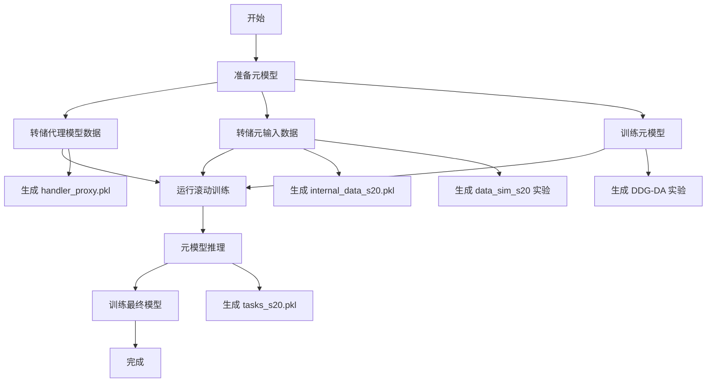
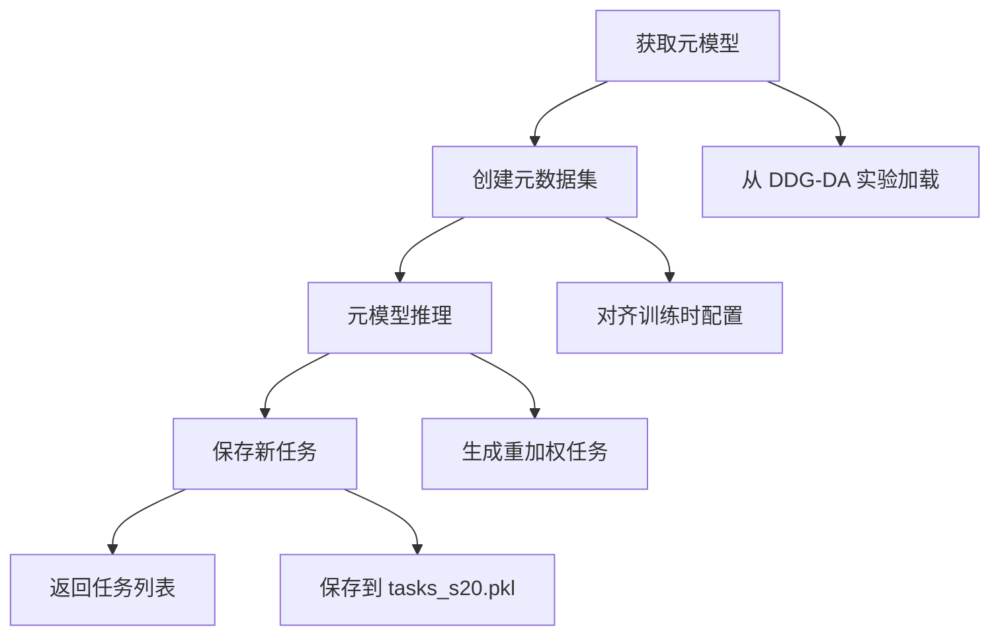
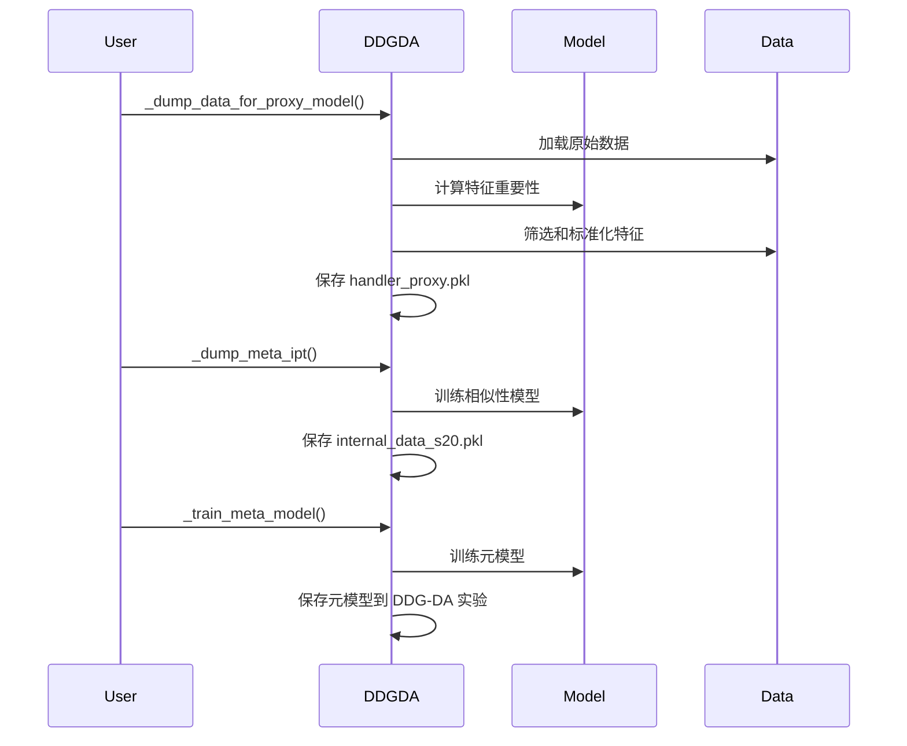
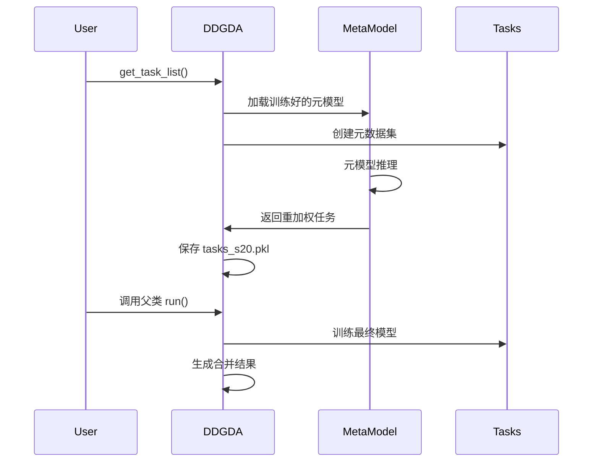

# qlib.contrib.rolling.ddgda

## 模块概述

`qlib.contrib.rolling.ddgda` 模块提供了基于 DDG-DA（Distribution Distance Guided Data Adaptation）的滚动训练实现。`DDGDA` 类继承自 `Rolling`，利用元学习（meta-learning）来适应数据分布的变化，提高滚动训练的预测性能。

---

## DDGDA 类

### 类概述

`DDGDA` 类实现了基于 DDG-DA 的滚动训练，通过元模型学习数据分布的变化规律，动态调整训练任务。

### 核心思想

1. **特征重要性分析**：使用 GBDT 模型分析特征重要性
2. **相似性计算**：使用简化模型计算数据相似性
3. **元模型训练**：训练元模型学习分布变化规律
4. **知识迁移**：将元模型知识迁移到最终预测模型

### 设计架构

```mermaid
graph TB
    A[原始任务] --> B[特征重要性分析]
    B --> C[简化模型训练]
    C --> D[元模型训练]
    D --> E[元模型推理]
    E --> F[滚动任务生成]
    F --> G[最终训练]

    B --> B1[GBDT 模型]
    C -->. C1[Linear/GBDT]
    D --> D1[MetaModelDS]
    E --> E1[权重调整]
    F --> F1[任务重加权]
```

### 注意事项

运行前请清理之前的结果：
```bash
rm -r mlruns
```

---

## 构造方法

### `__init__`

```python
def __init__(
    self,
    sim_task_model: UTIL_MODEL_TYPE = "gbdt",
    meta_1st_train_end: Optional[str] = None,
    alpha: float = 0.01,
    loss_skip_thresh: int = 50,
    fea_imp_n: Optional[int] = 30,
    meta_data_proc: Optional[str] = "V01",
    segments: Union[float, str] = 0.62,
    hist_step_n: int = 30,
    working_dir: Optional[Union[str, Path]] = None,
    **kwargs,
)
```

#### 参数说明

| 参数 | 类型 | 必填 | 默认值 | 说明 |
|------|------|------|--------|------|
| sim_task_model | str | 否 | "gbdt" | 计算数据相似性的模型类型（"linear" 或 "gbdt"） |
| meta_1st_train_end | str | 否 | None | 第一个元任务的训练结束时间 |
| alpha | float | 否 | 0.01 | L2 正则化参数（传递给 MetaModelDS） |
| loss_skip_thresh | int | 否 | 50 | 跳过损失计算的阈值 |
| fea_imp_n | int | 否 | 30 | 保留的特征重要性数量 |
| meta_data_proc | str | 否 | "V01" | 元数据集处理方式 |
| segments | float/str | 否 | 0.62 | 元任务训练集比例或边界日期 |
| hist_step_n | int | 否 | 30 | 历史步数 |
| working_dir | str/Path | 否 | None | 工作目录（默认为配置文件所在目录） |
| **kwargs | - | 否 | - | 传递给父类 Rolling 的参数 |

#### 参数详解

- **sim_task_model**：
  - `"gbdt"`：使用 GBDT 模型计算相似性
  - `"linear"`：使用线性模型计算相似性

- **segments**：
  - 如果是 `float`：元任务训练集的比例
  - 如果是 `str`：确保该日期在测试集中

- **meta_data_proc**：
  - `"V01"`：对特征进行标准化处理

#### 示例

```python
from qlib.contrib.rolling.ddgda import DDGDA

ddgda = DDGDA(
    conf_path="workflow_config.yaml",
    exp_name="ddgda_rolling",
    horizon=20,
    step=20,
    sim_task_model="gbdt",
    fea_imp_n=30,
    alpha=0.01,
    meta_1st_train_end="2010-12-31",
    segments=0.62
)
```

---

## 主要方法

### run

```python
def run(self)
```

#### 功能说明

执行完整的 DDG-DA 滚动训练流程。

#### 执行流程



#### 生成文件

1. **handler_proxy.pkl**：代理预测模型的数据处理器
2. **internal_data_s20.pkl**：元模型输入数据
3. **tasks_s20.pkl**：元模型推理后的任务列表

#### MLflow 实验

1. **feature_importance**：特征重要性分析实验
2. **data_sim_s20**：数据相似性计算实验
3. **DDG-DA**：元模型实验

#### 示例

```python
# 执行 DDG-DA 滚动训练
ddgda.run()

# 结果保存在：
# - mlruns/feature_importance/
# - mlruns/data_sim_s20/
# - mlruns/DDG-DA/
# - mlruns/exp_name/
```

---

### get_task_list

```python
def get_task_list(self)
```

#### 功能说明

利用元模型进行推理，生成带权重的滚动任务列表。

#### 执行流程



#### 返回值

返回包含权重调整的任务列表。

#### 示例

```python
# 获取元模型推理后的任务列表
task_list = ddgda.get_task_list()
print(f"Generated {len(task_list)} tasks with meta-weighting")
```

---

## 内部方法

### _adjust_task

```python
def _adjust_task(self, task: dict, astype: UTIL_MODEL_TYPE) -> dict
```

#### 功能说明

根据模型类型调整任务配置。

#### 参数说明

| 参数 | 类型 | 必填 | 说明 |
|------|------|------|------|
| task | dict | 是 | 原始任务配置 |
| astype | str | 是 | 模型类型（"gbdt" 或 "linear"） |

#### 返回值

返回调整后的任务配置。

#### 处理逻辑

- **"gbdt"**：使用 LGBM 模型，移除预处理步骤
- **"linear"**：使用线性模型，添加标准化处理

---

### _get_feature_importance

```python
def _get_feature_importance(self)
```

#### 功能说明

使用 GBDT 模型计算特征重要性。

#### 执行流程

1. 调整任务为 GBDT 模型
2. 训练 GBDT 模型
3. 提取特征重要性
4. 映射到实际特征名称

#### 返回值

返回特征重要性序列。

---

### _dump_data_for_proxy_model

```python
def _dump_data_for_proxy_model(self)
```

#### 功能说明

转储代理预测模型的数据。

#### 执行流程

1. 准备特征和标签数据
2. 根据特征重要性筛选特征
3. 对特征进行标准化处理
4. 保存为 pickle 文件

#### 生成文件

- `fea_label_df.pkl`：特征和标签数据
- `handler_proxy.pkl`：代理处理器

---

### _dump_meta_ipt

```python
def _dump_meta_ipt(self)
```

#### 功能说明

转储元模型的输入数据。

#### 执行流程

1. 训练相似性计算模型
2. 生成内部数据
3. 保存为 pickle 文件

#### 生成文件

- `internal_data_s20.pkl`：元模型输入数据

#### MLflow 实验

- `data_sim_s20`：相似性计算模型实验

---

### _train_meta_model

```python
def _train_meta_model(self, fill_method="max")
```

#### 功能说明

训练元模型。

#### 参数说明

| 参数 | 类型 | 必填 | 默认值 | 说明 |
|------|------|------|--------|------|
| fill_method | str | 否 | "max" | 填充方法 |

#### 执行流程

1. 创建代理预测模型任务
2. 准备元数据集
3. 训练元模型
4. 保存元模型

#### MLflow 实验

- `DDG-DA`：元模型实验

---

## 完整使用示例

### 示例 1：基础 DDG-DA 训练

```python
import qlib
from qlib.contrib.rolling.ddgda import DDGDA

# 初始化 Qlib
qlib.init(
    provider_uri="~/.qlib/qlib_data/cn_data",
    region="cn"
)

# 创建 DDG-DA 实例
ddgda = DDGDA(
    conf_path="workflow_config.yaml",
    exp_name="ddgda_baseline",
    horizon=20,
    step=20,
    train_start="2010-01-01",
    test_end="2020-12-31"
)

# 运行 DDG-DA 滚动训练
ddgda.run()

print("DDG-DA rolling training completed!")
```

### 示例 2：自定义 DDG-DA 参数

```python
from qlib.contrib.rolling.ddgda import DDGDA

ddgda = DDGDA(
    conf_path="workflow_config.yaml",
    exp_name="ddgda_custom",
    horizon=20,
    step=20,
    # DDG-DA 特定参数
    sim_task_model="gbdt",      # 使用 GBDT 计算相似性
    fea_imp_n=50,                # 保留 50 个重要特征
    alpha=0.05,                  # L2 正则化
    meta_1st_train_end="2010-12-31",  # 元模型训练结束时间
    segments=0.62,               # 训练集比例
    hist_step_n=30,             # 历史步数
    meta_data_proc="V01"         # 数据处理方式
)

ddgda.run()
```

### 示例 3：使用线性模型计算相似性

```python
from qlib.contrib.rolling.ddgda import DDGDA

ddgda = DDGDA(
    conf_path="workflow_config.yaml",
    exp_name="ddgda_linear",
    horizon=20,
    step=20,
    sim_task_model="linear",     # 使用线性模型
    fea_imp_n=None,              # 使用所有特征
    alpha=0.01
)

ddgda.run()
```

### 示例 4：指定工作目录

```python
from pathlib import Path
from qlib.contrib.rolling.ddgda import DDGDA

ddgda = DDGDA(
    conf_path="workflow_config.yaml",
    exp_name="ddgda_custom_dir",
    horizon=20,
    step=20,
    working_dir=Path("./ddgda_output")  # 自定义工作目录
)

ddgda.run()
```

---

## 命令行使用

```bash
# 基础 DDG-DA 训练
python -m qlib.contrib.rolling ddgda \
    --conf_path workflow_config.yaml \
    --exp_name ddgda_exp \
    --horizon 20 \
    --step 20 \
    --sim_task_model gbdt \
    --fea_imp_n 30 \
    --alpha 0.01 \
    run

# 使用线性模型
python -m qlib.contrib.rolling ddgda \
    --conf_path workflow_config.yaml \
    --exp_name ddgda_linear_exp \
    --horizon 20 \
    --step 20 \
    --sim_task_model linear \
    run

# 查看帮助
python -m qlib.contrib.rolling ddgda --help
```

---

## DDG-DA 工作流程详解

### 阶段 1：准备元模型



### 阶段 2：运行滚动训练



---

## 预定义配置

### LGBM 模型配置

```yaml
class: LGBModel
module_path: qlib.contrib.model.gbdt
kwargs:
    loss: mse
    colsample_bytree: 0.8879
    learning_rate: 0.2
    subsample: 0.8789
    lambda_l1: 205.6999
    lambda_l2: 580.9768
    max_depth: 8
    num_leaves: 210
    num_threads: 20
```

### 线性模型配置

```yaml
class: LinearModel
module_path: qlib.contrib.model.linear
kwargs:
    estimator: ridge
    alpha: 0.05
```

### 处理器配置

```yaml
infer_processors:
    - class: RobustZScoreNorm
      kwargs:
          fields_group: feature
          clip_outlier: true
    - class: Fillna
      kwargs:
          fields_group: feature
learn_processors:
    - class: DropnaLabel
    - class: CSRankNorm
      kwargs:
          fields_group: label
```

---

## 注意事项

1. **时域匹配**：horizon 必须与基础任务模板中的含义匹配
2. **实验清理**：运行前清理 `mlruns` 目录
3. **模型选择**：`sim_task_model` 的选择对结果质量很重要
4. **特征数量**：`fea_imp_n` 设置合理的特征数量可以改善结果
5. **工作目录**：确保工作目录有足够的写入权限
6. **数据泄露**：确保元模型训练时间不会泄露最终滚动任务的数据

---

## 性能优化建议

1. **特征选择**：使用 `fea_imp_n` 选择最重要的特征，减少计算量
2. **模型选择**：根据数据特征选择合适的 `sim_task_model`
3. **正则化**：调整 `alpha` 参数平衡过拟合和欠拟合
4. **历史步数**：增加 `hist_step_n` 可以捕获更多的历史信息
5. **并行训练**：利用多进程加速滚动训练

---

## 相关模块

- `qlib.contrib.rolling.base.Rolling` - 基础滚动训练
- `qlib.contrib.meta.data_selection.dataset.InternalData` - 内部数据类
- `qlib.contrib.meta.data_selection.dataset.MetaDatasetDS` - 元数据集
- `qlib.contrib.meta.data_selection.model.MetaModelDS` - 元模型
- `qlib.model.meta.task.MetaTask` - 元任务
