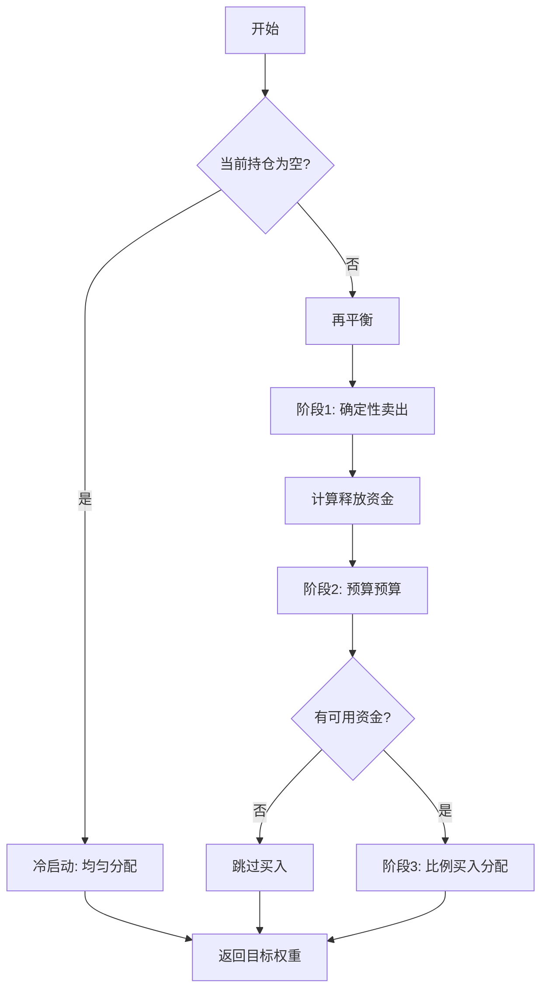

# cost_control.py

## 模块概述

该模块实现了考虑交易成本的软Topk策略，通过预算约束的再平衡引擎管理投资组合。

## 类定义

### SoftTopkStrategy

软Topk策略，实现了确定性的卖出和同步买入机制，考虑交易影响限制。

#### 构造方法参数

| 参数名 | 类型 | 默认值 | 说明 |
|--------|------|----------|------|
| model | BaseModel | None | 预测模型 |
| dataset | Dataset | None | 数据集 |
| topk | int | None | 持有股票数量 |
| order_generator_cls_or_obj | type or OrderGenerator | OrderGenWInteract | 订单生成器 |
| max_sold_weight | float | 1.0 | 最大卖出权重（已弃用） |
| trade_impact_limit | float | None | 单次交易影响限制 |
| risk_degree | float | 0.95 | 目标投资比例 |
| buy_method | str | "first_fill" | 买入方法 |
| **kwargs | - | - | 其他参数 |

**trade_impact_limit 参数说明：**

- `None`: 无限制（fallback 到 max_sold_weight）
- 数值: 每只股票单次最大权重变动
- 1.0: 实际上无限制

**buy_method 选项：**

- `"first_fill"`: 优先填充（当前实现）

#### 策略特点

1. **确定性的卖出顺序**: 相同输入产生相同输出
2. **比例预算分配**: 公平分配卖出释放的资金
3. **同步买入**: 卖出完成后根据可用资金买入
4. **交易影响限制**: 单次交易量受约束控制

#### 策略逻辑流程



#### 方法

##### get_risk_degree(trade_step=None)

获取风险度（目标投资比例）。

**返回值：**

- **float**: 风险度

##### generate_target_weight_position(score, current, trade_start_time, trade_end_time, **kwargs)

生成目标权重位置，使用比例预算分配。

**参数说明：**

- **score** (pd.Series): 预测得分
- **current** (Position): 当前持仓
- **trade_start_time**: 交易开始时间
- **trade_end_time**: 交易结束时间

**返回值：**

- **dict**: 目标权重 {stock_id: weight}

## 详细算法实现

### 阶段 1: 确定性卖出阶段

```python
# 初始化
released_cash = 0.0
all_tickers = 当前持仓股票 ∪ 目标股票
next_weights = {t: 当前持仓.get(t, 0) for t in all_tickers}

# 对每只股票
for ticker in all_t(ickers):
    current_weight = next_weights[ticker]

    if ticker not in ideal_list:
        # 不在目标列表中: 全部卖出
        sell = min(current_weight, trade_impact_limit)
        next_weights[ticker] -= sell
        released_cash += sell

    elif current_weight > ideal_per_stock + epsilon:
        # 持仓过量: 卖出多余部分
        excess = current_weight - ideal_per_stock
        sell = min(excess, trade_impact_limit)
        next_weights[ticker] -= sell
        released_cash += sell
```

### 阶段 2: 预算预算计算

```python
# 预算 = 卖出释放的资金 + 风险度内的可用空间
initial_total_weight = sum(current_weights)
total_budget = released_cash + (risk_degree_risk - initial_total_weight)
```

### 阶段 3: 比例买入分配

```python
# 计算每只目标股票的缺口
shortfalls = {
    t: ideal_per_stock - next_weights.get(t, 0)
    for t in ideal_list
    if next_weights.get(t, 0) < ideal_per_stock - epsilon
}

if total_budget > epsilon and shortfalls:
    total_shortfall = sum(shortfalls.values())
    # 预算不能超过总缺口
    available_to_spend = min(total_budget, total_shortfall)

    # 分配资金
    for ticker, shortfall in shortfalls.items():
        # 公平分配: 每只股票按缺口比例分配
        share_of_budget = (shortfall / total_shortfall) * available_to_spend

        # 受交易影响限制约束
        max_buy = min(shortfall, trade_impact_limit)

        # 实际买入额
        actual_buy = min(share_of_budget, max_buy)
        next_weights[ticker] += actual_buy
```

## 使用示例

### 基本使用

```python
from qlib.contrib.strategy import SoftTopkStrategy
from qlib.model import LightGBM
from qlib.data import Dataset

# 创建策略
strategy = SoftTopkStrategy(
    model=LightGBM(),
    dataset=Dataset(...),
    topk=30,                      # 持有30只股票
    trade_impact_limit=0.3,         # 每次最大变动30%
    risk_degree=0.95,               # 95%仓位
    buy_method="first_fill"
)

# 执行策略
portfolio = execute_strategy(
    strategy=strategy,
    executor=executor,
    exchange=exchange
)
```

### 参数调优

```python
# 保守策略: 缓慢调整
strategy = SoftTopkStrategy(
    ...,
    trade_impact_limit=0.1,  # 小额交易
    risk_degree=0.90         # 保留更多现金
)

# 激进策略: 快速调整
strategy = SoftTopkStrategy(
    ...,
    trade_impact_limit=0.5,  # 大额交易
    risk_degree=0.98         # 接近满仓
)
```

### 监控策略行为

```python
# 包装策略以监控
class MonitoredSoftTopkStrategy(SoftTopkStrategy):
    def generate_target_weight_position(
        self, score, current,
        trade_start_time, trade_end_time, **kwargs
    ):
        weights = super().generate_target_weight_position(
            score, current, trade_start_time, trade_end_time, **kwargs
        )

        # 记录统计信息
        total_weight = sum(weights.values())
        stock_count = len(weights)
        max_weight = max(weights.values()) if weights else 0

        logger.info(f"Total weight: {total_weight:.4f}")
        logger.info(f"Stock count: {stock_count}")
        logger.info(f"Max weight: {max_weight:.4f}")

        return weights
```

## 算法性质

### 1. 确定性

- 相同输入（得分、当前持仓）总是产生相同输出
- 无随机性，便于复现和调试

### 2. 预算约束

- 卖出释放的资金只用于目标股票买入
- 不会超过风险度上限
- 不会过度交易

### 3. 公平性

- 资金按缺口比例公平分配
- 相同缺口的股票获得相同分配

### 4. 安全性

- 单次交易受 `trade_impact_limit` 约束
- 最后一步可能不完全受约束（确保完成）

## 注意事项

1. **trade_impact_limit 设置**:
   - 太小: 调仓缓慢，可能错过机会
   - 太大: 单次交易冲击大，成本高
   - 建议: 0.2-0.4

2. **topk 参数**:
   - 太小: 分散风险不足
   - 太大: 单股权重小，可能难以超收益
   - 建议: 20-50

3. **risk_degree 参数**:
   - 太低: 资金利用率低
   - 太高: 缺乏安全缓冲
   - 建议: 0.90-0.98

4. **交易成本**:
   - 该策略不显式考虑交易成本
   - 实际使用时需要计入成本

5. **边界情况**:
   - 空仓启动: 均匀分配
   - 全部卖出: 释放所有资金
   - 资金不足: 按比例分配

## 性能考虑

1. **计算复杂度**: O(n) 其中 n 为股票数量
2. **内存使用**: 与股票数量线性相关
3. **可扩展性**: 适合处理数百只股票

## 与其他策略对比

| 特性 | SoftTopkStrategy | TopkDropoutStrategy |
|------|-----------------|-------------------|
| 卖出确定性 | 是（按权重顺序） | 取决于 method_sell |
| 买入同步 | 是（卖完再买） | 否（独立计算） |
| 交易影响限制 | 有 | 无 |
| 预算分配 | 公平 | 均匀 |

## 相关文档

- [signal_strategy.py 文档](./signal_strategy.md) - 基类 WeightStrategyBase
- [order_generator.py 文档](./order_generator.md) - 订单生成器
