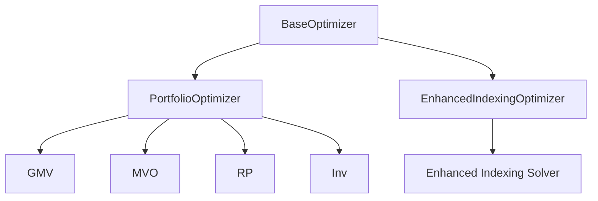

# base.py

## 模块概述

该模块定义了投资组合优化器的抽象基类。

## 类定义

### BaseOptimizer

投资组合优化器抽象基类，定义了优化器的统一接口。

#### 抽象方法

##### __call__(*args, **kwargs)

生成优化后的投资组合分配。

**参数说明：**

- **args**: 位置参数
- **kwargs**: 关键字参数

**返回值：**

- **object**: 优化后的投资组合权重（通常为 `np.ndarray` 或 `pd.Series`）

**注意事项：**

- 这是一个抽象方法，子类必须实现
- 具体的参数定义由子类决定

## 设计模式

### 策略模式

`BaseOptimizer` 使用策略模式，允许不同的优化算法实现统一的接口。



### 使用场景

```python
# 客户代码不需要知道具体的优化器实现
def optimize_portfolio(optimizer, data):
    return optimizer(data)

# 可以灵活切换优化器
optimizer1 = PortfolioOptimizer(method="gmv")
optimizer2 = EnhancedIndexingOptimizer(lamb=1.0)

weights1 = optimize_portfolio(optimizer1, data1)
weights2 = optimize_portfolio(optimizer2, data2)
```

## 实现自定义优化器

### 基本实现

```python
from qlib.contrib.strategy.optimizer.base import BaseOptimizer
import numpy as np

class CustomOptimizer(BaseOptimizer):
    def __init__(self, param1=1.0, param2=0.5):
        self.param1 = param1
        self.param2 = param2

    def __call__(self, data, **kwargs):
        """
        实现自定义优化逻辑

        Parameters:
        -----------
        data : dict or np.ndarray
            包含所需的数据

        Returns:
        --------
        np.ndarray : 优化后的权重
        """
        # 实现优化算法
        n = len(data)
        weights = np.ones(n) / n  # 均匀分配

        # 应用自定义逻辑
        weights = weights * self.param1
        weights = weights / weights.sum()

        return weights
```

### 高级实现（带约束）

```python
from qlib.contrib.strategy.optimizer.base import BaseOptimizer
import numpy as np
import scipy.optimize as so

class ConstrainedOptimizer(BaseOptimizer):
    def __init__(self, constraints=None):
        self.constraints = constraints

    def __call__(self, returns, cov_matrix=None, **kwargs):
        """
        带约束的优化器

        Parameters:
        -----------
        returns : np.ndarray
            资产收益序列
        cov_matrix : np.ndarray, optional
            协方差矩阵

        Returns:
        --------
        np.ndarray : 优化后的权重
        """
        n = returns.shape[1]

        if cov_matrix is None:
            cov_matrix = np.cov(returns.T)

        # 定义目标函数
        def objective(w):
            return w @ cov_matrix @ w

        # 定义约束
        cons = [
            {"type": "eq", "fun": lambda w: np.sum(w) - 1}  # 全投资
        ]
        bounds = so.Bounds(0.0, 1.0)  # 无卖空

        # 求解
        result = so.minimize(
            objective,
            x0=np.ones(n) / n,
            bounds=bounds,
            constraints=cons
        )

        return result.x
```

## 扩展点

### 1. 添加新约束

```python
class ExtendedOptimizer(BaseOptimizer):
    def __init__(self, max_position=0.1, min_position=0.01):
        self.max_position = max_position
        self.min_position = min_position

    def __call__(self, data, **kwargs):
        # 创建自定义边界
        bounds = so.Bounds(self.min_position, self.max_position)
        # ...
```

### 2. 支持动态参数

```python
class DynamicOptimizer(BaseOptimizer):
    def __call__(self, data, risk_aversion=0.5, **kwargs):
        # risk_aversion 可以在调用时动态调整
        weights = self._optimize(data, risk_aversion)
        return weights
```

### 3. 添加日志和监控

```python
from qlib.log import get_module_logger

class MonitoredOptimizer(BaseOptimizer):
    def __init__(self, log_file=None):
        self.logger = get_module_logger("Optimizer")
        self.log_file = log_file

    def __call__(self, data, **kwargs):
        self.logger.info("Starting optimization...")

        weights = self._solve(data, **kwargs)

        self.logger.info(f"Optimization completed")
        self.logger.info(f"Max weight: {weights.max():.4f}")
        self.logger.info(f"Min weight: {weights.min():.4f}")

        return weights
```

## 注意事项

1. **实现要求**:
   - 必须实现 `__call__` 方法
   - 返回值通常为权重向量或 Series
   - 权重和应该为 1.0

2. **错误处理**:
   - 处理数值稳定性问题
   - 处理无解的情况
   - 提供有意义的错误信息

3. **性能考虑**:
   - 优化算法可能计算密集
   - 考虑使用缓存或预计算
   - 监控优化时间

4. **文档和注释**:
   - 清晰说明输入输出格式
   - 记录优化算法和参数
   - 提供使用示例

## 相关文档

- [optimizer.py 文档](./optimizer.md) - 具体的投资组合优化器实现
- [enhanced_indexing.py 文档](./enhanced_indexing.md) - 增强指数优化器实现
