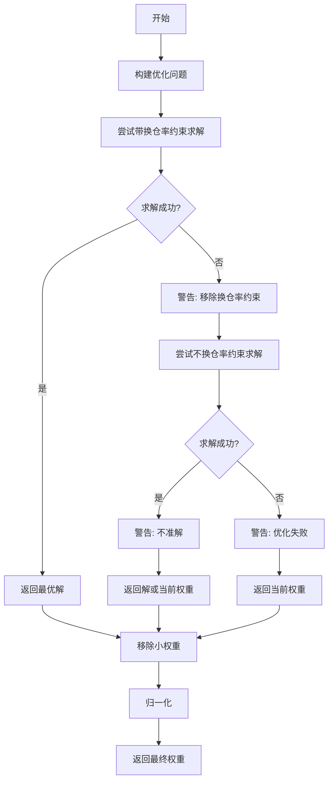

# enhanced_indexing.py

## 模块概述

该模块实现了增强指数投资组合优化器，在跟踪误差约束下最大化超额收益。

## 类定义

### EnhancedIndexingOptimizer

增强指数投资组合优化器。

#### 符号说明

```python
w0   : 当前持有权重
wb   : 基准权重
r    : 期望收益
F    : 因子暴露
cov_b: 因子协方差
var_u: 特质风险（对角线）
lamb : 风险厌恶参数
delta : 总换仓率限制
b_dev: 基准偏离限制
f_dev: 因子偏离限制

d    = w - wb  : 基准偏离
v    = d @ F   : 因子偏离
```

#### 优化问题

```math
max_w   d' r - λ * (v' Σ_b v + σᵤ² ⊙ d²)
s.t.   w ≥ 0
        Σw = 1
        Σw - w₀ ≤ δ
        d ≥ -b_dev
        d ≤ b_dev
        v ≥ -f_dev
        v ≤ f_dev
```

**目标函数说明：**

- `d' r`: 超额收益（基准偏离 × 期望收益）
- `v' Σ_b v`: 因子风险（因子偏离 × 因子协方差 × 因子偏离）
- `σᵤ² ⊙ d²`: 特质风险（特质风险 × 基准偏离的平方）
- `λ`: 风险厌恶参数，越大越关注风险

#### 构造方法参数

| 参数名 | 类型 | 默认值 | 说明 |
|--------|------|----------|------|
| lamb | float | 1 | 风险厌恶参数 |
| delta | float | None | 总换仓率限制 |
| b_dev | float | None | 基准偏离限制 |
| f_dev | list or np.ndarray | None | 因子偏离限制 |
| scale_return | bool | True | 是否缩放收益 |
| epsilon | float | 5e-5 | 最小权重阈值 |
| solver_kwargs | dict | {} | 求解器参数 |

**delta 参数说明：**

- `None`: 无换仓率限制
- 数值: 最大总换仓率（L1 范数）

**b_dev 参数说明：**

- `None`: 无基准偏离限制
- 数值: 单个资产相对基准的最大偏离

**f_dev 参数说明：**

- `None`: 无因子偏离限制
- 列表或数组: 每个因子的最大偏离

#### 方法

##### __call__(r, F, cov_b, var_u, w0, wb, mfh=None, mfs=None)

执行增强指数优化。

**参数说明：**

- **r** (np.ndarray): 期望收益
- **F** (np.ndarray): 因子暴露矩阵 [n_stocks, n_factors]
- **cov_b** (np.ndarray): 因子协方差矩阵 [n_factors, n_factors]
- **var_u** (np.ndarray): 特质风险向量 [n_stocks]
- **w0** (np.ndarray): 当前权重
- **wb** (np.ndarray): 基准权重
- **mfh** (np.ndarray): 强制持有掩面（可选）
- **mfs** (np.ndarray): 强制卖出掩面（可选）

**返回值：**

- **np.ndarray**: 优化后的权重

**处理流程：**

1. 缩放收益以匹配波动率
2. 设置权重边界（0 到 1）
3. 应用基准偏离限制
4. 应用强制持有/卖出约束
5. 构建优化问题
6. 尝试求解（带换仓率约束）
7. 如果失败，尝试不换仓率约束求解
8. 移除小权重
9. 归一化权重

---

## 优化问题详解

### 目标函数

```python
# 超额收益
ret = d @ r  # (w - wb) @ r

# 因子风险
factor_risk = cp.quad_form(v, cov_b)  # v @ cov_b @ v

# 特质风险
specific_risk = var_u @ (d ** 2)  # sum(var_u[i] * d[i]^2)

# 总跟踪误差
tracking_error = factor_risk + specific_risk

# 目标函数: 最大化超额收益 - 风险厌恶 * 跟踪误差
objective = cp.Maximize(ret - lamb * tracking_error)
```

### 约束条件

#### 1. 基本约束

```python
# 无卖空且全投资
cons = [
    cp.sum(w) == 1,      # 全投资
    w >= lb,                # 下界约束
    w <= ub                 # 上界约束
]
```

#### 2. 基准偏离约束

```python
if b_dev is not None:
    lb = np.maximum(lb, wb - b_dev)
    ub = np.minimum(ub, wb + b_dev)
```

#### 3. 因子偏离约束

```python
if f_dev is not None:
    # 因子暴露 = (w - wb) @ F
    v = d @ F

    # 因子偏离限制
    cons.extend([
        v >= -f_dev,  # 下界
        v <= f_dev     # 上界
    ])
```

#### 4. 强制持有/卖出约束

```python
# 强制持有: 保持当前权重
if mfh is not None:
    lb[mfh] = w0[mfh]
    ub[mfh] = w0[mfh]

# 强制卖出: 权重为 0
# 注意: 这会覆盖强制持有
if mfs is not None:
    lb[mfs] = 0
    ub[mfs] = 0
```

#### 5. 换仓率约束

```python
if delta is not None and w0 is not None and w0.sum() > 0:
    # L1 范数的换仓率限制
    turnover_cons = [cp.norm(w - w0, 1) <= delta]
```

---

## 求解策略

### 两阶段求解



### 不准解处理

```python
if prob.status == "optimal_inaccurate":
    logger.warning("优化结果不准")

# 移除小权重
w = np.asarray(w.value)
w[w < epsilon] = 0
w /= w.sum()
```

## 使用示例

### 基本使用

```python
from qlib.contrib.strategy.optimizer import EnhancedIndexingOptimizer

# 创建优化器
optimizer = EnhancedIndexingOptimizer(
    lamb=1.0,         # 风险厌恶参数
    delta=0.2,         # 换仓率限制 20%
    b_dev=0.01,        # 基准偏离限制 1%
    f_dev=[0.1, 0.1], # 因子偏离限制
    epsilon=1e-4       # 最小权重
)

# 准备数据
r = expected_returns        # [n_stocks]
F = factor_exposure        # [n_stocks, n_factors]
cov_b = factor_covariance  # [n_factors, n_factors]
var_u = specific_variance # [n_stocks]
w0 = current_weights      # [n_stocks]
wb = benchmark_weights    # [n_stocks]

# 优化
weights = optimizer(
    r=r, F=F, cov_b=cov_b, var_u=var_u,
    w0=w0, wb=wb
)

print(f"Optimized weights: {weights}")
```

### 使用强制约束

```python
# 创建掩面
n_stocks = len(w0)

# 强制持有前10只股票
mfh = np.zeros(n_stocks, dtype=bool)
mfh[:10] = True

# 强制卖出某些股票（如风险过高）
mfs = np.zeros(n_stocks, dtype=bool)
mfs[risky_indices] = True

# 优化
weights = optimizer(
    r=r, F=F, cov_b=cov_b, var_u=var_u,
    w0=w0, wb=wb,
    mfh=mfh,  # 强制持有
    mfs=mfs   # 强制卖出
)
```

### 风险厌恶调整

```python
# 保守策略: 高风险厌恶
optimizer_conservative = EnhancedIndexingOptimizer(
    lamb=2.0,  # 更关注风险
    delta=0.1  # 较小换仓率
)

# 激进策略: 低风险厌恶
optimizer_aggressive = EnhancedIndexingOptimizer(
    lamb=0.5,  # 更关注收益
    delta=0.3  # 较大换仓率
)
```

### 自定义求解器参数

```python
optimizer = EnhancedIndexingOptimizer(
    lamb=1.0,
    solver_kwargs={
        "max_iters": 10000,
        "eps": 1e-7,
        "verbose": True
    }
)
```

## 风险模型准备

### 因子风险模型

```python
from qlib.model.riskmodel.structured import StructuredCovEstimator

# 创建风险模型
risk_model = StructuredCovEstimator(step=20, window_size=252)

# 准备数据
for date in dates:
    # 提取特征
    features = extract_features(date)

    # 估计风险
    factor_exp, factor_cov, specific_risk = risk_model.fit(features)

    # 保存
    save_risk_data(date, factor_exp, factor_cov, specific_risk)
```

### 目录结构

```
/path/to/riskmodel/
├── 20210101/
│   ├── factor_exp.pkl      # 因子暴露 [n_stocks, n_factors]
│   ├── factor_cov.pkl      # 因子协方差 [n_factors, n_factors]
│   ├── specific_risk.pkl   # 特质风险 [n_stocks]
│   └── blacklist.pkl       # 黑名单（可选）
├── 20210102/
│   ├── ...
```

## 注意事项

1. **输入数据**:
   - 确保因子暴露、协方差和特质风险维度匹配
   - 基准权重和为 1.0
   - 当前权重和基准权重长度相同

2. **约束设置**:
   - 过多约束可能无解
   - 因子偏离限制要合理
   - 换仓率限制要考虑实际流动性

3. **求解失败处理**:
   - 第一次失败自动尝试移除换仓率约束
   - 如果都失败返回当前权重
   - 记录警告信息便于调试

4. **数值稳定性**:
   - 使用 `scale_return` 改善条件数
   - 设置合理的 `epsilon` 过滤小权重
   - 监控求解器状态

5. **性能优化**:
   - 使用 ECOS 求解器（二阶锥优化）
   - 预计算不变部分
   - 缓存风险模型数据

## 优化问题特性

### 凸性

使用 CVXPY 的二阶锥规划（SOCP）：

- 目标函数: 凸二次函数
- 约束: 线性约束和二阶锥约束
- 可以高效求解到全局最优

### 跟踪误差分解

```math
TE² = TE_factor² + TE_specific²

其中:
TE_factor² = v' Σ_b v     # 因子跟踪误差
TE_specific² = σᵤ² ⊙ d²   # 特质跟踪误差
```

### 风险贡献

```math
# 因子风险贡献
risk_contrib_factor = (w - wb) @ F @ cov_b @ F.T @ (w - wb)

# 特质风险贡献
risk_contrib_specific = var_u @ (w - wb)²

# 总跟踪误差
tracking_error = risk_contrib_factor + risk_contrib_specific
```

## 相关文档

- [base.py 文档](./base.md) - 优化器基类
- [optimizer.py 文档](./optimizer.md) - 投资组合优化器
