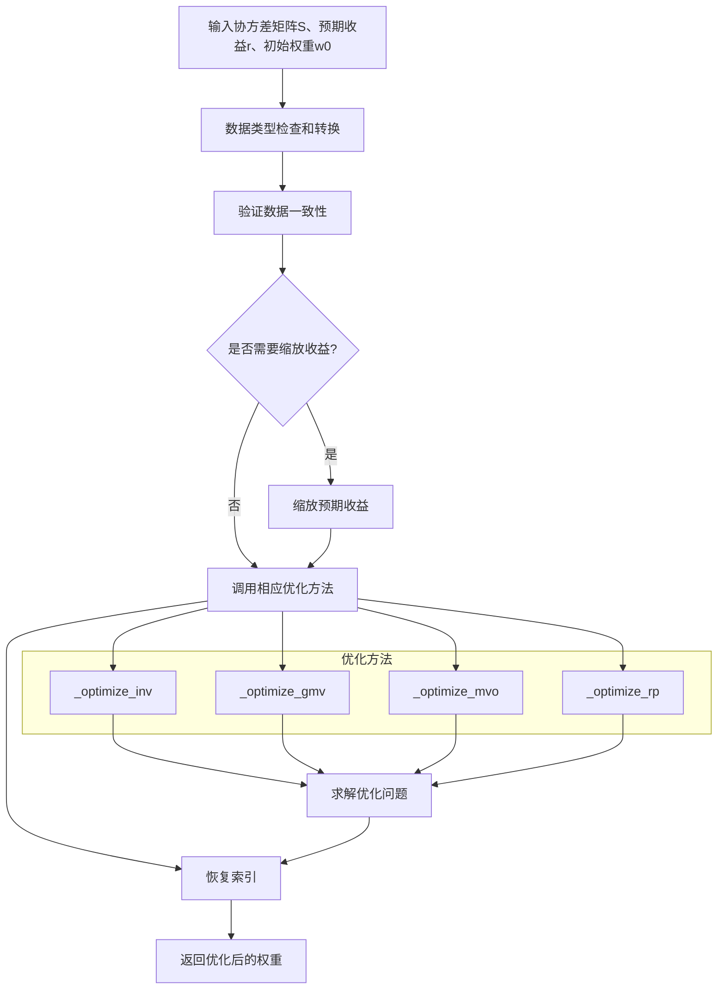

# PortfolioOptimizer 投资组合优化器

## 模块概述

PortfolioOptimizer 是 QLib 量化投资平台中用于投资组合优化的核心类，提供了多种经典的投资组合优化算法。该类继承自 BaseOptimizer 基类，实现了完整的投资组合优化流程，支持约束条件设置和正则化处理。

## 支持的优化算法

PortfolioOptimizer 支持以下四种主要的投资组合优化方法：

| 算法名称 | 英文名称 | 描述 |
|---------|---------|------|
| 全局最小方差 | GMV (Global Minimum Variance) | 寻找方差最小的投资组合 |
| 均值方差优化 | MVO (Mean Variance Optimized) | 在风险和收益之间权衡的经典优化方法 |
| 风险平价 | RP (Risk Parity) | 使每个资产对整体风险的贡献相等 |
| 逆波动率 | INV (Inverse Volatility) | 基于波动率倒数的简单分散化策略 |

## 类定义

```python
class PortfolioOptimizer(BaseOptimizer):
    """Portfolio Optimizer

    支持以下优化算法:
        - `gmv`: 全局最小方差投资组合
        - `mvo`: 均值方差优化投资组合
        - `rp`: 风险平价
        - `inv`: 逆波动率

    注意:
        该优化器始终假设满仓投资且不允许卖空。
    """
```

## 初始化方法

### `__init__`

```python
def __init__(
    self,
    method: str = "inv",
    lamb: float = 0,
    delta: float = 0,
    alpha: float = 0.0,
    scale_return: bool = True,
    tol: float = 1e-8,
):
```

**参数说明:**
- `method`: 优化方法，可选值为 "gmv"、"mvo"、"rp" 或 "inv"，默认值为 "inv"
- `lamb`: 风险厌恶参数，值越大表示越关注收益，默认值为 0
- `delta`: 换手率限制，默认值为 0
- `alpha`: L2 正则化参数，默认值为 0.0
- `scale_return`: 是否将预期收益与协方差矩阵的波动率进行缩放匹配，默认值为 True
- `tol`: 优化终止的 tolerance，默认值为 1e-8

**约束条件:**
- 所有参数必须为非负值
- 优化方法必须是支持的四种算法之一

## 主要方法

### `__call__`

```python
def __call__(
    self,
    S: Union[np.ndarray, pd.DataFrame],
    r: Optional[Union[np.ndarray, pd.Series]] = None,
    w0: Optional[Union[np.ndarray, pd.Series]] = None,
) -> Union[np.ndarray, pd.Series]:
```

**功能:** 执行投资组合优化

**参数说明:**
- `S`: 协方差矩阵，可以是 NumPy 数组或 Pandas DataFrame
- `r`: 预期收益，可以是 NumPy 数组或 Pandas Series，可选参数
- `w0`: 初始权重（用于换手率控制），可以是 NumPy 数组或 Pandas Series，可选参数

**返回值:** 优化后的投资组合权重，可以是 NumPy 数组或 Pandas Series（保留输入索引）

**处理流程:**
1. 检查输入数据类型并转换为 NumPy 数组
2. 验证输入数据的一致性
3. 缩放预期收益（如果需要）
4. 调用相应的优化方法
5. 恢复索引（如果输入是 DataFrame/Series）
6. 返回优化后的权重

### `_optimize`

```python
def _optimize(self, S: np.ndarray, r: Optional[np.ndarray] = None, w0: Optional[np.ndarray] = None) -> np.ndarray:
```

**功能:** 内部优化方法调度器

**参数说明:**
- `S`: 协方差矩阵（NumPy 数组）
- `r`: 预期收益（NumPy 数组，可选）
- `w0`: 初始权重（NumPy 数组，可选）

**返回值:** 优化后的权重数组

**调度逻辑:**
根据初始化时选择的方法调用对应的优化实现：
- "inv" → `_optimize_inv`
- "gmv" → `_optimize_gmv`
- "mvo" → `_optimize_mvo`
- "rp" → `_optimize_rp`

## 具体优化实现

### `_optimize_inv` (逆波动率优化)

```python
def _optimize_inv(self, S: np.ndarray) -> np.ndarray:
```

**功能:** 实现逆波动率优化策略

**参数说明:**
- `S`: 协方差矩阵（NumPy 数组）

**返回值:** 优化后的权重数组

**原理:**
1. 从协方差矩阵中提取对角线元素（方差）
2. 计算每个资产的波动率（方差的平方根）
3. 计算波动率的倒数作为权重
4. 归一化权重，确保总和为 1

**公式:**
$$ w_i = \frac{1/\sigma_i}{\sum_{j=1}^n 1/\sigma_j} $$

**特点:**
- 简单直观，计算效率高
- 不需要预期收益数据
- 不支持换手率控制

### `_optimize_gmv` (全局最小方差优化)

```python
def _optimize_gmv(self, S: np.ndarray, w0: Optional[np.ndarray] = None) -> np.ndarray:
```

**功能:** 实现全局最小方差投资组合优化

**参数说明:**
- `S`: 协方差矩阵（NumPy 数组）
- `w0`: 初始权重（用于换手率控制，可选）

**返回值:** 优化后的权重数组

**优化问题:**
$$ \min_w w^T S w \\ \text{s.t. } w \geq 0, \sum_{i=1}^n w_i = 1 $$

**特点:**
- 专注于风险最小化
- 不需要预期收益数据
- 支持换手率控制

### `_optimize_mvo` (均值方差优化)

```python
def _optimize_mvo(
    self, S: np.ndarray, r: Optional[np.ndarray] = None, w0: Optional[np.ndarray] = None
) -> np.ndarray:
```

**功能:** 实现均值方差优化

**参数说明:**
- `S`: 协方差矩阵（NumPy 数组）
- `r`: 预期收益（NumPy 数组，可选）
- `w0`: 初始权重（用于换手率控制，可选）

**返回值:** 优化后的权重数组

**优化问题:**
$$ \min_w -w^T r + \lambda w^T S w \\ \text{s.t. } w \geq 0, \sum_{i=1}^n w_i = 1 $$

**特点:**
- 在风险和收益之间进行权衡
- 需要预期收益数据
- 支持换手率控制
- 通过 `lamb` 参数调整风险厌恶程度

### `_optimize_rp` (风险平价优化)

```python
def _optimize_rp(self, S: np.ndarray, w0: Optional[np.ndarray] = None) -> np.ndarray:
```

**功能:** 实现风险平价优化

**参数说明:**
- `S`: 协方差矩阵（NumPy 数组）
- `w0`: 初始权重（用于换手率控制，可选）

**返回值:** 优化后的权重数组

**优化问题:**
$$ \min_w \sum_{i=1}^n \left( w_i - \frac{w^T S w}{(S w)_i n} \right)^2 \\ \text{s.t. } w \geq 0, \sum_{i=1}^n w_i = 1 $$

**特点:**
- 使每个资产对整体风险的贡献相等
- 不需要预期收益数据
- 支持换手率控制
- 计算复杂度较高

## 目标函数生成方法

### `_get_objective_gmv`

```python
def _get_objective_gmv(self, S: np.ndarray) -> Callable:
```

**功能:** 生成全局最小方差优化的目标函数

**参数说明:**
- `S`: 协方差矩阵（NumPy 数组）

**返回值:** 目标函数（Callable）

**目标函数:**
$$ f(w) = w^T S w $$

### `_get_objective_mvo`

```python
def _get_objective_mvo(self, S: np.ndarray, r: np.ndarray = None) -> Callable:
```

**功能:** 生成均值方差优化的目标函数

**参数说明:**
- `S`: 协方差矩阵（NumPy 数组）
- `r`: 预期收益（NumPy 数组）

**返回值:** 目标函数（Callable）

**目标函数:**
$$ f(w) = -w^T r + \lambda w^T S w $$

### `_get_objective_rp`

```python
def _get_objective_rp(self, S: np.ndarray) -> Callable:
```

**功能:** 生成风险平价优化的目标函数

**参数说明:**
- `S`: 协方差矩阵（NumPy 数组）

**返回值:** 目标函数（Callable）

**目标函数:**
$$ f(w) = \sum_{i=1}^n \left( w_i - \frac{w^T S w}{(S w)_i n} \right)^2 $$

## 约束条件生成方法

### `_get_constrains`

```python
def _get_constrains(self, w0: Optional[np.ndarray] = None):
```

**功能:** 生成优化问题的约束条件

**参数说明:**
- `w0`: 初始权重（用于换手率控制，可选）

**返回值:** 边界约束（Bounds）和约束条件列表（cons）

**约束条件:**
1. **无卖空和杠杆约束:** \( 0 \leq w_i \leq 1 \)（边界约束）
2. **满仓投资约束:** \( \sum_{i=1}^n w_i = 1 \)（等式约束）
3. **换手率约束:** \( \sum_{i=1}^n |w_i - w0_i| \leq \delta \)（不等式约束，仅当提供 w0 时有效）

## 优化求解方法

### `_solve`

```python
def _solve(self, n: int, obj: Callable, bounds: so.Bounds, cons: List) -> np.ndarray:
```

**功能:** 执行实际的优化求解

**参数说明:**
- `n`: 参数数量（资产数量）
- `obj`: 优化目标函数（Callable）
- `bounds`: 参数边界约束（Bounds）
- `cons`: 约束条件列表（list）

**返回值:** 优化后的参数值（NumPy 数组）

**优化过程:**
1. 添加 L2 正则化（如果需要）
2. 初始化参数值为均匀分布（1/n）
3. 使用 scipy.optimize.minimize 求解优化问题
4. 处理优化失败的情况（发出警告）
5. 返回优化结果

## 使用示例

### 1. 基础使用

```python
import numpy as np
import pandas as pd
from qlib.contrib.strategy.optimizer.optimizer import PortfolioOptimizer

# 创建协方差矩阵（示例数据）
np.random.seed(42)
n_assets = 5
returns = np.random.randn(n_assets, 100)
cov_matrix = np.cov(returns)

# 初始化优化器（使用逆波动率方法）
optimizer = PortfolioOptimizer(method="inv")

# 执行优化
weights = optimizer(cov_matrix)

print("优化后的权重:")
print(weights)
print(f"权重总和: {np.sum(weights):.4f}")
```

### 2. 均值方差优化

```python
# 创建预期收益（示例数据）
expected_returns = np.mean(returns, axis=1)

# 初始化优化器（使用均值方差方法，风险厌恶参数为 0.5）
optimizer = PortfolioOptimizer(method="mvo", lamb=0.5)

# 执行优化
weights = optimizer(cov_matrix, expected_returns)

print("优化后的权重:")
print(weights)
```

### 3. 带换手率约束的优化

```python
# 初始权重（示例数据）
initial_weights = np.ones(n_assets) / n_assets

# 初始化优化器（使用风险平价方法，换手率限制为 0.2）
optimizer = PortfolioOptimizer(method="rp", delta=0.2)

# 执行优化
weights = optimizer(cov_matrix, w0=initial_weights)

print("优化后的权重:")
print(weights)

# 计算换手率
turnover = np.sum(np.abs(weights - initial_weights))
print(f"实际换手率: {turnover:.4f}")
```

### 4. 使用 Pandas DataFrame 输入

```python
# 创建 DataFrame 格式的协方差矩阵
asset_names = [f"Asset {i}" for i in range(1, n_assets + 1)]
cov_df = pd.DataFrame(cov_matrix, index=asset_names, columns=asset_names)

# 初始化优化器
optimizer = PortfolioOptimizer(method="gmv")

# 执行优化
weights_series = optimizer(cov_df)

print("优化后的权重:")
print(weights_series)
```

## 优化流程示意图



## 关键参数说明

### 方法选择 (`method`)

| 方法 | 优势 | 劣势 | 适用场景 |
|------|------|------|---------|
| `inv` | 简单快速，计算效率高，不需要预期收益 | 忽略资产间相关性，风险分散效果有限 | 快速分散化，对预期收益不确定的情况 |
| `gmv` | 风险最小化，不需要预期收益，考虑相关性 | 可能过于保守，忽略收益潜力 | 风险厌恶型投资者，市场下跌期 |
| `mvo` | 经典方法，平衡风险和收益 | 对预期收益高度敏感，计算复杂 | 有明确预期收益预测的情况 |
| `rp` | 风险贡献均衡，不需要预期收益，考虑相关性 | 计算复杂，可能导致集中持仓 | 风险控制优先，长期稳健投资 |

### 风险厌恶参数 (`lamb`)

- 仅适用于 MVO 方法
- 值越大，越关注收益（愿意承担更多风险）
- 值越小，越关注风险（更保守）
- 建议值范围: 0.1 - 10.0

### 换手率限制 (`delta`)

- 控制投资组合调整幅度
- 0 表示无限制（完全重新优化）
- 典型值范围: 0.1 - 0.3（10% - 30% 换手率）
- 在量化交易中，过高的换手率会增加交易成本

### L2 正则化 (`alpha`)

- 防止权重过度集中
- 值越大，权重分布越均匀
- 典型值范围: 0.0 - 0.1

## 性能考虑

- **计算复杂度:** 风险平价方法计算复杂度最高，逆波动率方法最低
- **内存使用:** 主要取决于协方差矩阵大小
- **优化收敛性:** 对于大型协方差矩阵（>1000 个资产），建议增加 `tol` 参数值

## 注意事项

1. **输入数据格式:** 协方差矩阵必须是方阵，且尺寸与预期收益/初始权重匹配
2. **数据质量:** 协方差矩阵必须是半正定矩阵
3. **计算精度:** 对于数值不稳定的协方差矩阵，建议添加 L2 正则化
4. **边界约束:** 所有优化方法都强制要求权重非负且不超过 1（无杠杆约束）
5. **满仓约束:** 所有优化方法都假设满仓投资（权重总和为 1）

## 扩展建议

1. **添加新优化方法:** 可以通过继承 PortfolioOptimizer 类并实现 `_get_objective_*` 和 `_optimize_*` 方法
2. **修改约束条件:** 可以重写 `_get_constrains` 方法以支持自定义约束
3. **优化求解器:** 可以修改 `_solve` 方法以支持其他优化求解器（如 CVXPY）
4. **并行计算:** 对于大规模投资组合优化，可以考虑使用并行计算技术加速求解过程
