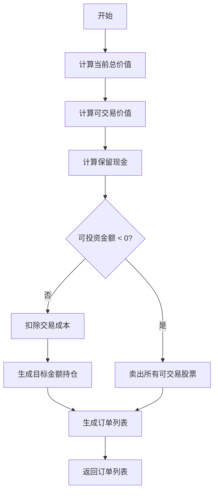

# order_generator.py

## 模块概述

该模块为基于权重的策略提供订单生成功能，将目标权重转换为实际交易订单。主要包含：

- **OrderGenerator**: 订单生成器基类
- **OrderGenWInteract**: 与交易所交互的订单生成器
- **OrderGenWOInteract**: 不与交易所交互的订单生成器

## 类定义

### OrderGenerator

订单生成器抽象基类，定义了将目标权重转换为订单列表的接口。

#### 方法

##### generate_order_list_from_target_weight_position(...)

从目标权重位置生成订单列表的抽象方法。

**参数说明：**

| 参数名 | 类型 | 说明 |
|--------|------|------|
| current | Position | 当前持仓 |
| trade_exchange | Exchange | 交易所对象 |
| target_weight_position | dict | 目标权重 {stock_id: weight} |
| risk_degree | float | 风险度（仓位比例） |
| pred_start_time | pd.Timestamp | 预测开始时间 |
| pred_end_time | pd.Timestamp | 预测结束时间 |
| trade_start_time | pd.Timestamp | 交易开始时间 |
| trade_end_time | pd.Timestamp | 交易结束时间 |

**返回值：**

- **list**: 订单列表

**注意事项：**

- 这是一个抽象方法，需要子类实现
- 权重为归一化的比例，需要转换为实际金额

---

### OrderGenWInteract

与交易所交互的订单生成器，使用交易日的实际价格生成订单。

#### 特点

- 使用交易日的实际价格和交易状态
- 考虑交易成本
- 支持不可交易股票的处理
- 自动处理现金和仓位约束

#### 方法

##### generate_order_list_from_target_weight_position(...)

生成订单列表，使用交易所交互。

**处理流程：**

1. 计算当前可交易价值
2. 计算保留现金（根据风险度）
3. 计算实际可投资金额
4. 如果满足约束条件，生成目标金额持仓
5. 生成从当前持仓到目标持仓的订单

**步骤详解：**



**约束处理：**

```python
# 保留现金 = (1 - risk_degree) * 总价值
reserved_cash = (1.0 - risk_degree) * (total_value + cash)

# 可投资金额 = 可交易价值 - 保留现金
investable_value = tradable_value - reserved_cash

if investable_value < 0:
    # 卖出所有可交易股票
    target_amounts = {stock: 0 for stock in tradable_stocks}
else:
    # 考虑交易成本
    investable_value /= (1 + max(close_cost, open_cost))
    # 生成目标持仓
    target_amounts = exchange.generate_amount_position_from_weight_position(...)
```

---

### OrderGenWOInteract

不与交易所交互的订单生成器，使用预测日的价格生成订单。

#### 特点

- 不使用交易日信息（避免未来函数）
- 使用预测日的收盘价或持仓价格
- 适用于快速回测
- 不考虑实际的交易状态

#### 方法

##### generate_order_list_from_target_weight_position(...)

生成订单列表，不使用交易所交互。

**处理流程：**

1. 计算风险总价值（risk_degree * 总价值）
2. 遍历目标权重中的每只股票
3. 根据股票可交易状态选择价格：
   - 可交易：使用预测日收盘价
   - 不可交易但持有：使用持仓价格
   - 其他：跳过
4. 计算目标金额：权重 * 风险总价值 / 价格
5. 生成订单列表

**价格选择逻辑：**

```python
for stock_id in target_weight_position:
    # 检查预测日和交易日的可交易状态
    if (is_tradable(pred_date) and
        is_tradable(trade_date)):
        # 使用预测日收盘价
        price = get_close(stock_id, pred_start, pred_end)
        amount = risk_total_value * weight / price

    elif stock_id in current_holdings:
        # 使用持仓价格
        price = current.get_stock_price(stock_id)
        amount = risk_total_value * weight / price

    else:
        # 跳过该股票
        continue
```

## 使用示例

### OrderGenWInteract

```python
from qlib.contrib.strategy.order_generator import OrderGenWInteract
from qlib.backtest.position import Position

# 创建订单生成器
order_gen = OrderGenWInteract()

# 定义目标权重
target_weights = {
    "SH600519": 0.03,  # 3% 仓位
    "SH600036": 0.03,
    "SZ000001": 0.03,
    # ... 更多股票
}

# 生成订单
orders = order_gen.generate_order_list_from_target_weight_position(
    current=current_position,
    trade_exchange=exchange,
    target_weight_position=target_weights,
    risk_degree=0.95,
    pred_start_time=pd.Timestamp("2021-01-01"),
    pred_end_time=pd.Timestamp("2021-01-01"),
    trade_start_time=pd.Timestamp("2021-01-02"),
    trade_end_time=pd.Timestamp("2021-01-02")
)

# 执行订单
for order in orders:
    exchange.deal_order(order, current_position)
```

### OrderGenWOInteract

```python
from qlib.contrib.strategy.order_generator import OrderGenWOInteract

# 创建不交互的订单生成器
order_gen = OrderGenWOInteract()

# 生成订单（快速回测场景）
orders = order_gen.generate_order_list_from_target_weight_position(
    current=current_position,
    trade_exchange=exchange,
    target_weight_position=target_weights,
    risk_degree=0.95,
    pred_start_time=pd.Timestamp("2021-01-01"),
    pred_end_time=pd.Timestamp("2021-01-01"),
    trade_start_time=pd.Timestamp("2021-01-02"),
    trade_end_time=pd.Timestamp("2021-01-02")
)
```

## 对比分析

| 特性 | OrderGenWInteract | OrderGenWOInteract |
|------|-------------------|--------------------|
| 交互方式 | 与交易所交互 | 不与交易所交互 |
| 价格来源 | 交易日实际价格 | 预测日价格 |
| 交易状态 | 考虑实际可交易性 | 不考虑 |
| 准确度 | 高 | 中等 |
| 速度 | 较慢 | 较快 |
| 适用场景 | 实盘、精确回测 | 快速回测、分析 |

## 集成使用

### 在 WeightStrategyBase 中使用

```python
from qlib.contrib.strategy import WeightStrategyBase
from qlib.contrib.strategy.order_generator import OrderGenWInteract

class MyStrategy(WeightStrategyBase):
    def __init__(self, **kwargs):
        super().__init__(
            order_generator_cls_or_obj=OrderGenWInteract,
            **kwargs
        )

    def generate_target_weight_position(
        self, score, current,
        trade_start_time, trade_end_time
    ):
        # 实现自定义权重分配
        return target_weights
```

### 自定义订单生成器

```python
from qlib.contrib.strategy.order_generator import OrderGenerator

class CustomOrderGenerator(OrderGenerator):
    def generate_order_list_from_target_weight_position(
        self, current, trade_exchange,
        target_weight_position, risk_degree,
        pred_start_time, pred_end_time,
        trade_start_time, trade_end_time
    ):
        # 实现自定义订单生成逻辑
        orders = []

        # 添加自定义约束或优化
        for stock_id, weight in target_weight_position.items():
            # ... 生成订单逻辑
            orders.append(order)

        return orders

# 使用自定义生成器
strategy = MyStrategy(
    order_generator_cls_or_obj=CustomOrderGenerator
)
```

## 注意事项

1. **OrderGenWInteract**:
   - 需要交易所提供完整的交易信息
   - 适用于需要精确模拟的场景
   - 计算成本较高

2. **OrderGenWOInteract**:
   - 可能高估或低估可交易性
   - 适用于快速原型开发
   - 价格可能与实际成交价有偏差

3. **共同注意事项**:
   - 确保目标权重和为 1.0
   - 考虑交易单位（手数）约束
   - 处理除零错误和异常情况

4. **性能优化**:
   - 批量处理订单生成
   - 缓存常用计算结果
   - 使用向量化操作

## 相关文档

- [signal_strategy.py 文档](./signal_strategy.md) - 使用订单生成器的信号策略
- [cost_control.py 文档](./cost_control.md) - 软Topk策略
- [rule_strategy.py 文档](./rule_strategy.md) - 规则策略
