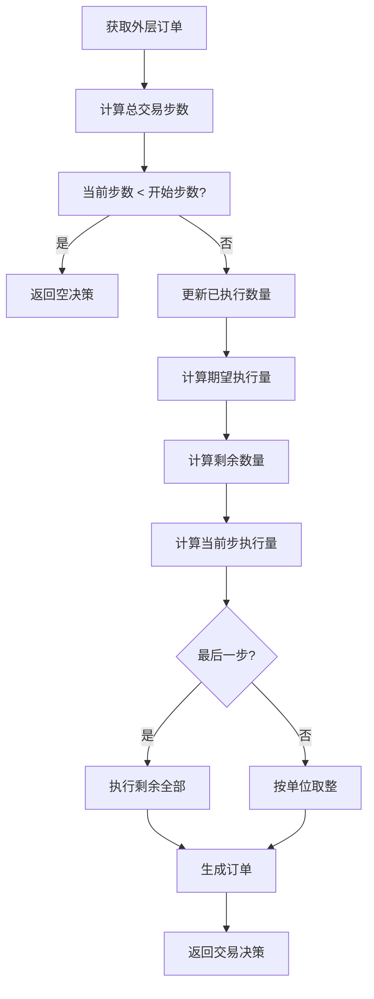
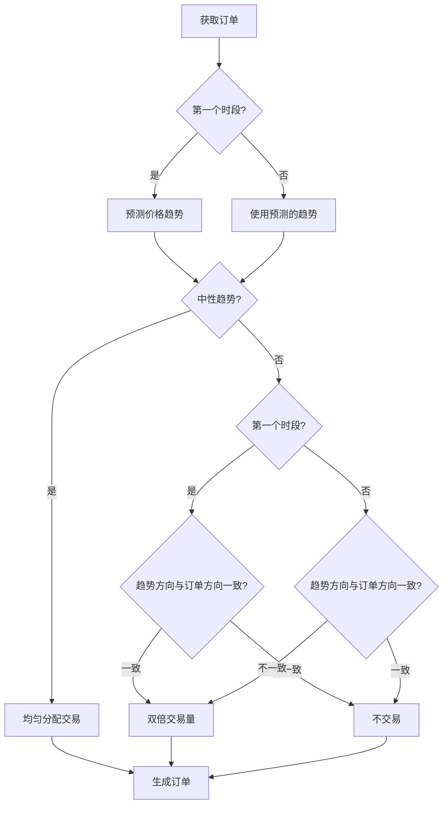

# rule_strategy.py

## 模块概述

该模块实现了基于规则的订单执行策略，包括：

- **TWAPStrategy**: 时间加权平均价格策略
- **SBBStrategyBase**: 选择更优交易时段策略基类
- **SBBStrategyEMA**: 基于EMA信号的选择更优交易时段策略
- **ACStrategy**: 自适应控制策略
- **RandomOrderStrategy**: 随机订单策略（测试用）
- **FileOrderStrategy**: 从文件读取订单策略

## 类定义

### TWAPStrategy

时间加权平均价格策略，将大宗订单分解到多个时间点执行。

#### 构造方法参数

从基类继承，需要 `outer_trade_decision` 参数。

**outer_trade_decision 参数说明：**

- `TradeDecision`: 外部交易决策，包含需要分解的大额订单

#### 策略逻辑



#### 方法

##### reset(outer_trade_decision=None, **kwargs)

重置策略，初始化剩余交易量。

##### generate_trade_decision(execute_result=None)

生成交易决策，均匀分配订单到各个时间点。

**处理流程：**

1. 检查是否在交易时间范围内
2. 更新已执行的数量
3. 计算期望的累计执行量
4. 计算当前步应该执行的数量
5. 考虑交易单位进行取整
6. 最后一步确保全部执行

**执行量计算：**

```python
# 期望累计执行量
amount_expect = order.amount / trade_len * (rel_trade_step + 1)

# 当前步应该执行的数量
amount_delta = amount_expect - amount_finished

# 考虑交易单位
if _amount_trade_unit is not None:
    amount_delta = min(
        round(amount_delta / _amount_trade_unit) * _amount_trade_unit,
        amount_remain
    )

# 最后一步全部执行
if rel_trade_step == trade_len - 1:
    amount_delta = amount_remain
```

---

### SBBStrategyBase

选择更优交易时段策略基类，在相邻两个交易时段中选择更有利的一方执行交易。

#### 策略参数

```python
TREND_MID = 0  # 中性趋势
TREND_SHORT = 1  # 短期趋势
TREND_LONG = 2  # 长期趋势
```

#### 策略逻辑



#### 方法

##### _pred_price_trend(stock_id, pred_start_time=None, pred_end_time=None)

预测价格趋势（需要子类实现）。

**返回值：**

- **int**: 趋势类型（TREND_MID, TREND_SHORT, TREND_LONG）

##### reset(outer_trade_decision=None, **kwargs)

重置策略，初始化交易量和趋势预测。

##### generate_trade_decision(execute_result=None)

生成交易决策，根据趋势选择更优的交易时段。

**处理流程：**

1. 获取或预测价格趋势
2. 如果趋势为中性，均匀分配交易
3. 如果趋势为短期：
   - 第一个时段：卖出双倍，买入不交易
   - 第二个时段：买入双倍，卖出不交易
4. 如果趋势为长期：
   - 第一个时段：买入双倍，卖出不交易
   - 第二个时段：卖出双倍，买入不交易

---

### SBBStrategyEMA

基于EMA信号的选择更优交易时段策略。

#### 构造方法参数

| 参数名 | 类型 | 默认值 | 说明 |
|--------|------|----------|------|
| instruments | list or str | "csi300" | 股票池 |
| freq | str | "day" | EMA信号频率 |
| **kwargs | - | - | 传递给基类的参数 |

#### 方法

##### _reset_signal()

重置EMA信号。

**计算公式：**

```python
EMA_diff = EMA(close, 10) - EMA(close, 20)
```

**信号说明：**

- EMA_diff > 0: 长期趋势
- EMA_diff < 0: 短期趋势
- EMA_diff = 0: 中性趋势

##### _pred_price_trend(stock_id, pred_start_time, pred_end_time)

使用EMA信号预测价格趋势。

**返回值：**

- **int**: 趋势类型

---

### ACStrategy

自适应控制策略，根据市场波动率调整交易执行速度。

#### 构造方法参数

| 参数名 | 类型 | 默认值 | 说明 |
|--------|------|----------|------|
| lamb | float | 1e-6 | 交易成本系数 |
| eta | float | 2.5e-6 | 风险厌恶系数 |
| window_size | int | 20 | 波动率窗口大小 |
| instruments | list or str | "csi300" | 股票池 |
| freq | str | "day" | 波动率计算频率 |
| **kwargs | - | - | 传递给基类的参数 |

#### 方法

##### _reset_signal()

重置波动率信号。

**波动率计算：**

```python
volatility = sqrt(
    Sum( (log(close / Ref(close, 1)))^2, window_size ) / (window_size - 1)
    - (Sum( log(close / Ref(close, 1)), window_size ))^2
      / (window_size * (window_size - 1))
)
```

##### generate_trade_decision(execute_result=None)

生成交易决策，根据波动率自适应调整执行量。

**执行量计算：**

1. 如果没有波动率信号：使用TWAP策略
2. 如果有波动率信号：使用VA（Volatility-Aware）策略

**VA策略公式：**

```python
# 计算调整系数
kappa_tild = (lamb / eta) * volatility^2
kappa = arccosh(kappa_tild / 2 + 1)

# 计算执行比例
amount_ratio = (
    sinh(kappa * (trade_len - trade_step))
    - sinh(kappa * (trade_len - trade_step - 1))
) / sinh(kappa * trade_len)

# 计算执行量
amount = order.amount * amount_ratio
```

**策略逻辑：**

- 高波动率：加快执行（减少风险）
- 低波动率：减慢执行（降低成本）

---

### RandomOrderStrategy

随机订单策略，主要用于测试和压力测试。

#### 构造方法参数

| 参数名 | 类型 | 默认值 | 说明 |
|--------|------|----------|------|
| trade_range | tuple or TradeRange | - | 交易范围 |
| sample_ratio | float | 1.0 | 采样比例 |
| volume_ratio | float | 0.01 | 成交量比例 |
| market | str | "all" | 市场 |
| direction | int | Order.BUY | 交易方向 |

#### 方法

##### generate_trade_decision(execute_result=None)

生成随机的交易决策。

---

### FileOrderStrategy

从文件读取订单的策略。

#### 构造方法参数

| 参数名 | 类型 | 必需 | 说明 |
|--------|------|------|------|
| file | str or Path or pd.DataFrame or IO | 是 | 订单文件或DataFrame |
| trade_range | tuple or TradeRange | None | 交易范围 |

**文件格式（CSV）：**

```csv
datetime,instrument,amount,direction
20200102,SH600519,1000,sell
20200103,SH600519,1000,buy
20200106,SH600519,1000,sell
```

**DataFrame格式：**

| 列名 | 说明 |
|------|------|
| datetime | 交易日期 |
| instrument | 股票代码 |
| amount | 交易数量（调整后） |
| direction | 交易方向（"buy" 或 "sell"） |

#### 方法

##### generate_trade_decision(execute_result=None)

从文件读取当前日期的订单并生成交易决策。

## 使用示例

### TWAPStrategy

```python
from qlib.contrib.strategy import TWAPStrategy
from qlib.backtest.decision import TradeDecisionWO, Order

# 创建大额订单
large_orders = [
    Order(stock_id="SH600519", amount=100000, direction=Order.BUY, ...),
    Order(stock_id="SZ000001", amount=50000, direction=Order.SELL, ...)
]

outer_decision = TradeDecisionWO(large_orders, strategy)

# 创建TWAP策略
twap_strategy = TWAPStrategy(
    outer_trade_decision=outer_decision,
    trade_exchange=exchange,
    trade_calendar=calendar
)

# 每个时间步执行一部分订单
for trade_step in range(total_steps):
    decision = twap_strategy.generate_trade_decision()
    # 执行订单...
    execute_result = exchange.execute(decision)
    twap_strategy.generate_trade_decision(execute_result)
```

### SBBStrategyEMA

```python
from qlib.contrib.strategy import SBBStrategyEMA

# 创建SBB策略
sbb_strategy = SBBStrategyEMA(
    outer_trade_decision=outer_decision,
    instruments="csi300",
    freq="day",
    trade_exchange=exchange
)

# 执行策略
for trade_step in range(total_steps):
    decision = sbb_strategy.generate_trade_decision(execute_result)
    execute_result = exchange.execute(decision)
```

### ACStrategy

```python
from qlib.contrib.strategy import ACStrategy

# 创建AC策略
ac_strategy = ACStrategy(
    outer_trade_decision=outer_decision,
    lamb=1e-6,
    eta=2.5e-6,
    window_size=20,
    instruments="csi300",
    freq="day"
)
```

### FileOrderStrategy

```python
from qlib.contrib.strategy import FileOrderStrategy

# 从文件创建策略
file_strategy = FileOrderStrategy(
    file="/path/to/orders.csv",
    trade_range=(0, 100)
)

# 执行文件中的订单
for trade_step in range(total_steps):
    decision = file_strategy.generate_trade_decision()
    execute_result = exchange.execute(decision)
```

## 策略对比

| 策略 | 优点 | 缺点 | 适用场景 |
|------|------|------|----------|
| TWAP | 简单稳定 | 忽视市场状态 | 标准订单执行 |
| SBBEMA | 利用价格趋势 | 依赖信号准度 | 有明确趋势的市场 |
| AC | 自适应波动率 | 参数敏感 | 波动率变化大的市场 |
| Random | 简单快速 | 无实际意义 | 压力测试 |

## 注意事项

1. **TWAPStrategy**:
   - 确保订单可以均匀分配
   - 考虑交易单位约束
   - 最后一步可能执行较多

2. **SBBStrategyBase**:
   - 需要准确的趋势预测
   - 每两个交易时段为一个周期
   - 趋势判断错误可能导致损失

3. **ACStrategy**:
   - 参数 lamb 和 eta 需要调优
   - 高波动环境下表现更好
   - 计算成本相对较高

4. **FileOrderStrategy**:
   - 确保文件格式正确
   - 日期格式要一致
   - 注意股票代码格式

5. **通用注意事项**:
   - 监控执行进度和剩余量
   - 处理股票停牌等异常情况
   - 考虑交易成本和市场冲击

## 相关文档

- [order_generator.py 文档](./order_generator.md) - 订单生成器
- [signal_strategy.py 文档](./signal_strategy.md) - 信号策略
- [cost_control.py 文档](./cost_control.md) - 成本控制策略
