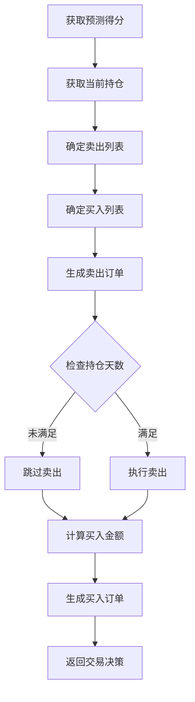

# signal_strategy.py

## 模块概述

该模块实现了基于信号的投资组合策略，包括：

- **BaseSignalStrategy**: 信号策略基类
- **TopkDropoutStrategy**: Topk 丢弃策略
- **WeightStrategyBase**: 权重策略基类
- **EnhancedIndexingStrategy**: 增强指数策略

## 类定义

### BaseSignalStrategy

基于信号的投资组合策略基类。

#### 构造方法参数

| 参数名 | 类型 | 默认值 | 说明 |
|--------|------|----------|------|
| signal | Signal or tuple or list or dict or str | None | 信号源 |
| model | BaseModel | None | 模型（已弃用） |
| dataset | Dataset | None | 数据集（已弃用） |
| risk_degree | float | 0.95 | 风险度（仓位比例） |
| trade_exchange | Exchange | None | 交易所对象 |
| level_infra | LevelInfrastructure | None | 级别基础设施 |
| common_infra | CommonInfrastructure | None | 公共基础设施 |

**signal 参数类型：**

- `Signal`: 信号对象
- `(BaseModel, Dataset)`: 模型和数据集元组
- `list` or `dict`: 自定义信号
- `str`: 预测结果文件路径
- `pd.Series` or `pd.DataFrame`: 直接的预测数据

#### 方法

##### get_risk_degree(trade_step=None)

获取风险度（仓位比例）。

**参数说明：**

- **trade_step**: 当前交易步骤（用于动态调整）

**返回值：**

- **float**: 风险度，默认 0.95

**扩展性：**

子类可以重写此方法实现动态仓位管理（市场择时）。

---

### TopkDropoutStrategy

Topk 丢弃策略，定期调整投资组合。

#### 构造方法参数

| 参数名 | 类型 | 默认值 | 说明 |
|--------|------|----------|------|
| topk | int | - | 持有股票数量 |
| n_drop | int | - | 每次调仓替换的股票数 |
| method_sell | str | "bottom" | 卖出方法："bottom" 或 "random" |
| method_buy | str | "top" | 买入方法："top" 或 "random" |
| hold_thresh | int | 1 | 最小持仓天数 |
| only_tradable | bool | False | 是否只交易可交易股票 |
| forbid_all_trade_at_limit | bool | True | 涨跌停时是否禁止交易 |
| **kwargs | - | - | 传递给基类的参数 |

**method_sell 选项：**

- `"bottom"`: 卖出得分最低的 n_drop 只股票
- `"random"`: 随机选择 n_drop 只股票卖出

**method_buy 选项：**

- `"top"`: 买入得分最高的股票
- `"random"`: 从 topk 候选股票中随机选择

#### 策略逻辑



**持仓更新流程：**

1. 获取当前持仓股票的得分排名
2. 确定要卖出的股票：
   - 如果 method_sell="bottom": 卖出得分最低的
   - 如果 method_sell="random": 随机选择
3. 确定要买入的股票：
   - 如果 method_buy="top": 买入得分最高的
   - 如果 method_buy="random": 从 topk 候选中随机选择
4. 检查持仓天数限制
5. 生成并执行交易订单

#### 方法

##### generate_trade_decision(execute_result=None)

生成交易决策。

**返回值：**

- **TradeDecisionWO**: 交易决策对象

**处理流程：**

1. 获取预测得分
2. 根据当前持仓和新得分确定调仓方案
3. 生成卖出订单（考虑持仓天数限制）
4. 生成买入订单（均匀分配资金）
5. 返回交易决策

---

### WeightStrategyBase

基于权重的投资组合策略基类。

#### 构造方法参数

| 参数名 | 类型 | 默认值 | 说明 |
|--------|------|----------|------|
| order_generator_cls_or_obj | type or OrderGenerator | OrderGenWOInteract | 订单生成器类或对象 |
| **kwargs | - | - | 传递给基类的参数 |

#### 方法

##### generate_target_weight_position(score, current, trade_start_time, trade_end_time)

生成目标权重位置（需要子类实现）。

**参数说明：**

- **score** (pd.Series): 预测得分
- **current** (Position): 当前持仓
- **trade_start_time**: 交易开始时间
- **trade_end_time**: 交易结束时间

**返回值：**

- **dict**: 目标权重 {stock_id: weight}

**注意事项：**

- 这是一个抽象方法，子类必须实现
- 权重不包含现金

##### generate_trade_decision(execute_result=None)

生成交易决策。

**处理流程：**

1. 获取预测得分
2. 调用 `generate_target_weight_position` 获取目标权重
3. 使用订单生成器生成订单列表
4. 返回交易决策

---

### EnhancedIndexingStrategy

增强指数策略，在跟踪误差约束下优化投资组合。

#### 构造方法参数

| 参数名 | 类型 | 默认值 | 说明 |
|--------|------|----------|------|
| riskmodel_root | str | - | 风险模型根目录 |
| market | str | "csi500" | 基准指数 |
| turn_limit | float | None | 换仓率限制 |
| name_mapping | dict | {} | 文件名映射 |
| optimizer_kwargs | dict | {} | 优化器参数 |
| verbose | bool | False | |是否详细输出 |
| **kwargs | - | - | 传递给基类的参数 |

**风险模型目录结构：**

```
/path/to/riskmodel/
├── 20210101/
│   ├── factor_exp.{csv|pkl|h5}    # 因子暴露
│   ├── factor_cov.{csv|pkl|h5}    # 因子协方差
│   ├── specific_risk.{csv|pkl|h5}  # 特质风险
│   └── blacklist.{csv|pkl|h5}      # 黑名单（可选）
├── 20210102/
/
```

#### 优化问题

```math
max_w   d @ r - λ * (v @ Σ_b @ v + σ_u² @ d²)
s.t.   w ≥ 0
        Σw = 1
        Σ|w - w₀| ≤ δ
        d ≥ -b_dev
        d ≤ b_dev
        v ≥ -f_dev
        v ≤ f_dev
```

其中：
- d = w - w_b: 基准偏离
- v = d @ F: 因子偏离
- Σ_b: 因子协方差矩阵
- σ_u²: 特质风险

#### 方法

##### get_risk_data(date)

获取指定日期的风险数据。

**参数说明：**

- **date** (pd.Timestamp): 查询日期

**返回值：**

- **tuple**: (factor_exp, factor_cov, specific_risk, universe, blacklist)
  - factor_exp: 因子暴露矩阵
  - factor_cov: 因子协方差矩阵
  - specific_risk: 特质风险向量
  - universe: 股票列表
  - blacklist: 黑市单列表

##### generate_target_weight_position(score, current, trade_start_time, trade_end_time)

生成目标权重位置。

**处理流程：**

1. 加载风险数据（使用前一交易日数据）
2. 处理预测得分（填充缺失值）
3. 获取当前权重（归一化）
4. 加载基准权重
5. 确定股票可交易性
6. 设置强制持有和强制卖出掩码
7. 调用优化器求解优化问题
8. 返回优化后的权重

## 使用示例

### TopkDropoutStrategy

```python
from qlib.contrib.strategy import TopkDropoutStrategy
from qlib.model import LightGBM
from qlib.data import Dataset

# 创建策略
strategy = TopkDropoutStrategy(
    signal=(LightGBM(), Dataset(...)),
    topk=30,                    # 持有30只股票
    n_drop=5,                    # 每次调仓替换5只
    method_sell="bottom",          # 卖出得分最低的
    method_buy="top",            # 买入得分最高的
    hold_thresh=1,               # 至少持有1天
    only_tradable=True,          # 只交易可交易股票
    forbid_all_trade_at_limit=True, # 涨跌停时禁止交易
    risk_degree=0.95             # 95%仓位
)

# 使用策略
portfolio = execute_strategy(
    strategy=strategy,
    executor=executor,
    ...
)
```

### EnhancedIndexingStrategy

```python
from qlib.contrib.strategy import EnhancedIndexingStrategy

# 创建策略
strategy = EnhancedIndexingStrategy(
    signal=(model, dataset),
    riskmodel_root="/path/to/riskmodel",
    market="csi500",
    turn_limit=0.2,
    name_mapping={
        "factor_exp": "factor_exp.pkl",
        "factor_cov": "factor_cov.pkl",
        "specific_risk": "specific_risk.pkl",
        "blacklist": "blacklist.pkl"
    },
    optimizer_kwargs={
        "lamb": 1.0,      # 风险厌恶参数
        "delta": 0.2,     # 换仓率限制
        "b_dev": 0.01,    # 基准偏离限制
        "f_dev": [0.1, 0.1, 0.1]  # 因子偏离限制
    },
    verbose=True
)
```

### 自定义权重策略

```python
from qlib.contrib.strategy import WeightStrategyBase

class EqualWeightStrategy(WeightStrategyBase):
    def generate_target_weight_position(
        self, score, current,
        trade_start_time, trade_end_time
    ):
        # 选择 topk 股票
        topk_stocks = score.nlargest(30).index.tolist()

        # 平均分配权重
        weight_per_stock = 1.0 / len(topk_stocks)
        target_weights = {stock: weight_per_stock for stock in topk_stocks}

        return target_weights

# 使用
strategy = EqualWeightStrategy(
    signal=(model, dataset),
    risk_degree=0.95
)
```

## 注意事项

1. **TopkDropoutStrategy**:
   - 确保 topk > n_drop
   - 持仓天数限制影响策略灵活性
   - 随机方法可能不稳定

2. **EnhancedIndexingStrategy**:
   - 需要准备风险模型数据
   - 优化可能失败，需要异常处理
   - 计算成本较高

3. **共同注意事项**:
   - 信号更新频率影响策略表现
   - 交易成本对收益有显著影响
   - 需要充分的回测验证

4. **风险控制**:
   - 设置合理的风险限制
   - 监控投资组合风险指标
   - 定期评估策略表现

## 相关文档

- [order_generator.py 文档](./order_generator.md) - 订单生成器
- [cost_control.py 文档](./cost_control.md) - 软Topk策略
- [optimizer/](./optimizer/) - 投资组合优化器
