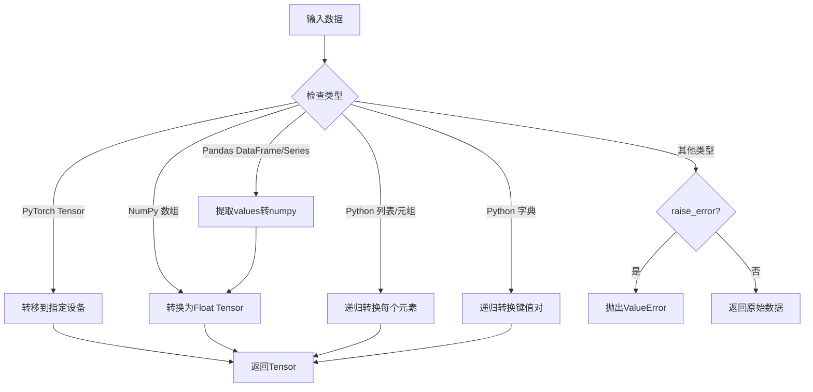

# QLib 贡献模块 - torch.py 文档

## 模块概述

`qlib.contrib.torch` 是 QLib 项目中的一个辅助模块，提供了数据类型转换功能，方便用户在使用 PyTorch 进行量化投资模型开发时，能够快速将各种数据类型（如 NumPy 数组、Pandas DataFrame/Series、Python 容器等）转换为 PyTorch Tensor 格式。

该模块的核心设计理念是提供一个简单易用的统一接口，处理各种常见数据类型到 PyTorch Tensor 的转换，同时保持与 QLib 核心功能的解耦。

## 核心函数

### data_to_tensor

#### 函数定义
```python
def data_to_tensor(data, device="cpu", raise_error=False):
```

#### 功能描述
将各种数据类型转换为 PyTorch Tensor 格式，并支持指定设备（CPU 或 GPU）。

#### 参数说明
| 参数名         | 类型    | 默认值 | 描述                                                                 |
|----------------|---------|--------|----------------------------------------------------------------------|
| `data`         | 任意类型 | -      | 需要转换的数据，可以是以下类型：PyTorch Tensor、Pandas DataFrame/Series、NumPy 数组、Python 列表/元组、Python 字典 |
| `device`       | str     | "cpu"  | 目标设备，可以是 "cpu" 或 "cuda"（GPU），也可以是具体的设备索引如 "cuda:0" |
| `raise_error`  | bool    | False  | 当遇到不支持的数据类型时，是否抛出异常。False 表示返回原始数据，True 表示抛出 ValueError |

#### 返回值
- 如果输入是 PyTorch Tensor：返回转移到指定设备的 Tensor
- 如果输入是 Pandas DataFrame/Series：返回转换后的 Float Tensor
- 如果输入是 NumPy 数组：返回转换后的 Float Tensor
- 如果输入是 Python 列表/元组：返回包含转换后元素的列表
- 如果输入是 Python 字典：返回键值对都经过转换的字典
- 如果输入是不支持的类型：根据 raise_error 参数决定返回原始数据或抛出异常

#### 类型转换流程



#### 使用示例

##### 1. 基本类型转换

```python
import torch
import numpy as np
import pandas as pd
from qlib.contrib.torch import data_to_tensor

# 转换 NumPy 数组
np_array = np.array([1, 2, 3, 4])
tensor = data_to_tensor(np_array)
print(f"NumPy数组转Tensor: {type(tensor)}, {tensor}")
# 输出: NumPy数组转Tensor: <class 'torch.Tensor'>, tensor([1., 2., 3., 4.])

# 转换 Pandas Series
pd_series = pd.Series([10, 20, 30])
tensor = data_to_tensor(pd_series)
print(f"Pandas Series转Tensor: {type(tensor)}, {tensor}")
# 输出: Pandas Series转Tensor: <class 'torch.Tensor'>, tensor([10., 20., 30.])

# 转换 Pandas DataFrame
pd_df = pd.DataFrame({'a': [1, 2], 'b': [3, 4]})
tensor = data_to_tensor(pd_df)
print(f"Pandas DataFrame转Tensor: {type(tensor)}, {tensor}")
# 输出: Pandas DataFrame转Tensor: <class 'torch.Tensor'>, tensor([[1., 3.], [2., 4.]])
```

##### 2. GPU 设备支持

```python
# 检查是否有可用的GPU
if torch.cuda.is_available():
    # 转换到GPU
    np_array = np.array([1, 2, 3])
    tensor = data_to_tensor(np_array, device="cuda")
    print(f"GPU Tensor: {type(tensor)}, {tensor.device}")
    # 输出: GPU Tensor: <class 'torch.Tensor'>, cuda:0
```

##### 3. 处理复杂数据结构

```python
# 转换包含多种类型的字典
complex_data = {
    'tensor': torch.tensor([1, 2]),
    'numpy': np.array([3, 4]),
    'pandas': pd.Series([5, 6]),
    'list': [7, 8, np.array([9, 10])]
}

converted_data = data_to_tensor(complex_data, device="cpu")
print(f"字典转换结果: {type(converted_data)}")
print(f"  'tensor' 类型: {type(converted_data['tensor'])}, 值: {converted_data['tensor']}")
print(f"  'numpy' 类型: {type(converted_data['numpy'])}, 值: {converted_data['numpy']}")
print(f"  'pandas' 类型: {type(converted_data['pandas'])}, 值: {converted_data['pandas']}")
print(f"  'list' 类型: {type(converted_data['list'])}, 值: {converted_data['list']}")
```

##### 4. 处理不支持的数据类型

```python
# 不抛出异常的情况
data = {"name": "test", "value": 10}
converted = data_to_tensor(data)
print(f"不抛出异常: {converted}")
# 输出: 不抛出异常: {'name': 'test', 'value': 10}

# 抛出异常的情况
try:
    data_to_tensor({"name": "test"}, raise_error=True)
except ValueError as e:
    print(f"抛出异常: {e}")
# 输出: 抛出异常: Unsupported data type: <class 'str'>.
```

#### 代码实现细节

```python
def data_to_tensor(data, device="cpu", raise_error=False):
    if isinstance(data, torch.Tensor):
        # 处理PyTorch Tensor类型
        if device == "cpu":
            return data.cpu()
        else:
            return data.to(device)
    if isinstance(data, (pd.DataFrame, pd.Series)):
        # 处理Pandas DataFrame/Series类型
        return data_to_tensor(torch.from_numpy(data.values).float(), device)
    elif isinstance(data, np.ndarray):
        # 处理NumPy数组类型
        return data_to_tensor(torch.from_numpy(data).float(), device)
    elif isinstance(data, (tuple, list)):
        # 处理Python列表/元组类型（递归转换）
        return [data_to_tensor(i, device) for i in data]
    elif isinstance(data, dict):
        # 处理Python字典类型（递归转换键值对）
        return {k: data_to_tensor(v, device) for k, v in data.items()}
    else:
        # 处理不支持的类型
        if raise_error:
            raise ValueError(f"Unsupported data type: {type(data)}.")
        else:
            return data
```

#### 使用场景

该函数在 QLib 的 PyTorch 模型开发中非常实用，特别是在以下场景：

1. **数据预处理阶段**：将 QLib 数据加载器返回的数据转换为模型可接受的 Tensor 格式
2. **模型训练阶段**：准备训练数据和标签，转换为 GPU 张量以加速计算
3. **特征工程阶段**：将计算得到的特征从 Pandas/NumPy 格式转换为 Tensor 进行进一步处理
4. **结果后处理**：将模型输出的 Tensor 转换回 NumPy 数组或 Pandas DataFrame 以便分析和可视化

#### 性能优化建议

- 对于大型数据集，建议在数据加载阶段就直接使用 Tensor 格式，避免频繁的类型转换
- 当需要在 CPU 和 GPU 之间频繁传输数据时，考虑使用 `pin_memory=True` 来加速数据传输
- 对于内存敏感的应用，使用 `torch.no_grad()` 和及时释放不再需要的张量来管理内存

## 模块总结

`qlib.contrib.torch` 模块提供了一个简单而强大的数据类型转换工具，使得用户在 QLib 框架内使用 PyTorch 进行量化投资研究时，能够更加专注于模型开发而非数据格式转换。该模块具有以下特点：

1. **统一性**：提供单一接口处理多种数据类型转换
2. **灵活性**：支持递归转换复杂数据结构
3. **易用性**：默认行为安全，不强制要求输入类型
4. **扩展性**：架构设计便于未来添加更多数据类型支持

通过使用该模块，用户可以显著减少在数据预处理阶段的代码量，提高开发效率。
