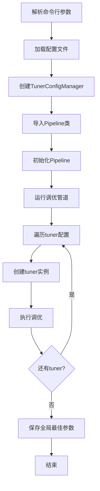

# launcher.py

## 模块概述

该模块是 Qlib Tuner 的启动入口，用于运行参数调优管道。

## 功能说明

`run()` 函数是主入口，执行以下操作：

1. 导入管道类 `Pipeline`
2. 初始化调优配置管理器
3. 创建管道实例
4. 开始调优

## 使用方式

### 命令行使用

```bash
# 使用配置文件运行调优
python -m qlib.contrib.tuner.launcher -c /path/to/config.yaml
```

### 命令行参数

| 参数 | 简称 | 必需 | 说明 |
|------|--------|------|------|
| -c, --config_path | config_path | 是 | 配置文件路径 |

## 配置文件结构

### 完整配置示例

```yaml
# 实验配置
experiment:
  name: tuner_experiment
  dir: ./exp_dir
  tuner_ex_dir: ./tuner_exp
  estimator_ex_dir: ./estimator_exp
  tuner_module_path: qlib.contrib.tuner.tuner
  tuner_class: QLibTuner

# 优化标准
optimization_criteria:
  report_type: pred_long
  report_factor: information_ratio
  optim_type: max

# 时间段
time_period:
  train: (2018-01-01, 2020-12-31)
  valid: (2021-01-01, 2021-06-30)
  test: (2021-07-01, 2021-12-31)

# 数据配置
data:
  class: DataHandlerLP
  module_path: qlib.data.dataset.handler
  kwargs:
    instruments: all
    start_time: 2018-01-01
    end_time: 2021-12-31

# 回测配置
backtest:
  exchange: Exchange
  start_time: 2021-07-01
  end_time: 2021-12-31

# 调优管道
tuner_pipeline:
  # 第一个tuner
  - model:
      class: LGBModel
      module_path: qlib.contrib.model.lgboost
      space: LGModelSpace
    strategy:
      class: TopkDropoutStrategy
      module_path: qlib.contrib.contrib.strategy
      space: TopkAmountStrategySpace
    max_evals: 50

  # 第二个tuner（可选）
  - model:
      class: LGBModel
      module_path: qlib.contrib.model.lgboost
      space: LGModelSpace
    strategy:
      class: TopkDropoutStrategy
      module_path: qlib.contrib.contrib.strategy
      space: TopkAmountStrategySpace
    max_evals: 50
```

## 执行流程



## 输出内容

### 日志输出

```
Searching params: {'model_space': {...}, 'strategy_space': {...}}
Local best params: {'model_space': {...}, 'strategy_space': {...}}
Finished searching best parameters in Tuner 0.
Finished tuner pipeline.
Best Tuner id: 0.
Global best parameters: {...}
You can check the best parameters at /path/to/global_best_params.json
```

### 生成的文件

- `tuner_exp_dir/tuner_config.yaml`: 调优器配置备份
- `tuner_exp_dir/global_best_params.json`: 全局最佳参数
- `estimator_ex_dir/estimator_experiment_0/local_best_params.json`: 局部最佳参数

## 注意事项

1. **配置文件**:
   - 必须是有效的 YAML 文件
   - 路径可以是相对路径或绝对路径

2. **模块导入**:
   - 确保 `qlib` 已正确安装
   - 模块路径要可访问

3. **执行环境**:
   - 需要 `hyperopt` 依赖
   - 确保 Python 环境正确配置

4. **日志级别**:
   - 使用 `QLIB_LOG_LEVEL` 环境变量控制
   - 建议设置适当的日志级别

## 相关文档

- [tuner.py 文档](./tuner.md) - Tuner实现
- [pipeline.py 文档](./pipeline.md) - 管道实现
- [config.py 文档](./config.md) - 配置管理
- [space.py 文档](./space.md) - 搜索空间定义
