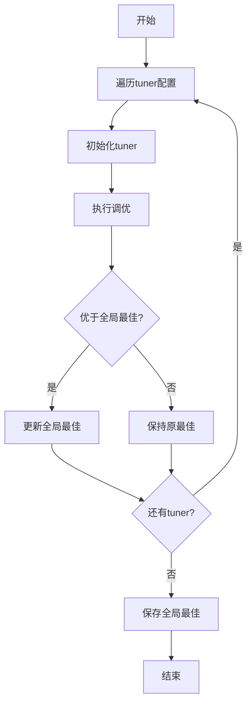

# pipeline.py

## 模块概述

该模块实现了参数调优管道，管理多个tuner的执行和结果比较。

## 类定义

### Pipeline

参数调优管道类，顺序执行多个tuner并记录全局最佳结果。

#### 常量定义

```python
GLOBAL_BEST_PARAMS_NAME = "global_best_params.json"
```

#### 构造方法参数

| 参数名 | 类型 | 必需 | 说明 |
|--------|------|------|------|
| tuner_config_manager | TunerConfigManager | 是 | 调优配置管理器 |

**配置内容：**

- `pipeline_ex_config`: 实验配置
- `optim_config`: 优化标准
- `time_config`: 时间段配置
- `pipeline_config`: tuner列表
- `data_config`: 数据配置
- `backtest_config`: 回测配置
- `qlib_client_config`: Qlib客户端配置

#### 属性

- `global_best_res` (float): 全局最佳结果
- `global_best_params` (dict): 全局最佳参数
- `best_tuner_index` (int): 最佳tuner索引

#### 方法

##### run()

运行调优管道。

**处理流程：**

1. 遍历所有tuner配置
2. 初始化每个tuner
3. 执行调优
4. 更新全局最佳结果
5. 保存全局最佳参数

**执行流程图：**



##### init_tuner(tuner_index, tuner_config)

初始化tuner实例。

**参数说明：**

- **tuner_index** (int): tuner索引
- **tuner_config** (dict): tuner配置

**返回值：**

- **Tuner**: tuner实例

**配置处理：**

1. 添加实验配置到tuner_config
2. 添加数据配置
3. 添加回测配置
4. 更新训练器配置（添加时间参数）
5. 导入tuner类模块
6. 创建tuner实例

##### save_tuner_exp_info()

保存tuner实验信息。

**保存内容：**

- 全局最佳参数
- 最佳tuner索引
- 保存路径信息

## 使用示例

### 基本使用

```python
from qlib.contrib.tuner.config import TunerConfigManager
from qlib.contrib.tuner.pipeline import Pipeline

# 加载配置
config_manager = TunerConfigManager("/path/to/config.yaml")

# 创建管道
pipeline = Pipeline(config_manager)

# 运行管道
pipeline.run()
```

### 输出示例

```
INFO - Tuner 0 starting...
INFO - Searching params: {'model_space': {...}, 'strategy_space': {...}}
INFO - Tuner 0 finished
INFO - Local best params: {'model_space': {...}, 'strategy_space': {...}}
INFO - Finished searching best parameters in Tuner 0.

INFO - Tuner 1 starting...
INFO - Searching params: {'model_space': {...}, 'strategy_space': {...}}
INFO - Tuner 1 finished
INFO - Local best params: {'model_space': {...}, 'strategy_space': {...}}
INFO - Finished searching best parameters in Tuner 1.

INFO - Finished tuner pipeline.
INFO - Best Tuner id: 0.
INFO - Global best parameters: {'model_space': {...}, 'strategy_space': {...}}
INFO - You can check best parameters at /path/to/tuner_ex_dir/global_best_params.json
```

### 访问结果

```python
# 运行管道后访问结果
pipeline.run()

# 获取全局最佳结果
print(f"Best tuner index: {pipeline.best_tuner_index}")
print(f"Best result: {pipeline.global_best_res}")
print(f"Best parameters: {pipeline.global_best_params}")

# 获取特定tuner的结果
tuner_0 = pipeline.init_tuner(0, pipeline_config[0])
print(f"Tuner 0 best: {tuner_0.best_res}")
print(f"Tuner 0 params: {tuner_0.best_params}")
```

## 配置示例

### 单模型单策略

```yaml
# config.yaml
experiment:
  name: single_model_tuner
  dir: ./experiments

optimization_criteria:
  report_type: pred_long
  report_factor: information_ratio
  optim_type: max

data:
  class: DataHandlerLP
  module_path: qlib.data.dataset.handler
  kwargs:
    instruments: all
    start_time: 2018-01-01
    end_time: 2021-12-31

time_period:
  train: (2018-01-01, 2020-12-31)
  valid: (2021-01-01, 2021-06-30)
  test: (2021-07-01, 2021-12-31)

backtest:
  exchange: Exchange
  start_time: 2021-07-01
  end_time: 2021-12-31

tuner_pipeline:
  - model:
      class: LGBModel
      module_path: qlib.contrib.model.lgboost
      space: LGModelSpace
    strategy:
      class: TopkDropoutStrategy
      module_path: qlib.contrib.strategy
      space: TopkAmountStrategySpace
    max_evals: 50
```

### 多模型对比

```yaml
tuner_pipeline:
  # LightGBM + TopkDropoutStrategy
  - model:
      class: LGBModel
      module_path: qlib.contrib.model.lgboost
      space: LGModelSpace
    strategy:
      class: TopkDropoutStrategy
      module_path: qlib.contrib.strategy
      space: TopkAmountStrategySpace
    max_evals: 50

  # XGBoost + TopkDropoutStrategy
  - model:
      class: XGBModel
      module_path: qlib.contrib.model.xgboost
      space: XGBoostSpace
    strategy:
      class: TopkDropoutStrategy
      module_path: qlib.contrib.strategy
      space: TopkAmountStrategySpace
    max_evals: 50

  # LightGBM + SoftTopkStrategy
  - model:
      class: LGBModel
      module_path: qlib.contrib.model.lgboost
      space: LGModelSpace
    strategy:
      class: SoftTopkStrategy
      module_path: qlib.contrib.strategy
      space: SoftTopkStrategySpace
    max_evals: 50
```

### 不同数据标签

```yaml
tuner_pipeline:
  - model:
      class: LGBModel
      module_path: qlib.contrib.model.lgboost
      space: LGModelSpace
    strategy:
      class: TopkDropoutStrategy
      module_path: qlib.contrib.strategy
           space: TopkAmountStrategySpace
    data_label:
      space: QLibDataLabelSpace
    max_evals: 50
```

## 注意事项

1. **执行顺序**:
   - tuner按顺序执行
   - 前面的tuner结果影响全局最佳
   - 总是记录最优结果

2. **配置管理**:
   - 确保配置文件格式正确
   - 验证参数有效性
   - 检查模块路径可访问

3. **结果保存**:
   - 全局最佳参数保存到指定目录
   - 每个tuner也保存局部最佳参数
   - 便于后续复现和分析

4. **性能考虑**:
   - 多tuner会显著增加总执行时间
   - 考虑并行执行（如果支持）
   - 监控进度和资源使用

5. **错误处理**:
   - 单个tuner失败不影响其他tuner
   - 记录错误信息便于调试
   - 提供有意义的错误消息

## 自定义管道

### 扩展Pipeline

```python
from qlib.contrib.tuner.pipeline import Pipeline

class CustomPipeline(Pipeline):
    def run(self):
        """自定义管道执行逻辑"""
        # 前处理
        self._preprocess()

        # 运行原始管道
        super().run()

        # 后处理
        self._postprocess()

    def _preprocess(self):
        """执行前处理"""
        # 准备数据、验证配置等
        pass

    def _postprocess(self):
        """执行后处理"""
        # 分析结果、生成报告等
        pass
```

### 并行执行

```python
from concurrent.futures import ThreadPoolExecutor

class ParallelPipeline(Pipeline):
    def run(self):
        """并行执行多个tuner"""
        with ThreadPoolExecutor(max_workers=4) as executor:
            futures = []
            for i, tuner_config in enumerate(self.pipeline_config):
                tuner = self.init_tuner(i, tuner_config)
                future = executor.submit(tuner.tune)
                futures.append((future, tuner))

            for future, tuner in futures:
                result = future.result()
                if self.global_best_res is None or \
                   self.global_best_res > tuner.best_res:
                    self.global_best_res = tuner.best_res
                    self.global_best_params = tuner.best_params
                    self.best_tuner_index = tuner.config.get("id")

        self.save_tuner_exp_info()
```

## 相关文档

- [tuner.py 文档](./tuner.md) - Tuner实现
- [config.py 文档](./config.md) - 配置管理
- [space.py 文档](./space.md) - 搜索空间定义
- [launcher.py 文档](./launcher.md) - 启动器
