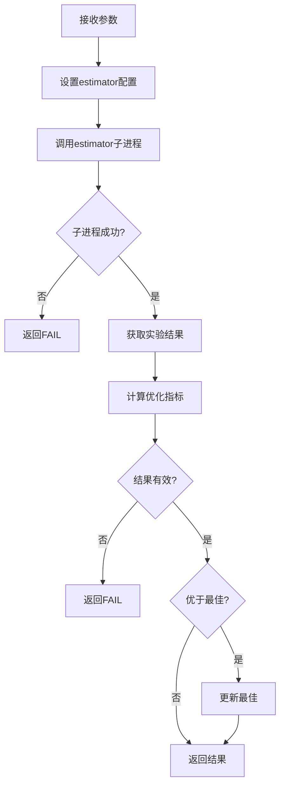

# tuner.py

## 模块概述

该模块实现了参数调优的基础框架，包括：

- **Tuner**: 调优器抽象基类
- **QibTuner**: Qlib专用调优器实现

## 类定义

### Tuner

参数调优器抽象基类，使用 hyperopt 进行贝叶斯优化。

#### 构造方法参数

| 参数名 | 类型 | 必需 | 说明 |
|--------|------|------|------|
| tuner_config | dict | 是 | 调优器配置 |
| optim_config | dict | 是 | 优化标准配置 |

**tuner_config 内容：**

```python
{
    "model": {
        "class": "LGBModel",
        "module_path": "qlib.contrib.model.lgboost",
        "space": "LGModelSpace"
    },
    "strategy": {
        "class": "TopkDropoutStrategy",
        "module_path": "qlib.contrib.contrib.strategy",
        "space": "TopkAmountStrategySpace"
    },
    "max_evals": 50,
    "experiment": {
        "name": "estimator_exp",
        "id": 0,
        "dir": "./exp_dir"
    },
    "data": {...},
    "backtest": {...},
    ...
}
```

**optim_config 内容：**

```python
{
    "report_type": "pred_long",      # 报告类型
    "report_factor": "information_ratio",  # 报告因子
    "optim_type": "max"            # 优化类型
}
```

#### 属性

- **max_evals** (int): 最大评估次数
- **ex_dir** (str): 实验目录
- **best_params** (dict): 最佳参数
- **best_res** (float): 最佳结果
- **space** (dict): 搜索空间

#### 方法

##### tune()

执行参数调优。

**处理流程：**

1. 使用 hyperopt.fmin 进行贝叶斯优化
2. 使用 TPE 算法
3. 记录和保存最佳参数

**搜索算法：**

- 使用 `tpe.suggest` (Tree-structured Parzen Estimator）
- 适用于连续和离散参数混合的搜索空间

##### objective(params) [抽象]

目标函数，需要子类实现。

**参数说明：**

- **params** (dict): 当前参数组合

**返回值：**

- **dict**: `{"loss": float, "status": str}`

**状态说明：**

- `STATUS_OK`: 评估成功
- `STATUS_FAIL`: 评估失败

##### setup_space() [抽象]

设置搜索空间，需要子类实现。

**返回值：**

- **dict**: 搜索空间定义

##### save_local_best_params() [抽象]

保存局部最佳参数，需要子类实现。

---

### QLibTuner

Qlib专用调优器，支持模型和策略的联合调优。

#### 常量定义

```python
ESTIMATOR_CONFIG_NAME = "estimator_config.yaml"
EXP_INFO_NAME = "exp_info.json"
EXP_RESULT_DIR = "sacred/{}"
EXP_RESULT_NAME = "analysis.pkl"
LOCAL_BEST_PARAMS_NAME = "local_best_params.json"
```

#### 方法

##### objective(params)

评估给定参数组合的性能。

**参数说明：**

- **params** (dict): 包含 `model_space`, `strategy_space`, 可选 `data_label_space`

**返回值：**

- **dict**: `{"loss": float, "status": str}`

**评估流程：**



##### fetch_result()

获取实验结果并计算优化指标。

**返回值：**

- **float**: 优化指标值

**报告类型说明：**

1. **model**: 模型性能
   - `model_score`: 模型得分（均值）
   - `model_pearsonr`: 皮尔逊相关系数（距离1）

2. **回测结果**:
   - `pred_long`: 做多结果
   - `pred_long_short`: 多空结果
   - `pred_short`: 做空结果
   - `excess_return_without_cost`: 不含成本超额收益
   - `excess_return_with_cost`: 含成本超额收益

**优化类型说明：**

- `min`: 最小化指标
- `max`: 最大化指标（返回负值）
- `correlation`: 最大化相关（返回距离1）

##### setup_estimator_config(params)

设置estimator配置文件。

**参数说明：**

- **params** (dict): 模型和策略参数

**返回值：**

- **str**: 配置文件路径

**处理流程：**

1. 深拷贝调优器配置
2. 更新模型参数
3. 更新策略参数
4. 如果提供，更新数据标签参数
5. 保存为 YAML 文件

##### setup_space()

设置搜索空间。

**返回值：**

- **dict**: 搜索空间

**处理流程：**

1. 导入模型空间
2. 导入策略空间
3. 可选导入数据标签空间
4. 组合成完整的搜索空间

##### save_local_best_params()

保存局部最佳参数到 JSON 文件。

## 使用示例

### 自定义Tuner

```python
from qlib.contrib.tuner.tuner import Tuner
from hyperopt import hp

class MyTuner(Tuner):
    def setup_space(self):
        """定义搜索空间"""
        space = {
            "lr": hp.loguniform("lr", np.log(0.0001), np.log(0.1)),
            "n_estimators": hp.choice("n_estimators", [100, 200, 500]),
            "max_depth": hp.choice("max_depth", [3, 5, 7])
        }
        return space

    def objective(self, params):
        """评估参数组合"""
        # 运行实验
        result = run_experiment(params)

        # 返回结果
        return {
            "loss": -result["metric"],  # 负值因为要最大化
            "status": STATUS_OK
        }

    def save_local_best_params(self):
        """保存最佳参数"""
        import json
        with open("best_params.json", "w") as f:
            json.dump(self.best_params, f)

# 使用
tuner = MyTuner(tuner_config, optim_config)
tuner.tune()
```

### QLibTuner

```python
from qlib.contrib.tuner.tuner import QLibTuner

# 创建tuner
tuner = QLibTuner(
    tuner_config=tuner_config,
    optim_config=optim_config
)

# 执行调优
tuner.tune()

# 获取最佳参数
best_params = tuner.best_params
best_result = tuner.best_res

print(f"Best parameters: {best_params}")
print(f"Best result: {best_result}")
```

## 搜索空间定义

### Hyperopt搜索空间

```python
from hyperopt import hp

# 连续空间
space = {
    "learning_rate": hp.loguniform("lr", -7, -2),  # [1e-7, 1e-2]
    "dropout": hp.uniform("dropout", 0.0, 0.5)
}

# 离散空间
space = {
    "n_estimators": hp.choice("n_estimators", [100, 200, 500]),
    "max_depth": hp.choice("max_depth", [3, 5, 7])
}

# 混合空间
space = {
    "learning_rate": hp.loguniform("lr", -7, -2),
    "n_estimators": hp.choice("n_estimators", [100, 200, 500]),
    "max_depth": hp.choice("max_depth", [3, 5, 7])
}
```

## 注意事项

1. **QibTuner**:
   - 需要已安装 `estimator` 命令行工具
   - 实验结果要有正确的格式
   - 确保实验目录可写

2. **优化指标**:
   - 选择合适的报告因子
   - 确保优化类型与目标一致
   - 处理可能的异常情况

3. **搜索空间**:
   - 合理设置参数范围
   - 避免过大或过小的值
   - 使用对数空间学习率和尺度参数

4. **性能考虑**:
   - 谑整 `max_evals` 平衡精度和速度
   - 使用并行加速（如果支持）
   - 缓存中间结果

5. **日志和监控**:
   - 记录每次评估的参数和结果
   - 监控优化进度
   - 保存最佳配置便于复现

## 相关文档

- [space.py 文档](./space.md) - 搜索空间定义
- [pipeline.py 文档](./pipeline.md) - 管道实现
- [config.py 文档](./config.md) - 配置管理
- [launcher.py 文档](./launcher.md) - 启动器
