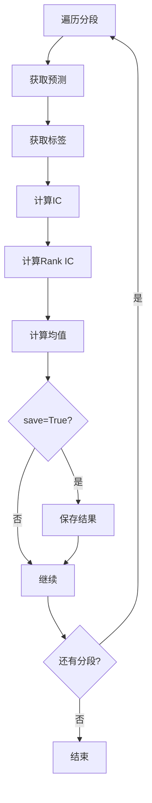
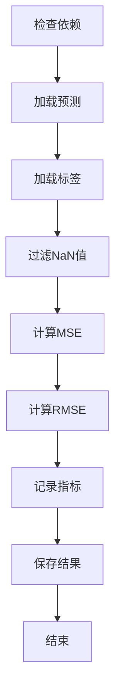

# record_temp.py

## 模块概述

该模块实现了实验记录相关的类，用于生成和评估模型预测结果。

## 类定义

### MultiSegRecord

多段信号记录类，用于生成多段的信号预测并评估性能。

#### 构造方法参数

| 参数名 | 类型 | 必需 | 说明 |
|--------|------|------|------|
| model | BaseModel | 是 | 已训练的模型实例 |
| dataset | DatasetH | 是 | 数据集实例 |
| recorder | Recorder | 否 | 实验记录器 |

#### 方法

##### generate(segments, save=False)

生成多段预测并评估IC指标。

**参数说明：**

- **segments** (dict): 分段配置字典，格式为 `{段名: (起始时间, 结束时间)}`
- **save** (bool): 是否保存结果为artifacts

**处理流程：**



**IC计算：**

- **IC** (Information Coefficient): 预测与标签的Spearman相关系数
- **Rank IC**: 排名后的预测与标签的Spearman相关系数
- **ICIR**: 信息比率（IC均值 / IC标准差）
- **Rank ICIR**: 排名信息比率（Rank IC均值 / Rank IC标准差）

**输出示例：**

```
--- Results for train ((2018-01-01, 2020-12-31)) ---
IC: 0.0532%
ICIR: 0.2453%
Rank IC: 0.0481%
Rank ICIR: 0.2187%

--- Results for valid ((2021-01-01, 2021-06-30)) ---
IC: 0.0495%
ICIR: 0.2312%
Rank IC: 0.0453%
Rank ICIR: 0.2056%
```

**保存文件：**

- `results-{段名}.pkl`: 包含以下内容的字典
  - `all-IC`: 每日IC序列
  - `mean-IC`: IC均值
  - `all-Rank-IC`: 每日Rank IC序列
  - `mean-Rank-IC`: Rank IC均值

---

### SignalMseRecord

信号MSE记录类，用于计算预测的均方误差。

#### 类属性

```python
artifact_path = "sig_analysis"      # artifact路径
depend_cls = SignalRecord            # 依赖类
```

#### 构造方法参数

| 参数名 | 类型 | 必需 | 说明 |
|--------|------|------|------|
| recorder | Recorder | 是 | 实验记录器 |
| **kwargs | - | 否 | 传递给基类的参数 |

#### 方法

##### generate()

生成MSE评估指标。

**处理流程：**



**计算公式：**

```python
# MSE: 均方误差
MSE = mean((pred - label)²)

# RMSE: 均方根误差
RMSE = sqrt(MSE)
```

**指标记录：**

- `MSE`: 均方误差
- `RMSE`: 均方根误差

**保存文件：**

- `mse.pkl`: MSE值
- `rmse.pkl`: RMSE值

##### list()

列出生成的文件列表。

**返回值：**

- **list**: 生成的artifact文件名列表

**输出示例：**

```python
["mse.pkl", "rmse.pkl"]
```

## 使用示例

### MultiSegRecord

```python
from qlib.contrib.workflow import MultiSegRecord
from qlib.model import LightGBM
from qlib.data import DatasetH
from qlib.workflow import R

# 训练模型
model = LightGBM(...)
dataset = DatasetH(...)
model.fit(dataset)

# 创建记录器
with R.start_exp("multi_seg_exp"):
    recorder = R.get_recorder()

    # 创建多段记录器
    multi_rec = MultiSegRecord(
        model=model,
        dataset=dataset,
        recorder=recorder
    )

    # 定义分段
    segments = {
        "train": ("2018-01-01", "2020-12-31"),
        "valid": ("2021-01-01", "2021-06-30"),
        "test": ("2021-07-01", "2021-12-31")
    }

    # 生成预测和评估
    multi_rec.generate(segments, save=True)

    # 查看结果
    results = recorder.load_artifact("results-train.pkl")
    print(f"Train IC: {results['mean-IC']:.4f}")
```

### SignalMseRecord

```python
from qlib.contrib.workflow import SignalMseRecord
from qlib.workflow import R

# 在实验上下文中使用
with R.start_exp("signal_mse_exp"):
    recorder = R.get_recorder()

    # 假设已经有SignalRecord生成了预测和标签
    # signal_rec = SignalRecord(...)
    # signal_rec.generate()

    # 创建MSE记录器
    mse_rec = SignalMseRecord(recorder=recorder)

    # 生成MSE指标
    mse_rec.generate()

    # 列出生成的文件
    files = mse_rec.list()
    print(f"Generated files: {files}")

    # 加载MSE值
    mse = recorder.load_artifact("mse.pkl")
    rmse = recorder.load_artifact("rmse.pkl")

    print(f"MSE: {mse:.6f}")
    print(f"RMSE: {rmse:.6f}")
```

## 指标说明

### IC (Information Coefficient)

信息系数，衡量预测值与真实标签之间的相关性。

**计算方法：**

- 使用Spearman秩相关系数
- 按时间分组计算（每个交易日）

**解释：**

- IC > 0: 正相关，预测方向正确
- IC = 0: 无相关
- IC < 0: 负相关，预测方向错误
- |IC| > 0.05: 通常认为有预测能力

### Rank IC

排名后的信息系数，更关注排名而非绝对值。

**优点：**

- 对异常值更稳健
- 关注相对排序而非绝对预测

### ICIR (Information Ratio)

信息比率，衡量IC的稳定性。

**计算方法：**

```python
ICIR = mean(IC) / std(IC)
```

**解释：**

- ICIR > 1.0: IC表现稳定且有效
- ICIR 越高越好

### MSE (Mean Squared Error)

均方误差，衡量预测值与真实值的平均平方差异。

**计算方法：**

```python
MSE = mean((pred - label)²)
```

**解释：**

- MSE 越小越好
- 对异常值敏感

### RMSE (Root Mean Squared Error)

均方根误差，MSE的平方根。

**计算方法：**

```python
RMSE = sqrt(MSE)
```

**解释：**

- RMSE 的单位与原始数据相同
- 更易于解释

## 注意事项

1. **MultiSegRecord**:
   - 确保数据集是 DatasetH 类型
   - 分段时间要合理且有重叠
   - 模型要在指定时间范围内有效

2. **SignalMseRecord**:
   - 依赖于 SignalRecord 的输出
   - 自动处理 NaN 值
   - 同时计算 MSE 和 RMSE

3. **通用注意事项**:
   - 确保 recorder 正确配置
   - 预测和标签维度要匹配
   - 考虑计算时间和内存使用

4. **性能考虑**:
   - IC 计算对大数据集可能较慢
   - 考虑使用采样加速评估
   - 缓存中间结果

5. **结果解释**:
   - IC 指标用于评估预测质量
   - MSE 指标用于评估数值精度
   - 不同指标反映不同的性能方面

## 相关文档

- [MultiSegRecord](https://qlib.readthedocs.io/en/latest/component/workflow.html#multisegrecord) - 官方文档
- [SignalMseRecord](https://qlib.readthedocs.io/en/latest/component/workflow.html#signalmserecord) - 官方文档
