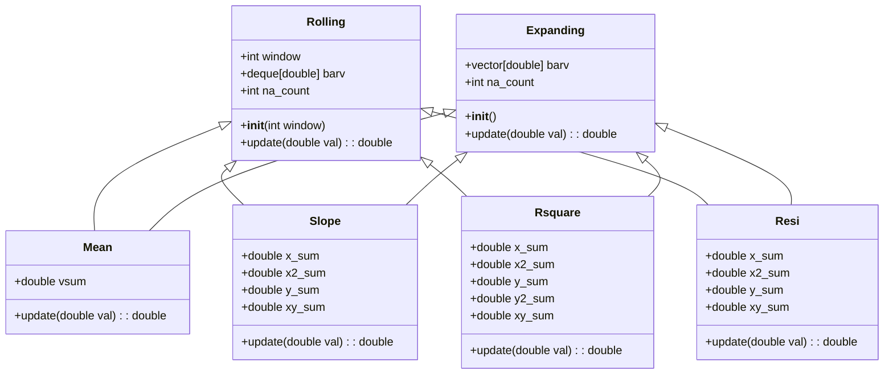

# QLib 数据处理高性能模块 (_libs)

## 模块概述

`qlib.data._libs` 是 QLib 量化投资平台的高性能数据处理核心模块，包含用 Cython 编写的优化算法实现，主要用于加速金融时间序列数据的滚动和扩展窗口计算。这些 Cython 模块提供了比纯 Python 实现更高效的计算性能，是 QLib 能够处理大规模金融数据的关键组件之一。

## 核心功能

该模块实现了以下核心功能：

1. **滚动窗口计算 (Rolling)**：基于固定窗口大小的时间序列分析
2. **扩展窗口计算 (Expanding)**：从起始点到当前位置的累积时间序列分析
3. **统计指标计算**：
   - 均值 (Mean)
   - 斜率 (Slope) - 线性回归斜率
   - 决定系数 (R-squared) - 回归拟合优度
   - 残差 (Residuals) - 回归残差

## 架构设计

### 模块结构

```
qlib/data/_libs/
├── __init__.py          # 空模块初始化文件
├── rolling.pyx          # 滚动窗口计算 Cython 实现
└── expanding.pyx        # 扩展窗口计算 Cython 实现
```

### 类层次结构



## 滚动窗口计算 (rolling.pyx)

### 基本原理

滚动窗口计算通过维护一个固定大小的滑动窗口，对金融时间序列数据进行连续统计计算。该模块使用 C++ 的 `deque` 数据结构实现高效的窗口操作。

### 主要类

1. **Rolling 基类**：定义滚动窗口计算的通用接口
2. **Mean 类**：计算滚动窗口内数据的均值
3. **Slope 类**：计算滚动窗口内数据的线性回归斜率
4. **Rsquare 类**：计算滚动窗口内数据的决定系数 (R²)
5. **Resi 类**：计算滚动窗口内数据的回归残差

### 对外接口

```python
def rolling_mean(np.ndarray a, int window):
    """计算滚动窗口均值"""

def rolling_slope(np.ndarray a, int window):
    """计算滚动窗口线性回归斜率"""

def rolling_rsquare(np.ndarray a, int window):
    """计算滚动窗口决定系数"""

def rolling_resi(np.ndarray a, int window):
    """计算滚动窗口回归残差"""
```

## 扩展窗口计算 (expanding.pyx)

### 基本原理

扩展窗口计算从时间序列的起始点开始，随着时间推移不断扩大窗口，计算累积统计指标。该模块使用 C++ 的 `vector` 数据结构实现动态窗口操作。

### 主要类

1. **Expanding 基类**：定义扩展窗口计算的通用接口
2. **Mean 类**：计算扩展窗口内数据的均值
3. **Slope 类**：计算扩展窗口内数据的线性回归斜率
4. **Rsquare 类**：计算扩展窗口内数据的决定系数 (R²)
5. **Resi 类**：计算扩展窗口内数据的回归残差

### 对外接口

```python
def expanding_mean(np.ndarray a):
    """计算扩展窗口均值"""

def expanding_slope(np.ndarray a):
    """计算扩展窗口线性回归斜率"""

def expanding_rsquare(np.ndarray a):
    """计算扩展窗口决定系数"""

def expanding_resi(np.ndarray a):
    """计算扩展窗口回归残差"""
```

## 使用示例

这些高性能函数主要通过 `qlib.data.ops` 模块中的高级接口间接使用，例如：

```python
from qlib.data.ops import Slope

# 计算收盘价的 20 天滚动斜率
feature = Slope("$close", 20)
```

在底层，这些操作会自动调用 Cython 实现的高性能函数。

## 性能优化

这些 Cython 模块通过以下方式实现高性能：

1. **Cython 静态类型声明**：使用 `cdef` 关键字声明静态类型，提高解释执行效率
2. **C++ 标准库**：使用 C++ 的 `deque` 和 `vector` 数据结构实现高效的窗口操作
3. **边界检查优化**：通过 `boundscheck=False` 禁用边界检查
4. **环绕检查优化**：通过 `wraparound=False` 禁用负数索引检查
5. **除法优化**：通过 `cdivision=True` 使用 C 风格的整数除法

## 编译与依赖

这些 Cython 模块需要编译成 C 扩展才能使用。QLib 提供了 `setup.py` 文件用于自动编译：

```bash
cd /home/firewind0/qlib
python setup.py build_ext --inplace
```

## 代码质量与维护

该模块遵循 QLib 项目的编码规范：
- 使用 Black 进行代码格式化
- 使用 Pylint 进行静态分析
- 使用 MyPy 进行类型检查
- 使用 conventional commits 风格的 Git 提交

## 错误处理与兼容性

- 处理了 NaN 值的统计计算
- 提供了导入错误处理机制，防止在未编译 Cython 模块的情况下程序崩溃
- 考虑了不同平台和 NumPy 版本的兼容性问题

## 总结

`qlib.data._libs` 是 QLib 量化投资平台的高性能数据处理核心模块，通过 Cython 实现了优化的滚动和扩展窗口计算算法。这些高性能函数为 QLib 处理大规模金融时间序列数据提供了坚实的基础，是构建复杂量化策略和模型的关键组件。
