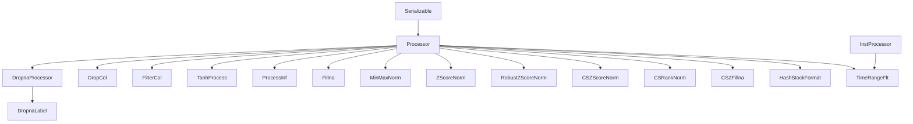

# QLib 数据处理模块文档

## 模块概述

`processor.py` 是 QLib 量化投资平台中负责数据预处理的核心模块，包含了一系列用于数据清洗、标准化、转换和过滤的处理类。这些处理器类遵循统一的接口，允许用户通过组合不同的处理器来构建复杂的数据处理流程，为量化模型的训练和推理提供高质量的输入数据。

该模块主要包含以下功能：
- 数据清洗（处理缺失值、无穷大值）
- 数据标准化（Z-score、Min-Max、Robust Z-score）
- 数据转换（Tanh变换、哈希存储格式）
- 数据过滤（时间范围、列过滤）
- 截面数据处理（截面标准化、截面排名）

## 类层次结构



## 核心功能函数

### `get_group_columns`

```python
def get_group_columns(df: pd.DataFrame, group: Union[Text, None]):
```

**功能：** 从具有多级列索引的 DataFrame 中获取指定分组的列。

**参数：**
- `df`：具有多级列索引的 DataFrame。
- `group`：特征组的名称，即分组索引的第一级值。如果为 None，则返回所有列。

**返回：**
- 指定分组的列标签。

**示例：**

```python
import pandas as pd
import numpy as np

# 创建具有多级列索引的 DataFrame
arrays = [['feature', 'feature', 'label', 'label'],
          ['f1', 'f2', 'l1', 'l2']]
columns = pd.MultiIndex.from_arrays(arrays, names=('group', 'field'))
df = pd.DataFrame(np.random.rand(2, 4), columns=columns)

# 获取 feature 组的列
feature_cols = get_group_columns(df, 'feature')
print(feature_cols)
# Output: MultiIndex([('feature', 'f1'), ('feature', 'f2')], names=['group', 'field'])
```

## 数据处理器类

### `Processor`

```python
class Processor(Serializable):
```

**功能：** 所有数据处理器的基类，定义了统一的接口。

**核心方法：**

- `fit(df: pd.DataFrame = None)`：学习数据处理参数。在逐个使用处理器拟合和处理数据时，fit 函数依赖于前一个处理器的输出。
- `__call__(df: pd.DataFrame)`：处理数据。**注意：处理器可能会原地修改 df 的内容！** 用户应在外部保留数据的副本。
- `is_for_infer() -> bool`：判断该处理器是否可用于推理。某些处理器不可用于推理，默认返回 True。
- `readonly() -> bool`：判断处理器是否将输入数据视为只读。默认返回 False。
- `config(**kwargs)`：配置处理器参数，支持设置 `fit_start_time` 和 `fit_end_time`。

**示例：**

```python
# 创建一个简单的自定义处理器
class CustomProcessor(Processor):
    def __call__(self, df):
        # 对数据进行自定义处理
        df['new_col'] = df['col1'] + df['col2']
        return df

# 使用处理器
processor = CustomProcessor()
processed_df = processor(raw_df)
```

### `DropnaProcessor`

```python
class DropnaProcessor(Processor):
```

**功能：** 删除包含缺失值的行。

**参数：**
- `fields_group`：要检查缺失值的特征组名称。如果为 None，则检查所有列。

**示例：**

```python
processor = DropnaProcessor(fields_group='feature')
processed_df = processor(df)
```

### `DropnaLabel`

```python
class DropnaLabel(DropnaProcessor):
```

**功能：** 专门用于删除标签列中包含缺失值的行的处理器。

**参数：**
- `fields_group`：标签组的名称，默认值为 'label'。

**特性：** 该处理器不可用于推理，`is_for_infer()` 方法返回 False。

### `DropCol`

```python
class DropCol(Processor):
```

**功能：** 删除指定的列。

**参数：**
- `col_list`：要删除的列名列表。

**示例：**

```python
processor = DropCol(col_list=['col1', 'col2'])
processed_df = processor(df)
```

### `FilterCol`

```python
class FilterCol(Processor):
```

**功能：** 根据指定的特征组和列列表筛选列。

**参数：**
- `fields_group`：要保留的特征组名称，默认值为 'feature'。
- `col_list`：要保留的额外列名列表。

### `TanhProcess`

```python
class TanhProcess(Processor):
```

**功能：** 使用双曲正切函数处理噪声数据。

**特性：** 自动识别包含 "LABEL" 的列并保留，对其他列进行 tanh 变换。

### `ProcessInf`

```python
class ProcessInf(Processor):
```

**功能：** 处理无穷大值。

**特性：** 使用时间分组的平均值替换无穷大值。

### `Fillna`

```python
class Fillna(Processor):
```

**功能：** 填充缺失值。

**参数：**
- `fields_group`：要填充缺失值的特征组名称。如果为 None，则填充所有列。
- `fill_value`：用于填充缺失值的值，默认值为 0。

**示例：**

```python
processor = Fillna(fields_group='feature', fill_value=0)
processed_df = processor(df)
```

### `MinMaxNorm`

```python
class MinMaxNorm(Processor):
```

**功能：** 最小-最大归一化。

**参数：**
- `fit_start_time`：拟合阶段的起始时间。
- `fit_end_time`：拟合阶段的结束时间。
- `fields_group`：要归一化的特征组名称。

**示例：**

```python
processor = MinMaxNorm(fit_start_time='2010-01-01', fit_end_time='2019-12-31', fields_group='feature')
processor.fit(df)
processed_df = processor(df)
```

### `ZScoreNorm`

```python
class ZScoreNorm(Processor):
```

**功能：** Z-Score 标准化。

**参数：**
- `fit_start_time`：拟合阶段的起始时间。
- `fit_end_time`：拟合阶段的结束时间。
- `fields_group`：要标准化的特征组名称。

### `RobustZScoreNorm`

```python
class RobustZScoreNorm(Processor):
```

**功能：** 鲁棒 Z-Score 标准化。

**参数：**
- `fit_start_time`：拟合阶段的起始时间。
- `fit_end_time`：拟合阶段的结束时间。
- `fields_group`：要标准化的特征组名称。
- `clip_outlier`：是否将异常值裁剪到 [-3, 3] 范围内，默认值为 True。

**原理：**
使用鲁棒统计量进行 Z-Score 标准化：
- 均值 = 中位数
- 标准差 = MAD（中位数绝对偏差）* 1.4826

**示例：**

```python
processor = RobustZScoreNorm(fit_start_time='2010-01-01', fit_end_time='2019-12-31', fields_group='feature')
processor.fit(df)
processed_df = processor(df)
```

### `CSZScoreNorm`

```python
class CSZScoreNorm(Processor):
```

**功能：** 截面 Z-Score 标准化。

**参数：**
- `fields_group`：要标准化的特征组名称或列表。
- `method`：标准化方法，可选 'zscore' 或 'robust'，默认值为 'zscore'。

**特性：** 对每个时间点的截面数据进行 Z-Score 标准化。

### `CSRankNorm`

```python
class CSRankNorm(Processor):
```

**功能：** 截面排名标准化。

**参数：**
- `fields_group`：要标准化的特征组名称。

**原理：**
将截面数据的排名转换为标准正态分布：
- 计算每个时间点的排名百分比
- 减去 0.5（使分布中心在 0）
- 乘以 3.46（使分布的标准差接近 1）

### `CSZFillna`

```python
class CSZFillna(Processor):
```

**功能：** 截面填充缺失值。

**参数：**
- `fields_group`：要填充缺失值的特征组名称。

**特性：** 使用每个时间点的截面平均值填充缺失值。

### `HashStockFormat`

```python
class HashStockFormat(Processor):
```

**功能：** 将数据转换为哈希股票存储格式。

**特性：** 内部使用 `HashingStockStorage` 类进行转换。

### `TimeRangeFlt`

```python
class TimeRangeFlt(InstProcessor):
```

**功能：** 过滤特定时间范围内存在的数据。

**参数：**
- `start_time`：数据必须存在的起始时间。
- `end_time`：数据必须存在的结束时间。
- `freq`：日历频率，默认值为 'day'。

**警告：** 该处理器可能会导致数据泄漏！

**示例：**

```python
processor = TimeRangeFlt(start_time='2010-01-01', end_time='2019-12-31')
filtered_df = processor(df, instrument='000001.SH')
```

## 数据处理流程

在 QLib 中，数据处理通常通过组合多个处理器来实现。以下是一个典型的数据处理流程示例：

```python
from qlib.data.dataset.processor import (
    DropnaLabel, ZScoreNorm, Fillna, CSRankNorm, ProcessInf
)

# 构建数据处理流程
processors = [
    DropnaLabel(),           # 删除标签列缺失的行
    ProcessInf(),            # 处理无穷大值
    Fillna(fill_value=0),    # 填充缺失值
    ZScoreNorm(fit_start_time='2010-01-01', fit_end_time='2019-12-31'),  # 时间序列标准化
    CSRankNorm()             # 截面排名标准化
]

# 依次应用处理器
processed_df = raw_df
for processor in processors:
    if hasattr(processor, 'fit'):
        processor.fit(processed_df)
    processed_df = processor(processed_df)
```

## 注意事项

1. **数据原地修改**：大多数处理器会原地修改输入 DataFrame，建议在处理前保留原始数据的副本。
2. **拟合阶段**：一些处理器（如 ZScoreNorm、MinMaxNorm）需要先调用 fit 方法来学习数据参数。
3. **截面 vs 时间序列**：截面处理（CS 开头的处理器）是针对每个时间点的所有股票，而时间序列处理是针对每个股票的历史数据。
4. **数据泄漏风险**：在使用时间相关的处理器时，确保 `fit_end_time` 不包含测试数据的信息。

## 总结

`processor.py` 模块提供了一套完整且灵活的数据处理工具，覆盖了量化投资中常见的数据预处理需求。通过组合不同的处理器，用户可以构建高效的数据处理流程，为后续的模型训练和推理提供高质量的数据。
