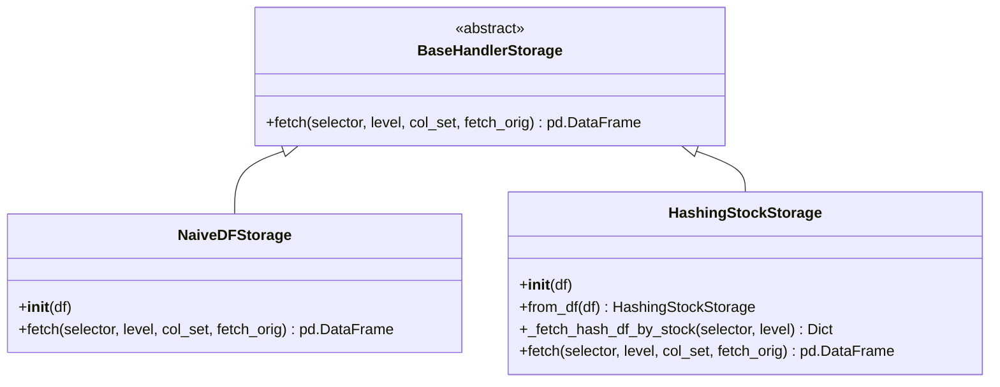

# QLib 数据存储模块

## 模块概述

`qlib.data.dataset.storage` 模块提供了 QLib 数据处理框架中的数据存储抽象层，允许用户根据需要选择或实现不同的数据存储方案。该模块定义了统一的数据获取接口，并提供了两种内置实现：

- `NaiveDFStorage`：简单的 DataFrame 存储实现
- `HashingStockStorage`：基于股票代码哈希的数据存储实现，优化了单只股票数据的随机访问性能

## 类定义

### BaseHandlerStorage

```python
class BaseHandlerStorage:
    """
    Base data storage for datahandler
    - pd.DataFrame is the default data storage format in Qlib datahandler
    - If users want to use custom data storage, they should define subclass inherited BaseHandlerStorage, and implement the following method
    """
```

**功能描述**：数据存储的抽象基类，定义了统一的数据获取接口。所有具体的数据存储实现都必须继承自该类并实现 `fetch` 方法。

**核心方法**：

#### fetch()

```python
@abstractmethod
def fetch(
    self,
    selector: Union[pd.Timestamp, slice, str, pd.Index] = slice(None, None),
    level: Union[str, int] = "datetime",
    col_set: Union[str, List[str]] = DataHandler.CS_ALL,
    fetch_orig: bool = True,
) -> pd.DataFrame:
    """
    fetch data from the data storage

    Parameters
    ----------
    selector : Union[pd.Timestamp, slice, str]
        describe how to select data by index
    level : Union[str, int]
        which index level to select the data
        - if level is None, apply selector to df directly
    col_set : Union[str, List[str]]
        - if isinstance(col_set, str):
            select a set of meaningful columns.(e.g. features, columns)
            if col_set == DataHandler.CS_RAW:
                the raw dataset will be returned.
        - if isinstance(col_set, List[str]):
            select several sets of meaningful columns, the returned data has multiple level
    fetch_orig : bool
        Return the original data instead of copy if possible.

    Returns
    -------
    pd.DataFrame
        the dataframe fetched
    """
```

**功能描述**：从数据存储中获取数据的抽象方法，具体实现由子类提供。

### NaiveDFStorage

```python
class NaiveDFStorage(BaseHandlerStorage):
    """Naive data storage for datahandler
    - NaiveDFStorage is a naive data storage for datahandler
    - NaiveDFStorage will input a pandas.DataFrame as and provide interface support for fetching data
    """
```

**功能描述**：简单的数据存储实现，直接使用 pandas DataFrame 作为存储格式，并提供基本的数据获取接口支持。

**核心方法**：

#### __init__()

```python
def __init__(self, df: pd.DataFrame):
    """
    初始化 NaiveDFStorage 实例

    Parameters
    ----------
    df : pd.DataFrame
        要存储的 DataFrame 数据
    """
```

#### fetch()

```python
def fetch(
    self,
    selector: Union[pd.Timestamp, slice, str, pd.Index] = slice(None, None),
    level: Union[str, int] = "datetime",
    col_set: Union[str, List[str]] = DataHandler.CS_ALL,
    fetch_orig: bool = True,
) -> pd.DataFrame:
    """
    从存储中获取数据

    Parameters
    ----------
    selector : Union[pd.Timestamp, slice, str]
        索引选择器，描述如何通过索引选择数据
    level : Union[str, int]
        要选择数据的索引级别
    col_set : Union[str, List[str]]
        列集合选择器
    fetch_orig : bool
        是否返回原始数据而不是副本（如果可能）

    Returns
    -------
    pd.DataFrame
        提取的数据
    """
```

### HashingStockStorage

```python
class HashingStockStorage(BaseHandlerStorage):
    """Hashing data storage for datahanlder
    - The default data storage pandas.DataFrame is too slow when randomly accessing one stock's data
    - HashingStockStorage hashes the multiple stocks' data(pandas.DataFrame) by the key `stock_id`.
    - HashingStockStorage hashes the pandas.DataFrame into a dict, whose key is the stock_id(str) and value this stock data(panda.DataFrame), it has the following format:
        {
            stock1_id: stock1_data,
            stock2_id: stock2_data,
            ...
            stockn_id: stockn_data,
        }
    - By the `fetch` method, users can access any stock data with much lower time cost than default data storage
    """
```

**功能描述**：基于股票代码哈希的数据存储实现，通过将多只股票的数据按股票代码哈希存储到字典中，显著优化了单只股票数据的随机访问性能。

**核心方法**：

#### __init__()

```python
def __init__(self, df):
    """
    初始化 HashingStockStorage 实例

    Parameters
    ----------
    df : pd.DataFrame
        要存储的多股票数据 DataFrame，必须包含 "instrument" 索引级别
    """
```

#### from_df()

```python
@staticmethod
def from_df(df):
    """
    从 DataFrame 创建 HashingStockStorage 实例

    Parameters
    ----------
    df : pd.DataFrame
        要存储的多股票数据 DataFrame

    Returns
    -------
    HashingStockStorage
        创建的 HashingStockStorage 实例
    """
```

#### _fetch_hash_df_by_stock()

```python
def _fetch_hash_df_by_stock(self, selector, level):
    """
    按股票选择器获取数据

    Parameters
    ----------
    selector : Union[pd.Timestamp, slice, str]
        描述如何通过索引选择数据
    level : Union[str, int]
        要选择数据的索引级别

    Returns
    -------
    Dict
        股票数据字典，键为股票代码，值为该股票的数据
    """
```

#### fetch()

```python
def fetch(
    self,
    selector: Union[pd.Timestamp, slice, str, pd.Index] = slice(None, None),
    level: Union[str, int] = "datetime",
    col_set: Union[str, List[str]] = DataHandler.CS_ALL,
    fetch_orig: bool = True,
) -> pd.DataFrame:
    """
    从哈希存储中获取数据

    Parameters
    ----------
    selector : Union[pd.Timestamp, slice, str]
        索引选择器，描述如何通过索引选择数据
    level : Union[str, int]
        要选择数据的索引级别
    col_set : Union[str, List[str]]
        列集合选择器
    fetch_orig : bool
        是否返回原始数据而不是副本（如果可能）

    Returns
    -------
    pd.DataFrame
        提取的数据
    """
```

## 使用示例

### 基本用法

```python
import pandas as pd
from qlib.data.dataset.storage import NaiveDFStorage, HashingStockStorage
from qlib.data.dataset.handler import DataHandler

# 创建示例数据
data = pd.DataFrame({
    'feature1': [1, 2, 3, 4],
    'feature2': [5, 6, 7, 8],
    'label': [0, 1, 0, 1]
}, index=pd.MultiIndex.from_product([
    ['stock1', 'stock2'],
    pd.date_range('2023-01-01', periods=2)
], names=['instrument', 'datetime']))

# 使用 NaiveDFStorage
naive_storage = NaiveDFStorage(data)
result = naive_storage.fetch(
    selector=slice('2023-01-01', '2023-01-01'),
    level='datetime',
    col_set='feature'
)
print("NaiveDFStorage 结果:")
print(result)

# 使用 HashingStockStorage
hashing_storage = HashingStockStorage(data)
result = hashing_storage.fetch(
    selector='stock1',
    level='instrument',
    col_set='feature'
)
print("\nHashingStockStorage 结果:")
print(result)
```

### 自定义存储实现

```python
from qlib.data.dataset.storage import BaseHandlerStorage

class CustomStorage(BaseHandlerStorage):
    """自定义数据存储实现"""

    def __init__(self, data_source):
        self.data_source = data_source

    def fetch(
        self,
        selector: Union[pd.Timestamp, slice, str, pd.Index] = slice(None, None),
        level: Union[str, int] = "datetime",
        col_set: Union[str, List[str]] = DataHandler.CS_ALL,
        fetch_orig: bool = True,
    ) -> pd.DataFrame:
        # 实现自定义数据获取逻辑
        pass

# 使用自定义存储
custom_storage = CustomStorage("your_data_source")
result = custom_storage.fetch(selector="20230101")
```

## 存储架构设计



## 性能对比

| 存储实现 | 随机访问单只股票 | 批量访问多只股票 | 内存使用 | 适用场景 |
|---------|-----------------|-----------------|----------|----------|
| NaiveDFStorage | 慢 | 快 | 低 | 数据量较小，频繁进行全表操作 |
| HashingStockStorage | 快 | 中等 | 高 | 数据量大，频繁进行单只股票操作 |

## 注意事项

1. 当数据量较大且需要频繁随机访问单只股票数据时，推荐使用 `HashingStockStorage`
2. 如果主要进行全表操作或批量处理，`NaiveDFStorage` 更适合
3. 实现自定义存储时，必须继承 `BaseHandlerStorage` 并实现 `fetch` 方法
4. 所有存储实现都需要处理多级别索引数据的获取操作
5. 存储实现需要支持列集合选择功能，允许按逻辑分组获取数据

## 扩展阅读

- [DataHandler 模块文档](../handler.md)
- [QLib 数据处理流程](../README.md)
- [自定义数据存储实现示例](../../contrib/data/storage.py)