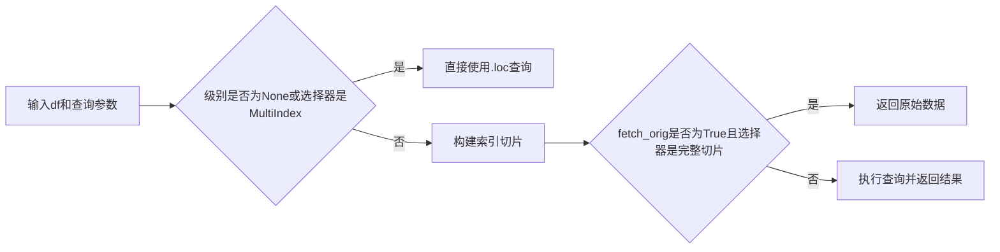
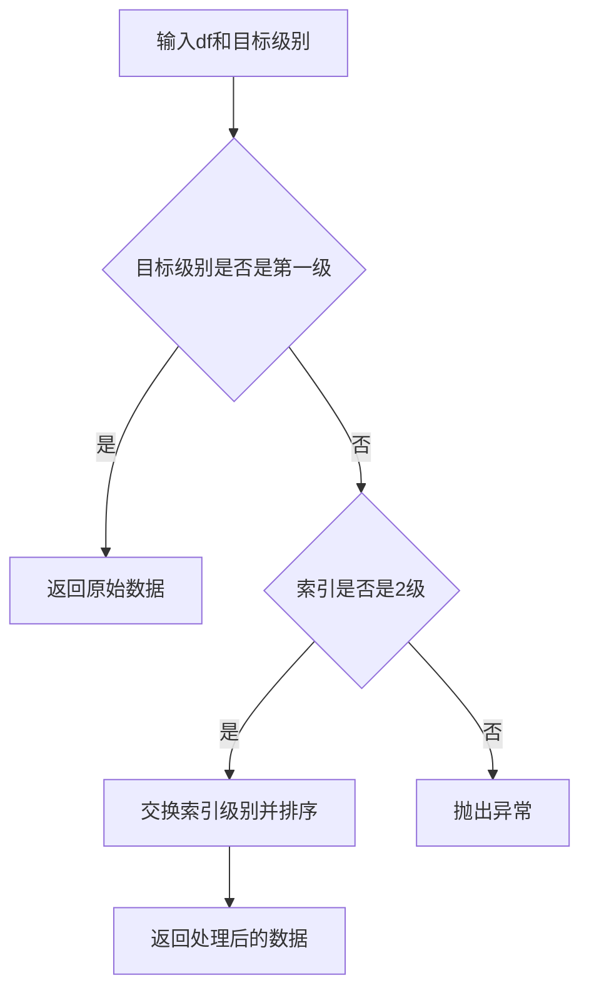

# QLib 数据处理工具模块文档

## 模块概述

`qlib.data.dataset.utils` 是 QLib 量化投资平台中数据处理模块的核心工具库，提供了一系列用于处理金融时间序列数据的实用函数。该模块主要用于处理具有多级别索引（MultiIndex）的 pandas DataFrame，这是 QLib 中标准的数据存储格式。

## 功能特性

该模块提供的主要功能包括：
- 多级别索引定位和查询
- 数据索引操作和转换
- 列数据选择
- 任务处理程序初始化

## 函数说明

### 1. get_level_index

```python
def get_level_index(df: pd.DataFrame, level: Union[str, int]) -> int:
```

#### 功能描述
获取 DataFrame 中指定级别的索引位置。该函数支持通过级别名称或位置获取对应的整数索引。

#### 参数说明
- `df`: 输入的 DataFrame，通常包含多级别索引
- `level`: 索引级别，可以是字符串（级别名称）或整数（级别位置）

#### 返回值
返回对应级别的整数索引位置

#### 实现逻辑
```mermaid
graph TD
    A[输入df和level] --> B{level类型判断}
    B -->|字符串| C{查找level名称}
    C -->|找到| D[返回位置]
    C -->|未找到| E[使用默认索引('datetime', 'instrument')]
    B -->|整数| F[直接返回level]
    B -->|其他类型| G[抛出NotImplementedError]
```

#### 使用示例

```python
import pandas as pd
import numpy as np

# 创建带有多级索引的DataFrame
arrays = [
    pd.date_range('2023-01-01', periods=2, name='datetime'),
    ['000001.SH', '000002.SZ', '000003.SZ'],
]
index = pd.MultiIndex.from_product(arrays, names=['datetime', 'instrument'])
df = pd.DataFrame(np.random.randn(6, 2), index=index, columns=['close', 'volume'])

# 获取级别索引
time_level = get_level_index(df, 'datetime')  # 返回0
instrument_level = get_level_index(df, 'instrument')  # 返回1
third_level = get_level_index(df, 2)  # 返回2
```

---

### 2. fetch_df_by_index

```python
def fetch_df_by_index(
    df: pd.DataFrame,
    selector: Union[pd.Timestamp, slice, str, list, pd.Index],
    level: Union[str, int],
    fetch_orig=True,
) -> pd.DataFrame:
```

#### 功能描述
根据指定的选择器和级别从 DataFrame 中获取数据。该函数负责正确解析多级别索引的查询。

#### 参数说明
- `df`: 输入的 DataFrame
- `selector`: 查询选择器，可以是时间戳、切片、字符串、列表或索引
- `level`: 查询的级别
- `fetch_orig`: 是否在选择器包含所有数据时返回原始数据（默认 True）

#### 返回值
返回符合查询条件的数据子集

#### 实现逻辑


#### 使用示例

```python
# 使用上面创建的df
import pandas as pd

# 查询特定日期的数据
result1 = fetch_df_by_index(df, pd.Timestamp('2023-01-01'), level='datetime')

# 查询日期范围的数据
result2 = fetch_df_by_index(df, slice('2023-01-01', '2023-01-02'), level='datetime')

# 查询特定股票的数据
result3 = fetch_df_by_index(df, ['000001.SH', '000003.SZ'], level='instrument')

# 查询单个股票在特定日期的数据
single_stock = fetch_df_by_index(df, '000001.SH', level='instrument')
result4 = fetch_df_by_index(single_stock, pd.Timestamp('2023-01-01'), level='datetime')
```

---

### 3. fetch_df_by_col

```python
def fetch_df_by_col(df: pd.DataFrame, col_set: Union[str, List[str]]) -> pd.DataFrame:
```

#### 功能描述
根据指定的列集合从 DataFrame 中选择列数据。该函数支持处理具有多级别列索引的数据。

#### 参数说明
- `df`: 输入的 DataFrame
- `col_set`: 列集合，可以是字符串（预定义常量）或字符串列表

#### 返回值
返回包含指定列的数据子集

#### 预定义列集合常量
- `DataHandler.CS_RAW`: 返回原始数据（所有列）
- `DataHandler.CS_ALL`: 删除第一级列索引并返回所有列
- 自定义列集合：返回指定列的数据

#### 使用示例

```python
# 创建带有多级别列索引的DataFrame
import pandas as pd
import numpy as np

arrays = [
    ['close', 'close', 'volume', 'volume'],
    ['1d', '5d', '1d', '5d']
]
columns = pd.MultiIndex.from_arrays(arrays, names=['feature', 'period'])
data = np.random.randn(2, 4)
df = pd.DataFrame(data, index=pd.date_range('2023-01-01', periods=2), columns=columns)

# 获取所有原始数据
raw_data = fetch_df_by_col(df, 'raw')  # 或 DataHandler.CS_RAW

# 获取所有列（删除第一级索引）
all_data = fetch_df_by_col(df, 'all')  # 或 DataHandler.CS_ALL

# 获取特定列
close_data = fetch_df_by_col(df, 'close')
close_1d_data = fetch_df_by_col(df, ['close', 'volume'])
```

---

### 4. convert_index_format

```python
def convert_index_format(df: Union[pd.DataFrame, pd.Series], level: str = "datetime") -> Union[pd.DataFrame, pd.Series]:
```

#### 功能描述
根据指定的级别调整 DataFrame 或 Series 的多级别索引格式。该函数主要用于确保时间级别为第一级索引。

#### 参数说明
- `df`: 输入的 DataFrame 或 Series
- `level`: 要调整到第一级的索引级别（默认 "datetime"）

#### 返回值
返回索引格式调整后的 DataFrame 或 Series

#### 实现逻辑


#### 使用示例

```python
# 创建索引级别顺序不正确的DataFrame
import pandas as pd
import numpy as np

arrays = [
    ['000001.SH', '000002.SZ', '000003.SZ'],
    pd.date_range('2023-01-01', periods=2)
]
index = pd.MultiIndex.from_product(arrays, names=['instrument', 'datetime'])
df = pd.DataFrame(np.random.randn(6, 2), index=index, columns=['close', 'volume'])

# 调整索引格式，使datetime为第一级
converted_df = convert_index_format(df, level='datetime')
print(converted_df.index.names)  # 输出: ['datetime', 'instrument']
```

---

### 5. init_task_handler

```python
def init_task_handler(task: dict) -> DataHandler:
```

#### 功能描述
初始化任务配置中的数据处理程序（DataHandler）部分。该函数负责将任务配置中的处理程序配置转换为实际的 DataHandler 实例。

#### 参数说明
- `task`: 任务配置字典，通常包含 dataset 配置
- `task["dataset"]["kwargs"]["handler"]`: 数据处理程序配置，可以是字符串或字典

#### 返回值
返回初始化后的 DataHandler 实例

#### 使用示例

```python
from qlib.data.dataset.utils import init_task_handler

# 任务配置示例
task_config = {
    "dataset": {
        "kwargs": {
            "handler": {
                "class": "Alpha158",
                "module_path": "qlib.contrib.data.handler",
                "kwargs": {
                    "start_time": "2010-01-01",
                    "end_time": "2020-12-31",
                    "fit_start_time": "2010-01-01",
                    "fit_end_time": "2015-12-31"
                }
            }
        }
    }
}

# 初始化任务处理程序
handler = init_task_handler(task_config)
print(type(handler))  # 输出: <class 'qlib.contrib.data.handler.Alpha158'>
```

## 应用场景

### 1. 数据查询与处理流程

```python
from qlib.data.dataset.utils import get_level_index, fetch_df_by_index, convert_index_format

# 假设我们有一个包含大量金融数据的DataFrame
# df = load_qlib_data()

# 1. 查询特定日期范围和股票的数据
date_level = get_level_index(df, 'datetime')
stock_level = get_level_index(df, 'instrument')

# 查询2023年1月的数据
data_2023_01 = fetch_df_by_index(df, slice('2023-01-01', '2023-01-31'), date_level)

# 查询特定股票的数据
target_stocks = ['000001.SH', '000002.SZ', '600036.SH']
stock_data = fetch_df_by_index(data_2023_01, target_stocks, stock_level)

# 2. 调整数据格式
formatted_data = convert_index_format(stock_data, level='datetime')

# 3. 进行后续分析
# ...
```

### 2. 在策略开发中的应用

```python
from qlib.data.dataset.utils import init_task_handler

def initialize_strategy(task_config):
    # 初始化数据处理程序
    handler = init_task_handler(task_config)

    # 获取训练和测试数据
    train_data, test_data = handler.split_train_valid(test_ratio=0.2)

    # 训练模型
    # ...

    # 回测
    # ...

# 任务配置
task_config = {
    "dataset": {
        "kwargs": {
            "handler": "Alpha158",
            "start_time": "2010-01-01",
            "end_time": "2020-12-31"
        }
    }
}

initialize_strategy(task_config)
```

## 技术实现细节

### 多级别索引处理机制

QLib 使用的多级别索引格式通常为 `(datetime, instrument)`，这允许高效的时间序列和横截面数据分析。该模块提供的函数专门针对这种格式进行了优化。

### 类型安全设计

所有函数都使用类型注解，提高了代码的可读性和可靠性。同时，函数实现中包含了适当的类型检查，确保了输入的正确性。

### 性能优化

这些函数在设计时考虑了金融数据分析中的性能要求，使用了 pandas 的高级索引操作，避免了不必要的数据复制和计算。

## 注意事项

1. **索引格式要求**：函数主要针对 `(datetime, instrument)` 格式的多级别索引设计，使用其他格式可能需要额外处理。
2. **数据一致性**：在使用这些函数时，应确保数据的一致性，尤其是在处理不同时间范围和股票代码的数据时。
3. **错误处理**：函数包含了基本的错误处理，但在使用过程中仍需注意异常情况，如无效的索引级别、格式不匹配等。

## 总结

`qlib.data.dataset.utils` 是 QLib 中数据处理的核心工具库，提供了一系列高效、易用的函数，帮助开发者处理和分析金融时间序列数据。这些函数的设计充分考虑了量化投资场景的需求，为策略开发、回测和研究提供了基础支持。
