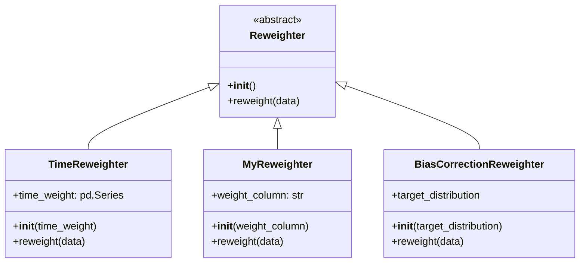
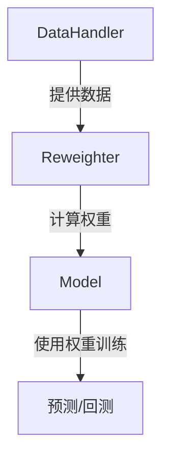

# data/dataset/weight.py 模块文档

## 文件概述

此文件定义了数据重加权器（Reweighter）的抽象基类，用于为数据样本分配权重。重加权是量化投资和机器学习中的重要技术，可以用于样本选择、偏差修正和风险控制。

## 类与函数

### Reweighter 类

**说明**:
- 数据重加权器抽象基类
- 定义了重加权器的基本接口
- 需要子类实现具体的重加权方法

**主要方法**:

```python
def __init__(self, *args, **kwargs):
```
- 抽象初始化方法
- 说明：初始化重加权器，用户需要提供具体的重加权方法（如样本级、规则基等）
- 注意：此方法在基类中抛出 `NotImplementedError`，必须在子类中实现

```python
def reweight(self, data: object) -> object:
```
- 抽象重加权方法
- 说明：根据输入数据计算样本权重
- 参数：
  - data: 输入数据，第一维度是样本索引
- 返回：数据的权重信息
- 注意：此方法在基类中抛出 `NotImplementedError`，必须在子类中实现
- 抛出异常：如果不支持输入数据类型，会抛出 `NotImplementedError`

## 使用示例

### 自定义重加权器实现

```python
from qlib.data.dataset.weight import Reweighter
import pandas as pd

class MyReweighter(Reweighter):
    """自定义重加权器示例"""

    def __init__(self, weight_column: str = "weight"):
        self.weight_column = weight_column

    def reweight(self, data: pd.DataFrame) -> pd.Series:
        """
        根据数据中的特定列计算权重

        Parameters
        ----------
        data : pd.DataFrame
            输入数据，包含权重列

        Returns
        -------
        pd.Series
            样本权重
        """
        if self.weight_column not in data.columns:
            # 如果没有指定的权重列，返回均匀权重
            return pd.Series(1.0, index=data.index)

        return data[self.weight_column]
```

### 在模型训练中使用重加权器

```python
from qlib.contrib.model.linear import LinearModel
from qlib.data.dataset.weight import Reweighter

# 假设已经有训练数据集 dataset
model = LinearModel()

# 创建重加权器实例
reweighter = MyReweighter()

# 使用重加权器训练模型
model.fit(dataset, reweighter=reweighter)
```

## 重加权器的继承与扩展

### TimeReweighter（时间重加权器）

在 `qlib/contrib/meta/data_selection/model.py` 中实现了一个具体的重加权器示例：

```python
class TimeReweighter(Reweighter):
    def __init__(self, time_weight: pd.Series):
        self.time_weight = time_weight

    def reweight(self, data: Union[pd.DataFrame, pd.Series]):
        w_s = pd.Series(1.0, index=data.index)
        for k, w in self.time_weight.items():
            w_s.loc[slice(*k)] = w
        logger.info(f"Reweighting result: {w_s}")
        return w_s
```

这个重加权器根据时间区间为数据分配不同的权重，常用于时间序列分析中的样本重加权。

## 在模型中的应用

Reweighter 在多个 Qlib 模型中得到了支持，包括：
- `qlib.contrib.model.linear.LinearModel`
- `qlib.contrib.model.gbdt.GBDTModel`
- `qlib.contrib.model.pytorch_alstm_ts.AlstmModel`
- `qlib.contrib.model.pytorch_gru_ts.GRUModel`
- `qlib.contrib.model.pytorch_lstm_ts.LSTMModel`
- `qlib.contrib.model.pytorch_general_nn.GeneralNNModel`
- `qlib.contrib.model.pytorch_nn.NNModel`
- `qlib.contrib.model.catboost_model.CatBoostModel`
- `qlib.contrib.model.xgboost.XGBModel`

## 重加权的应用场景

### 1. 样本选择偏差修正

```python
class BiasCorrectionReweighter(Reweighter):
    """修正样本选择偏差的重加权器"""

    def __init__(self, target_distribution):
        self.target_distribution = target_distribution

    def reweight(self, data: pd.DataFrame):
        # 计算当前样本分布
        current_distribution = data["feature"].value_counts(normalize=True)

        # 计算权重以修正偏差
        weights = data["feature"].map(
            lambda x: self.target_distribution.get(x, 1.0) /
                     current_distribution.get(x, 1.0)
        )

        return weights
```

### 2. 风险控制

```python
class RiskControlReweighter(Reweighter):
    """风险控制重加权器"""

    def __init__(self, risk_threshold: float = 0.02):
        self.risk_threshold = risk_threshold

    def reweight(self, data: pd.DataFrame):
        # 假设数据包含风险指标
        if "risk" not in data.columns:
            return pd.Series(1.0, index=data.index)

        # 对高风险样本进行降权
        weights = data["risk"].apply(lambda x: 1.0 if x <= self.risk_threshold else 0.1)
        return weights
```

### 3. 时间衰减权重

```python
class TimeDecayReweighter(Reweighter):
    """时间衰减重加权器"""

    def __init__(self, decay_rate: float = 0.01):
        self.decay_rate = decay_rate

    def reweight(self, data: pd.DataFrame):
        if "datetime" not in data.index.names:
            return pd.Series(1.0, index=data.index)

        # 计算相对于最近日期的时间差（天）
        max_date = data.index.get_level_values("datetime").max()
        time_diffs = (max_date - data.index.get_level_values("datetime")).days

        # 计算时间衰减权重
        weights = (1 - self.decay_rate) ** time_diffs
        return pd.Series(weights, index=data.index)
```

## 设计模式

### 策略模式

Reweighter 类实现了策略模式，允许不同的重加权策略在运行时互换使用。



### 与其他模块的关系



## 注意事项

1. **数据兼容性**: 重加权器通常假设输入数据是 pandas DataFrame 或 Series，需要根据实际数据类型进行处理
2. **性能考虑**: 对于大型数据集，重加权操作应尽量避免循环，采用向量化操作
3. **索引对齐**: 确保权重返回值的索引与输入数据的索引对齐
4. **默认行为**: 如果未提供重加权器，模型通常会使用均匀权重（所有样本权重相等）
5. **异常处理**: 在重写 `reweight` 方法时应考虑异常处理和边界条件
6. **序列化**: 重加权器需要支持序列化以便模型保存和加载

## 扩展点

### 自定义重加权器实现

要实现自定义重加权器，只需继承 `Reweighter` 类并重写 `reweight` 方法：

```python
class CustomReweighter(Reweighter):
    def __init__(self, param1: float, param2: str):
        self.param1 = param1
        self.param2 = param2

    def reweight(self, data: pd.DataFrame) -> pd.Series:
        # 实现自定义重加权逻辑
        # 确保返回 Series，索引与输入数据对齐
        return pd.Series(...)
```

### 支持新的数据类型

如果需要支持除 pandas DataFrame/Series 之外的数据类型（如 Tensor），可以在 `reweight` 方法中添加类型检查：

```python
def reweight(self, data: object) -> object:
    if isinstance(data, pd.DataFrame):
        # 处理 DataFrame
        pass
    elif isinstance(data, pd.Series):
        # 处理 Series
        pass
    elif torch.is_tensor(data):
        # 处理 PyTorch 张量
        pass
    else:
        raise NotImplementedError(f"Unsupported data type: {type(data)}")
```

## 相关文件

- **qlib/contrib/meta/data_selection/model.py**: 包含 TimeReweighter 实现
- **qlib/contrib/model/linear.py**: 使用重加权器的线性模型实现
- **qlib/contrib/model/gbdt.py**: 使用重加权器的 GBDT 模型实现
- **qlib/data/dataset/__init__.py**: 数据集模块入口
