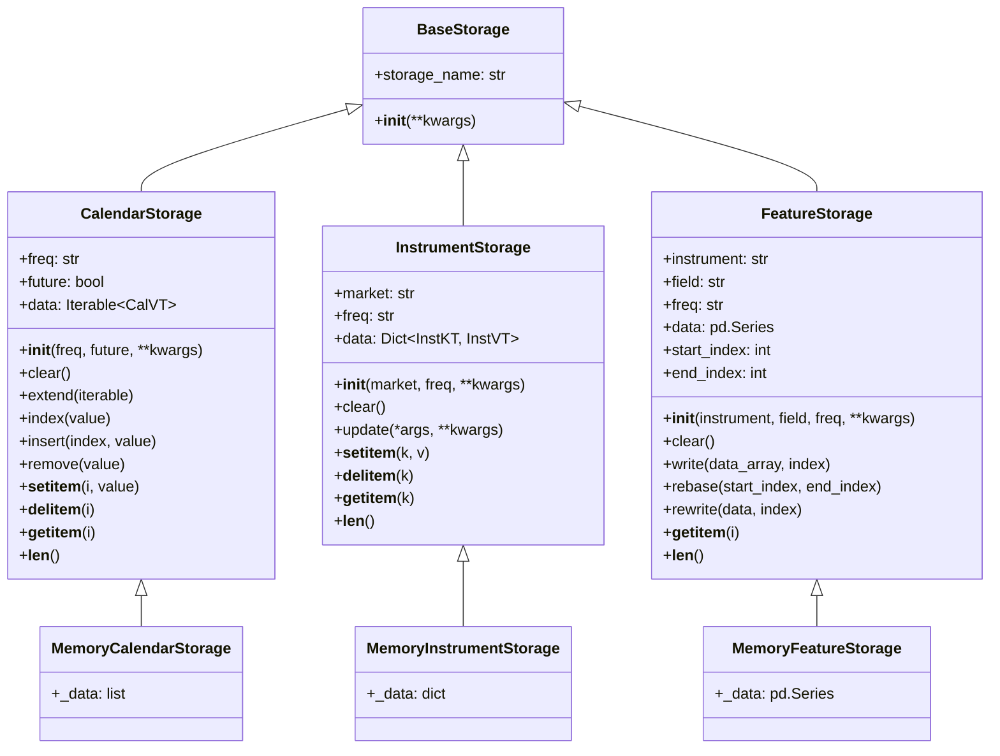

# QLib 数据存储模块

## 模块概述

`qlib.data.storage` 是 QLib 量化投资平台的数据存储抽象层，提供了统一的数据访问接口，支持多种存储后端（如内存存储、文件存储、数据库存储等）。该模块定义了三个核心存储类和相关类型别名，为日历数据、股票代码数据和特征数据的存储和访问提供了标准化接口。

## 类型别名

### CalVT
```python
CalVT = str
```
**日历值类型** - 表示单个日历日期的字符串类型（如 '2023-01-01'）。

### InstVT
```python
InstVT = List[Tuple[CalVT, CalVT]]
```
**股票代码值类型** - 表示股票代码在特定时间区间的有效日期范围列表。每个元素是一个元组 `(start_date, end_date)`，表示股票代码在该区间内有效。

### InstKT
```python
InstKT = Text
```
**股票代码键类型** - 表示股票代码的字符串类型（如 '000001.SZ'）。

## 类定义

### BaseStorage
```python
class BaseStorage:
    @property
    def storage_name(self) -> str:
        return re.findall("[A-Z][^A-Z]*", self.__class__.__name__)[-2].lower()
```

**基础存储类** - 所有存储类的基类，提供了存储名称的自动提取功能。

#### 主要属性

- `storage_name` - 属性，自动从类名中提取存储类型名称（如 CalendarStorage 会提取 'calendar'）。

---

### CalendarStorage(BaseStorage)

```python
class CalendarStorage(BaseStorage):
    def __init__(self, freq: str, future: bool, **kwargs):
        self.freq = freq
        self.future = future
        self.kwargs = kwargs

    @property
    def data(self) -> Iterable[CalVT]:
        raise NotImplementedError

    def clear(self) -> None: raise NotImplementedError
    def extend(self, iterable: Iterable[CalVT]) -> None: raise NotImplementedError
    def index(self, value: CalVT) -> int: raise NotImplementedError
    def insert(self, index: int, value: CalVT) -> None: raise NotImplementedError
    def remove(self, value: CalVT) -> None: raise NotImplementedError

    @overload
    def __setitem__(self, i: int, value: CalVT) -> None: ...
    @overload
    def __setitem__(self, s: slice, value: Iterable[CalVT]) -> None: ...
    def __setitem__(self, i, value) -> None: raise NotImplementedError

    @overload
    def __delitem__(self, i: int) -> None: ...
    @overload
    def __delitem__(self, i: slice) -> None: ...
    def __delitem__(self, i) -> None: raise NotImplementedError

    @overload
    def __getitem__(self, s: slice) -> Iterable[CalVT]: ...
    @overload
    def __getitem__(self, i: int) -> CalVT: ...
    def __getitem__(self, i) -> CalVT: raise NotImplementedError

    def __len__(self) -> int: raise NotImplementedError
```

**日历存储类** - 提供日历数据的存储和访问接口，行为类似于列表。

#### 构造方法

- `__init__(freq: str, future: bool, **kwargs)` - 初始化日历存储
  - `freq`: 频率字符串（如 'day'、'minute'）
  - `future`: 是否包含未来日期
  - `**kwargs`: 其他关键字参数

#### 核心属性

- `data: Iterable[CalVT]` - 属性，获取所有日历数据

#### 主要方法

- `clear()` - 清空存储
- `extend(iterable)` - 扩展存储，添加多个元素
- `index(value)` - 查找值的索引
- `insert(index, value)` - 在指定位置插入值
- `remove(value)` - 移除指定值
- `__setitem__(i, value)` - 设置指定位置的值（支持整数索引和切片）
- `__delitem__(i)` - 删除指定位置的值（支持整数索引和切片）
- `__getitem__(i)` - 获取指定位置的值（支持整数索引和切片）
- `__len__()` - 获取存储的长度

---

### InstrumentStorage(BaseStorage)

```python
class InstrumentStorage(BaseStorage):
    def __init__(self, market: str, freq: str, **kwargs):
        self.market = market
        self.freq = freq
        self.kwargs = kwargs

    @property
    def data(self) -> Dict[InstKT, InstVT]:
        raise NotImplementedError

    def clear(self) -> None: raise NotImplementedError
    def update(self, *args, **kwargs) -> None: raise NotImplementedError

    def __setitem__(self, k: InstKT, v: InstVT) -> None: raise NotImplementedError
    def __delitem__(self, k: InstKT) -> None: raise NotImplementedError
    def __getitem__(self, k: InstKT) -> InstVT: raise NotImplementedError
    def __len__(self) -> int: raise NotImplementedError
```

**股票代码存储类** - 提供股票代码数据的存储和访问接口，行为类似于字典。

#### 构造方法

- `__init__(market: str, freq: str, **kwargs)` - 初始化股票代码存储
  - `market`: 市场标识（如 'CN'、'US'）
  - `freq`: 频率字符串（如 'day'、'minute'）
  - `**kwargs`: 其他关键字参数

#### 核心属性

- `data: Dict[InstKT, InstVT]` - 属性，获取所有股票代码数据，以字典形式返回

#### 主要方法

- `clear()` - 清空存储
- `update(*args, **kwargs)` - 更新存储，支持多种参数形式
- `__setitem__(k, v)` - 设置股票代码的有效日期范围
- `__delitem__(k)` - 删除指定股票代码的条目
- `__getitem__(k)` - 获取指定股票代码的有效日期范围
- `__len__()` - 获取股票代码的数量

---

### FeatureStorage(BaseStorage)

```python
class FeatureStorage(BaseStorage):
    def __init__(self, instrument: str, field: str, freq: str, **kwargs):
        self.instrument = instrument
        self.field = field
        self.freq = freq
        self.kwargs = kwargs

    @property
    def data(self) -> pd.Series:
        raise NotImplementedError

    @property
    def start_index(self) -> Union[int, None]: raise NotImplementedError
    @property
    def end_index(self) -> Union[int, None]: raise NotImplementedError

    def clear(self) -> None: raise NotImplementedError
    def write(self, data_array: Union[List, np.ndarray, Tuple], index: int = None): raise NotImplementedError
    def rebase(self, start_index: int = None, end_index: int = None): ...
    def rewrite(self, data: Union[List, np.ndarray, Tuple], index: int): ...

    @overload
    def __getitem__(self, s: slice) -> pd.Series: ...
    @overload
    def __getitem__(self, i: int) -> Tuple[int, float]: ...
    def __getitem__(self, i) -> Union[Tuple[int, float], pd.Series]: raise NotImplementedError

    def __len__(self) -> int: raise NotImplementedError
```

**特征存储类** - 提供金融特征数据的存储和访问接口，支持高效的读写操作。

#### 构造方法

- `__init__(instrument: str, field: str, freq: str, **kwargs)` - 初始化特征存储
  - `instrument`: 股票代码（如 '000001.SZ'）
  - `field`: 特征字段名（如 'close'、'volume'）
  - `freq`: 频率字符串（如 'day'、'minute'）
  - `**kwargs`: 其他关键字参数

#### 核心属性

- `data: pd.Series` - 属性，获取所有特征数据，返回 pandas Series
- `start_index: Union[int, None]` - 属性，获取数据的起始索引
- `end_index: Union[int, None]` - 属性，获取数据的结束索引（闭区间）

#### 主要方法

- `clear()` - 清空存储
- `write(data_array, index=None)` - 写入数据数组
  - 如果 index 为 None，追加数据到末尾
  - 支持自动填充 NaN 值来处理不连续的索引
- `rebase(start_index=None, end_index=None)` - 调整数据的索引范围
  - 支持扩展和收缩数据范围，并自动填充 NaN
- `rewrite(data, index)` - 重写存储中的所有数据
- `__getitem__(i)` - 获取指定位置的值（支持整数索引和切片）
  - 整数索引返回 (index, value) 元组
  - 切片返回 pandas Series
- `__len__()` - 获取数据长度

## 使用示例

### 1. 自定义日历存储实现

```python
from qlib.data.storage import CalendarStorage, CalVT
from typing import Iterable

class MyCalendarStorage(CalendarStorage):
    def __init__(self, freq: str, future: bool, **kwargs):
        super().__init__(freq, future, **kwargs)
        self._data = []

    @property
    def data(self) -> Iterable[CalVT]:
        return self._data

    def clear(self) -> None:
        self._data.clear()

    def extend(self, iterable: Iterable[CalVT]) -> None:
        self._data.extend(iterable)

    def index(self, value: CalVT) -> int:
        return self._data.index(value)

    def insert(self, index: int, value: CalVT) -> None:
        self._data.insert(index, value)

    def remove(self, value: CalVT) -> None:
        self._data.remove(value)

    def __setitem__(self, i, value) -> None:
        self._data[i] = value

    def __delitem__(self, i) -> None:
        del self._data[i]

    def __getitem__(self, i):
        return self._data[i]

    def __len__(self) -> int:
        return len(self._data)

# 使用示例
cal_storage = MyCalendarStorage(freq='day', future=False)
cal_storage.extend(['2023-01-01', '2023-01-02', '2023-01-03'])
print(cal_storage[1])  # '2023-01-02'
print(len(cal_storage))  # 3
```

### 2. 自定义特征存储实现

```python
from qlib.data.storage import FeatureStorage
import pandas as pd
import numpy as np

class MyFeatureStorage(FeatureStorage):
    def __init__(self, instrument: str, field: str, freq: str, **kwargs):
        super().__init__(instrument, field, freq, **kwargs)
        self._data = pd.Series(dtype=np.float32)
        self._start_index = None
        self._end_index = None

    @property
    def data(self) -> pd.Series:
        return self._data

    @property
    def start_index(self):
        return self._start_index

    @property
    def end_index(self):
        return self._end_index

    def clear(self) -> None:
        self._data = pd.Series(dtype=np.float32)
        self._start_index = None
        self._end_index = None

    def write(self, data_array, index: int = None):
        if len(data_array) == 0:
            return

        if index is None:
            if self._end_index is None:
                index = 0
            else:
                index = self._end_index + 1

        # 处理不连续索引，填充NaN
        if self._start_index is not None and index > self._end_index + 1:
            fill_len = index - self._end_index - 1
            fill_index = range(self._end_index + 1, index)
            fill_series = pd.Series([np.nan]*fill_len, index=fill_index)
            self._data = pd.concat([self._data, fill_series])

        # 写入数据
        data_index = range(index, index + len(data_array))
        data_series = pd.Series(data_array, index=data_index)
        self._data = pd.concat([self._data, data_series]).sort_index()

        # 更新边界索引
        if self._start_index is None or index < self._start_index:
            self._start_index = index
        if index + len(data_array) - 1 > (self._end_index or -1):
            self._end_index = index + len(data_array) - 1

    def __getitem__(self, i):
        if isinstance(i, int):
            if i not in self._data.index:
                return (None, None)
            return (i, self._data[i])
        elif isinstance(i, slice):
            return self._data[i]
        else:
            raise TypeError(f"Unsupported index type: {type(i)}")

    def __len__(self) -> int:
        return len(self._data)

# 使用示例
feature_storage = MyFeatureStorage('000001.SZ', 'close', 'day')
feature_storage.write([10.5, 10.6, 10.7], index=3)
print(feature_storage.start_index)  # 3
print(feature_storage.end_index)  # 5
print(feature_storage[3:6])
# 输出:
# 3    10.5
# 4    10.6
# 5    10.7
# dtype: float32
```

### 3. 完整的数据存储系统架构



## 架构设计说明

QLib 数据存储系统采用抽象接口与具体实现分离的设计模式：

1. **接口层**：定义了统一的存储接口（CalendarStorage、InstrumentStorage、FeatureStorage）
2. **实现层**：提供具体的存储实现（如 MemoryStorage、FileStorage、DatabaseStorage 等）
3. **类型系统**：通过类型别名（CalVT、InstKT、InstVT）提供清晰的数据类型定义
4. **扩展性**：允许用户通过继承自定义存储实现，支持多种存储后端

这种设计使得 QLib 的数据存储系统既具有良好的抽象性，又具备高度的可扩展性，能够满足不同量化投资场景的需求。
