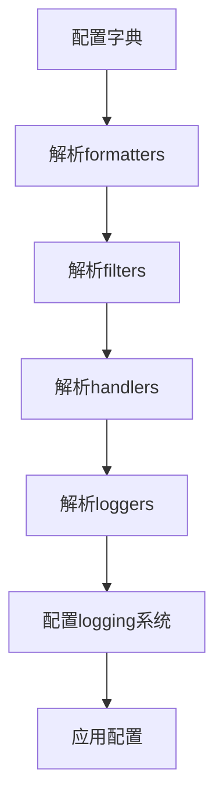
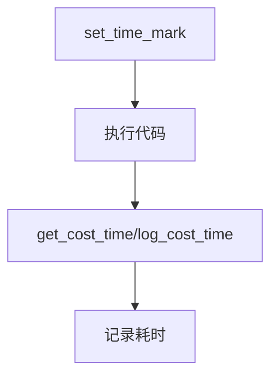
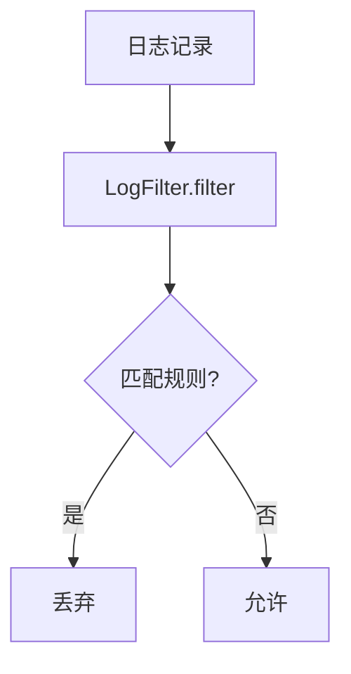

# log.py 模块文档

## 文件概述
提供Qlib的日志系统，包括自定义日志器、时间检查器、日志过滤器等。

## 类

### MetaLogger 类
**功能：** 自定义元类，创建QlibLogger

**说明：** 复制logging.Logger的所有属性到QlibLogger

---

### QlibLogger 类
**功能：** 自定义日志器类

**主要属性：**
- `module_name`: 模块名称
- `__level`: 日志级别

**主要方法：**

1. `__init__(module_name)`
   - 初始化日志器
   - 设置默认级别

2. `@property logger`: 获取logging.Logger实例
   - 设置级别
   - 返回logger对象

3. `setLevel(level)`: 设置日志级别

4. `__getattr__(name)`: 动态获取logger属性
   - 避免无限递归

**说明：** 提供与标准logging.Logger相同的接口

---

### _QLibLoggerManager 类
**功能：** 日志管理器（单例模式）

**主要属性：**
- `_loggers`: 存储所有模块的日志器

**主要方法：**

1. `__init__()`: 初始化日志字典

2. `setLevel(level)`: 设置所有日志器的级别

3. `__call__(module_name, level=None) -> QlibLogger`
   - 获取或创建模块日志器
   - 参数：
     - `module_name`: 模块名（自动添加"qlib."前缀）
     - `level`: 日志级别（默认使用C.logging_level）
   - 返回：QlibLogger实例

---

### TimeInspector 类
**功能：** 时间检查器，用于性能计时

**主要属性（类级别）：**
- `timer_logger`: 时间日志器
- `time_marks`: 时间标记栈

**主要方法（类方法）：**

1. `set_time_mark()` -> float
   - 设置时间标记并推入栈
   - 返回：当前时间戳

2. `pop_time_mark()` -> float
   - 弹出最后的时间标记
   - 返回：弹出的时间标记

3. `get_cost_time()` -> float
   - 计算与最后一个时间标记的时间差
   - 返回：耗时（秒）

4. `log_cost_time(info="Done")`
   - 计算耗时并记录
   - 参数：
     - `info`: 附加信息（默认"Done"）

5. `logt(name="", show_start=False)` (上下文管理器)
   - 记录代码块执行时间
   - 参数：
     - `name`: 块名称
     - `show_start`: 是否显示开始信息

**使用示例：**
```python
from qlib.log import TimeInspector

# 基本用法
TimeInspector.set_time_mark()
# ... 执行代码 ...
TimeInspector.log_cost_time("计算完成")

# 使用上下文管理器
with TimeInspector.logt("数据处理", show_start=True):
    process_data()
```

---

### LogFilter 类
**功能：** 日志过滤器，基于规则过滤日志消息

**继承关系：**
- 继承自 `logging.Filter`

**主要方法：**

1. `__init__(param=None)`
   - 初始化过滤器
   - 参数：
     - `param`: 过滤规则（字符串或列表）

2. `match_msg(filter_str, msg)` (静态方法)
   - 检查消息是否匹配过滤规则
   - 返回：是否匹配

3. `filter(record) -> bool`
   - 过滤日志记录
   - 返回：是否允许记录

**过滤规则示例：**
```python
# 过滤特定模式
LogFilter(".*?WARN: data not found for.*?")

# 多个模式
LogFilter(["pattern1.*", "pattern2.*"])
```

## 函数

### set_log_with_config 函数
**签名：** `set_log_with_config(log_config: Dict[Text, Any])`

**功能：** 使用配置字典设置日志系统

**参数：**
- `log_config`: 日志配置字典

**配置结构示例：**
```python
{
    "version": 1,
    "formatters": {
        "logger_format": {
            "format": "[%(process)s:%(threadName)s](%(asctime)s) %(levelname)s - %(name)s"
        }
    },
    "filters": {
        "field_not_found": {
            "()": "qlib.log.LogFilter",
            "param": [".*?WARN: data not found for.*?"],
        }
    },
    "handlers": {
        "console": {
            "class": "logging.StreamHandler",
            "level": logging.DEBUG,
            "formatter": "logger_format",
            "filters": ["field_not_found"],
        }
    },
    "loggers": {
        "qlib": {
            "level": logging.DEBUG,
            "handlers": ["console"],
            "propagate": False
        }
    },
    "disable_existing_loggers": False,
}
```

---

### set_global_logger_level 函数
**签名：** `set_global_logger_level(level: int, return_orig_handler_level: bool = False)`

**功能：** 设置qlib日志处理器级别

**参数：**
- `level`: 日志级别
- `return_orig_handler_level`: 是否返回原始级别映射

**返回：** 原始处理器级别映射（如果return_orig_handler_level=True）

**说明：** 不影响logger级别，只影响handler级别

---

### set_global_logger_level_cm 函数
**签名：** `set_global_logger_level_cm(level: int)` (上下文管理器)

**功能：** 使用上下文管理器设置日志级别

**参数：**
- `level`: 日志级别

**示例：** 临时提升日志级别
```python
from qlib.log import set_global_logger_level_cm

with set_global_logger_level_cm(logging.DEBUG):
    # 在此块中，日志级别为DEBUG
    logger.debug("调试信息")
```

## 全局对象

```python
get_module_logger = _QLibLoggerManager()
```

**用途：** 获取模块日志器

**示例：**
```python
from qlib.log import get_module_logger

# 获取日志器
logger = get_module_logger("my_module")
logger.info("信息消息")
logger.debug("调试消息")

# 指定级别
logger = get_module_logger("my_module", level=logging.DEBUG)
```

## 日志配置流程



## 时间测量流程



## 日志过滤流程



## 使用示例

### 基本日志使用
```python
from qlib.log import get_module_logger

# 获取日志器
logger = get_module_logger("my_module")

# 记录不同级别
logger.debug("调试信息")
logger.info("一般信息")
logger.warning("警告信息")
logger.error("错误信息")
```

### 时间测量
```python
from qlib.log import TimeInspector

# 方法1：基本用法
TimeInspector.set_time_mark()
result = expensive_function()
TimeInspector.log_cost_time("函数执行完成")

# 方法2：使用上下文管理器
with TimeInspector.logt("数据处理"):
    process_data()
# 自动记录耗时
```

### 临时改变日志级别
```python
from qlib.log import set_global_logger_level_cm, get_module_logger
import logging

# 临时提升到DEBUG
with set_global_logger_level_cm(logging.DEBUG):
    logger = get_module_logger("test")
    logger.debug("调试信息")

# 离开上下文后恢复
logger.info("一般信息")
```

### 自定义日志过滤器
```python
from qlib.log import LogFilter, set_log_with_config
import logging

# 创建过滤配置
config = {
    "filters": {
        "my_filter": {
            "()": "qlib.log.LogFilter",
            "param": ".*skipping.*",
        }
    },
    "handlers": {
        "console": {
            "class": "logging.StreamHandler",
            "filters": ["my_filter"],
        }
    },
    "loggers": {
        "qlib": {
            "handlers": ["console"],
        }
    },
}

set_log_with_config(config)
```

## 与其他模块的关系
- `logging`: Python标准日志模块
- `qlib.config`: 日志配置
