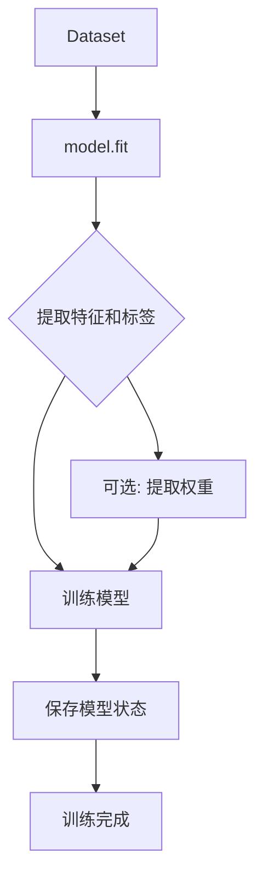
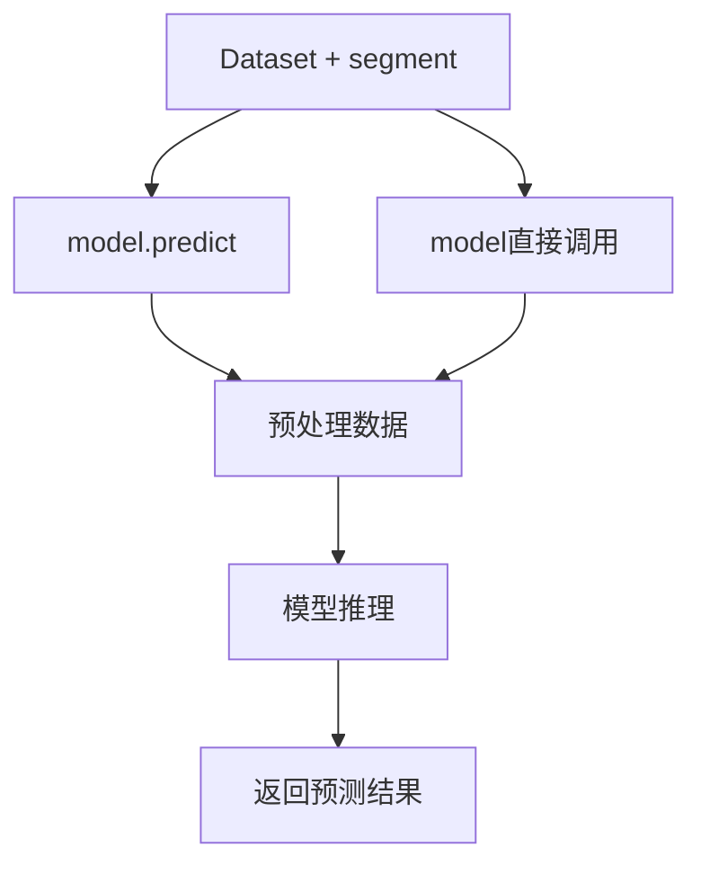
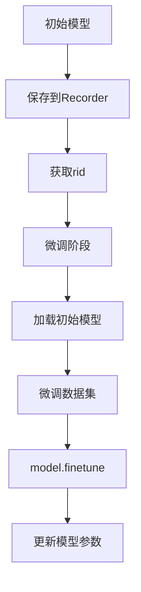

# model/base.py 模块文档

## 文件概述

定义了Qlib模型系统的核心基类，包括：
- **BaseModel**: 所有模型的抽象基类
- **Model**: 可学习模型的基类
- **ModelFT**: 可微调模型的基类

这些基类定义了Qlib模型系统的基础接口和契约。

## 类继承关系图

```
Serializable (from utils.serial)
    └── BaseModel (抽象基类)
            └── Model (可学习模型)
                    └── ModelFT (可微调模型)
```

## 类与函数

### BaseModel 类

**继承关系**: Serializable → BaseModel

**职责**: 所有模型的抽象基类，定义模型的基本行为接口

#### 方法签名

##### `__init__()`
```python
def __init__(self):
    """初始化模型"""
```

##### `predict(*args, **kwargs) -> object`
```python
@abc.abstractmethod
def predict(self, *args, **kwargs) -> object:
    """Make predictions after modeling things"""
```
- **抽象方法**: 子类必须实现
- **返回值**: 预测结果，类型由具体模型决定
- **说明**: 模型预测的核心接口

##### `__call__(*args, **kwargs) -> object`
```python
def __call__(self, *args, **kwargs) -> object:
    """leverage Python syntactic sugar to make the models' behaviors like functions"""
    return self.predict(*args, **kwargs)
```
- **功能**: 使模型对象可以像函数一样调用
- **用法示例**: `model(dataset)` 等价于 `model.predict(dataset)`

### Model 类

**继承关系**: BaseModel → Model

**职责**: 可学习模型的基类，定义模型训练和预测的标准接口

#### 方法签名

##### `fit(dataset: Dataset, reweighter: Reweighter)`
```python
def fit(self, dataset: Dataset, reweighter: Reweighter):
    """Learn model from the base model"""
```

**参数说明**:
- `dataset`: Dataset对象，提供训练数据
  - 可通过`dataset.prepare()`获取特征和标签
  - 支持多段数据：train、valid、test
- `reweighter`: Reweighter对象，用于样本重加权

**数据提取示例**:
```python
# 获取特征和标签
df_train, df_valid = dataset.prepare(
    ["train", "valid"],
    col_set=["feature", "label"],
    data_key=DataHandlerLP.DK_L
)
x_train, y_train = df_train["feature"], df_train["label"]
x_valid, y_valid = df_valid["feature"], df_valid["label"]

# 获取权重
try:
    wdf_train, wdf_valid = dataset.prepare(
        ["train", "valid"],
        col_set=["weight"],
        data_key=DataHandlerLP.DK_L
    )
    w_train, w_valid = wdf_train["weight"], wdf_valid["weight"]
except KeyError as e:
    w_train = pd.DataFrame(np.ones_like(y_train.values), index=y_train.index)
    w_valid = pd.DataFrame(np.ones_like(y_valid.values), index=y_valid.index)
```

**注意事项**:
- 模型属性名不应以下划线`_`开头，以便序列化
- 必须实现具体的训练逻辑
- 训练后的模型状态需要可持久化

##### `predict(dataset: Dataset, segment: Union[Text, slice] = "test") -> object`
```python
@abc.abstractmethod
def predict(self, dataset: Dataset, segment: Union[Text, slice] = "test") -> object:
    """give prediction given Dataset"""
```

**参数说明**:
- `dataset`: Dataset对象，提供预测数据
- `segment`: 指定数据段，默认为"test"
  - 可以是字符串："train"、"valid"、"test"
  - 可以是slice对象用于索引

**返回值**:
- 预测结果，通常是`pd.Series`类型
- 包含每个样本的预测值

### ModelFT 类

**继承关系**: Model → ModelFT

**职责**: 可微调模型的基类，在Model基础上增加微调功能

#### 方法签名

##### `finetune(dataset: Dataset)`
```python
@abc.abstractmethod
def finetune(self, dataset: Dataset):
    """finetune model based given dataset"""
```

**参数说明**:
- `dataset`: Dataset对象，提供微调数据

**典型使用场景**:
```python
# 阶段1：训练初始模型
with R.start(experiment_name="init models"):
    model.fit(dataset)
    R.save_objects(init_model=model)
    rid = R.get_recorder().id

# 阶段2：微调模型
with R.start(experiment_name="finetune model"):
    recorder = R.get_recorder(recorder_id=rid, experiment_name="init models")
    model = recorder.load_object("init_model")
    model.finetune(dataset, num_boost_round=10)
```

## 设计模式

### 1. 模板方法模式

- **基类定义接口流程**: BaseModel定义预测接口
- **子类实现具体逻辑**: 具体模型类实现predict和fit方法

### 2. 策略模式

- 不同后端实现：LightGBM、XGBoost、PyTorch等
- 统一接口调用：用户无需关心具体实现细节

### 3. 可调用对象模式

- 通过`__call__`使模型对象像函数一样调用
- 提供更简洁的API

## 重要流程图

### 模型训练流程



### 模型预测流程



### 模型微调流程



## 与其他模块的关系

### 依赖模块

- `qlib.utils.serial.Serializable`: 提供序列化能力
- `qlib.data.dataset.Dataset`: 提供数据访问接口
- `qlib.data.dataset.weight.Reweighter`: 提供样本重加权

### 被依赖模块

- `qlib.contrib.model`: 所有具体模型实现
- `qlib.model.trainer`: 训练器使用Model接口
- `qlib.workflow`: 工作流使用模型进行预测

## 扩展指南

### 实现自定义模型

1. 继承`Model`类
2. 实现`fit`方法：
   ```python
   def fit(self, dataset, reweighter):
       # 1. 提取数据
       df_train = dataset.prepare(["train"], col_set=["feature", "label"])
       x_train, y_train = df_train["feature"], df_train["label"]

       # 2. 训练模型
       self._model = SomeEstimator().fit(x_train, y_train)
   ```

3. 实现`predict`方法：
   ```python
   def predict(self, dataset, segment="test"):
       df_test = dataset.prepare([segment], col_set=["feature"])
       x_test = df_test["feature"]
       return self._model.predict(x_test)
   ```

4. 如需微调功能，继承`ModelFT`并实现`finetune`方法

## 注意事项

1. **序列化限制**: 模型属性名不要以下划线`_`开头
2. **数据一致性**: 确保训练和预测使用相同的数据格式
3. **线程安全**: fit和predict方法应保证线程安全
4. **资源释放**: 在`__del__`方法中释放模型资源（如GPU内存）
