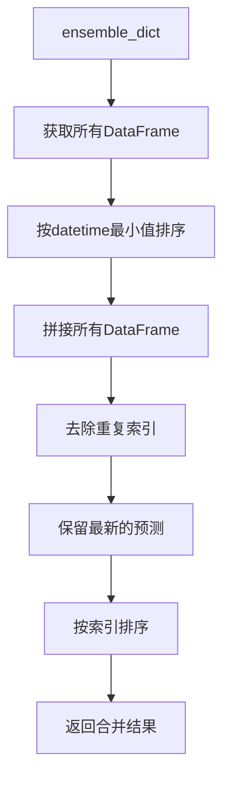
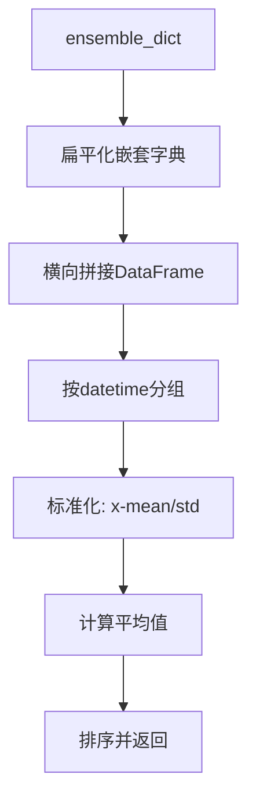

# model/ens/ensemble.py 模块文档

## 文件概述

定义了Qlib的集成学习（Ensemble）核心类，提供多种策略来合并多个模型的预测结果：
- **Ensemble**: 集成学习的抽象基类
- **SingleKeyEnsemble**: 单键提取器，用于简化嵌套字典
- **RollingEnsemble**: 滚动窗口集成，合并不同时间段的预测
- **AverageEnsemble**: 平均集成，标准化后取平均

## 类定义

### Ensemble 类

**职责**: 集成学习的抽象基类，定义集成操作的基本接口

#### 方法签名

##### `__call__(ensemble_dict: dict, *args, **kwargs)`
```python
def __call__(self, ensemble_dict: dict, *args, **kwargs):
    raise NotImplementedError(f"Please implement the `__call__` method.")
```

**参数说明**:
- `ensemble_dict`: 字典形式的集成数据，格式为`{name: predictions}`

**功能**: 定义集成操作的基本接口，子类必须实现具体的集成逻辑

**预期输入输出**:
- 输入: `{"model_1": pred1, "model_2": pred2, ...}`
- 输出: 集成后的预测结果

### SingleKeyEnsemble 类

**继承关系**: Ensemble → SingleKeyEnsemble

**职责**: 提取字典中的单键值对，用于简化嵌套字典结构

#### 初始化
```python
def __init__(self):
    """无需特殊初始化"""
```

#### 方法签名

##### `__call__(ensemble_dict: Union[dict, object], recursion: bool = True) -> object`
```python
def __call__(self, ensemble_dict: Union[dict, object], recursion: bool = True) -> object:
    if not isinstance(ensemble_dict, dict):
        return ensemble_dict
    if recursion:
        tmp_dict = {}
        for k, v in ensemble_dict.items():
            tmp_dict[k] = self(v, recursion)
        ensemble_dict = tmp_dict
    keys = list(ensemble_dict.keys())
    if len(keys) == 1:
        ensemble_dict = ensemble_dict[keys[0]]
    return ensemble_dict
```

**参数说明**:
- `ensemble_dict`: 字典或对象
- `recursion`: 是否递归处理嵌套字典，默认为True

**功能**:
- 如果字典只有1个键值对，提取其值
- 如果字典有多个键值对，保持原样
- 如果是对象，直接返回

**示例**:
```python
from qlib.model.ens.ensemble import SingleKeyEnsemble

ens = SingleKeyEnsemble()

# 单键情况：提取值
result = ens({"only_key": value})
# result = value

# 多键情况：保持不变
result = ens({"key1": value1, "key2": value2})
# result = {"key1": value1, "key2": value2}

# 递归处理嵌套
nested = {"outer": {"inner": {"deep": value}}}
result = ens(nested, recursion=True)
# result = value
```

**使用场景**:
- 简化模型预测结果的嵌套结构
- 在多级集成后提取最终结果
- 提高结果的可读性

### RollingEnsemble 类

**继承关系**: Ensemble → RollingEnsemble

**职责**: 合并滚动窗口的预测结果，处理时间序列预测

#### 方法签名

##### `__call__(ensemble_dict: dict) -> pd.DataFrame`
```python
def __call__(self, ensemble_dict: dict) -> pd.DataFrame:
    get_module_logger("RollingEnsemble").info(f"keys in group: {list(ensemble_dict.keys())}")
    artifact_list = list(ensemble_dict.values())
    artifact_list.sort(key=lambda x: x.index.get_level_values("datetime").min())
    artifact = pd.concat(artifact_list)
    # If there are duplicated predition, use the latest perdiction
    artifact = artifact[~artifact.index.duplicated(keep="last")]
    artifact = artifact.sort_index()
    return artifact
```

**参数说明**:
- `ensemble_dict`: 字典，值为`pd.DataFrame`，必须有"datetime"索引

**功能流程**:


**详细步骤**:
1. 从字典中提取所有DataFrame
2. 根据"datetime"索引的最小值排序
3. 使用`pd.concat`拼接所有DataFrame
4. 去除重复索引，保留最新的预测
5. 按索引排序返回

**示例**:
```python
from qlib.model.ens.ensemble import RollingEnsemble
import pandas as pd

# 创建滚动窗口预测
pred_1 = pd.DataFrame(
    {"score": [0.1, 0.2]},
    index=pd.MultiIndex.from_tuples(
        [("2020-01-01", "stock1"), ("2020-01-02", "stock1")],
        names=["datetime", "instrument"]
    )
)

pred_2 = pd.DataFrame(
    {"score": [0.3, 0.4]},
    index=pd.MultiIndex.from_tuples(
        [("2020-01-02", "stock1"), ("2020-01-03", "stock1")],
        names=["datetime", "instrument"]
    )
)

# 合并滚动预测
ensemble_dict = {"window_1": pred_1, "window_2": pred_2}
ens = RollingEnsemble()
result = ens(ensemble_dict)

# 结果：合并后的预测，重复的日期保留最新值
# (2020-01-01, stock1): 0.1
# (2020-01-02, stock1): 0.3  # 使用window_2的值
# (2020-01-03, stock1): 0.4
```

**注意事项**:
- 输入DataFrame必须有"datetime"索引
- 重复索引会保留最新的预测
- 结果按时间顺序排列

### AverageEnsemble 类

**继承关系**: Ensemble → AverageEnsemble

**职责**: 对多个预测结果进行标准化后取平均

#### 方法签名

##### `__call__(ensemble_dict: dict) -> pd.DataFrame`
```python
def __call__(self, ensemble_dict: dict) -> pd.DataFrame:
    """using sample:
    from qlib.model.ens.ensemble import AverageEnsemble
    pred_res['new_key_name'] = AverageEnsemble()(predict_dict)

    Parameters
    ----------
    ensemble_dict : dict
        Dictionary you want to ensemble

    Returns
    -------
    pd.DataFrame
        The dictionary including ensenbling result
    """
    # need to flatten the nested dict
    ensemble_dict = flatten_dict(ensemble_dict, sep=FLATTEN_TUPLE)
    get_module_logger("AverageEnsemble").info(f"keys in group: {list(ensemble_dict.keys())}")
    values = list(ensemble_dict.values())
    # NOTE: this may change the style underlying data!!!!
    # from pd.DataFrame to pd.Series
    results = pd.concat(values, axis=1)
    results = results.groupby("datetime", group_keys=False).apply(lambda df: (df - df.mean()) / df.std())
    results = results.mean(axis=1)
    results = results.sort_index()
    return results
```

**参数说明**:
- `ensemble_dict`: 字典，值为`pd.DataFrame`

**功能流程**:


**详细步骤**:
1. 扁平化嵌套字典（如果存在）
2. 横向拼接所有DataFrame（axis=1）
3. 按"datetime"分组
4. 对每组数据进行标准化：(x - mean) / std
5. 计算所有模型预测的平均值
6. 按索引排序返回

**示例**:
```python
from qlib.model.ens.ensemble import AverageEnsemble
import pandas as pd

# 多个模型的预测
pred_1 = pd.DataFrame(
    {"score": [0.1, 0.2, 0.3]},
    index=pd.MultiIndex.from_tuples(
        [("2020-01-01", "stock1"), ("2020-01-02", "stock1"), ("2020-01-03", "stock1")],
        names=["datetime", "instrument"]
    )
)

pred_2 = pd.DataFrame(
    {"score": [0.2, 0.3, 0.4]},
    index=pd.MultiIndex.from_tuples(
        [("2020-01-01", "stock1"), ("2020-01-02", "stock1"), ("2020-01-03", "stock1")],
        names=["datetime", "instrument"]
    )
)

# 平均集成
ensemble_dict = {"model_1": pred_1, "model_2": pred_2}
ens = AverageEnsemble()
result = ens(ensemble_dict)

# 结果：标准化后的平均预测
```

**注意事项**:
- 处理嵌套字典时会自动扁平化
- 标准化是按datetime分组进行的
- 可能改变底层的数据类型（DataFrame → Series）

## 类继承关系图

```
Ensemble (抽象基类)
├── SingleKeyEnsemble
├── RollingEnsemble
└── AverageEnsemble
```

## 集成策略对比

| 策略 | 输入要求 | 处理方式 | 适用场景 |
|------|----------|----------|----------|
| SingleKeyEnsemble | 任意字典 | 提取单键值 | 简化嵌套结构 |
| RollingEnsemble | 带datetime索引 | 拼接并去重 | 滚动窗口预测 |
| AverageEnsemble | 同shape的DataFrame | 标准化后平均 | 多模型集成 |

## 使用示例

### 完整工作流示例

```python
from qlib.model.ens.ensemble import RollingEnsemble, AverageEnsemble, SingleKeyEnsemble

# 1. 滚动窗口预测集成
rolling_preds = {
    "window_1": pred_df_1,
    "window_2": pred_df_2,
    "window_3": pred_df_3
}
rolling_ens = RollingEnsemble()
combined_pred = rolling_ens(rolling_preds)

# 2. 多模型平均集成
model_preds = {
    "lgbm": pred_lgbm,
    "xgb": pred_xgb,
    "catboost": pred_catboost
}
avg_ens = AverageEnsemble()
ensemble_pred = avg_ens(model_preds)

# 3. 简化嵌套结果
nested_result = {"outer": {"model_1": pred_1}}
simple_ens = SingleKeyEnsemble()
simplified = simple_ens(nested_result)
# simplified = pred_1
```

### 与Group模块结合使用

```python
from qlib.model.ens.group import RollingGroup
from qlib.model.ens.ensemble import RollingEnsemble

# 创建滚动分组和集成
group = RollingGroup(ens=RollingEnsemble())

# 分组处理滚动结果
ungrouped_dict = {
    ("model1", "window1"): pred1,
    ("model1", "window2"): pred2,
    ("model2", "window1"): pred3,
    ("model2", "window2"): pred4
}

# 分组并集成
grouped_dict = group(ungrouped_dict)
# 结果: {"model1": ensemble1, "model2": ensemble2}
```

## 设计模式

### 1. 策略模式

- 不同的集成策略实现相同接口
- 用户可以灵活选择集成方法

### 2. 职责链模式

- SingleKeyEnsemble可以简化结果，传递给下一个处理器
- 支持集成操作的链式调用

## 与其他模块的关系

### 依赖模块

- `qlib.utils`: 工具函数（flatten_dict等）
- `pandas`: 数据处理

### 被依赖模块

- `qlib.model.ens.group`: Group模块使用Ensemble
- `qlib.workflow`: 工作流中使用集成学习

## 扩展指南

### 实现自定义集成策略

```python
from qlib.model.ens.ensemble import Ensemble
import pandas as pd

class WeightedEnsemble(Ensemble):
    """加权平均集成"""

    def __init__(self, weights: dict):
        self.weights = weights

    def __call__(self, ensemble_dict: dict) -> pd.DataFrame:
        """加权平均"""
        result = 0
        for name, pred in ensemble_dict.items():
            weight = self.weights.get(name, 1.0)
            result += pred * weight
        return result / sum(self.weights.values())

# 使用自定义集成
weights = {"model1": 0.5, "model2": 0.3, "model3": 0.2}
ens = WeightedEnsemble(weights)
final_pred = ens(ensemble_dict)
```

### 实现投票集成

```python
from qlib.model.ens.ensemble import Ensemble
import pandas as pd

class VotingEnsemble(Ensemble):
    """投票集成（多数投票）"""

    def __call__(self, ensemble_dict: dict) -> pd.Series:
        """多数投票"""
        votes = pd.concat(ensemble_dict.values(), axis=1)
        # 每行投票取众数
        result = votes.mode(axis=1).iloc[:, 0]
        return result

# 使用投票集成
ens = VotingEnsemble()
final_pred = ens(ensemble_dict)
```

## 注意事项

1. **索引一致性**: 确保所有输入DataFrame有相同的索引结构
2. **数据类型**: AverageEnsemble会改变底层数据类型
3. **性能优化**: 大规模集成时考虑并行计算
4. **标准化**: AverageEnsemble会自动标准化，如需原始平均请自行实现
5. **重复处理**: RollingEnsemble自动处理重复索引

## 性能优化建议

1. **预排序**: 在集成前预先排序DataFrame可以提升拼接速度
2. **内存优化**: 对于大规模数据，考虑分批处理
3. **缓存标准化**: 如果多次使用相同数据，缓存标准化结果
