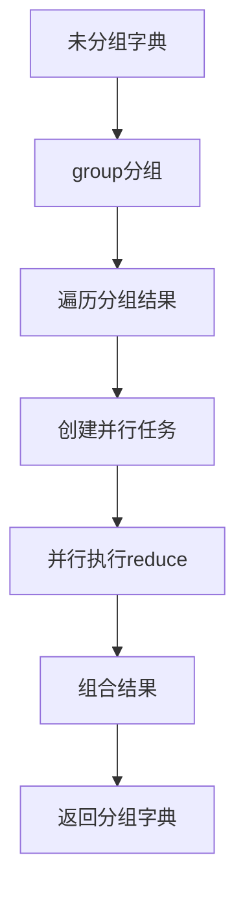

# model/ens/group.py 模块文档

## 文件概述

定义了Qlib的分组和聚合（Group）工具类，用于将多个对象按特定规则分组并进行聚合：
- **Group**: 通用分组和聚合类
- **RollingGroup**: 专门用于滚动字典的分组

这些类通常与Ensemble模块结合使用，实现复杂的多级预测结果处理。

## 核心概念

### 分组和聚合

分组和聚合是处理复杂预测结果的常用技术：

1. **分组（Group）**: 将扁平化的结果按某种规则分组
   - 例如：`{(A,B,C1): obj1, (A,B,C2): obj2}` → `{(A,B): {C1: obj1, C2: obj2}}`

2. **聚合（Reduce）**: 对分组后的结果进行聚合
   - 例如：`{(A,B): {C1: obj1, C2: obj2}}` → `{(A,B): aggregated_obj}`

3. **组合使用**: Group可以同时执行分组和聚合
   - 适用于并行处理多个组的结果

## 类定义

### Group 类

**职责**: 通用分组和聚合类，支持基于字典的分组和自定义聚合

#### 初始化
```python
def __init__(self, group_func=None, ens: Ensemble = None):
    """
    Init Group.

    Args:
        group_func (Callable, optional): Given a dict and return the group key and one of the group elements.
            Defaults to None.
        ens (Ensemble, optional): If not None, do ensemble for grouped value after grouping.
    """
    self._group_func = group_func
    self._ens_func = ens
```

**参数说明**:
- `group_func`: 分组函数，接受字典并返回分组后的字典
- `ens`: 集成（Ensemble）对象，用于聚合分组后的值

#### 方法签名

##### `group(*args, **kwargs) -> dict`
```python
def group(self, *args, **kwargs) -> dict:
    """Group a set of objects and change them to a dict."""
```

**功能**:
- 使用`_group_func`对输入进行分组
- 如果未指定`group_func`，抛出NotImplementedError

**示例**:
```python
def my_group_func(ungrouped_dict):
    """自定义分组函数"""
    grouped = {}
    for key, value in ungrouped_dict.items():
        # 假设key是元组，使用前两个元素作为分组键
        group_key = key[:-1]
        grouped.setdefault(group_key, {})[key[-1]] = value
    return grouped

group = Group(group_func=my_group_func)
result = group(ungrouped_dict)
```

##### `reduce(*args, **kwargs) -> dict`
```python
def reduce(self, *args, **kwargs) -> dict:
    """Reduce grouped dict."""
```

**功能**:
- 使用`_ens_func`对分组后的字典进行聚合
- 如果未指定`ens`，抛出NotImplementedError

##### `__call__(ungrouped_dict: dict, n_jobs: int = 1, verbose: int = 0, *args, **kwargs) -> dict`
```python
def __call__(self, ungrouped_dict: dict, n_jobs: int = 1, verbose: int = 0, *args, **kwargs) -> dict:
    """Group the ungrouped_dict into different groups."""
```

**参数说明**:
- `ungrouped_dict`: 未分组的字典，格式为`{name: things}`
- `n_jobs`: 并行任务数量，默认为1
- `verbose`: joblib.Parallel的打印模式，默认为0

**功能流程**:


**详细步骤**:
1. 使用`group`方法对输入进行分组
2. 遍历分组后的字典，提取键和值
3. 为每个组的`reduce`操作创建延迟任务
4. 使用`joblib.Parallel`并行执行所有任务
5. 组合键和结果，返回最终的分组字典

**注意事项**:
- 多进程环境可能因为`Serializable`影响pickle行为而报错
- 建议在单进程环境下使用，或确保对象可正确序列化

**示例**:
```python
from qlib.model.ens.group import Group
from qlib.model.ens.ensemble import RollingEnsemble

# 创建分组和聚合
group = Group(ens=RollingEnsemble())

# 未分组的数据
ungrouped_dict = {
    ("model1", "window1"): pred1,
    ("model1", "window2"): pred2,
    ("model2", "window1"): pred3,
    ("model2", "window2"): pred4
}

# 执行分组和聚合
result = group(ungrouped_dict, n_jobs=2)
# result: {("model1",): ensemble1, ("model2",): ensemble2}
```

### RollingGroup 类

**继承关系**: Group → RollingGroup

**职责**: 专门用于滚动字典的分组

#### 初始化
```python
def __init__(self, ens=RollingEnsemble()):
    super().__init__(ens=ens)
```

**参数说明**:
- `ens`: 默认使用`RollingEnsemble`进行聚合

#### 方法签名

##### `group(rolling_dict: dict) -> dict`
```python
def group(self, rolling_dict: dict) -> dict:
    """Given an rolling dict, return the grouped dict."""
```

**参数说明**:
- `rolling_dict`: 滚动字典，键为元组

**功能**:
- 将滚动字典按键分组
- 假设滚动键在元组的末尾
- 例如：`{(A,B,R): things}` → `{(A,B): {R: things}}`

**示例**:
```python
from qlib.model.ens.group import RollingGroup

# 创建滚动分组
group = RollingGroup()

# 滚动字典（键为元组，滚动键在末尾）
rolling_dict = {
    ("model1", "rolling1"): pred1,
    ("model1", "rolling2"): pred2,
    ("model2", "rolling1"): pred3,
    ("model2", "rolling2"): pred4
}

# 分组
result = group.group(rolling_dict)
# result: {
#     ("model1",): {"rolling1": pred1, "rolling2": pred2},
#     ("model2",): {"rolling1": pred3, "rolling2": pred4}
# }
```

**注意事项**:
- 键必须是元组类型
- 滚动键必须是元组的最后一个元素
- 如果键不是元组，抛出TypeError

## 类继承关系图

```
Group
└── RollingGroup
```

## 使用示例

### 示例1：基本分组和聚合

```python
from qlib.model.ens.group import Group
from qlib.model.ens.ensemble import RollingEnsemble

# 定义分组函数
def group_by_model(ungrouped_dict):
    grouped = {}
    for (model_name, window_name), pred in ungrouped_dict.items():
        grouped.setdefault(model_name, {})[window_name] = pred
    return grouped

# 创建分组对象
group = Group(group_func=group_by_model, ens=RollingEnsemble())

# 未分组数据
ungrouped = {
    ("lgbm", "win1"): pred1,
    ("lgbm", "win2"): pred2,
    ("xgb", "win1"): pred3,
    ("xgb", "win2"): pred4
}

# 分组和聚合
result = group(ungrouped)
# result: {"lgbm": ensemble1, "xgb": ensemble2}
```

### 示例2：滚动分组（RollingGroup）

```python
from qlib.model.ens.group import RollingGroup

# 创建滚动分组
group = RollingGroup()

# 滚动预测结果
rolling_predictions = {
    ("exp1", "model1", "rolling1"): pred1,
    ("exp1", "model1", "rolling2"): pred2,
    ("exp1", "model2", "rolling1"): pred3,
    ("exp1", "model2", "rolling2"): pred4
}

# 分组并自动集成
result = group(rolling_predictions, n_jobs=2)
# 结果：按实验和模型分组，每个组内的滚动预测自动集成
```

### 示例3：并行分组处理

```python
from qlib.model.ens.group import RollingGroup

# 创建分组对象，使用4个并行任务
group = RollingGroup()
result = group(rolling_dict, n_jobs=4, verbose=10)

# verbose=10会显示进度条
```

## 设计模式

### 1. 模板方法模式

- Group定义分组和聚合的框架
- 子类可以重写`group`方法实现特定分组逻辑

### 2. 策略模式

- 通过`group_func`和`ens`参数自定义分组和聚合策略
- 支持灵活的组合方式

### 3. 并行模式

- 使用`joblib.Parallel`实现并行处理
- 提高大规模数据处理的效率

## 与其他模块的关系

### 依赖模块

- `qlib.model.ens.ensemble`: Ensemble基类和RollingEnsemble
- `joblib`: 并行处理

### 被依赖模块

- `qlib.workflow`: 工作流中使用分组和聚合
- `qlib.contrib.model`: 具体模型实现可能使用分组

## 扩展指南

### 实现自定义分组逻辑

```python
from qlib.model.ens.group import Group
from qlib.model.ens.ensemble import Ensemble

class CustomEnsemble(Ensemble):
    def __call__(self, ensemble_dict: dict):
        # 自定义聚合逻辑
        return sum(ensemble_dict.values()) / len(ensemble_dict)

def custom_group_func(ungrouped_dict):
    # 自定义分组逻辑
    grouped = {}
    for key, value in ungrouped_dict.items():
        # 按键的第一个元素分组
        group_key = key[0]
        grouped.setdefault(group_key, []).append(value)
    return grouped

# 使用自定义分组和聚合
group = Group(group_func=custom_group_func, ens=CustomEnsemble())
result = group(ungrouped_dict)
```

### 实现自定义分组类

```python
from qlib.model.ens.group import Group
from qlib.model.ens.ensemble import RollingEnsemble

class TimeBasedGroup(Group):
    """基于时间的分组"""

    def __init__(self, time_window: str = "month"):
        super().__init__(ens=RollingEnsemble())
        self.time_window = time_window

    def group(self, ungrouped_dict: dict) -> dict:
        grouped = {}
        for (datetime, *rest), pred in ungrouped_dict.items():
            # 按月分组
            if self.time_window == "month":
                time_key = datetime[:7]  # "2020-01"
            grouped.setdefault(time_key, {})[(datetime, *rest)] = pred
        return grouped

# 使用基于时间的分组
group = TimeBasedGroup(time_window="month")
result = group(ungrouped_dict)
```

## 注意事项

1. **键的类型**: RollingGroup要求键必须是元组
2. **并行限制**: 多进程环境中注意序列化问题
3. **内存管理**: 大规模分组时注意内存使用
4. **顺序保证**: 并行处理时结果的顺序可能与输入不同

## 性能优化建议

1. **并行度**: 根据CPU核心数调整`n_jobs`参数
2. **批量处理**: 对于极大字典，考虑分批分组
3. **避免重复**: 分组前去重可以减少计算量
4. **预分配**: 预先估计分组数量可以提升性能
