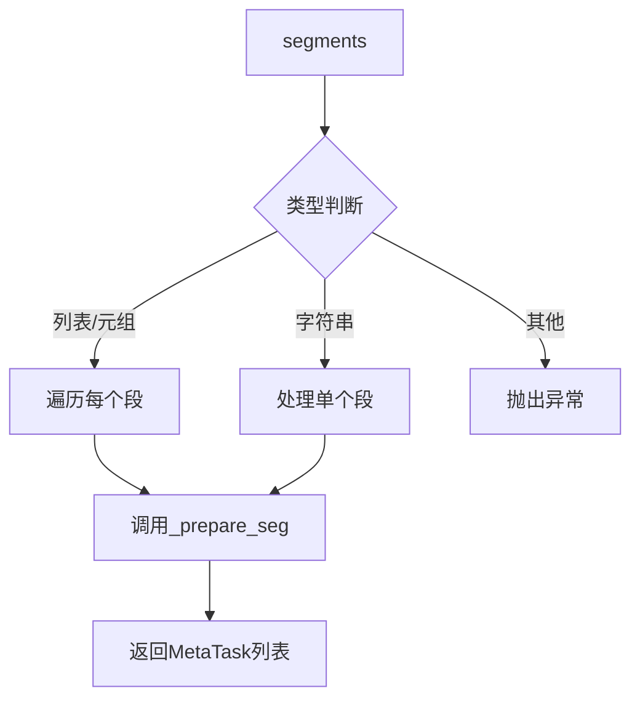

# model/meta/dataset.py 模块文档

## 文件概述

定义了Qlib元学习（Meta-Learning）的数据集接口，提供元级别数据访问：
- **MetaTaskDataset**: 元任务数据集，管理多个元任务

该类负责在元学习框架中准备和组织数据，支持元模型的训练和推理。

## 类定义

### MetaTaskDataset 类

**继承关系**: Serializable → MetaTaskDataset

**职责**: 元级别的数据集，管理元任务并提供数据访问接口

#### 初始化
```python
def __init__(self, segments: Union[Dict[Text, Tuple], float], *args, **kwargs):
    super().__init__(*args, **kwargs)
    self.segments = segments
```

**参数说明**:
- `segments`: 数据段划分方式
  - 可以是字典：`{"train": (0, 0.7), "valid": (0.7, 0.85), "test": (0.85, 1.0)}`
  - 也可以是浮点数：0.8表示80%用于训练

**功能**:
- 初始化元任务数据集
- 维护数据段划分信息
- 子类需要在初始化时创建任务列表

#### 方法签名

##### `prepare_tasks(segments: Union[List[Text], Text], *args, **kwargs) -> List[MetaTask]`
```python
def prepare_tasks(self, segments: Union[List[Text], Text], *args, **kwargs) -> List[MetaTask]:
    """
    Prepare the data in each meta-task and ready for training.
    """
    if isinstance(segments, (list, tuple)):
        return [self._prepare_seg(seg) for seg in segments]
    elif isinstance(segments, str):
        return self._prepare_seg(segments)
    else:
        raise NotImplementedError(f"This type of input is not supported")
```

**参数说明**:
- `segments`: 数据段名称
  - 可以是字符串：`"train"`、`"valid"`、`"test"`
  - 可以是列表/元组：`["train", "test"]`、`("train", "valid", "test")`

**返回值**:
- 单个段：返回`List[MetaTask]`
- 多个段：返回`List[List[MetaTask]]`，每个元素对应一个段的任务列表

**功能流程**:


**示例**:
```python
from qlib.model.meta.dataset import MetaTaskDataset

# 创建元数据集
meta_dataset = MetaTaskDataset(
    segments={
        "train": (0, 0.7),
        "valid": (0.7, 0.85),
        "test": (0.85, 1.0)
    }
)

# 获取单个段的任务
train_tasks = meta_dataset.prepare_tasks("train")
# 返回: [MetaTask, MetaTask, ...]

# 获取多个段的任务
train_tasks, test_tasks = meta_dataset.prepare_tasks(["train", "test"])
# 返回: (
#     [MetaTask, MetaTask, ...],  # train段的任务
#     [MetaTask, MetaTask, ...]   # test段的任务
# )

# 获取三个段的任务
train_tasks, valid_tasks, test_tasks = meta_dataset.prepare_tasks(["train", "valid", "test"])
```

##### `_prepare_seg(segment: Text)`
```python
@abc.abstractmethod
def _prepare_seg(self, segment: Text):
    """
    prepare a single segment of data for training data

    Parameters
    ----------
    seg : Text
        the name of the segment
    """
```

**参数说明**:
- `segment`: 段名称（"train"、"valid"、"test"等）

**功能**:
- 抽象方法，子类必须实现
- 准备指定段的数据并返回MetaTask列表
- 每个MetaTask包含基础任务和元信息

## 设计理念

### 元数据集的职责

1. **任务管理**: 维护和管理多个MetaTask
2. **数据准备**: 为不同段准备相应的任务
3. **灵活划分**: 支持多种数据段划分方式
4. **元级别操作**: 提供元学习所需的数据访问接口

### 数据处理模式

MetaTaskDataset支持不同的数据处理模式：

1. **PROC_MODE_FULL** (`"full"`):
   - 完整处理
   - 包含训练和测试数据
   - 用于元模型训练

2. **PROC_MODE_TEST** (`"test"`):
   - 仅测试数据
   - 用于元模型推理

3. **PROC_MODE_TRANSFER** (`"transfer"`):
   - 仅元信息
   - 用于跨数据集迁移

## 使用示例

### 示例1：基本使用

```python
from qlib.model.meta.dataset import MetaTaskDataset

# 定义元数据集
class MyMetaDataset(MetaTaskDataset):
    def _prepare_seg(self, segment):
        # 实现具体的数据准备逻辑
        tasks = []
        for task_config in self._get_tasks_for_segment(segment):
            # 创建元任务
            meta_info = self._extract_meta_info(task_config)
            meta_task = MetaTask(
                task=task_config,
                meta_info=meta_info,
                mode="full"
            )
            tasks.append(meta_task)
        return tasks

# 使用元数据集
meta_dataset = MyMetaDataset(segments={"train": 0.8})
train_tasks = meta_dataset.prepare_tasks("train")
```

### 示例2：多段数据准备

```python
from qlib.model.meta.dataset import MetaTaskDataset

# 准备训练和测试数据
meta_dataset = MyMetaDataset(
    segments={
        "train": (0, 0.7),
        "valid": (0.7, 0.85),
        "test": (0.85, 1.0)
    }
)

# 准备所有段
all_segments = ["train", "valid", "test"]
train_tasks, valid_tasks, test_tasks = meta_dataset.prepare_tasks(all_segments)

# 训练元模型
meta_model.fit(train_tasks)

# 在验证集上评估
valid_predictions = meta_model.inference(valid_tasks)

# 在测试集上测试
test_predictions = meta_model.inference(test_tasks)
```

### 示例3：跨数据集迁移

```python
# 在数据集A上训练元模型
meta_dataset_A = MyMetaDataset(segments={"train": 0.8})
train_tasks_A = meta_dataset_A.prepare_tasks("train")

meta_model = MyMetaModel()
meta_model.fit(train_tasks_A)

# 迁移到数据集B
meta_dataset_B = MyMetaDataset(segments={"train": 0.8})
train_tasks_B = meta_dataset_B.prepare_tasks("train", mode="transfer")

# 使用A上训练的元模型指导B上的学习
enhanced_tasks_B = meta_model.inference(train_tasks_B)
```

## 设计模式

### 1. 模板方法模式

- `prepare_tasks`定义数据准备流程
- `_prepare_seg`由子类实现具体逻辑

### 2. 工厂模式

- 数据集负责创建MetaTask对象
- 封装任务创建的复杂性

## 与其他模块的关系

### 依赖模块

- `qlib.model.meta.task`: MetaTask类
- `qlib.utils.serial.Serializable`: 序列化支持

### 被依赖模块

- `qlib.model.meta.model`: MetaModel使用MetaTaskDataset
- `qlib.workflow`: 工作流中使用元数据集

## 扩展指南

### 实现自定义元数据集

```python
from qlib.model.meta.dataset import MetaTaskDataset
from qlib.model.meta.task import MetaTask

class RollingMetaDataset(MetaTaskDataset):
    """滚动窗口的元数据集"""

    def __init__(self, segments, window_size=30, step_size=10):
        super().__init__(segments)
        self.window_size = window_size
        self.step_size = step_size
        self._initialize_windows()

    def _initialize_windows(self):
        """初始化滚动窗口"""
        self.windows = []
        start = 0
        end = self.window_size
        while end <= self.total_length:
            self.windows.append((start, end))
            start += self.step_size
            end += self.step_size

    def _prepare_seg(self, segment):
        """准备滚动窗口的元任务"""
        tasks = []
        for window_idx, (start, end) in enumerate(self.windows):
            # 为每个窗口创建任务
            task_config = self._create_task_for_window(start, end)
            meta_info = {
                "window_idx": window_idx,
                "start": start,
                "end": end
            }
            meta_task = MetaTask(
                task=task_config,
                meta_info=meta_info,
                mode="full"
            )
            tasks.append(meta_task)
        return tasks

# 使用
meta_dataset = RollingMetaDataset(
    segments={"train": 0.8},
    window_size=100,
    step_size=50
)
train_tasks = meta_dataset.prepare_tasks("train")
```

## 注意事项

1. **段划分**: 确保segments的定义与任务创建逻辑一致
2. **内存管理**: 大规模数据集注意内存使用
3. **元信息**: 元信息应该包含足够的上下文用于元学习
4. **模式匹配**: 使用正确的PROC_MODE以匹配应用场景

## 性能优化建议

1. **惰性加载**: 延迟加载数据，按需准备
2. **缓存机制**: 缓存已准备的任务以避免重复计算
3. **并行准备**: 使用多线程/多进程并行准备多个任务
4. **批量处理**: 对任务进行批量处理以提高效率

## 应用场景

### 1. 趂数据集学习

```python
# 在多个数据集上训练元模型
meta_datasets = []
for dataset_name in ["dataset_A", "dataset_B", "dataset_C"]:
    meta_ds = MyMetaDataset(segments={"train": 0.8})
    meta_ds.load_from(dataset_name)
    meta_datasets.append(meta_ds)

# 合并所有任务
all_train_tasks = []
for meta_ds in meta:datasets:
    tasks = meta_ds.prepare_tasks("train")
    all_train_tasks.extend(tasks)

# 训练元模型
meta_model.fit(all_train_tasks)
```

### 2. 在线元学习

```python
# 在线更新元模型
meta_dataset = MyMetaDataset(segments={"train": 0.8})

# 初始训练
train_tasks = meta_dataset.prepare_tasks("train")
meta_model.fit(train_tasks)

# 随着新数据到来，持续更新
while has_new_data:
    new_tasks = meta_dataset.prepare_tasks("new_data")
    meta_model.update(new_tasks)  # 假设有更新方法
```

### 3. 任务配置优化

```python
# 使用元模型优化任务配置
meta_dataset = MyMetaDataset(segments={"train": 0.8})
train_tasks = meta_dataset.prepare_tasks("train")

# 训练元模型
meta_model.fit(train_tasks)

# 生成优化后的任务配置
test_tasks = meta_dataset.prepare_tasks("test")
optimized_tasks = meta_model.inference(test_tasks)

# 使用优化后的任务训练基础模型
for task_config in optimized_tasks:
    model = init_instance_by_config(task_config["model"])
    dataset = init_instance_by_config(task_config["dataset"])
    model.fit(dataset)
```
