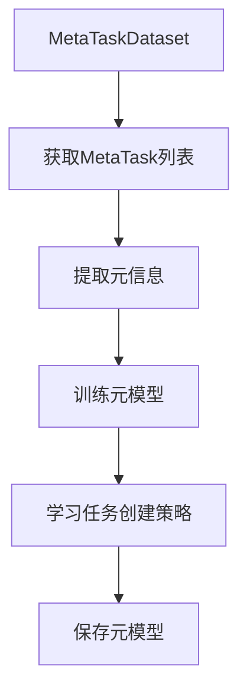
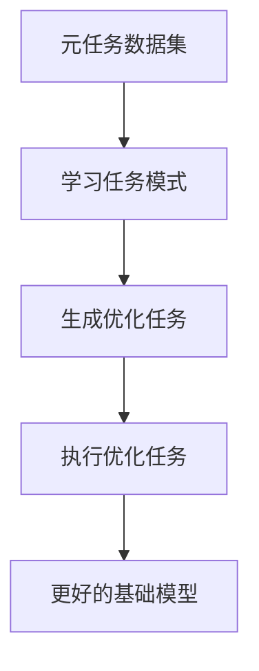
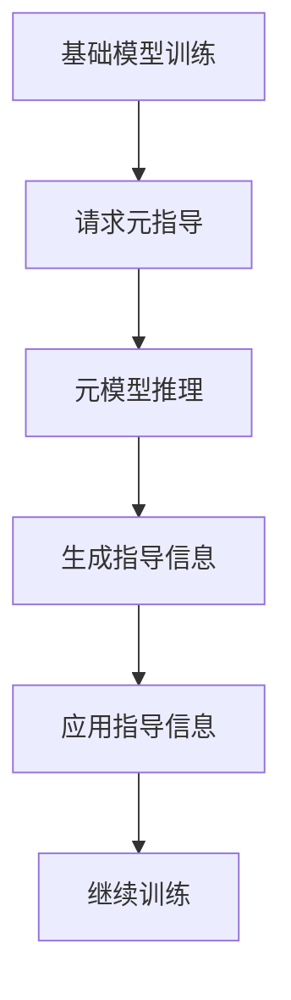

# model/meta/model.py 模块文档

## 文件概述

定义了Qlib元学习（Meta-Learning）的模型接口，提供元学习模型的基类和功能接口：
- **MetaModel**: 元学习模型抽象基类
- **MetaTaskModel**: 任务级元学习模型
- **MetaGuideModel**: 指导级元学习模型

这些类定义了元学习模型如何指导基础模型的学习过程。

## 类定义

### MetaModel 类

**继承关系**: 抽象基类（metaclass=abc.ABCMeta）

**职责**: 元学习模型的抽象基类，定义元学习的基本接口

#### 方法签名

##### `fit(*args, **kwargs)`
```python
@abc.abstractmethod
def fit(self, *args, **kwargs):
    """The training process of the meta-model."""
```

**功能**:
- 元模型的训练过程
- 从多个基础任务或元任务中学习通用知识
- 抽象方法，子类必须实现

##### `inference(*args, **kwargs) -> object`
```python
@abc.abstractmethod
def inference(self, *args, **kwargs) -> object:
    """
    The inference process of the meta-model.

    Returns
    -------
    object:
        Some information to guide the model learning
    """
```

**功能**:
- 元模型的推理过程
- 生成指导基础模型学习的信息
- 抽象方法，子类必须实现

**返回值**:
- 返回指导信息，具体类型由子类决定
- 可能是任务配置、训练参数、学习策略等

### MetaTaskModel 类

**继承关系**: MetaModel → MetaTaskModel

**职责**: 任务级元学习模型，通过修改任务定义来指导学习

#### 方法签名

##### `fit(meta_dataset: MetaTaskDataset)`
```python
def fit(self, meta_dataset: MetaTaskDataset):
    """
    The MetaTaskModel is expected to get prepared MetaTask from meta_dataset.
    And then it will learn knowledge from the meta tasks
    """
    raise NotImplementedError(f"Please implement the `fit` method")
```

**参数说明**:
- `meta_dataset`: MetaTaskDataset对象，包含元任务

**功能**:
- 从MetaTaskDataset中获取准备好的MetaTask
- 从多个元任务中学习通用模式
- 学习如何创建更好的基础任务

**`**使用流程**:


##### `inference(meta_dataset: MetaTaskDataset) -> List[dict]`
```python
def inference(self, meta_dataset: MetaTaskDataset) -> List[dict]:
    """
    MetaTaskModel will make inference on the meta_dataset
    The MetaTaskModel is expected to get prepared MetaTask from meta_dataset.
    Then it will create modified task with Qlib format which can be executed by Qlib trainer.

    Returns
    -------
    List[dict]:
        A list of modified task definitions.
    """
    raise NotImplementedError(f"Please implement the `inference` method")
```

**参数说明**:
- `meta_dataset`: MetaTaskDataset对象

**返回值**:
- `List[dict]`: 修改后的任务定义列表
- 每个任务定义可以被Qlib训练器执行

**功能**:
- 对元数据集进行推理
- 为每个元任务创建优化后的任务配置
- 返回可执行的任务定义

**使用示例**:
```python
from qlib.model.meta.model import MetaTaskModel
from qlib.model.meta.dataset import MetaTaskDataset

# 训练阶段
meta_dataset = MetaTaskDataset(segments={"train": 0.8})
meta_model = MyMetaTaskModel()
train_tasks = meta_dataset.prepare_tasks("train")
meta_model.fit(meta_dataset)

# 推理阶段
test_dataset = MetaTaskDataset(segments={"test": 0.2})
optimized_tasks = meta_model.inference(test_dataset)

# 使用优化后的任务
for task_config in optimized_tasks:
    # 执行任务
    model = init_instance_by_config(task_config["model"])
    dataset = init_instance_by_config(task_config["dataset"])
    model.fit(dataset)
```

### MetaGuideModel 类

**继承关系**: MetaModel → MetaGuideModel

**职责**: 指导级元学习模型，在训练过程中动态指导学习

#### 方法签名

##### `fit(*args, **kwargs)`
```python
@abc.abstractmethod
def fit(self, *args, **kwargs):
    pass
```

**功能**:
- 元模型的训练过程
- 子类实现具体训练逻辑

##### `inference(*args, **kwargs)`
```python
@abc.abstractmethod
def inference(self, *args, **kwargs):
    pass
```

**功能**:
- 元模型的推理过程
- 动态生成训练过程中的指导信息
- 子类实现具体推理逻辑

**与MetaTaskModel的区别**:
- MetaTaskModel: 修改任务定义，在训练前指导
- MetaGuideModel: 在训练过程中实时指导

**使用场景**:
```python
# MetaTaskModel示例（训练前指导）
meta_model = MetaTaskModel()
optimized_tasks = meta_model.inference(meta_dataset)
# 使用优化后的任务配置训练
for task in optimized_tasks:
    model.fit(task.dataset)

# MetaGuideModel示例（训练中指导）
meta_model = MetaGuideModel()
for epoch in range(num_epochs):
    # 获取当前训练状态的指导
    guidance = meta_model.inference(current_state)
    # 根据指导调整训练
    model.fit(data, **guidance)
```

## 类继承关系图

```
MetaModel (抽象基类)
├── MetaTaskModel (任务级元学习)
└── MetaGuideModel (指导级元学习)
```

## 设计理念

### 元学习的两种类型

Qlib将元学习分为两类：

#### 1. MetaTaskModel（任务级元学习）

**目标**: 优化任务定义

**流程**:


**应用场景**:
- 超参数优化
- 模型架构搜索
- 特征选择
- 训练策略学习

**示例**:
```python
# 学习如何创建更好的LightGBM任务
meta_model = MetaTaskModel()
meta_model.fit(meta_dataset)  # 从历史任务中学习

# 为新数据生成优化任务
new_task = meta_model.inference(new_dataset)
# 返回: {
#     "model": {
#         "class": "LGBModel",
#         "module_path": "qlib.contrib.model.gbdt",
#         "kwargs": {
#             "loss": "mse",  # 学习到的最优loss
#             "learning_rate": 0.05  # 学习到的最优学习率
#         }
#     },
#     "dataset": {...}
# }
```

#### 2. MetaGuideModel（指导级元学习）

**目标**: 指导训练过程

**流程**:


**应用场景**:
- 动态学习率调整
- 自适应梯度优化
- 课程学习
- 主动学习

**示例**:
```python
class LearningRateMetaGuide(MetaGuideModel):
    """学习率元指导"""

    def fit(self, training_histories):
        """从训练历史中学习最佳学习率策略"""
        # 分析训练历史，学习学习率调整策略
        self.strategy = self._learn_strategy(training_histories)

    def inference(self, current_state):
        """为当前训练状态提供学习率"""
        epoch = current_state["epoch"]
        loss = current_state["loss"]
        # 根据学习到的策略调整学习率
        lr = self.strategy.get_lr(epoch, loss)
        return {"learning_rate": lr}

# 使用
meta_guide = LearningRateMetaGuide()
meta_guide.fit(historical_data)

for epoch in range(num_epochs):
    # 获取学习率指导
    guidance = meta_guide.inference({"epoch": epoch, "loss": loss})
    # 使用指导的学习率
    optimizer.learning_rate = guidance["learning_rate"]
    model.fit(data)
```

## 使用示例

### 示例1：超参数优化（MetaTaskModel）

```python
from qlib.model.meta.model import MetaTaskModel
from qlib.model.meta.dataset import MetaTaskDataset

class HyperparameterOptimizer(MetaTaskModel):
    """超参数优化元模型"""

    def fit(self, meta_dataset):
        """学习最优超参数"""
        train_tasks = meta_dataset.prepare_tasks("train")

        # 收集所有任务的超参数和性能
        self.hyperparams = []
        self.performance = []
        for task in train_tasks:
            hyperparams = self._extract_hyperparams(task.task)
            performance = task.meta_info["performance"]
            self.hyperparams.append(hyperparams)
            self.performance.append(performance)

        # 学习超参数与性能的关系
        self.optimizer = self._learn_optimizer(self.hyperparams, self.performance)

    def inference(self, meta_dataset) -> List[dict]:
        """生成优化后的任务"""
        test_tasks = meta_dataset.prepare_tasks("test")
        optimized_tasks = []

        for task in test_tasks:
            # 预测最优超参数
            optimal_hyperparams = self.optimizer.predict(task.meta_info)
            # 创建优化后的任务
            optimized_task = task.task.copy()
            optimized_task["model"]["kwargs"].update(optimal_hyperparams)
            optimized_tasks.append(optimized_task)

        return optimized_tasks

# 使用
meta_dataset = MetaTaskDataset(segments={"train": 0.7, "test": 0.3})
meta_model = HyperparameterOptimizer()

# 训练元模型
meta_model.fit(meta_dataset)

)

# 生成优化任务
optimized_tasks = meta_model.inference(meta_dataset)
```

### 示例2：动态训练指导（MetaGuideModel）

```python
from qlib.model.meta.model import MetaGuideModel

class DynamicTrainingGuide(MetaGuideModel):
    """动态训练指导元模型"""

    def fit(self, training_hist):
        """从训练历史中学习指导策略"""
        # 分析训练轨迹，学习最佳训练策略
        self.guidance_policy = self._learn_policy(training_hist)

    def inference(self, current_state):
        """为当前状态提供指导"""
        # 根据当前状态和学到的策略生成指导
        guidance = self.guidance_policy(current_state)
        return {
            "learning_rate": guidance["lr"],
            "early_stopping": guidance["stop"],
            "gradient_clip": guidance["clip"]
        }

# 使用
meta_guide = DynamicTrainingGuide()
meta_guide.fit(historical_training_data)

for epoch in range(num_epochs):
    # 获取训练指导
    guidance = meta_guide.inference({
        "epoch": epoch,
        "train_loss": train_loss,
        "val_loss": val_loss
    })

    # 应用指导
    if guidance["early_stopping"]:
        break
    optimizer.learning_rate = guidance["learning_rate"]
    # ...训练模型
```

## 设计模式

### 1. 策略模式

- MetaTaskModel和MetaGuideModel提供不同的元学习策略
- 用户可以根据需求选择合适的策略

### 2. 模板方法模式

- MetaModel定义元学习的基本流程
- 子类实现具体的fit和inference逻辑

## 与其他模块的关系

### 依赖模块

- `qlib.model.meta.dataset.MetaTaskDataset`: 元数据集接口

### 被依赖模块

- `qlib.workflow`: 工作流中使用元模型
- `qlib.contrib.model`: 具体模型可能使用元指导

## 扩展指南

### 实现任务配置元模型

```python
from qlib.model.meta.model import MetaTaskModel

class TaskConfigMetaModel(MetaTaskModel):
    """学习最优任务配置"""

    def fit(self, meta_dataset):
        train_tasks = meta_dataset.prepare_tasks("train")

        # 提取任务配置和性能
        self.task_configs = [task.task for task in train_tasks]
        self.performances = [task.meta_info["score"] for task in train_tasks]

        # 训练配置优化器
        self.config_optimizer = ConfigOptimizer()
        self.config_optimizer.fit(self.task_configs, self.performances)

    def inference(self, meta_dataset):
        test_tasks = meta_dataset.prepare_tasks("test")
        optimized_tasks = []

        for task in test_tasks:
            # 优化任务配置
            config = self.config_optimizer.optimize(task.task)
            optimized_tasks.append(config)

        return optimized_tasks
```

### 实现学习策略元模型

```python
from qlib.model.meta.model import MetaGuideModel

class LearningStrategyMetaGuide(MetaGuideModel):
    """学习最优训练策略"""

    def fit(self, strategy_histories):
        """从策略历史中学习"""
        # 分析哪些策略效果最好
        self.strategy_ranker = StrategyRanker()
        self.strategy_ranker.fit(strategy_histories)

    def inference(self, current_context):
        """为当前上下文推荐策略"""
        # 根据当前上下文推荐最佳策略
        best_strategy = self.strategy_ranker.predict(current_context)
        return best_strategy

# 使用
meta_guide = LearningStrategyMetaGuide()
meta_guide.fit(strategy_histories)

# 在训练中使用
strategy = meta_guide.inference({"data_size": 1000, "model_type": "lgbm"})
model.fit(data, **strategy)
```

## 注意事项

1. **模型类型**: 根据应用场景选择MetaTaskModel或MetaGuideModel
2. **数据质量**: 元学习需要高质量的元数据才能学习到有用模式
3. **计算成本**: 元学习训练通常比基础学习更耗时
4. **过拟合风险**: 注意元模型在有限任务上的过拟合问题

## 应用场景

### 1. AutoML

```python
# 使用元模型自动化机器学习流程
meta_model = AutoMLMetaModel()
meta_model.fit(meta_dataset)  # 学习AutoML策略

# 自动生成最优配置
best_config = meta_model.inference(new_dataset)
```

### 2. 迁移学习

```python
# 在源任务上训练元模型
source_meta_dataset = MetaTaskDataset(segments={"train": 0.8})
meta_model.fit(source_meta_dataset)

# 迁移到目标任务
target_meta_dataset = MetaTaskDataset(segments={"test": 0.2})
optimized_tasks = meta_model.inference(target_meta_dataset)
```

### 3. 在线学习

```python
# 持续更新元模型
meta_model = OnlineMetaModel()

while True:
    # 获取新任务
    new_task = get_new_task()
    # 增量更新元模型
    meta_model.update(new_task)
    # 获取指导
    guidance = meta_model.inference(current_context)
```
