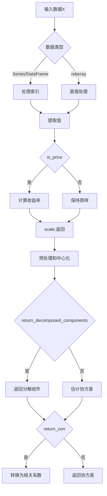

# model/riskmodel/base.py 模块文档

## 文件概述

定义了Qlib风险模型（RiskModel）的基类，提供协方差矩阵估计的基础接口：
- **RiskModel**: 风险模型基类，用于估计资产收益率的协方差矩阵

## 类定义

### RiskModel 类

**继承关系**: BaseModel → RiskModel

**职责**: 风险模型基类，估计协方差矩阵

#### 类属性

```python
MASK_NAN = "mask"      # 掩盖缺失值
FILL_NAN = "fill"      # 填充缺失值
IGNORE_NAN = "ignore"  # 忽略缺失值
```

#### 初始化
```python
def __init__(
    self,
    nan_option: str = "ignore",
    assume_centered: bool = False,
    scale_return: bool = True
):
```

**参数说明**:

| 参数 | 类型 | 说明 |
|------|------|------|
| `nan_option` | str | 缺失值处理方式：`mask`/`fill`/`ignore` |
| `assume_centered` | bool | 是否假设数据已中心化 |
| `scale_return` | bool | 是否将收益率缩放为百分比 |

**功能**:
- 初始化风险模型
- `**设置缺失值处理方式**
- 设置是否假设数据已中心化
- 设置是否缩放收益率为百分比

#### 方法签名

##### `predict(X, return_corr=False, is_price=True, return_decomposed_components=False)`
```python
def predict(
    self,
    X: Union[pd.Series, pd.DataFrame, np.ndarray],
    return_corr: bool = False,
    is_price: bool = True,
    return_decomposed_components=False,
) -> Union[pd.DataFrame, np.ndarray, tuple]:
```

**参数说明**:

| 参数 | 类型 | 说明 |
|------|------|------|
| `X` | pd.Series/pd.DataFrame/np.ndarray | 输入数据，变量为列，观测为行 |
| `return_corr` | bool | 是否返回相关系数矩阵 |
| `is_price` | bool | 是否X包含价格（否则假设收益率） |
| `return_decomposed_components` | bool | 是否返回协方差分解的组件 |

**返回值**:
- 默认：协方差矩阵（pd.DataFrame或np.ndarray）
- `return_corr=True`: 相关系数矩阵
- `return_decomposed_components=True`: 分解的协方差组件

**功能流程**:


**详细步骤**:
1. 转换输入为2D数组，保存列名
2. 如果`is_price=True`，计算百分比变化（收益率）
3. 如果`scale_return=True`，将收益率缩放为百分比（×100）
4. 预处理数据（处理NaN和中心化）
5. 如果`return_decomposed_components=True`，返回分解的协方差组件
6. 调用`_predict`估计协方差
7. 如果`return_corr=True`，转换为相关系数矩阵
8. 返回结果（DataFrame或ndarray）

**示例**:
```python
from qlib.model.riskmodel import base
import pandas as pd

# 创建风险模型
risk_model = base.RiskModel()

# 准备价格数据
prices = pd.DataFrame({
    "AAPL": [150.0, 152.0, 148.0, 155.0],
    "MSFT": [280.0, 285.0, 275.0, 290.0],
    "GOOG": [2500.0, 2550.0, 2480.0, 2600.0]
})

# 估计协方差矩阵
cov_matrix = risk_model.predict(prices, is_price=True)
print(cov_matrix)
#           AAPL      MSFT      GOOG
# AAPL  0.000045  0.000052  0.000048
# MSFT  0.000052  0.000061  0.000055
# GOOG  0.000048  0.000055  0.000050

# 返回相关系数矩阵
corr_matrix = risk_model.predict(prices, return_corr=True, is_price=True)
print(corr_matrix)
#           AAPL      MSFT      GOOG
# AAPL  1.000000  0.990000  0.950000
# MSFT  0.990000  1.000000  0.920000
# GOOG  0.950000  0.920000  1.000000
```

##### `_predict(X: np.ndarray) -> np.ndarray`
```python
def _predict(self, X: np.ndarray) -> np.ndarray:
    """covariance estimation implementation

    This method should be overridden by child classes.

    By default, this method implements the empirical covariance estimation.
    """
```

**参数说明**:
- `X`: 数据矩阵，变量为列，观测为行

**返回值**:
协方差矩阵（np.ndarray）

**功能**:
- 默认实现经验协方差估计
- 子类应该重写此方法实现自定义估计
- 公式：S = X^T X / N

**默认实现细节**:
```python
xTx = np.asarray(X.T.dot(X))  # 计算X^T X
N = len(X)  # 观测数量

if isinstance(X, np.ma.MaskedArray):  # 如果是掩盖数组
    M = 1 - X.mask  # 掩盖矩阵
    N = M.T.dot(M)  # 每对有不同的样本数

return xTx / N  # 协方差矩阵
```

**示例**: 自定义风险模型
```python
class MyRiskModel(RiskModel):
    def _predict(self, X):
        """自定义协方差估计"""
        # 使用加权协方差估计
        weights = np.ones(len(X)) / len(X)
        X_weighted = X * np.sqrt(weights[:, np.newaxis])
        S = X_weighted.T.dot(X_weighted)
        return S
```

##### `_preprocess(X: np.ndarray) -> Union[np.ndarray, np.ma.MaskedArray]`
```python
def _preprocess(self, X: np.ndarray) -> Union[np.ndarray, np.ma.MaskedArray]:
    """handle nan and centerize data

    Note:
        if `nan_option='mask'` then the returned array will be `np.ma.MaskedArray`.
    """
```

**参数说明**:
- `X`: 数据矩阵

**返回值**:
- 预处理后的数据（np.ndarray或np.ma.MaskedArray）

**功能**:
1. 处理NaN值
   - `fill`: 用0填充
   - `mask`: 创建掩盖数组
   - `ignore`: 保持原样
2. 如果`assume_centered=False`，中心化数据

**示例**:
```python
# 填充缺失值
risk_model = RiskModel(nan_option="fill")
X_processed = risk_model._preprocess(X_with_nan)

# 掩盖缺失值
risk_model = RiskModel(nan_option="mask")
X_processed = risk_model._preprocess(X_with_nan)
# X_processed是np.ma.MaskedArray

# 忽略缺失值（保持原样）
risk_model = RiskModel(nan_option="ignore")
X_processed = risk_model._preprocess(X_with_nan)
```

## 类继承关系图

```
BaseModel (来自model.base)
    └── RiskModel
            ├── ShrinkCovEstimator
            ├── StructuredCovEstimator
            └── POETCovEstimator
```

## 使用示例

### 示例1：基本协方差估计

```python
from qlib.model.riskmodel import RiskModel
import numpy as np

# 创建风险模型
risk_model = RiskModel()

# 准备收益率数据
returns = np.array([
    [0.01, 0.02, 0.015],
    [0.02, 0.01, 0.018],
    [0.015, 0.018, 0.02]
])

# 估计协方差
cov = risk_model.predict(returns, is_price=False)
print(cov)
```

### 示例2：处理缺失值

```python
from qlib.model.riskmodel import RiskModel
import numpy as np

# 创建带有NaN的数据
data_with_nan = np.array([
    [0.01, np.nan, 0.015],
    [0.02, 0.01, 0.018],
    [0.015, 0.018, np.nan]
])

# 使用mask选项
risk_model = RiskModel(nan_option="mask")
X_processed = risk_model._preprocess(data_with_nan)

# 使用fill选项
risk_model = RiskModel(nan_option="fill")
X_processed = risk_model._preprocess(data_with_nan)
```

### 示例3：从价格计算协方差

```python
from qlib.model.riskmodel import RiskModel
import pandas as pd

# 价格数据
prices = pd.DataFrame({
    "stock1": [100, 105, 102, 108, 106],
    "stock2": [200, 205, 198, 210, 208],
    "stock3": [50, 52, 49, 55, 53]
})

# 计算协方差
risk_model = RiskModel()
cov = risk_model.predict(prices, is_price=True)

# 计算相关系数
risk_model = RiskModel()
corr = risk_model.predict(prices, return_corr=True, is_price=True)
```

### 示例4：多索引数据处理

```python
from qlib.model.riskmodel import RiskModel
import pandas as pd

# 创建多索引数据
dates = pd.date_range("2020-01-01", periods=5)
instruments = ["stock1", "stock2", "stock3"]

# 创建多索引Series
multi_index = pd.MultiIndex.from_product(
    [dates, instruments],
    names=["datetime", "instrument"]
)

prices = pd.Series(
    [100, 200, 50, 105, 205, 52, 102, 198, 49, 108, 210, 55, 106, 208, 53],
    index=multi_index
)

# 计算协方差
risk_model = RiskModel()
cov = risk_model.predict(prices, is_price=True)
print(cov.shape)  # (3, 3)
```

## 设计模式

### 1. 模板方法模式

- `predict`定义协方差估计的流程
- `_predict`由子类实现具体估计逻辑

### 2. 策略模式

- 通过`nan_option`参数选择缺失值处理策略
- 支持不同的NaN处理方式

## 与其他模块的关系

### 依赖模块

- `qlib.model.base.BaseModel`: 基础模型接口
- `numpy`, `pandas`: 数值计算和数据处理

### 被依赖模块

- `qlib.model.riskmodel.shrink`: 收缩协方差估计
- `qlib.model.riskmodel.structured`: 结构化协方差估计
- `qlib.model.riskmodel.poet`: POET协方差估计

## 扩展指南

### 实现自定义风险模型

```python
from qlib.model.riskmodel import RiskModel
import numpy as np

class WeightedCovEstimator(RiskModel):
    """加权协方差估计器"""

    def __init__(self, weights=None, **kwargs):
        super().__init__(**kwargs)
        self.weights = weights

    def _predict(self, X):
        """加权协方差估计"""
        if self.weights is None:
            # 默认等权重
            weights = np.ones(len(X)) / len(X)
        else:
            weights = np.asarray(self.weights)
            weights = weights / weights.sum()  # 归一化

        # 加权协方差
        X_centered = X - X.mean(axis=0)
        X_weighted = X_centered * np.sqrt(weights[:, np.newaxis])
        S = X_weighted.T.dot(X_weighted)

        return S

# 使用
risk_model = WeightedCovEstimator(weights=[0.5, 0.3, 0.2])
cov = risk_model.predict(returns)
```

### 实现鲁棒协方差估计

```python
class RobustCovEstimator(RiskModel):
    """鲁棒协方差估计器（使用M估计）"""

    def __init__(self, max_iter=100, tol=1e-6, **kwargs):
        super().__init__(**kwargs)
        self.max_iter = max_iter
        self.tol = tol

    def _predict(self, X):
        """鲁棒协方差估计（M估计）"""
        # 初始化
        n, p = X.shape
        S = np.cov(X.T)
        mu = X.mean(axis=0)

        # 迭代更新
        for _ in range(self.max_iter):
            # 计算Mahalanobis距离
            diff = X - mu
            inv_S = np.linalg.inv(S)
            mahal = np.sum(diff * (diff @ inv_S), axis=1)

            # 计算权重（Huber权重函数）
            c = 1.345  # 常数
            weights = np.where(mahal <= c**2, 1, c / np.sqrt(mahal))

            # 更新均值和协方差
            mu_new = np.sum(weights[:, np.newaxis] * X, axis=0) / np.sum(weights)
            diff = X - mu_new
            weights_sqrt = np.sqrt(weights)
            S_new = (diff.T * weights_sqrt) @ (diff * weights_sqrt) / np.sum(weights)

            # 检查收敛
            if np.linalg.norm(S_new - S) < self.tol:
                break

            mu = mu_new
            S = S_new

        return S

# 使用
risk_model = RobustCovEstimator()
cov = risk_model.predict(returns)
```

## 注意事项

1. **数据格式**: 确保输入数据的格式正确（变量为列，观测为行）
2. **缺失值处理**: 选择合适的nan_option处理缺失值
3. **中心化**: 如果数据未中心化，设置`assume_centered=False`
4. **缩放**: 如果不需要百分比缩放，设置`scale_return=False`

## 性能优化建议

1. **批量计算**: 一次性计算多个时间点的协方差
2. **增量更新**: 对于新增数据，使用增量协方差更新
3. **低秩近似**: 对于大规模问题，使用低秩近似
4. **并行计算**: 利用多核并行计算协方差

## 应用场景

### 1. 投资组合优化

```python
# 计算协方差矩阵用于组合优化
risk_model = RiskModel()
cov = risk_model.predict(prices, is_price=True)

# 最小方差组合
inv_cov = np.linalg.inv(cov)
ones = np.ones(len(cov))
weights = inv_cov @ ones / (ones @ inv_cov @ ones)
```

### 2. 风险分解

```python
# 分解组合风险
risk_model = RiskModel()
cov = risk_model.predict(prices)

# 边际风险贡献
portfolio_weights = np.array([0.3, 0.4, 0.3])
portfolio_vol = np.sqrt(portfolio_weights @ cov @ portfolio_weights)
marginal_risk = (cov @ portfolio_weights) / portfolio_vol
contribution = portfolio_weights * marginal_risk

print(marginal_risk)
print(contribution)
```

### 3. 风险归因

```python
# 主成分分析进行风险归因
risk_model = RiskModel()
cov = risk_model.predict(prices)

eigvals, eigvecs = np.linalg.eigh(cov)

# 主成分解释的风险
explained_ratio = eigvals / eigvals.sum()
print(explained_ratio)

# 主成分风险贡献
factor_loadings = eigvecs.T @ np.diag(np.sqrt(eigvals))
print(factor_loadings)
```
