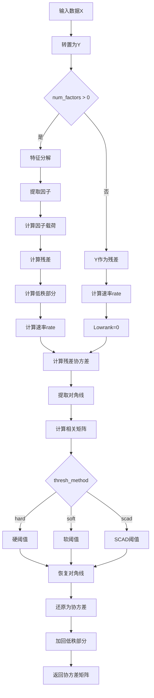

# model/riskmodel/poet.py 模块文档

## 文件概述

定义了POET（Principal Orthogonal Complement Thresholding）协方差估计器：
- **POETCovEstimator**: POET协方差估计器

POET是一种高维协方差矩阵估计方法，结合了因子模型和阈值处理技术。

## 参考文献

- [1] Fan, J., Liao, Y., & Mincheva, M. (2013). Large covariance estimation by thresholding principal orthogonal complements. Journal of Royal Statistical Society. Series B: Statistical Methodology, 75(4), 603–680. https://doi.org/10.1111/rssb.12016
- [2] http://econweb.rutgers.edu/yl1114/papers/poet/POET.m

## 类定义

### POETCovEstimator 类

**继承关系**: RiskModel → POETCovEstimator

**职责**: POET协方差估计器，适用于高维和因子模型场景

#### 类属性

```python
THRESH_SOFT = "soft"    # 软阈值
THRESH_HARD = "hard"    # 硬阈值
THRESH_SCAD = "scad"    # SCAD阈值
```

#### 初始化
```python
def __init__(
    self,
    num_factors: int = 0,
    thresh: float = 1.0,
    thresh_method: str = "soft",
    **kwargs
):
```

**参数说明**:

| 参数 | 类型 | 说明 |
|------|------|------|
| `num_factors` | int | 因子数量（0表示不使用因子模型） |
| `thresh` | float | 阈值常数（正数） |
| `thresh_method` | str | 阈值方法：`soft`/`hard`/`scad` |
| `**kwargs` |  | 传递给RiskModel的参数 |

**功能**:
- 初始化POET估计器
- 设置因子数量和阈值参数
- 选择阈值处理方法

#### 方法签名

##### `_predict(X: np.ndarray) -> np.ndarray`
```python
def _predict(self, X: np.ndarray) -> np.ndarray:
    Y = X.T  # NOTE: to match POET's implementation
    p, n = Y.shape

    if self.num_factors > 0:
        Dd, V = np.linalg.eig(Y.T.dot(Y))
        V = V[:, np.argsort(Dd)]
        F = V[:, -self.num_factors :][:, ::-1] * np.sqrt(n)
        LamPCA = Y.dot(F) / n
        uhat = np.asarray(Y - LamPCA.dot(F.T))
        Lowrank = np.asarray(LamPCA.dot(LamPCA.T))
        rate = 1 / np.sqrt(p) + np.sqrt(np.log(p) / n)
    else:
        uhat = np.asarray(Y)
        rate = np.sqrt(np.log(p) / n)
        Lowrank = 0

    lamb = rate * self.thresh
    SuPCA = uhat.dot(uhat.T) / n
    SuDiag = np.diag(np.diag(SuPCA))
    R = np.linalg.inv(SuDiag**0.5).dot(SuPCA).dot(np.linalg.inv(SuDiag**0.5))

    if self.thresh_method == self.THRESH_HARD:
        M = R * (np.abs(R) > lamb)
    elif self.thresh_method == self.THRESH_SOFT:
        res = np.abs(R) - lamb
        res = (res + np.abs(res)) / 2
        M = np.sign(R) * res
    else:
        M1 = (np.abs(R) < 2 * lamb) * np.sign(R) * (np.abs(R) - lamb) * (np.abs(R) > lamb)
        M2 = (np.abs(R) < 3.7 * lamb) * (np.abs(R) >= 2 * lamb) * (2.7 * R - 3.7 * np.sign(R) * lamb) / 1.7
        M3 = (np.abs(R) >= 3.7 * lamb) * R
        M = M1 + M2 + M3

    Rthresh = M - np.diag(np.diag(M)) + np.eye(p)
    SigmaU = (SuDiDiag**0.5).dot(Rthresh).dot(SuDiag**0.5)
    SigmaY = Sigma (SigmaU + Lowrank)

    return SigmaY
```

**功能流程**:


**详细步骤**:

1. **转置数据**（匹配POET原始实现）：
   ```python
   Y = X.T  # p x n
   ```

2. **因子模型处理**（如果`num_factors > 0`）：
   - 特征分解：`Y.T @ Y = V @ D @ V.T`
   - 提取前`num_factors`个主成分
   - 计算因子载荷：`LamPCA = Y @ F / n`
   - 计算残差：`uhat = Y - LamPCA @ F.T`
   - 计算低秩部分：`Lowrank = LamPCA @ LamPCA.T`

3. **不使用因子模型**（`num_factors = 0`）：
   - `uhat = Y`
   - `Lowrank = 0`

4. **计算阈值速率**：
   - 有因子：`rate = 1/√p + √(log(p)/n)`
   - 无因子：`rate = √(log(p)/n)`

5. **计算残差协方差**：
   ```python
   SuPCA = uhat @ uhat.T / n  # 残差协方差
   SuDiag = diag(diag(SuPCA))  # 对角矩阵
   ```

6. **计算相关矩阵**：
   ```python
   R = SuDiag^(-0.5) @ SuPCA @ SuDiag^(-0.5)
   ```

7. **应用阈值**：
   - **硬阈值**（hard）：`M = R * (|R| > λ)`
   - **软阈值**（soft）：`M = sign(R) * max(|R| - λ, 0)`
   - **SCAD阈值**（scad）：使用SCAD阈值函数

8. **恢复为协方差矩阵**：
   ```python
   Rthresh = M - diag(M) + I  # 恢复对角线
   SigmaU = SuDiag^0.5 @ Rthresh @ SuDiag^0.5
   SigmaY = SigmaU + Lowrank
   ```

**阈值方法详解**:

1. **硬阈值**（Hard Thresholding）：
   ```python
   M = R * (|R| > λ)
   # 如果|R| > λ，保留R；否则为0
   ```

2. **软阈值**（Soft Thresholding）：
   ```python
   res = |R| - λ
   res = (res + |res|) / 2  # 等价于max(res, 0)
   M = sign(R) * res
   # 结果是sign(R) * max(|R| - λ, 0)
   ```

3. **SCAD阈值**（Smoothly Clipped Absolute Deviation）：
   ```python
   # 第一段：λ < |R| < 2λ
   M1 = sign(R) * (|R| - λ) * (|R| > λ) * (|R| < 2λ)

   # 第二段：2λ ≤ |R| < 3.7λ
   M2 = ((2.7 * R - 3.7 * sign(R) * λ) / 1.7) * (|R| >= 2λ) * (|R| < 3.7λ)

   # 第三段：|R| ≥ 3.7λ
   M3 = R * (|R| >= 3.7λ)

   M = M1 + M2 + M3
   ```

## 使用示例

### 示例1：基本使用

```python
from qlib.model.riskmodel.poet import POETCovEstimator
import numpy as np

# 创建POET估计器（不使用因子模型）
poet = POETCovEstimator(
    num_factors=0,
    thresh=1.0,
    thresh_method="soft"
)

# 准备数据
returns = np.random.randn(100, 50)  # 100个观测，50个变量

# 估计协方差
cov = poet.predict(returns, is_price=False)
print(cov.shape)  # (50, 50)
```

### 示例2：使用因子模型

```python
from qlib.model.riskmodel.poet import POETCovEstimator
import numpy as np

# 创建POET估计器（使用5个因子）
poet = POETCovEstimator(
    num_factors=5,
    thresh=1.5,
    thresh_method="hard"
)

# 准备数据
returns = np.random.randn(200, 100)   # 200个观测，100个变量

# 估计协方差
cov = poet.predict(returns, is_price=False)
print(cov.shape)  # (100, 100)
```

### 示例3：比较不同阈值方法

```python
from qlib.model.riskmodel.poet import POETCovEstimator
import numpy as np

# 准备数据
returns = np.random.randn(150, 80)

# 比较三种阈值方法
methods = ["soft", "hard", "scad"]
results = {}

for method in methods:
    poet = POETCovEstimator(
        num_factors=10,
        thresh=1.0,
        thresh_method=method
    )
    cov = poet.predict(returns, is_price=False)
    results[method] = cov

    print(f"{method}方法:")
    print(f"  条件数: {np.linalg.cond(cov):.2f}")
    print(f"  迹: {np.trace(cov):.4f}")
```

### 示例4：调优阈值参数

```python
from qlib.model.riskmodel.poet import POETCovEstimator
import numpy as np

# 准备数据
returns = np.random.randn(200, 100)

# 测试不同的阈值
thresh_values = [0.5, 1.0, 1.5, 2.0]
results = []

for thresh in thresh_values:
    poet = POETCovEstimator(
        num_factors=5,
        thresh=thresh,
        thresh_method="soft"
    )
    cov = poet.predict(returns, is_price=False)

    results.append({
        "thresh": thresh,
        "condition_number": np.linalg.cond(cov),
        "trace": np.trace(cov),
        "sparsity": np.sum(cov == 0) / cov.size
    })

# 打印结果
for res in results:
    print(f"thresh={res['thresh']:.1f}: "
          f"条件数={res['condition_number']:.2f}, "
          f"稀疏度={res['sparsity']:.2%}")
```

## 设计理念

### POET方法的优势

1. **高维适应性**: 适用于变量数p大于观测数n的情况
2. **因子建模**: 可以捕捉资产的共同风险因子
3. **稀疏性**: 通过阈值引入稀疏性，提高估计稳定性
4. **理论保证**: 有良好的理论性质和收敛速率

### POET公式的数学表达

POET将协方差矩阵分解为：

```
Σ = Σ_F + Σ_U

其中：
- Σ_F: 因子结构部分（低秩）
- Σ_U: 稀疏部分（阈值处理后的残差）
```

具体计算：

1. **因子提取**:
   ```
   Y = X^T
   Y Y^T = V Λ V^T（特征分解）
   F = V_{-k} √n（提取前k个主成分）
   Λ_PCA = Y F / n（因子载荷）
   û = Y - Λ_PCA F^T（残差）
   ```

2. **协方差估计**:
   ```
   Σ_F = Λ_PCA Λ_PCA^T（低秩部分）
   Σ_û = û û^T / n（残差协方差）
   R = D^{-0.5} Σ_û D^{-0.5}（相关矩阵）
   R_λ = T_λ(R)（阈值处理）
   Σ_U = D^{0.5} R_λ D^{0.5}（还原为协方差）
   Σ = Σ_F + Σ_U
   ```

## 类继承关系图

```
RiskModel
    └── POETCovEstimator
```

## 设计模式

### 1. 策略模式

- 通过`thresh_method`参数选择阈值处理策略
- 支持硬阈值、软阈值和SCAD阈值

### 2. 组合模式

- 组合因子模型和阈值处理
- Σ = Σ_F + Σ_U

## 与其他模块的关系

### 依赖模块

- `qlib.model.riskmodel.RiskModel`: 风险模型基类
- `numpy`: 数值计算

### 被依赖模块

- `qlib.contrib.strategy`: 投资组合优化
- `qlib.backtest`: 回测

## 扩展指南

### 实现自定义阈值方法

```python
from qlib.model.riskmodel.poet import POETCovEstimator
import numpy as np

class CustomThresholdPOET(POETCovEstimator):
    """自定义阈值方法的POET"""

    def __init__(self, thresh_func=None, **kwargs):
        super().__init__(**kwargs)
        self.thresh_func = thresh_func

    def _predict(self, X):
        """使用自定义阈值函数"""
        # 复用原逻辑到阈值处理前
        Y = X.T
        p, n = Y.shape

        if self.num_factors > 0:
            Dd, V = np.linalg.eig(Y.T.dot(Y))
            V = V[:, np.argsort(Dd)]
            F = V[:, -self.num_factors :][:, ::-1] * np.sqrt(n)
            LamPCA = Y.dot(F) / n
            uhat = np.asarray(Y - LamPCA.dot(F.T))
            Lowrank = np.asarray(LamPCA.dot(LamPCA.T))
            rate = 1 / np.sqrt(p) + np.sqrt(np.log(p) / n)
        else:
            uhat = np.asarray(Y)
            rate = np.sqrt(np.log(p) / n)
            Lowrank = 0

        SuPCA = uhat.dot(uhat.T) / n
        SuDiag = np.diag(np.diag(SuPCA))
        R = np.linalg.inv(SuDiag**0.5).dot(SuPCA).dot(np.linalg.inv(SuDiag**0.5))

        # 使用自定义阈值函数
        if self.thresh_func is not None:
            M = self.thresh_func(R, rate * self.thresh)
        else:
            # 默认软阈值
            lamb = rate * self.thresh
            res = np.abs(R) - lamb
            res = (res + np.abs(res)) / 2
            M = np.sign(R) * res

        Rthresh = M - np.diag(np.diag(M)) + np.eye(p)
        SigmaU = (SuDiag**0.5).dot(Rthresh).dot(SuDiag**0.5)
        SigmaY = SigmaU + Lowrank

        return SigmaY

# 使用自定义阈值函数
def adaptive_threshold(R, lam):
    """自适应阈值"""
    # 根据R的值动态调整阈值
    threshold = lam * (1 + np.abs(R).mean())
    return np.sign(R) * np.maximum(np.abs(R) - threshold, 0)

poet = CustomThresholdPOET(
    num_factors=5,
    thresh=1.0,
    thresh_func=adaptive_threshold
)
cov = poet.predict(returns)
```

## 注意事项

1. **因子数量**: `num_factors`应小于变量数和观测数
2. **阈值选择**: 阈值参数`thresh`影响稀疏性和估计质量
3. **数值稳定性**: 注意协方差矩阵的条件数
4. **计算复杂度**: 特征分解的计算复杂度为O(p³)

## 性能优化建议

1. **因子数量**: 对于高维问题，使用较少的因子数
2. **近似计算**: 对于大规模问题，使用近似特征分解
3. **并行计算**: 特征分解可以并行化
4. **增量更新**: 对于新增数据，考虑增量更新

## 应用场景

### 1. 高维风险建模

```python
# 处理高维资产池（数百个资产）
poet = POETCovEstimator(
    num_factors=20,  # 使用20个因子
    thresh=1.5,
    thresh_method="soft"
)

cov = poet.predict(high_dim_returns)

# 检查条件数
cond_num = np.linalg.cond(cov)
print(f"条件数: {cond_num:.2f}")
```

### 2. 因子模型协方差估计

```python
# 假设资产受市场、行业等因子影响
poet = POETCovEstimator(
    num_factors=10,  # 市场因子 + 行业因子
    thresh=1.0,
    thresh_method="hard"
)

cov = poet.predict(returns)

# 分解因子部分和特异性部分
# （需要修改源码以返回分解）
```

### 3. 稀疏协方差估计

```python
# 估计稀疏的协方差矩阵
poet = POETCovEstimator(
    num_factors=0,  # 不使用因子
    thresh=2.0,  # 大阈值增加稀疏性
    thresh_method="hard"
)

cov = poet.predict(returns)

# 检查稀疏性
sparsity = np.sum(cov == 0) / cov.size
print(f"稀疏度: {sparsity:.2%}")
print(f"非零元素: {np.sum(cov != 0)}")
```

### 4. 比较不同阈值方法

```python
import matplotlib.pyplot as plt

returns = np.random.randn(200, 100)

methods = ["soft", "hard", "scad"]
fig, axes = plt.subplots(1, 3, figsize=(15, 5))

for i, method in enumerate(methods):
    poet = POETCovEstimator(
        num_factors=5,
        thresh=1.0,
        thresh_method=method
    )
    cov = poet.predict(returns)

    # 可视化协方差矩阵
    im = axes[i].imshow(cov, cmap='viridis')
    axes[i].set_title(f'{method}方法')
    plt.colorbar(im, ax=axes[i])

plt.tight_layout()
plt.show()
```
