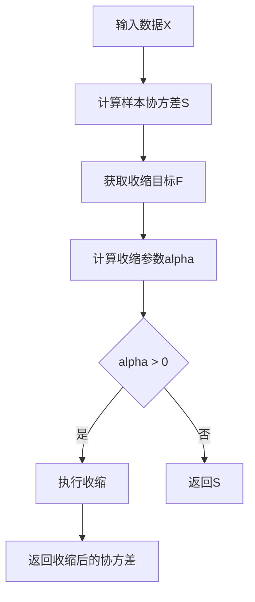

# model/riskmodel/shrink.md 模块文档

## 文件概述

定义了收缩协方差估计器（Shrinkage Covariance Estimator）：
- **ShrinkCovEstimator**: 收缩协方差估计器

收缩估计通过将样本协方差向结构化目标收缩，改善高维估计的稳定性。

## 参考文献

- [1] Ledoit, O., & Wolf, M. (2004). A well-conditioned estimator for large-dimensional covariance matrices. Journal of Multivariate Analysis, 88(2), 365–411.
- [2] Ledoit, O., & Wolf, M. (2004). Honey, I shrunk the sample covariance matrix. Journal of Portfolio Management, 30(4), 1–22.
- [3] Ledoit, O., & Wolf, M. (2003). Improved estimation of the covariance matrix of stock returns with an application to portfolio selection. Journal of Empirical Finance, 10(5), 603–621.
- [4] Chen, Y., Wiesel, A., Eldar, Y. C., & Hero, A. O. (2010). Shrinkage algorithms for MMSE covariance estimation. IEEE Transactions on Signal Processing, 58(10), 5016–5029.

## 类定义

### ShrinkCovEstimator 类

**继承关系**: RiskModel → ShrinkCovEstimator

**职责**: 收缩协方差估计器，改善估计的条件数和稳定性

#### 类属性

```python
# 收缩参数类型
SHR_LW = "lw"      # Ledoit-Wolf收缩
SHR_OAS = "o"AS"  # Oracle Approximating Shrinkage

# 收缩目标类型
TGT_CONST_VAR = "const_var"      # 常数方差
TGT_CONST_CORR = "const_corr"   # 常数相关系数
TGT_SINGLE_FACTOR = "single_factor"  # 单因子模型
```

#### 初始化
```python
def __init__(
    self,
    alpha: Union[str, float] = 0.0,
    target: Union[str, np.ndarray] = "const_var",
    **kwargs
):
```

**参数说明**:

| 参数 | 类型 | 说明 |
|------|------|------|
| `alpha` | str/float | 收缩参数：`lw`/`oas`/或0-1之间的浮点数 |
| `target` | str/np.ndarray | 收缩目标：`const_var`/`const_corr`/`single_factor`或自定义目标 |
| `**kwargs` |  | 传递给RiskModel的参数 |

**功能**:
- 初始化收缩估计器
- 设置收缩参数和目标
- 验证参数的合法性

#### 方法签名

##### `_predict(X: np.ndarray) -> np.ndarray`
```python
def _predict(self, X: np.ndarray) -> np.ndarray:
    # sample covariance
    S = super()._predict(X)

    # shrinking target
    F = self._get_shrink_target(X, S)

    # get shrinking parameter
    alpha = self._get_shrink_param(X, S, F)

    # shrink covariance
    if alpha > 0:
        S *= 1 - alpha
        F *= alpha
        S += F

    return S
```

**功能流程**:


**收缩公式**:
```
Ŝ = (1 - α) · S + α · F

其中：
- Ŝ: 收缩后的协方差矩阵
- S: 样本协方差矩阵
- F: 收缩目标
- α: 收缩参数（0 ≤ α ≤ 1）
```

##### `_get_shrink_target(X: np.ndarray, S: np.ndarray) -> np.ndarray`
```python
def _get_shrink_target(self, X: np.ndarray, S: np.ndarray) -> np.ndarray:
    """get shrinking target `F`"""
    if self.target == self.TGT_CONST_VAR:
        return self._get_shrink_target_const_var(X, S)
    if self.target == self.TGT_CONST_CORR:
        return self._get_shrink_target_const_corr(X, S)
    if self.target == self.TGT_SINGLE_FACTOR:
        return self._get_shrink_target_single_factor(X, S)
    return self.target
```

**功能**: 根据目标类型获取收缩目标

##### `_get_shrink_target_const_var(X, S) -> np.ndarray`
```python
def _get_shrink_target_const_var(self, X: np.ndarray, S: np.ndarray) -> np.ndarray:
    n = len(S)
    F = np.eye(n)
    np.fill_diagonal(F, np.mean(np.diag(S)))
    return F
```

**常数方差目标**:
- 假设：零相关系数和常数方差
- 常数方差：所有样本方差的平均值
- 公式：`F = σ̄² · I`

##### `_get_shrink_target_const_corr(X, S) -> np.ndarray`
```python
def _get_shrink_target_const_corr(self, X: np.ndarray, S: np.ndarray) -> np.ndarray:
    n = len(S)
    var = np.diag(S)
    sqrt_var = np.sqrt(var)
    covar = np.outer(sqrt_var, sqrt_var)
    r_bar = (np.sum(S / covar) - n) / (n * (n - 1))
    F = r_bar * covar
    np.fill_diagonal(F, var)
    return F
```

**常数相关系数目标**:
- 假设：常数相关系数但保持样本方差
- 常数相关系数：所有成对相关系数的平均值
- 公式：
  ```
  r̄ = (∑_{i≠j} r_{ij}) / (n(n-1))
  F_{ij} = r̄ · σ_i · σ_j (i≠j)
  F_{ii} = σ_i²
  ```

##### `_get_shrink_target_single_factor(X, S) -> np.ndarray`
```python
def _get_shrink_target_single_factor(self, X: np.ndarray, S: np.ndarray) -> np.ndarray:
    X_mkt = np.nanmean(X, axis=1)
    cov_mkt = np.asarray(X.T.dot(X_mkt) / len(X))
    var_mkt = np.asarray(X_mkt.dot(X_mkt) / len(X))
    F = np.outer(cov_mkt, cov_mkt) / var_mkt
    np.fill_diagonal(F, np.diag(S))
    return F
```

**单因子模型目标**:
- 假设：市场因子驱动所有资产收益
- 市场因子：所有资产收益的平均值
- 公式：
  ```
  r_mkt = mean(X, axis=1)  # 市场收益
  cov(r_i, r_mkt) = r_mkt^T X / n
  var(r_mkt) = r_mkt^T r_mkt / n
  F = cov(r, r_mkt) · cov(r, r_mkt)^T / var(r_mkt)
  ```

##### `_get_shrink_param(X, S, F) -> float`
```python
def _get_shrink_param(self, X: np.ndarray, S: np.ndarray, F: np.ndarray) -> float:
    if self.alpha == self.SHR_OAS:
        return self._get_shrink_param_oas(X, S, F)
    elif self.alpha == self.SHR_LW:
        if self.target == self.TGT_CONST_VAR:
            return self._get_shrink_param_lw_const_var(X, S, F)
        if self.target == self.TGT_CONST_CORR:
            return self._get_shrink_param_lw_const_corr(X, S, F)
        if self.target == self.TGT_SINGLE_FACTOR:
            return self._get_shrink_param_lw_single_factor(X, S, F)
    return self.alpha
```

**功能**: 根据参数类型获取收缩参数

##### `_get_shrink_param_oas(X, S, F) -> float`
```python
def _get_shrink_param_oas(self, X: np.ndarray, S: np.ndarray, F: np.ndarray) -> float:
    trS2 = np.sum(S**2)
    tr2S = np.trace(S) ** 2

    n, p = X.shape

    A = (1 - 2 / p) * (trS2 + tr2S)
    B = (n + 1 - 2 / p) * (trS2 + tr2S / p)
    alpha = A / B

    return alpha
```

**Oracle Approximating Shrinkage (OAS)**:
- 适用于常数方差目标
- 闭式解，计算快速
- 公式：
  ```
  tr(S²) = ∑ S_ij²
  [tr(S)]² = (∑ S_ii)²
  A = (1 - 2/p) · [tr(S²) + (tr(S))²]
  B = (n + 1 - 2/p) · [tr(S²) + (tr(S))²/p]
  α = A / B
  ```

##### `_get_shrink_param_lw_const_var(X, S, F) -> float`
```python
`def _get_shrink_param_lw_const_var(self, X: np.ndarray, S: np.ndarray, F: np.ndarray) -> float:
    t, n = X.shape

    y = X**2
    phi = np.sum(y.T.dot(y) / t - S**2)

    gamma = np.linalg.norm(S - F, "fro") ** 2

    kappa = phi / gamma
    alpha = max(0, min(1, kappa / t))

    return alpha
```

**Ledoit-Wolf收缩（常数方差）**:
- 公式：
  ```
  φ = ∑ [y^T y / t - S²]
  γ = ||S - F||_F²
  κ = φ / γ
  α = max(0, min(1, κ/t))
  ```

##### `_get_shrink_param_lw_const_corr(X, S, F) -> float`
```python
def _get_shrink_param_lw_const_corr(self, X: np.ndarray, S: np.ndarray, F: np.ndarray) -> float:
    t, n = X.shape

    var = np.diag(S)
    sqrt_var = np.sqrt(var)
    r_bar = (np.sum(S / np.outer(sqrt_var, sqrt_var)) - n) / (n * (n - 1))

    y = X**2
    phi_mat = y.T.dot(y) / t - S**2
    phi = np.sum(phi_mat)

    theta_mat = (X**3).T.dot(X) / t - var[:, None] * S
    np.fill_diagonal(theta_mat, 0)
    rho = np.sum(np.diag(phi_mat)) + r_bar * np.sum(np.outer(1 / sqrt_var, sqrt_var) * theta_mat)

    gamma = np.linalg.norm(S - F, "fro") ** 2

    kappa = (phi - rho) / gamma
    alpha = max(0, min(1, kappa / t))

    return alpha
```

**Ledoit-Wolf收缩（常数相关系数）**:
- 考虑了相关系数的估计误差
- 公式更加复杂，包含高阶矩项

##### `_get_shrink_param_lw_single_factor(X, S, F) -> float`
```python
def _get_shrink_param_lw_single_factor(self, X: np.ndarray, S: np.ndarray, F: np.ndarray) -> float:
    t, n = X.shape

    X_mkt = np.nanmean(X, axis=1)
    cov_mkt = np.asarray(X.T.dot(X_mkt) / len(X))
    var_mkt = np.asarray(X_mkt.dot(X_mkt) / len(X))

    y = X**2
    phi = np.sum(y.T.dot(y)) / t - np.sum(S**2)

    rdiag = np.sum(y**2) / t - np.sum(np.diag(S) ** 2)
    z = X * X_mkt[:, None]
    v1 = y.T.dot(z) / t - cov_mkt[:, None] * S
    roff1 = np.sum(v1 * cov_mkt[:, None].T) / var_mkt - np.sum(np.diag(v1) * cov_mkt) / var_mkt
    v3 = z.T.dot(z) / t - var_mkt * S
    roff3 = np.sum(v3 * np.outer(cov_mkt, cov_mkt)) / var_mkt**2 - np.sum(np.diag(v3) * cov_mkt**2) / var_mkt**2
    roff = 2 * roff1 - roff3
    rho = rdiag + roff

    gamma = np.linalg.norm(S - F, "fro") ** 2

    kappa = (phi - rho) / gamma
    alpha = max(0, min(1, kappa / t))

    return alpha
```

**Ledoit-Wolf收缩（单因子模型）**:
- 基于市场因子的收缩
- 最符合金融市场的假设

## 类继承关系图

```
RiskModel
    └── ShrinkCovEstimator
```

## 使用示例

### 示例1：基本使用（OAS）

```python
from qlib.model.riskmodel.shrink import ShrinkCovEstimator
import numpy as np

# 创建OAS收缩估计器
shrink = ShrinkCovEstimator(
    alpha="oas",
    target="const_var"
)

# 准备数据
returns = np.random.randn(100, 50)  # 100个观测，50个变量

# 估计协方差
cov = shrink.predict(returns, is_price=False)
print(f"收缩协方差形状: {cov.shape}")
```

### 示例2：Ledoit-Wolf收缩（常数方差）

```python
from qlib.model.riskmodel.shrink import ShrinkCovEstimator

# 创建LW收缩估计器
shrink = ShrinkCovEstimator(
    alpha="lw",
    target="const_var"
)

# 估计协方差
cov = shrink.predict(returns, is_price=False)

# 比较样本协方差和收缩协方差
import numpy as np
sample_cov = np.cov(returns.T)

print(f"样本协方差条件数: {np.linalg.cond(sample_cov):.2f}")
print(f"收缩协方差条件数: {np.linalg.cond(cov):.2f}")
```

### 示例3：单因子模型收缩

```python
from qlib.model.riskmodel.shrink import ShrinkCovEstimator

# 创建单因子模型收缩估计器
shrink = ShrinkCovEstimator(
    alpha="lw",
    target="single_factor"
)

# 估计协方差
cov = shrink.predict(returns, is_price=False)
```

### 示例4：固定收缩参数

```python
# 使用固定的收缩参数
shrink = ShrinkCovEstimator(
    alpha=0.5,  # 固定收缩50%
    target="const_var"
)

cov = shrink.predict(returns, is_price=False)
```

### 示例5：比较不同收缩目标

```python
from qlib.model.riskmodel.shrink import ShrinkCovEstimator
import numpy as np

# 准备数据
returns = np.random.randn(200, 100)

# 比较三种收缩目标
targets = ["const_var", "const_corr", "single_factor"]
results = {}

for target in targets:
    try:
        shrink = ShrinkCovEstimator(
            alpha="lw",
            target=target
        )
        cov = shrink.predict(returns, is_price=False)

        results[target] = {
            "condition_number": np.linalg.cond(cov),
            "trace": np.trace(cov),
            "frobenius_norm": np.linalg.norm(cov)
        }

        print(f"{target}目标:")
        print(f"  条件数: {results[target]['condition_number']:.2f}")
        print(f"  迹: {results[target]['trace']:.4f}")
    except Exception as e:
        print(f"{target}目标: {e}")
```

## 收缩目标对比

| 目标类型 | 假设 | 适用场景 | OAS支持 |
|---------|------|----------|----------|
| `const_var` | 零相关，常数方差 | 通用 | ✓ |
| `const_corr` | 常数相关，保持方差 | 相关系数稳定 | ✗ |
| `single_factor` | 市场因子驱动 | 金融市场 | ✗ |

## 设计理念

### 收缩估计的优势

1. **数值稳定性**: 改善协方差矩阵的条件数
2. **偏差-方差权衡**: 用偏差换取方差的减少
3. **理论保证**: Ledoit-Wolf方法有最优的渐近性质
4. **灵活性**: 支持多种收缩目标和参数估计方法

### 收缩公式的意义

```
Ŝ = (1 - α) · S + α · F

- α = 0: 不收缩，使用样本协方差S
- α = 1: 完全收缩，使用目标F
- 0 < α < 1: 部分收缩，权衡两者
```

## 设计模式

### 1. 策略模式

- 通过`alpha`参数选择收缩参数估计方法
- 通过`target`参数选择收缩目标

### 2. 模板方法模式

- `_get_shrink_param`定义收缩参数计算框架
- 具体方法实现不同的估计逻辑

## 与其他模块的关系

### 依赖模块

- `qlib.model.riskmodel.RiskModel`: 风险模型基类
- `numpy`: 数值计算

### 被依赖模块

- `qlib.contrib.strategy`: 投资组合优化
- `qlib.backtest`: 回测

## 扩展指南

### 实现自定义收缩目标

```python
from qlib.model.riskmodel.shrink import ShrinkCovEstimator
import numpy as np

class CustomShrinkCovEstimator(ShrinkCovEstimator):
    """自定义收缩目标的估计器"""

    def __init__(self, target_matrix=None, **kwargs):
        super().__init__(target=target_matrix, **kwargs)
        self.custom_target = target_matrix

    def _get_shrink_target(self, X, S):
        """使用自定义目标"""
        if isinstance(self.target, np.ndarray):
            return self.target

        if self.custom_target is not None:
            # 根据X和S计算自定义目标
            # 例如：对角线加权的目标
            n = len(S)
            F = np.diag(np.diag(S) * 0.5)
            return F

        return super()._get_shrink_target(X, S)

# 使用自定义目标
custom_target = np.eye(50) * 0.01  # 对角线目标
shrink = CustomShrinkCovEstimator(
    alpha=0.5,
    target_matrix=custom_target
)
cov = shrink.predict(returns)
```

## 注意事项

1. **OAS限制**: OAS仅支持常数方差目标
2. **参数选择**: 对于小样本，推荐使用`alpha="lw"`
3. **目标选择**: 单因子模型最适合金融数据
4. **数值稳定性**: 收缩后的协方差条件数应该显著改善

## 性能优化建议

1. **批量计算**: 一次性计算多个时间点的协方差
2. **增量更新**: 对于新增数据，使用增量协方差更新
3. **并行计算**: 收缩参数计算可以并行化

## 应用场景

### 1. 投资组合优化

```python
# 使用收缩协方差进行组合优化
shrink = ShrinkCovEstimator(
    alpha="lw",
    target="single_factor"
)

cov = shrink.predict(returns, is_price=False)

# 最小方差组合
inv_cov = np.linalg.inv(cov)
ones = np.ones(len(cov))
weights = inv_cov @ ones / (ones @ inv_cov @ ones)

print(f"组合权重: {weights}")
```

### 2. 风险预算

```python
# 使用收缩协方差进行风险预算
cov = shrink.predict(returns, is_price=False)

# 边际风险贡献
portfolio_weights = np.array([0.3, 0.4, 0.3])
portfolio_vol = np.sqrt(portfolio_weights @ cov @ portfolio_weights)
marginal_risk = (cov @ portfolio_weights) / portfolio_vol

print(f"边际风险: {marginal_risk}")
```

### 3. 条件数对比

```python
# 比较样本协方差和收缩协方差的稳定性
import numpy as np

sample_cov = np.cov(returns.T)
shrink_cov = shrink.predict(returns, is_price=False)

print(f"样本协方差条件数: {np.linalg.cond(sample_cov):.2f}")
print(f"收缩协方差条件数: {np.linalg.cond(shrink_cov):.2f}")
print(f"改善: {(1 - np.linalg.cond(shrink_cov)/np.linalg.cond(sample_cov)):.1%}")
```

### 4. 收缩参数敏感性分析

```python
import matplotlib.pyplot as plt

# 测试不同收缩参数的影响
alphas = np.linspace(0, 1, 21)
cond_numbers = []

for alpha in alphas:
    shrink = ShrinkCovEstimator(
        alpha=alpha,
        target="const_var"
    )
    cov = shrink.predict(returns, is_price=False)
    cond_numbers.append(np.linalg.cond(cov))

# 绘制条件数随收缩参数的变化
plt.figure(figsize=(10, 6))
plt.plot(alphas, cond_numbers, marker='o')
plt.xlabel('收缩参数 α')
plt.ylabel('条件数')
plt.title('条件数随收缩参数的变化')
plt.grid(True)
plt.show()
```
